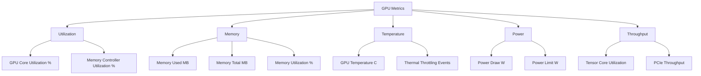
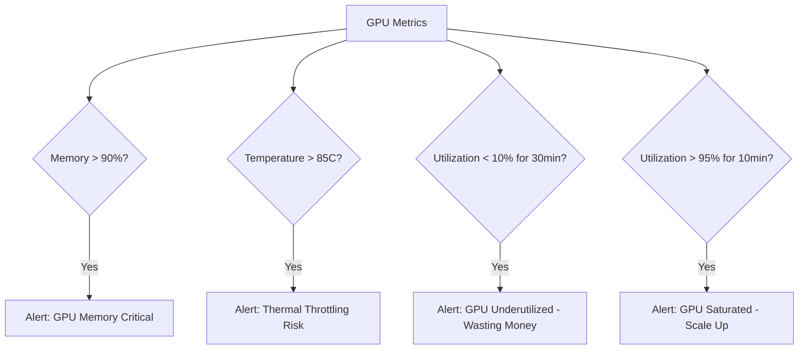

# How to Monitor GPU Utilization for ML Workloads with OpenTelemetry

Author: [nawazdhandala](https://www.github.com/nawazdhandala)

Tags: OpenTelemetry, GPU Monitoring, Machine Learning, NVIDIA, Observability, Metrics, Infrastructure

Description: Learn how to collect and export GPU utilization metrics for ML workloads using OpenTelemetry, covering NVIDIA SMI integration, custom metric instruments, and Collector receivers.

---

If you're running machine learning workloads in production, you already know that GPU utilization is one of the most important metrics to track. GPUs are expensive. An underutilized GPU is burning money, and an overloaded one is creating latency problems. But integrating GPU metrics into your existing observability stack has traditionally been a pain. You end up with separate dashboards for GPU stats and application metrics, making it hard to correlate the two.

OpenTelemetry changes that. By collecting GPU metrics through OpenTelemetry, you can view GPU utilization alongside your application traces, request latency, and error rates in a single observability platform. This post walks through multiple approaches to getting GPU metrics into OpenTelemetry, from simple polling scripts to production-ready Collector configurations.

## What GPU Metrics Matter for ML Workloads?

Not all GPU metrics are equally useful. Here are the ones you should focus on for ML inference and training workloads:



For inference workloads, you'll care most about GPU utilization, memory usage, and temperature. For training, add power draw and tensor core utilization to the mix, since long-running training jobs can hit thermal limits that cause throttling.

## Approach 1: Custom Python Metrics with nvidia-smi

The most straightforward way to collect GPU metrics is by querying NVIDIA's management library (NVML) from Python and recording the values as OpenTelemetry metrics. The `pynvml` library gives you a Python wrapper around NVML.

```bash
# Install the required packages
pip install opentelemetry-api opentelemetry-sdk opentelemetry-exporter-otlp pynvml
```

Here's a complete GPU metrics collector that runs as a background thread in your ML application:

```python
# gpu_metrics.py - Collect GPU metrics using pynvml and export via OpenTelemetry

import pynvml
import threading
import time
from opentelemetry import metrics
from opentelemetry.sdk.metrics import MeterProvider
from opentelemetry.sdk.metrics.export import PeriodicExportingMetricReader
from opentelemetry.exporter.otlp.proto.grpc.metric_exporter import OTLPMetricExporter
from opentelemetry.sdk.resources import Resource

class GPUMetricsCollector:
    def __init__(self, collection_interval_seconds: int = 10):
        self.interval = collection_interval_seconds
        self._running = False

        # Initialize NVML to access GPU information
        pynvml.nvmlInit()
        self.device_count = pynvml.nvmlDeviceGetCount()

        # Set up OpenTelemetry metrics
        resource = Resource.create({
            "service.name": "gpu-metrics-collector",
            "host.name": self._get_hostname(),
        })

        exporter = OTLPMetricExporter(endpoint="http://localhost:4317", insecure=True)
        reader = PeriodicExportingMetricReader(exporter, export_interval_millis=10000)
        provider = MeterProvider(resource=resource, metric_readers=[reader])
        metrics.set_meter_provider(provider)

        meter = metrics.get_meter("gpu.metrics", version="1.0.0")

        # Create gauge-like metrics using observable gauges
        # Observable gauges call a callback function to get the current value
        meter.create_observable_gauge(
            name="gpu.utilization",
            description="GPU core utilization percentage",
            unit="percent",
            callbacks=[self._gpu_utilization_callback],
        )

        meter.create_observable_gauge(
            name="gpu.memory.used",
            description="GPU memory currently in use",
            unit="MiB",
            callbacks=[self._memory_used_callback],
        )

        meter.create_observable_gauge(
            name="gpu.memory.total",
            description="Total GPU memory available",
            unit="MiB",
            callbacks=[self._memory_total_callback],
        )

        meter.create_observable_gauge(
            name="gpu.temperature",
            description="GPU temperature in Celsius",
            unit="Cel",
            callbacks=[self._temperature_callback],
        )

        meter.create_observable_gauge(
            name="gpu.power.draw",
            description="Current GPU power consumption",
            unit="W",
            callbacks=[self._power_draw_callback],
        )

        meter.create_observable_gauge(
            name="gpu.memory.utilization",
            description="GPU memory utilization percentage",
            unit="percent",
            callbacks=[self._memory_utilization_callback],
        )

    def _get_hostname(self):
        import socket
        return socket.gethostname()

    def _gpu_utilization_callback(self, options):
        """Callback that reads GPU utilization for all devices."""
        for i in range(self.device_count):
            handle = pynvml.nvmlDeviceGetHandleByIndex(i)
            util = pynvml.nvmlDeviceGetUtilizationRates(handle)
            gpu_name = pynvml.nvmlDeviceGetName(handle)
            yield metrics.Observation(
                value=util.gpu,
                attributes={"gpu.index": i, "gpu.name": gpu_name},
            )

    def _memory_used_callback(self, options):
        """Callback that reads memory usage for all GPUs."""
        for i in range(self.device_count):
            handle = pynvml.nvmlDeviceGetHandleByIndex(i)
            mem_info = pynvml.nvmlDeviceGetMemoryInfo(handle)
            # Convert bytes to MiB
            yield metrics.Observation(
                value=mem_info.used / (1024 * 1024),
                attributes={"gpu.index": i},
            )

    def _memory_total_callback(self, options):
        """Callback that reads total memory for all GPUs."""
        for i in range(self.device_count):
            handle = pynvml.nvmlDeviceGetHandleByIndex(i)
            mem_info = pynvml.nvmlDeviceGetMemoryInfo(handle)
            yield metrics.Observation(
                value=mem_info.total / (1024 * 1024),
                attributes={"gpu.index": i},
            )

    def _temperature_callback(self, options):
        """Callback that reads GPU temperature."""
        for i in range(self.device_count):
            handle = pynvml.nvmlDeviceGetHandleByIndex(i)
            temp = pynvml.nvmlDeviceGetTemperature(handle, pynvml.NVML_TEMPERATURE_GPU)
            yield metrics.Observation(
                value=temp,
                attributes={"gpu.index": i},
            )

    def _power_draw_callback(self, options):
        """Callback that reads current power draw in watts."""
        for i in range(self.device_count):
            handle = pynvml.nvmlDeviceGetHandleByIndex(i)
            # NVML returns milliwatts, convert to watts
            power_mw = pynvml.nvmlDeviceGetPowerUsage(handle)
            yield metrics.Observation(
                value=power_mw / 1000.0,
                attributes={"gpu.index": i},
            )

    def _memory_utilization_callback(self, options):
        """Callback that computes memory utilization as a percentage."""
        for i in range(self.device_count):
            handle = pynvml.nvmlDeviceGetHandleByIndex(i)
            mem_info = pynvml.nvmlDeviceGetMemoryInfo(handle)
            utilization = (mem_info.used / mem_info.total) * 100.0
            yield metrics.Observation(
                value=utilization,
                attributes={"gpu.index": i},
            )

    def shutdown(self):
        """Clean up NVML resources."""
        pynvml.nvmlShutdown()
```

The key thing to notice here is the use of `create_observable_gauge` with callbacks. Observable gauges are the right instrument type for GPU metrics because these values represent a current state (like temperature or memory usage) rather than a cumulative count. The OpenTelemetry SDK calls your callback functions at each collection interval, and you return the current readings.

## Integrating GPU Metrics with Your ML Application

Here's how to use the GPU metrics collector alongside your ML inference code so that GPU metrics are correlated with your application traces:

```python
# ml_app.py - ML inference app with GPU metrics and request tracing

from opentelemetry import trace
from opentelemetry.sdk.trace import TracerProvider
from opentelemetry.sdk.trace.export import BatchSpanProcessor
from opentelemetry.exporter.otlp.proto.grpc.trace_exporter import OTLPSpanExporter
from gpu_metrics import GPUMetricsCollector
import torch

# Initialize tracing
trace_provider = TracerProvider()
trace_provider.add_span_processor(
    BatchSpanProcessor(OTLPSpanExporter(endpoint="http://localhost:4317", insecure=True))
)
trace.set_tracer_provider(trace_provider)
tracer = trace.get_tracer("ml.inference")

# Start GPU metrics collection in the background
gpu_collector = GPUMetricsCollector(collection_interval_seconds=5)

def run_inference(input_data):
    with tracer.start_as_current_span("ml.inference") as span:
        # Record which GPU this inference runs on
        device = torch.device("cuda:0" if torch.cuda.is_available() else "cpu")
        span.set_attribute("ml.device", str(device))

        if torch.cuda.is_available():
            # Record GPU memory before inference
            mem_before = torch.cuda.memory_allocated(0) / (1024 * 1024)
            span.set_attribute("gpu.memory_before_mb", mem_before)

        # Run your model inference here
        with tracer.start_as_current_span("model.forward"):
            result = model(input_data.to(device))

        if torch.cuda.is_available():
            # Record GPU memory after inference
            mem_after = torch.cuda.memory_allocated(0) / (1024 * 1024)
            span.set_attribute("gpu.memory_after_mb", mem_after)
            span.set_attribute("gpu.memory_delta_mb", mem_after - mem_before)

        return result
```

## Approach 2: Using the OpenTelemetry Collector with NVIDIA Receiver

For a more infrastructure-oriented approach, you can use the OpenTelemetry Collector with the NVIDIA GPU receiver. This is especially useful if you want to monitor GPU metrics from multiple machines without modifying application code.

```yaml
# otel-collector-gpu.yaml - Collector configuration with NVIDIA GPU metrics

receivers:
  # The NVIDIA GPU receiver collects metrics from all available GPUs
  nvml:
    collection_interval: 10s
    metrics:
      gpu.utilization:
        enabled: true
      gpu.memory.bytes_used:
        enabled: true
      gpu.temperature:
        enabled: true
      gpu.power.draw:
        enabled: true
      gpu.memory.bandwidth_utilization:
        enabled: true

  # Also receive OTLP data from your applications
  otlp:
    protocols:
      grpc:
        endpoint: 0.0.0.0:4317

processors:
  # Batch metrics for efficient export
  batch:
    timeout: 10s
    send_batch_size: 1024

  # Add resource attributes to identify the host
  resourcedetection:
    detectors: [system]
    system:
      hostname_sources: ["os"]

exporters:
  otlp:
    endpoint: "https://your-backend.example.com:4317"
    tls:
      insecure: false

service:
  pipelines:
    metrics:
      receivers: [nvml, otlp]
      processors: [resourcedetection, batch]
      exporters: [otlp]
    traces:
      receivers: [otlp]
      processors: [batch]
      exporters: [otlp]
```

To run the Collector with NVIDIA GPU support, you need to use the `contrib` distribution which includes the NVML receiver:

```bash
# Run the OpenTelemetry Collector contrib build with the GPU config
docker run --gpus all \
  -v $(pwd)/otel-collector-gpu.yaml:/etc/otel-collector-config.yaml \
  -p 4317:4317 \
  otel/opentelemetry-collector-contrib:latest \
  --config=/etc/otel-collector-config.yaml
```

The `--gpus all` flag is critical. Without it, the container won't have access to the NVIDIA devices and the NVML receiver will fail to initialize.

## Approach 3: Using DCGM Exporter for Kubernetes

If your ML workloads run on Kubernetes, the NVIDIA DCGM (Data Center GPU Manager) exporter is the standard way to get GPU metrics. You can feed these into OpenTelemetry using the Prometheus receiver.

```yaml
# otel-collector-dcgm.yaml - Collect DCGM metrics via Prometheus scraping

receivers:
  # Scrape GPU metrics from DCGM exporter running as a DaemonSet
  prometheus:
    config:
      scrape_configs:
        - job_name: "dcgm-exporter"
          scrape_interval: 15s
          kubernetes_sd_configs:
            - role: pod
          relabel_configs:
            # Only scrape pods with the dcgm-exporter label
            - source_labels: [__meta_kubernetes_pod_label_app]
              regex: "nvidia-dcgm-exporter"
              action: keep
            - source_labels: [__meta_kubernetes_pod_ip]
              target_label: __address__
              replacement: "$1:9400"

processors:
  batch:
    timeout: 15s

exporters:
  otlp:
    endpoint: "https://your-backend.example.com:4317"

service:
  pipelines:
    metrics:
      receivers: [prometheus]
      processors: [batch]
      exporters: [otlp]
```

The DCGM exporter gives you a richer set of metrics than raw NVML, including GPU clock speeds, ECC error counts, and NVLink throughput for multi-GPU setups.

## Correlating GPU Metrics with Inference Traces

The real value of having GPU metrics in OpenTelemetry is correlation. When a particular inference request is slow, you want to check if the GPU was saturated at that moment. Here's how to link the two.

```python
# correlated_inference.py - Link GPU state to individual inference spans

import pynvml
from opentelemetry import trace

tracer = trace.get_tracer("ml.inference")
pynvml.nvmlInit()

def inference_with_gpu_context(model, input_tensor, gpu_index: int = 0):
    """Run inference and record the GPU state at the time of execution."""
    handle = pynvml.nvmlDeviceGetHandleByIndex(gpu_index)

    with tracer.start_as_current_span("ml.inference") as span:
        # Snapshot GPU state at the start of inference
        util = pynvml.nvmlDeviceGetUtilizationRates(handle)
        mem_info = pynvml.nvmlDeviceGetMemoryInfo(handle)
        temp = pynvml.nvmlDeviceGetTemperature(handle, pynvml.NVML_TEMPERATURE_GPU)

        span.set_attribute("gpu.index", gpu_index)
        span.set_attribute("gpu.utilization_at_start", util.gpu)
        span.set_attribute("gpu.memory_used_mb_at_start", mem_info.used / (1024 * 1024))
        span.set_attribute("gpu.temperature_at_start", temp)

        # Detect if GPU is under pressure
        if util.gpu > 90:
            span.add_event("gpu_high_utilization", {
                "gpu.utilization": util.gpu,
                "message": "GPU utilization above 90% at inference start",
            })

        if temp > 80:
            span.add_event("gpu_high_temperature", {
                "gpu.temperature": temp,
                "message": "GPU temperature above 80C, possible thermal throttling",
            })

        # Run the actual inference
        result = model(input_tensor)

        # Snapshot GPU state after inference
        util_after = pynvml.nvmlDeviceGetUtilizationRates(handle)
        span.set_attribute("gpu.utilization_at_end", util_after.gpu)

        return result
```

This way, when you look at a slow trace, you can immediately see the GPU utilization at the moment that request was being processed. If GPU utilization was at 95% when the request started, you know the slowdown was due to GPU contention, not a problem with the model itself.

## Setting Up Alerts

With GPU metrics flowing through OpenTelemetry, you can set up meaningful alerts:



The underutilization alert is just as important as the overutilization one. If you're paying for GPU instances that are sitting mostly idle, you need to either consolidate workloads or downsize your instances.

## Best Practices

Here are some things I've learned from monitoring GPU workloads in production:

1. **Collect at the right interval**. Every 10-15 seconds is a good balance between granularity and overhead for GPU metrics. Going sub-second creates unnecessary noise.

2. **Always include gpu.index as an attribute**. In multi-GPU systems, aggregate metrics are misleading. One GPU might be at 100% while another sits idle.

3. **Track memory fragmentation, not just usage**. PyTorch's memory allocator can cause fragmentation where `torch.cuda.memory_allocated()` is low but `torch.cuda.memory_reserved()` is high. Track both.

4. **Correlate GPU metrics with batch size**. If you're doing dynamic batching, larger batches will naturally use more GPU resources. Without this context, utilization spikes look like problems when they're actually expected behavior.

5. **Monitor across the full stack**. GPU metrics alone aren't enough. Combine them with CPU metrics, network I/O, and application-level metrics to get the complete picture.

## Conclusion

Monitoring GPU utilization through OpenTelemetry gives you a unified view of your ML infrastructure alongside your application telemetry. Whether you choose the application-level approach with pynvml, the Collector-based approach with the NVML receiver, or the Kubernetes-native approach with DCGM, the end result is the same: GPU metrics flowing through your standard observability pipeline.

The most impactful thing you can do is correlate GPU state with individual inference requests. When you can look at a slow trace and immediately see that the GPU was at 98% utilization with memory nearly full, you've cut your debugging time from hours to minutes. That's the value of having everything in one place.
