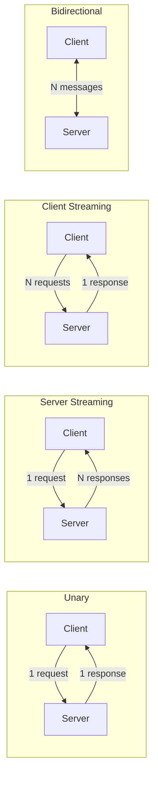
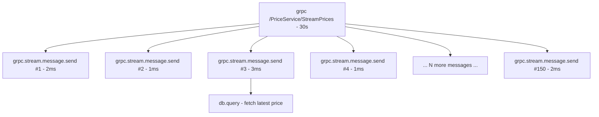

# How to Monitor gRPC Streaming Calls with OpenTelemetry

Author: [nawazdhandala](https://www.github.com/nawazdhandala)

Tags: OpenTelemetry, gRPC, Streaming, Tracing, Observability, Microservices

Description: A practical guide to monitoring gRPC streaming calls with OpenTelemetry, covering server streaming, client streaming, and bidirectional streaming patterns.

---

gRPC streaming is one of those features that makes gRPC so powerful for microservices communication. Instead of simple request-response pairs, you can have server-side streams, client-side streams, or fully bidirectional streams. But monitoring these streaming calls introduces challenges that don't exist with unary RPCs. A single streaming call can last minutes and carry hundreds of messages, and standard gRPC instrumentation often treats the whole stream as one opaque span.

This post covers how to get deep visibility into gRPC streaming calls using OpenTelemetry. We'll set up proper instrumentation for all three streaming patterns, add per-message tracing, and capture the metrics that actually matter for streaming workloads.

## gRPC Streaming Patterns

Before diving into instrumentation, let's quickly review the three streaming patterns gRPC supports:



Each pattern needs slightly different instrumentation. Server streaming is the most common in practice - think of things like watching a Kubernetes pod's logs or subscribing to a price feed.

## Auto-Instrumentation with the gRPC Plugin

OpenTelemetry provides auto-instrumentation for gRPC in most languages. Let's start with Node.js, since it's widely used for gRPC services.

First, install the necessary packages.

```bash
# Install OpenTelemetry core and gRPC instrumentation packages
npm install @opentelemetry/sdk-node \
  @opentelemetry/exporter-trace-otlp-http \
  @opentelemetry/instrumentation-grpc \
  @grpc/grpc-js
```

Now set up the SDK with the gRPC instrumentation plugin.

```javascript
// tracing.js - Must be loaded before any gRPC imports
const { NodeSDK } = require('@opentelemetry/sdk-node');
const { OTLPTraceExporter } = require('@opentelemetry/exporter-trace-otlp-http');
const { GrpcInstrumentation } = require('@opentelemetry/instrumentation-grpc');
const { Resource } = require('@opentelemetry/resources');
const { ATTR_SERVICE_NAME } = require('@opentelemetry/semantic-conventions');

const sdk = new NodeSDK({
  resource: new Resource({
    [ATTR_SERVICE_NAME]: 'grpc-streaming-service',
  }),
  traceExporter: new OTLPTraceExporter({
    url: 'http://localhost:4318/v1/traces',
  }),
  instrumentations: [
    // This automatically instruments all gRPC calls, including streams
    new GrpcInstrumentation(),
  ],
});

sdk.start();
```

The auto-instrumentation creates one span per RPC call. For unary calls, that's perfect. For streaming calls, it gives you a span that covers the entire stream duration. That's useful but not sufficient - you can't see what happened inside the stream.

## Adding Per-Message Spans to Server Streaming

Let's say you have a server streaming RPC that sends stock price updates. The auto-instrumented span will tell you the stream lasted 30 seconds, but it won't show you that 150 price updates were sent during that time.

Here's how to add per-message tracing to a server streaming handler.

```javascript
const { trace, SpanKind, context } = require('@opentelemetry/api');

const tracer = trace.getTracer('grpc-streaming-service');

// Server streaming RPC handler - sends multiple price updates to client
async function* streamPrices(call) {
  const symbol = call.request.symbol;

  // The auto-instrumentation already creates a parent span for the RPC
  // We add child spans for each message sent
  const parentContext = context.active();

  let messageCount = 0;
  const priceStream = subscribeToPriceFeed(symbol);

  for await (const price of priceStream) {
    messageCount++;

    // Create a child span for each streamed message
    const messageSpan = tracer.startSpan(
      `grpc.stream.message.send`,
      {
        kind: SpanKind.SERVER,
        attributes: {
          'rpc.grpc.stream.message.index': messageCount,
          'rpc.grpc.stream.symbol': symbol,
          'price.value': price.value,
          'price.timestamp': price.timestamp,
        },
      },
      parentContext
    );

    try {
      call.write({ symbol, price: price.value, timestamp: price.timestamp });
      messageSpan.setStatus({ code: 0 }); // OK
    } catch (err) {
      messageSpan.recordException(err);
      messageSpan.setStatus({ code: 2, message: err.message }); // ERROR
      throw err;
    } finally {
      messageSpan.end();
    }
  }
}
```

## Instrumenting Client Streaming

Client streaming is the reverse: the client sends a stream of messages and the server responds once after processing them all. A typical use case is uploading chunks of a file or sending batched telemetry data.

```javascript
// Client streaming RPC handler - receives multiple messages from client
function uploadData(call, callback) {
  const tracer = trace.getTracer('grpc-streaming-service');
  const parentContext = context.active();

  let totalBytes = 0;
  let chunkCount = 0;

  call.on('data', (chunk) => {
    chunkCount++;

    // Trace each received chunk individually
    const receiveSpan = tracer.startSpan(
      'grpc.stream.message.receive',
      {
        kind: SpanKind.SERVER,
        attributes: {
          'rpc.grpc.stream.message.index': chunkCount,
          'rpc.grpc.stream.chunk.size': chunk.data.length,
        },
      },
      parentContext
    );

    totalBytes += chunk.data.length;
    processChunk(chunk); // Your processing logic
    receiveSpan.end();
  });

  call.on('end', () => {
    // Add summary attributes to the parent span after stream completes
    const parentSpan = trace.getSpan(parentContext);
    if (parentSpan) {
      parentSpan.setAttribute('rpc.grpc.stream.total_messages', chunkCount);
      parentSpan.setAttribute('rpc.grpc.stream.total_bytes', totalBytes);
    }

    callback(null, {
      bytesReceived: totalBytes,
      chunksProcessed: chunkCount,
    });
  });

  call.on('error', (error) => {
    const errorSpan = tracer.startSpan('grpc.stream.error', {}, parentContext);
    errorSpan.recordException(error);
    errorSpan.end();
  });
}
```

## Bidirectional Streaming Instrumentation

Bidirectional streaming is the most complex pattern. Both sides send messages independently, and the order isn't necessarily correlated. Think of a chat service or a real-time collaboration tool.

```javascript
// Bidirectional streaming RPC - both client and server send messages
function chat(call) {
  const tracer = trace.getTracer('grpc-streaming-service');
  const parentContext = context.active();

  let sentCount = 0;
  let receivedCount = 0;
  const sessionId = generateSessionId();

  call.on('data', (message) => {
    receivedCount++;

    // Span for each incoming message in the bidirectional stream
    const inSpan = tracer.startSpan(
      'grpc.bidi.receive',
      {
        kind: SpanKind.SERVER,
        attributes: {
          'rpc.grpc.bidi.session_id': sessionId,
          'rpc.grpc.bidi.direction': 'receive',
          'rpc.grpc.bidi.message_index': receivedCount,
          'chat.user': message.userId,
          'chat.room': message.roomId,
        },
      },
      parentContext
    );

    // Process the message and potentially send a response
    const response = processMessage(message);

    if (response) {
      sentCount++;

      // Span for outgoing response message
      const outSpan = tracer.startSpan(
        'grpc.bidi.send',
        {
          kind: SpanKind.SERVER,
          attributes: {
            'rpc.grpc.bidi.session_id': sessionId,
            'rpc.grpc.bidi.direction': 'send',
            'rpc.grpc.bidi.message_index': sentCount,
          },
        },
        parentContext
      );

      call.write(response);
      outSpan.end();
    }

    inSpan.end();
  });

  call.on('end', () => {
    // Log summary metrics on the parent span when stream ends
    const parentSpan = trace.getSpan(parentContext);
    if (parentSpan) {
      parentSpan.setAttribute('rpc.grpc.bidi.total_received', receivedCount);
      parentSpan.setAttribute('rpc.grpc.bidi.total_sent', sentCount);
      parentSpan.setAttribute('rpc.grpc.bidi.session_id', sessionId);
    }
    call.end();
  });
}
```

## Key Metrics for gRPC Streaming

Traces show individual call behavior, but metrics reveal system-level trends. Here are the metrics you should be collecting for streaming RPCs.

```javascript
const { metrics } = require('@opentelemetry/api');
const meter = metrics.getMeter('grpc-streaming-service');

// Track active streams by method and type
const activeStreams = meter.createUpDownCounter('grpc.streams.active', {
  description: 'Currently active gRPC streams',
});

// Count messages per stream direction
const streamMessages = meter.createCounter('grpc.stream.messages.total', {
  description: 'Total messages sent or received on gRPC streams',
});

// Measure time between consecutive stream messages (inter-message latency)
const interMessageLatency = meter.createHistogram('grpc.stream.inter_message.duration', {
  description: 'Time between consecutive messages on a stream',
  unit: 'ms',
});

// Track total stream duration
const streamDuration = meter.createHistogram('grpc.stream.duration', {
  description: 'Total duration of a gRPC streaming call',
  unit: 'ms',
});
```

Inter-message latency is particularly valuable. If your server streaming RPC normally sends a message every 100ms and suddenly it's taking 2 seconds between messages, that's a signal something is wrong upstream.

## Go Implementation

Many gRPC services are written in Go. Here's how to add streaming instrumentation using the `otelgrpc` package alongside custom spans.

```go
package main

import (
    "context"
    "go.opentelemetry.io/otel"
    "go.opentelemetry.io/otel/attribute"
    "go.opentelemetry.io/otel/trace"
    pb "your-project/proto"
)

var tracer = otel.Tracer("grpc-streaming-service")

// Server streaming implementation with per-message tracing
func (s *server) StreamUpdates(req *pb.StreamRequest, stream pb.Service_StreamUpdatesServer) error {
    ctx := stream.Context()
    messageIndex := 0

    for {
        update, err := s.getNextUpdate(ctx, req.Topic)
        if err != nil {
            return err
        }

        messageIndex++

        // Start a span for each streamed message
        _, span := tracer.Start(ctx, "grpc.stream.send",
            trace.WithAttributes(
                attribute.Int("rpc.grpc.stream.message.index", messageIndex),
                attribute.String("rpc.grpc.stream.topic", req.Topic),
            ),
        )

        // Send the message on the stream
        if err := stream.Send(update); err != nil {
            span.RecordError(err)
            span.End()
            return err
        }
        span.End()
    }
}
```

## Span Structure for Streaming Calls

Here's how a well-instrumented streaming call looks in your trace viewer:



The auto-instrumented gRPC span wraps the entire stream. Your custom per-message spans sit as children, and any downstream calls (database queries, cache lookups) appear as grandchildren.

## Practical Tips

**Sample aggressively for high-throughput streams.** If a single stream sends 10,000 messages, you probably don't need a span for each one. Consider sampling every Nth message or only tracing messages that trigger interesting behavior.

**Set stream-level attributes on the parent span.** When the stream ends, annotate the parent span with totals like message count, total bytes transferred, and stream duration. This makes it easy to find anomalous streams in your trace backend.

**Use span events for lightweight tracking.** If creating a full child span per message is too expensive, use span events instead. They add timestamps to the parent span without the overhead of a new span.

```javascript
// Lightweight alternative: add events instead of child spans
parentSpan.addEvent('stream.message.sent', {
  'message.index': messageCount,
  'message.size': payload.length,
});
```

**Watch for backpressure.** If your server is producing messages faster than the client can consume them, gRPC flow control kicks in. Instrument the send path to detect when writes block, as that's often the first sign of a problem.

## Wrapping Up

Monitoring gRPC streaming calls requires thinking beyond the single-request-single-response model. Use auto-instrumentation to get the overall stream span, then layer on per-message spans or events for the detail you need. Combine traces with streaming-specific metrics like inter-message latency and active stream counts, and you'll have a complete picture of how your streaming RPCs are actually performing in production.
