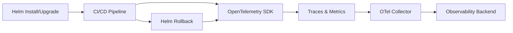
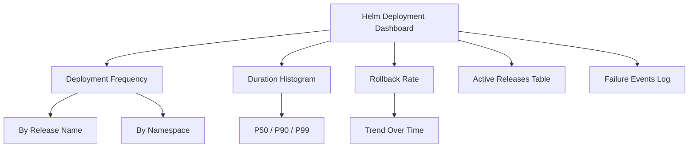

# How to Monitor Helm Chart Deployments and Rollbacks with OpenTelemetry

Author: [nawazdhandala](https://www.github.com/nawazdhandala)

Tags: OpenTelemetry, Helm, Kubernetes, Deployments, Observability, DevOps

Description: Learn how to monitor Helm chart deployments and rollbacks using OpenTelemetry traces, metrics, and events for full release observability.

---

Helm is the de facto package manager for Kubernetes. It simplifies deploying complex applications, but when something goes wrong during a release or rollback, figuring out what happened can be painful. You check `helm history`, scan pod logs, stare at events, and try to piece together a timeline. It does not have to be this way.

By integrating OpenTelemetry into your Helm deployment pipeline, you can capture traces for every release, record metrics on deployment frequency and duration, and correlate rollbacks with the exact conditions that triggered them. This post walks through setting that up from scratch.

## Why Helm Deployments Need Observability

Helm gives you `helm install`, `helm upgrade`, and `helm rollback`. These commands interact with the Kubernetes API to create or modify resources. But Helm itself does not emit telemetry. You get a success or failure exit code, and that is about it.

In production, you need to answer questions like:

- How long did the last deployment take?
- Which deployments triggered rollbacks?
- What was the state of the cluster when a rollback happened?
- Are deployment durations trending upward over time?

OpenTelemetry lets you instrument the deployment pipeline to answer all of these questions.



## Setting Up the OpenTelemetry Collector

Before instrumenting anything, you need a collector running in your cluster. The collector receives telemetry from your pipeline and exports it to your backend of choice.

Here is a basic collector deployment using the OpenTelemetry Operator. This configuration sets up an OTLP receiver on both gRPC and HTTP, and exports data to an external endpoint.

```yaml
# otel-collector.yaml
# Deploys an OpenTelemetry Collector that receives traces and metrics
# from your Helm deployment pipeline
apiVersion: opentelemetry.io/v1beta1
kind: OpenTelemetryCollector
metadata:
  name: helm-deploy-collector
  namespace: monitoring
spec:
  mode: deployment
  config:
    receivers:
      otlp:
        protocols:
          grpc:
            endpoint: 0.0.0.0:4317
          http:
            endpoint: 0.0.0.0:4318
    processors:
      batch:
        # Batch telemetry to reduce export overhead
        send_batch_size: 512
        timeout: 5s
      resource:
        attributes:
          - key: deployment.environment
            value: production
            action: upsert
    exporters:
      otlp:
        endpoint: "https://your-backend.example.com:4317"
        tls:
          insecure: false
    service:
      pipelines:
        traces:
          receivers: [otlp]
          processors: [batch, resource]
          exporters: [otlp]
        metrics:
          receivers: [otlp]
          processors: [batch, resource]
          exporters: [otlp]
```

Apply this to your cluster before moving on.

```bash
# Deploy the collector to the monitoring namespace
kubectl apply -f otel-collector.yaml
```

## Instrumenting Helm Deployments in CI/CD

The key insight is that your CI/CD pipeline is where Helm commands run. That is where you add instrumentation. Whether you use GitHub Actions, GitLab CI, or Jenkins, the approach is similar: wrap the Helm commands with OpenTelemetry trace context.

Here is a shell script that uses the `otel-cli` tool to create spans around Helm operations. The `otel-cli` is a command-line utility that speaks OTLP and can wrap arbitrary commands in trace spans.

```bash
#!/bin/bash
# helm-deploy-instrumented.sh
# Wraps Helm upgrade with OpenTelemetry tracing using otel-cli

export OTEL_EXPORTER_OTLP_ENDPOINT="http://helm-deploy-collector.monitoring:4318"
export OTEL_SERVICE_NAME="helm-deployment-pipeline"

RELEASE_NAME="my-app"
CHART_PATH="./charts/my-app"
NAMESPACE="default"
REVISION=$(helm history "$RELEASE_NAME" -n "$NAMESPACE" --max 1 -o json 2>/dev/null | jq -r '.[0].revision // "0"')

# Create a parent span for the entire deployment process
otel-cli exec \
  --name "helm-upgrade" \
  --service "$OTEL_SERVICE_NAME" \
  --attrs "helm.release=$RELEASE_NAME,helm.namespace=$NAMESPACE,helm.previous_revision=$REVISION" \
  -- helm upgrade --install "$RELEASE_NAME" "$CHART_PATH" \
     --namespace "$NAMESPACE" \
     --wait \
     --timeout 5m \
     --set image.tag="${IMAGE_TAG}"

DEPLOY_EXIT_CODE=$?

if [ $DEPLOY_EXIT_CODE -ne 0 ]; then
  # Record the failure and trigger a rollback with its own span
  otel-cli span \
    --name "helm-upgrade-failed" \
    --service "$OTEL_SERVICE_NAME" \
    --attrs "helm.release=$RELEASE_NAME,helm.exit_code=$DEPLOY_EXIT_CODE"

  otel-cli exec \
    --name "helm-rollback" \
    --service "$OTEL_SERVICE_NAME" \
    --attrs "helm.release=$RELEASE_NAME,helm.rollback_to_revision=$REVISION" \
    -- helm rollback "$RELEASE_NAME" "$REVISION" --namespace "$NAMESPACE" --wait
fi
```

This gives you a trace for every deployment. If a rollback happens, it appears as a child or sibling span in the same trace, so you can see the full story.

## Recording Deployment Metrics

Traces are great for individual deployments, but you also want aggregate metrics. How many deployments happened today? What is the average deployment duration? How often do rollbacks occur?

You can push these metrics using a lightweight script that runs after each Helm operation. This Python snippet uses the OpenTelemetry SDK to record custom metrics.

```python
# record_helm_metrics.py
# Records deployment metrics (duration, success/failure, rollback count)

from opentelemetry import metrics
from opentelemetry.sdk.metrics import MeterProvider
from opentelemetry.sdk.metrics.export import PeriodicExportingMetricReader
from opentelemetry.exporter.otlp.proto.grpc.metric_exporter import OTLPMetricExporter
import time
import sys

# Configure the OTLP exporter pointed at the collector
exporter = OTLPMetricExporter(endpoint="helm-deploy-collector.monitoring:4317", insecure=True)
reader = PeriodicExportingMetricReader(exporter, export_interval_millis=5000)
provider = MeterProvider(metric_readers=[reader])
metrics.set_meter_provider(provider)

meter = metrics.get_meter("helm.deployments")

# Create instruments for tracking deployment behavior
deploy_counter = meter.create_counter(
    "helm.deploy.count",
    description="Total number of Helm deployments"
)
rollback_counter = meter.create_counter(
    "helm.rollback.count",
    description="Total number of Helm rollbacks"
)
deploy_duration = meter.create_histogram(
    "helm.deploy.duration",
    description="Duration of Helm deployments in seconds",
    unit="s"
)

def record_deployment(release_name, namespace, duration_seconds, success, rolled_back=False):
    """Record metrics for a single Helm deployment."""
    labels = {
        "helm.release": release_name,
        "helm.namespace": namespace,
        "helm.success": str(success).lower(),
    }
    deploy_counter.add(1, labels)
    deploy_duration.record(duration_seconds, labels)

    if rolled_back:
        rollback_counter.add(1, labels)

if __name__ == "__main__":
    # Usage: python record_helm_metrics.py <release> <namespace> <duration> <success> [rolled_back]
    release = sys.argv[1]
    namespace = sys.argv[2]
    duration = float(sys.argv[3])
    success = sys.argv[4].lower() == "true"
    rolled_back = len(sys.argv) > 5 and sys.argv[5].lower() == "true"

    record_deployment(release, namespace, duration, success, rolled_back)
    # Give the exporter time to flush
    time.sleep(6)
    provider.shutdown()
```

Call this from your CI pipeline right after the Helm commands complete.

## Capturing Kubernetes Events During Deployments

Helm deployments create a cascade of Kubernetes events: pods scheduling, containers pulling images, readiness probes passing or failing. The OpenTelemetry Collector can capture these events using the `k8s_events` receiver.

Add this receiver to your collector configuration to automatically ingest Kubernetes events as logs.

```yaml
# Additional receiver config for capturing K8s events
# Add this to your collector's receivers section
receivers:
  k8s_events:
    # Watch all namespaces for deployment-related events
    namespaces: []
    auth_type: serviceAccount

# Update the service pipelines to include a logs pipeline
service:
  pipelines:
    logs:
      receivers: [k8s_events]
      processors: [batch, resource]
      exporters: [otlp]
```

The collector's service account needs RBAC permissions to watch events. Here is the ClusterRole you need.

```yaml
# clusterrole-events.yaml
# Grants the collector permission to watch Kubernetes events
apiVersion: rbac.authorization.k8s.io/v1
kind: ClusterRole
metadata:
  name: otel-events-reader
rules:
  - apiGroups: [""]
    resources: ["events"]
    verbs: ["get", "list", "watch"]
  - apiGroups: ["events.k8s.io"]
    resources: ["events"]
    verbs: ["get", "list", "watch"]
```

Now when a deployment fails and triggers a rollback, you will have the Kubernetes events captured alongside your deployment traces. You can correlate them using timestamps and resource attributes like the namespace and pod name.

## Building Dashboards for Helm Release Health

With traces, metrics, and events flowing into your backend, you can build dashboards that give you a real-time view of your release health. Here are the key panels to include:

- **Deployment frequency** - a time series of `helm.deploy.count` broken down by release name
- **Deployment duration** - a histogram of `helm.deploy.duration` showing P50, P90, and P99
- **Rollback rate** - the ratio of `helm.rollback.count` to `helm.deploy.count`
- **Active releases** - a table showing the current revision of each Helm release with last deploy timestamp
- **Recent failures** - a log panel filtered to Kubernetes events with `reason=Failed` or `reason=BackOff`



## Alerting on Deployment Anomalies

Dashboards are useful but you also want automated alerts. Set up alert rules in your observability backend for conditions like:

- Rollback rate exceeds 20% in a 1-hour window
- Deployment duration exceeds the P99 baseline by more than 2x
- More than 3 consecutive failed deployments for the same release

These alerts ensure that your team finds out about deployment problems before users do.

## Putting It All Together

The full picture looks like this: your CI/CD pipeline runs Helm commands wrapped in OpenTelemetry spans. A metrics recording script captures deployment counts, durations, and rollback rates. The collector running in the cluster captures Kubernetes events during the deployment window. Everything flows to your observability backend where dashboards and alerts give you complete visibility into your release process.

This approach works regardless of which Helm charts you deploy or how many clusters you manage. The instrumentation lives in the pipeline, not in the application code, so you do not need to modify your charts at all.

Start with traces on your most critical releases. Add metrics next. Then wire up events and alerting. Within a few hours, you will have better visibility into your deployment process than most teams achieve with custom tooling built over months.
