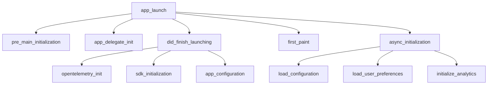

# How to Monitor iOS App Launch Performance with OpenTelemetry Spans

Author: [nawazdhandala](https://www.github.com/nawazdhandala)

Tags: OpenTelemetry, Swift, iOS, App Launch, Performance, Spans

Description: Track and optimize iOS app launch performance using OpenTelemetry spans to measure cold starts, warm starts, and initialization phases for better user experience.

App launch time is one of the most critical performance metrics for iOS applications. Users expect apps to start quickly, and slow launches lead to frustration and abandonment. Apple recommends keeping launch time under 400 milliseconds, but many apps take several seconds. OpenTelemetry provides the instrumentation needed to measure, analyze, and optimize your app's launch performance.

## Understanding iOS App Launch Types

iOS has three distinct types of app launches, each with different performance characteristics. Cold starts happen when the app isn't in memory and the system must load everything from scratch. Warm starts occur when the app was recently terminated but some resources remain cached. Resume operations happen when the app was suspended in the background and returns to the foreground.

Cold starts are the slowest and most important to optimize. They include process creation, dylib loading, static initializer execution, UIApplication initialization, and your app's custom setup code. Each phase contributes to the total launch time, and measuring them individually helps identify bottlenecks.

## Creating a Launch Tracer

Start by creating a dedicated tracer for launch performance monitoring. This tracer begins measuring as early as possible in the app lifecycle.

```swift
import UIKit
import OpenTelemetryApi
import OpenTelemetrySdk

class LaunchPerformanceTracer {
    static let shared = LaunchPerformanceTracer()

    private var tracer: Tracer?
    private var launchSpan: Span?
    private let launchStartTime: Date

    private init() {
        // Capture launch start time immediately
        launchStartTime = Date()
    }

    func initialize(tracerProvider: TracerProvider) {
        tracer = tracerProvider.get(
            instrumentationName: "app-launch",
            instrumentationVersion: "1.0.0"
        )

        // Create the main launch span with the captured start time
        launchSpan = tracer?.spanBuilder(spanName: "app_launch")
            .setStartTime(time: launchStartTime)
            .setSpanKind(spanKind: .internal)
            .startSpan()

        launchSpan?.setAttribute(key: "launch.type", value: determineLaunchType())
    }

    func recordPhase(name: String, startTime: Date, endTime: Date) {
        guard let tracer = tracer, let parent = launchSpan else { return }

        let phaseSpan = tracer.spanBuilder(spanName: "launch.\(name)")
            .setParent(parent)
            .setStartTime(time: startTime)
            .startSpan()

        let duration = endTime.timeIntervalSince(startTime)
        phaseSpan.setAttribute(key: "phase.name", value: name)
        phaseSpan.setAttribute(key: "phase.duration_ms", value: duration * 1000)

        phaseSpan.end(time: endTime)
    }

    func completeLaunch() {
        guard let span = launchSpan else { return }

        let totalDuration = Date().timeIntervalSince(launchStartTime)
        span.setAttribute(key: "launch.total_duration_ms", value: totalDuration * 1000)

        // Add device performance context
        span.setAttribute(
            key: "device.thermal_state",
            value: getThermalState()
        )
        span.setAttribute(
            key: "device.low_power_mode",
            value: ProcessInfo.processInfo.isLowPowerModeEnabled
        )

        span.end()
        launchSpan = nil
    }

    private func determineLaunchType() -> String {
        // Check if this is the first launch
        let hasLaunchedBefore = UserDefaults.standard.bool(forKey: "has_launched_before")

        if !hasLaunchedBefore {
            UserDefaults.standard.set(true, forKey: "has_launched_before")
            return "first_launch"
        }

        // Distinguish between cold and warm start based on time since last launch
        // This is an approximation - exact detection is complex
        return "cold_start"
    }

    private func getThermalState() -> String {
        switch ProcessInfo.processInfo.thermalState {
        case .nominal: return "nominal"
        case .fair: return "fair"
        case .serious: return "serious"
        case .critical: return "critical"
        @unknown default: return "unknown"
        }
    }
}
```

The tracer captures the launch start time in its initializer, which runs very early in the process lifecycle. This ensures the measurement includes as much of the launch sequence as possible.

## Instrumenting AppDelegate Lifecycle

The AppDelegate receives callbacks at key points during launch. Instrument these methods to measure their execution time.

```swift
import UIKit
import OpenTelemetrySdk

@main
class AppDelegate: UIResponder, UIApplicationDelegate {
    private var initStartTime: Date?
    private var didFinishLaunchingStartTime: Date?

    override init() {
        initStartTime = Date()
        super.init()

        let initEndTime = Date()
        LaunchPerformanceTracer.shared.recordPhase(
            name: "app_delegate_init",
            startTime: initStartTime!,
            endTime: initEndTime
        )
    }

    func application(
        _ application: UIApplication,
        didFinishLaunchingWithOptions launchOptions: [UIApplication.LaunchOptionsKey: Any]?
    ) -> Bool {
        didFinishLaunchingStartTime = Date()

        // Initialize OpenTelemetry first
        let tracerProvider = initializeOpenTelemetry()

        // Initialize the launch tracer
        LaunchPerformanceTracer.shared.initialize(tracerProvider: tracerProvider)

        // Record OpenTelemetry initialization time
        let otelInitEndTime = Date()
        LaunchPerformanceTracer.shared.recordPhase(
            name: "opentelemetry_init",
            startTime: didFinishLaunchingStartTime!,
            endTime: otelInitEndTime
        )

        // Perform other initialization tasks
        let sdkInitStartTime = Date()
        initializeSDKs()
        let sdkInitEndTime = Date()

        LaunchPerformanceTracer.shared.recordPhase(
            name: "sdk_initialization",
            startTime: sdkInitStartTime,
            endTime: sdkInitEndTime
        )

        // Configure app settings
        let configStartTime = Date()
        configureAppSettings()
        let configEndTime = Date()

        LaunchPerformanceTracer.shared.recordPhase(
            name: "app_configuration",
            startTime: configStartTime,
            endTime: configEndTime
        )

        // Record total didFinishLaunching time
        LaunchPerformanceTracer.shared.recordPhase(
            name: "did_finish_launching",
            startTime: didFinishLaunchingStartTime!,
            endTime: Date()
        )

        return true
    }

    func applicationDidBecomeActive(_ application: UIApplication) {
        // Launch is complete when the app becomes active
        LaunchPerformanceTracer.shared.completeLaunch()
    }

    private func initializeOpenTelemetry() -> TracerProvider {
        // Initialize and return tracer provider
        let tracerProvider = TracerProviderBuilder()
            .with(resource: createResource())
            .add(spanProcessor: createSpanProcessor())
            .build()

        OpenTelemetry.registerTracerProvider(tracerProvider: tracerProvider)

        return tracerProvider
    }

    private func createResource() -> Resource {
        return Resource(attributes: [
            ResourceAttributes.serviceName.rawValue: AttributeValue.string("my-ios-app")
        ])
    }

    private func createSpanProcessor() -> SpanProcessor {
        // Return configured span processor with exporter
        return SimpleSpanProcessor(spanExporter: StdoutExporter())
    }

    private func initializeSDKs() {
        // Initialize third-party SDKs
        Thread.sleep(forTimeInterval: 0.1) // Simulated work
    }

    private func configureAppSettings() {
        // Configure app settings and preferences
        Thread.sleep(forTimeInterval: 0.05) // Simulated work
    }
}
```

This instrumentation creates a hierarchy of spans showing how launch time is distributed across different initialization phases.

## Measuring Pre-Main Time

A significant portion of launch time happens before your code runs. The system loads dynamic libraries, runs static initializers, and prepares the runtime. While you can't directly instrument this phase with OpenTelemetry, you can measure it using Xcode environment variables.

Add the environment variable `DYLD_PRINT_STATISTICS` in your scheme's Run configuration to see pre-main timing in the console. Record this information as a span attribute:

```swift
class SystemLaunchMetrics {
    static func recordPreMainTime() {
        // The pre-main time must be captured from Xcode logs and recorded manually
        // or through automated tooling that parses the console output

        // This is a placeholder showing how you would record the data
        let estimatedPreMainTime: TimeInterval = 0.3 // 300ms, example value

        let tracer = OpenTelemetry.instance.tracerProvider.get(
            instrumentationName: "app-launch",
            instrumentationVersion: "1.0.0"
        )

        let span = tracer.spanBuilder(spanName: "pre_main_initialization")
            .startSpan()

        span.setAttribute(key: "phase.name", value: "pre_main")
        span.setAttribute(key: "phase.duration_ms", value: estimatedPreMainTime * 1000)
        span.setAttribute(
            key: "phase.note",
            value: "Estimated from DYLD_PRINT_STATISTICS"
        )

        span.end()
    }
}
```

## Tracking First Screen Display

Launch isn't complete until the first screen appears and is interactive. Measure the time from app start to first meaningful paint.

```swift
import SwiftUI
import OpenTelemetryApi

struct RootView: View {
    @State private var hasRecordedFirstPaint = false

    var body: some View {
        HomeView()
            .onAppear {
                recordFirstPaint()
            }
    }

    private func recordFirstPaint() {
        guard !hasRecordedFirstPaint else { return }
        hasRecordedFirstPaint = true

        let tracer = OpenTelemetry.instance.tracerProvider.get(
            instrumentationName: "app-launch",
            instrumentationVersion: "1.0.0"
        )

        let span = tracer.spanBuilder(spanName: "first_paint")
            .startSpan()

        span.setAttribute(key: "ui.state", value: "visible")
        span.setAttribute(key: "view.name", value: "HomeView")

        span.end()

        // Mark launch as complete
        LaunchPerformanceTracer.shared.completeLaunch()
    }
}

struct HomeView: View {
    var body: some View {
        NavigationView {
            VStack {
                Text("Welcome!")
                    .font(.largeTitle)
            }
        }
    }
}
```

## Measuring Async Initialization Tasks

Many apps perform asynchronous initialization during launch, such as fetching configuration from a server or loading cached data. Track these operations even though they don't block the main thread.

```swift
import Foundation
import OpenTelemetryApi

class AsyncInitializationTracker {
    private let tracer: Tracer

    init() {
        self.tracer = OpenTelemetry.instance.tracerProvider.get(
            instrumentationName: "async-initialization",
            instrumentationVersion: "1.0.0"
        )
    }

    func trackInitialization() {
        // Track multiple async initialization tasks
        let group = DispatchGroup()

        group.enter()
        loadConfiguration { [weak self] success in
            self?.recordTask(name: "load_configuration", success: success)
            group.leave()
        }

        group.enter()
        loadUserPreferences { [weak self] success in
            self?.recordTask(name: "load_user_preferences", success: success)
            group.leave()
        }

        group.enter()
        initializeAnalytics { [weak self] success in
            self?.recordTask(name: "initialize_analytics", success: success)
            group.leave()
        }

        // Create a span for the entire async initialization phase
        let overallSpan = tracer.spanBuilder(spanName: "async_initialization")
            .setSpanKind(spanKind: .internal)
            .startSpan()

        group.notify(queue: .main) {
            overallSpan.setAttribute(key: "initialization.complete", value: true)
            overallSpan.end()
        }
    }

    private func recordTask(name: String, success: Bool) {
        let span = tracer.spanBuilder(spanName: "init_task.\(name)")
            .startSpan()

        span.setAttribute(key: "task.name", value: name)
        span.setAttribute(key: "task.success", value: success)

        if !success {
            span.status = .error(description: "Initialization task failed")
        }

        span.end()
    }

    private func loadConfiguration(completion: @escaping (Bool) -> Void) {
        // Simulate async work
        DispatchQueue.global().asyncAfter(deadline: .now() + 0.5) {
            completion(true)
        }
    }

    private func loadUserPreferences(completion: @escaping (Bool) -> Void) {
        DispatchQueue.global().asyncAfter(deadline: .now() + 0.3) {
            completion(true)
        }
    }

    private func initializeAnalytics(completion: @escaping (Bool) -> Void) {
        DispatchQueue.global().asyncAfter(deadline: .now() + 0.2) {
            completion(true)
        }
    }
}
```

## Creating a Launch Performance Dashboard

Structure your launch spans to enable easy analysis in your observability backend. Use consistent naming and attributes:



This hierarchy shows the complete launch sequence with parallel and sequential operations clearly separated.

## Detecting Launch Performance Regressions

Track launch performance over time to catch regressions before they reach production. Compare launches across app versions, device types, and OS versions.

```swift
import OpenTelemetryApi

class LaunchPerformanceAnalyzer {
    private let tracer: Tracer

    init() {
        self.tracer = OpenTelemetry.instance.tracerProvider.get(
            instrumentationName: "launch-analysis",
            instrumentationVersion: "1.0.0"
        )
    }

    func analyzeLaunchPerformance(totalDuration: TimeInterval) {
        let span = tracer.spanBuilder(spanName: "launch_performance_analysis")
            .startSpan()

        // Categorize launch performance
        let performanceCategory: String
        if totalDuration < 0.4 {
            performanceCategory = "excellent"
        } else if totalDuration < 1.0 {
            performanceCategory = "good"
        } else if totalDuration < 2.0 {
            performanceCategory = "acceptable"
        } else {
            performanceCategory = "poor"
        }

        span.setAttribute(key: "performance.category", value: performanceCategory)
        span.setAttribute(key: "performance.duration_ms", value: totalDuration * 1000)

        // Add device context
        span.setAttribute(
            key: "device.model",
            value: UIDevice.current.model
        )
        span.setAttribute(
            key: "device.system_version",
            value: UIDevice.current.systemVersion
        )

        // Compare to baseline
        let baseline: TimeInterval = 0.8 // 800ms baseline
        let delta = totalDuration - baseline

        span.setAttribute(key: "performance.baseline_ms", value: baseline * 1000)
        span.setAttribute(key: "performance.delta_ms", value: delta * 1000)

        if delta > 0.5 {
            // Launch is significantly slower than baseline
            span.setAttribute(key: "performance.regression", value: true)
            span.status = .error(description: "Launch performance regression detected")
        }

        span.end()
    }
}
```

## Optimizing Based on Launch Traces

Once you have launch traces, analyze them to identify optimization opportunities. Common issues include:

Excessive work on the main thread during initialization. Move heavy operations to background queues or defer them until after the first screen appears.

Too many third-party SDK initializations. Many SDKs can be initialized lazily when first used rather than during app launch.

Large amounts of data loading during startup. Cache aggressively and load incrementally rather than blocking launch on data fetching.

Synchronous network requests during launch. Never make synchronous network calls during app startup.

```swift
class OptimizedAppDelegate: UIResponder, UIApplicationDelegate {
    func application(
        _ application: UIApplication,
        didFinishLaunchingWithOptions launchOptions: [UIApplication.LaunchOptionsKey: Any]?
    ) -> Bool {
        let startTime = Date()

        // Initialize only critical components synchronously
        initializeCriticalServices()

        // Defer non-critical initialization
        DispatchQueue.main.async {
            self.initializeNonCriticalServices()
        }

        // Background initialization for heavy work
        DispatchQueue.global(qos: .utility).async {
            self.initializeBackgroundServices()
        }

        LaunchPerformanceTracer.shared.recordPhase(
            name: "optimized_launch",
            startTime: startTime,
            endTime: Date()
        )

        return true
    }

    private func initializeCriticalServices() {
        // Only OpenTelemetry and essential services
        initializeOpenTelemetry()
    }

    private func initializeNonCriticalServices() {
        // Analytics, crash reporting, etc.
        // These can wait until after first paint
        let startTime = Date()

        // Initialize services...

        LaunchPerformanceTracer.shared.recordPhase(
            name: "deferred_initialization",
            startTime: startTime,
            endTime: Date()
        )
    }

    private func initializeBackgroundServices() {
        // Heavy initialization like ML models, large caches, etc.
        let startTime = Date()

        // Initialize services...

        LaunchPerformanceTracer.shared.recordPhase(
            name: "background_initialization",
            startTime: startTime,
            endTime: Date()
        )
    }

    private func initializeOpenTelemetry() {
        // OpenTelemetry initialization
    }
}
```

## Measuring Warm Start Performance

Distinguish between cold starts and warm starts to understand the full picture of launch performance.

```swift
class LaunchTypeDetector {
    private static let lastTerminationTimeKey = "last_termination_time"

    static func recordTermination() {
        UserDefaults.standard.set(
            Date().timeIntervalSince1970,
            forKey: lastTerminationTimeKey
        )
    }

    static func detectLaunchType() -> String {
        let lastTerminationTime = UserDefaults.standard.double(
            forKey: lastTerminationTimeKey
        )

        if lastTerminationTime == 0 {
            return "first_launch"
        }

        let timeSinceTermination = Date().timeIntervalSince1970 - lastTerminationTime

        // If less than 60 seconds since termination, likely a warm start
        if timeSinceTermination < 60 {
            return "warm_start"
        }

        return "cold_start"
    }
}

class ImprovedAppDelegate: UIResponder, UIApplicationDelegate {
    func application(
        _ application: UIApplication,
        didFinishLaunchingWithOptions launchOptions: [UIApplication.LaunchOptionsKey: Any]?
    ) -> Bool {
        let launchType = LaunchTypeDetector.detectLaunchType()

        let span = createLaunchSpan()
        span.setAttribute(key: "launch.type", value: launchType)

        return true
    }

    func applicationWillTerminate(_ application: UIApplication) {
        LaunchTypeDetector.recordTermination()
    }

    private func createLaunchSpan() -> Span {
        let tracer = OpenTelemetry.instance.tracerProvider.get(
            instrumentationName: "app-launch",
            instrumentationVersion: "1.0.0"
        )

        return tracer.spanBuilder(spanName: "app_launch").startSpan()
    }
}
```

## Best Practices for Launch Monitoring

Keep launch instrumentation lightweight. The instrumentation itself shouldn't significantly impact launch time. Use efficient code and avoid creating excessive spans.

Focus on phases that actually take significant time. Creating spans for operations that take less than 10ms adds noise without providing value.

Test launch performance on real devices, not just simulators. Simulators run on powerful hardware and don't reflect real-world performance.

Measure launch performance across different device models and iOS versions. Older devices show performance issues more clearly.

Track launch performance in production, not just during development. Real users experience different network conditions, device states, and usage patterns than your test environment.

## The Foundation of User Experience

App launch performance sets users' first impression of your application. Fast launches feel responsive and professional, while slow launches frustrate users before they even see your content. OpenTelemetry provides the measurement capabilities needed to understand, optimize, and maintain fast launch times across your user base.

The instrumentation patterns shown here create detailed visibility into every phase of app launch. Use this data to identify bottlenecks, validate optimizations, and prevent regressions. With proper launch monitoring in place, you can confidently deliver the fast, responsive experience users expect from iOS apps.
