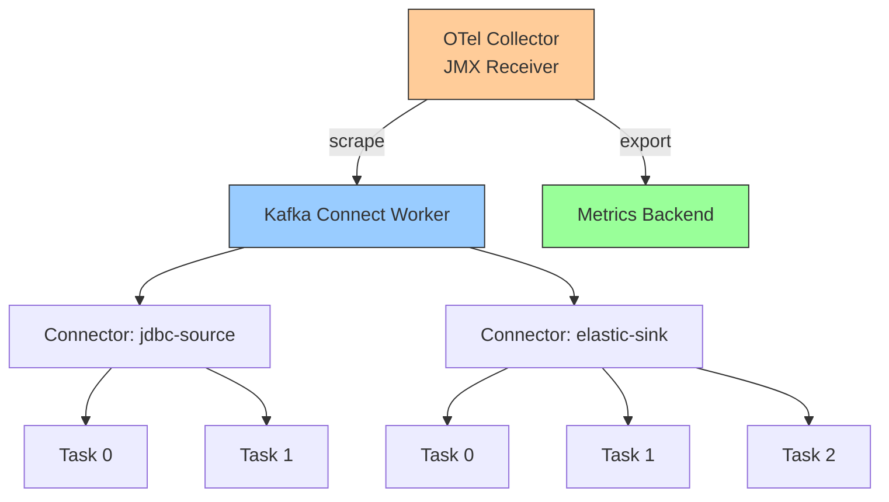

# How to Monitor Kafka Connect Connectors with OpenTelemetry

Author: [nawazdhandala](https://www.github.com/nawazdhandala)

Tags: OpenTelemetry, Kafka Connect, Monitoring, Connectors, Apache Kafka, JMX, Observability

Description: Learn how to monitor Kafka Connect connectors with OpenTelemetry using JMX metrics, connector health checks, and task-level observability for reliable data pipelines.

---

Kafka Connect is the integration framework for Apache Kafka that moves data between Kafka and external systems like databases, search indexes, and cloud storage. A single Kafka Connect cluster might run dozens of connectors, each with multiple tasks, creating a complex operational surface that requires dedicated monitoring. When a connector task fails or slows down, the ripple effects can include data loss, stale search indexes, or broken ETL pipelines. OpenTelemetry gives you the tools to collect connector metrics, track task health, and alert on problems before they impact downstream systems.

This guide covers monitoring Kafka Connect using the OpenTelemetry Collector's JMX receiver for connector metrics, the REST API for health checks, and application-level tracing for custom connectors.

## Kafka Connect Metrics Architecture

Kafka Connect exposes metrics through JMX, just like the rest of the Kafka ecosystem. These metrics cover three levels: the worker (the Connect process itself), the connectors (logical groupings of tasks), and the individual tasks (the units that actually move data). Each level provides different insights.



## Enabling JMX on Kafka Connect

Before the OpenTelemetry Collector can scrape metrics, JMX must be enabled on the Kafka Connect worker. Add the JMX configuration to the Connect startup:

```bash
# kafka-connect-env.sh
# Enable JMX for the Kafka Connect worker process
export KAFKA_JMX_OPTS="-Dcom.sun.management.jmxremote \
  -Dcom.sun.management.jmxremote.port=9999 \
  -Dcom.sun.management.jmxremote.rmi.port=9999 \
  -Dcom.sun.management.jmxremote.authenticate=true \
  -Dcom.sun.management.jmxremote.ssl=false \
  -Dcom.sun.management.jmxremote.password.file=/etc/kafka/jmxremote.password \
  -Dcom.sun.management.jmxremote.access.file=/etc/kafka/jmxremote.access \
  -Djava.rmi.server.hostname=localhost"
```

For Docker or Kubernetes deployments, set this through environment variables in your container configuration:

```yaml
# docker-compose.yml - Kafka Connect with JMX enabled
services:
  kafka-connect:
    image: confluentinc/cp-kafka-connect:7.6.0
    environment:
      CONNECT_BOOTSTRAP_SERVERS: "kafka:9092"
      CONNECT_GROUP_ID: "connect-cluster"
      CONNECT_CONFIG_STORAGE_TOPIC: "connect-configs"
      CONNECT_OFFSET_STORAGE_TOPIC: "connect-offsets"
      CONNECT_STATUS_STORAGE_TOPIC: "connect-status"
      CONNECT_KEY_CONVERTER: "org.apache.kafka.connect.json.JsonConverter"
      CONNECT_VALUE_CONVERTER: "org.apache.kafka.connect.json.JsonConverter"
      # Enable JMX
      KAFKA_JMX_PORT: "9999"
      KAFKA_JMX_HOSTNAME: "kafka-connect"
    ports:
      - "8083:8083"   # REST API
      - "9999:9999"   # JMX
```

## Collector Configuration for Kafka Connect Metrics

The OpenTelemetry Collector's JMX receiver connects to the Kafka Connect JMX endpoint and collects the relevant MBeans. Here is a complete collector configuration:

```yaml
# otel-collector-config.yaml
receivers:
  # JMX receiver for Kafka Connect metrics
  jmx:
    jar_path: /opt/opentelemetry-jmx-metrics.jar
    endpoint: kafka-connect:9999
    target_system: kafka-connect
    collection_interval: 30s
    username: monitor
    password: ${env:JMX_PASSWORD}

  # OTLP for any application-level telemetry
  otlp:
    protocols:
      grpc:
        endpoint: 0.0.0.0:4317

processors:
  batch:
    timeout: 15s
    send_batch_size: 200

  # Add Connect cluster identification
  resource:
    attributes:
      - key: kafka.connect.cluster
        value: ${env:CONNECT_CLUSTER_NAME}
        action: upsert

exporters:
  otlp:
    endpoint: https://oneuptime-ingest.example.com:4317
    tls:
      insecure: false

service:
  pipelines:
    metrics:
      receivers: [jmx]
      processors: [resource, batch]
      exporters: [otlp]
    traces:
      receivers: [otlp]
      processors: [batch]
      exporters: [otlp]
```

The `target_system: kafka-connect` setting uses the built-in metric definitions for Kafka Connect, which map to the standard JMX MBeans that Connect exposes.

## Key Metrics to Monitor

Kafka Connect exposes a rich set of metrics across workers, connectors, and tasks. Here are the most important ones for operational monitoring:

### Worker-Level Metrics

```yaml
# Worker metrics from JMX MBean:
# kafka.connect:type=connect-worker-metrics

# Number of connectors in the worker
kafka.connect.worker.connector_count:
  description: "Total connectors deployed to this worker"

# Task startup and failure rates
kafka.connect.worker.task_startup_success_total:
  description: "Total successful task starts"
kafka.connect.worker.task_startup_failure_total:
  description: "Total failed task starts"

# Rebalance metrics - critical for cluster stability
kafka.connect.worker.rebalance_completed_total:
  description: "Total completed rebalances"
kafka.connect.worker.rebalance_avg_time_ms:
  description: "Average time spent in rebalance"
```

Frequent rebalances indicate cluster instability. Each rebalance pauses all connectors on the affected workers, so high rebalance frequency directly impacts data pipeline throughput.

### Connector-Level Metrics

```yaml
# Connector metrics from JMX MBean:
# kafka.connect:type=connector-metrics,connector=*

# Connector status
kafka.connect.connector.status:
  description: "Connector running state"
  # Values: running, paused, failed, unassigned

# Task-level metrics from JMX MBean:
# kafka.connect:type=connector-task-metrics,connector=*,task=*

kafka.connect.connector.task.status:
  description: "Individual task state"
```

### Source Connector Metrics

```yaml
# Source connector metrics from JMX MBean:
# kafka.connect:type=source-task-metrics,connector=*,task=*

# Records produced to Kafka
kafka.connect.source.poll_batch_avg_time_ms:
  description: "Average time for a poll batch"
kafka.connect.source.source_record_write_total:
  description: "Total records written to Kafka"
kafka.connect.source.source_record_active_count:
  description: "Records polled but not yet committed"

# Poll rate indicates source throughput
kafka.connect.source.source_record_poll_total:
  description: "Total records polled from source"
```

### Sink Connector Metrics

```yaml
# Sink connector metrics from JMX MBean:
# kafka.connect:type=sink-task-metrics,connector=*,task=*

# Records consumed from Kafka
kafka.connect.sink.sink_record_read_total:
  description: "Total records read from Kafka"
kafka.connect.sink.sink_record_send_total:
  description: "Total records sent to destination"

# Offset commit tracking
kafka.connect.sink.offset_commit_success_percentage:
  description: "Percentage of successful offset commits"
kafka.connect.sink.offset_commit_avg_time_ms:
  description: "Average offset commit duration"

# Partition-level metrics for identifying lag
kafka.connect.sink.partition_count:
  description: "Number of partitions assigned to this task"
```

The gap between `sink_record_read_total` and `sink_record_send_total` indicates records that were read from Kafka but not yet successfully written to the destination. A growing gap suggests the destination is slow or failing.

## Monitoring Connector Health via REST API

Kafka Connect's REST API provides connector and task status information that complements JMX metrics. You can use the OpenTelemetry Collector's HTTP receiver with a script to poll the REST API:

```python
# connect_health_check.py - Poll Connect REST API and emit OTel metrics
import requests
import time
from opentelemetry import metrics
from opentelemetry.sdk.metrics import MeterProvider
from opentelemetry.sdk.metrics.export import PeriodicExportingMetricReader
from opentelemetry.exporter.otlp.proto.grpc.metric_exporter import OTLPMetricExporter

# Set up OTel metrics
reader = PeriodicExportingMetricReader(
    OTLPMetricExporter(endpoint="http://otel-collector:4317"),
    export_interval_millis=30000,
)
provider = MeterProvider(metric_readers=[reader])
metrics.set_meter_provider(provider)

meter = metrics.get_meter("kafka-connect-health")

# Create gauges for connector and task status
connector_status_gauge = meter.create_observable_gauge(
    "kafka.connect.connector.health",
    description="Connector health status (1=running, 0=failed)",
)

task_status_gauge = meter.create_observable_gauge(
    "kafka.connect.task.health",
    description="Task health status (1=running, 0=failed)",
)

CONNECT_URL = "http://kafka-connect:8083"

def check_connector_health():
    """Poll all connectors and their tasks for health status."""
    try:
        # Get list of all connectors
        resp = requests.get(f"{CONNECT_URL}/connectors")
        connectors = resp.json()

        results = []
        for connector_name in connectors:
            # Get connector status including task details
            status_resp = requests.get(
                f"{CONNECT_URL}/connectors/{connector_name}/status")
            status = status_resp.json()

            # Check connector state
            connector_state = status["connector"]["state"]
            is_running = 1 if connector_state == "RUNNING" else 0

            results.append({
                "name": connector_name,
                "state": connector_state,
                "healthy": is_running,
                "worker": status["connector"]["worker_id"],
            })

            # Check each task state
            for task in status["tasks"]:
                task_state = task["state"]
                task_healthy = 1 if task_state == "RUNNING" else 0

                if task_state == "FAILED":
                    # Log the failure trace for debugging
                    print(f"FAILED task {connector_name}/{task['id']}: "
                          f"{task.get('trace', 'no trace')}")

        return results

    except requests.exceptions.ConnectionError:
        print("Cannot connect to Kafka Connect REST API")
        return []

# Run health checks on a schedule
while True:
    check_connector_health()
    time.sleep(30)
```

This script polls the Connect REST API every 30 seconds and emits health metrics through OpenTelemetry. The REST API provides information that JMX does not easily expose, like the specific error trace when a task fails. Combining both sources gives you complete visibility.

## Alerting on Common Failure Patterns

Based on the collected metrics, set up alerts for these common Kafka Connect failure patterns:

**Connector task failure**: A task enters the FAILED state and stops processing data.

```yaml
# Alert condition (expressed as a metric query)
# kafka.connect.task.health == 0 for any connector/task combination
# Severity: Critical
# Action: Check task trace via REST API, restart if transient
```

**Growing source record active count**: Source connector polls records but cannot write them to Kafka, indicating Kafka broker issues.

```yaml
# Alert condition:
# kafka.connect.source.source_record_active_count > threshold
# sustained for 5 minutes
# Severity: Warning
# Action: Check Kafka broker health and network connectivity
```

**Sink offset commit failures**: The sink connector cannot commit offsets, which means progress is not being tracked and records will be reprocessed after a restart.

```yaml
# Alert condition:
# kafka.connect.sink.offset_commit_success_percentage < 95
# Severity: Warning
# Action: Check destination system health and Connect worker resources
```

**Frequent rebalances**: Workers joining and leaving the group too often, causing processing pauses.

```yaml
# Alert condition:
# kafka.connect.worker.rebalance_completed_total increases
# more than 5 times per hour
# Severity: Warning
# Action: Check worker health, network stability, and session timeouts
```

## Tracing Custom Connectors

If you are building custom Kafka Connect connectors, you can add OpenTelemetry tracing directly into the connector code:

```java
// CustomSinkTask.java - Sink task with OTel tracing
import org.apache.kafka.connect.sink.SinkTask;
import org.apache.kafka.connect.sink.SinkRecord;
import io.opentelemetry.api.GlobalOpenTelemetry;
import io.opentelemetry.api.trace.Tracer;
import io.opentelemetry.api.trace.Span;
import io.opentelemetry.context.Scope;

import java.util.Collection;

public class CustomSinkTask extends SinkTask {

    private static final Tracer tracer =
        GlobalOpenTelemetry.getTracer("custom-sink-connector");

    @Override
    public void put(Collection<SinkRecord> records) {
        if (records.isEmpty()) return;

        // Create a span for the batch write operation
        Span span = tracer.spanBuilder("sink.put_batch")
            .setAttribute("kafka.connect.batch.size", records.size())
            .setAttribute("kafka.connect.connector",
                this.getClass().getSimpleName())
            .startSpan();

        try (Scope scope = span.makeCurrent()) {
            // Group records by topic-partition for efficient writes
            var grouped = groupByPartition(records);

            for (var entry : grouped.entrySet()) {
                // Create a child span per partition batch
                Span partitionSpan = tracer
                    .spanBuilder("sink.write_partition")
                    .setAttribute("kafka.topic", entry.getKey().topic())
                    .setAttribute("kafka.partition",
                        entry.getKey().partition())
                    .setAttribute("record.count",
                        entry.getValue().size())
                    .startSpan();

                try (Scope partitionScope =
                         partitionSpan.makeCurrent()) {
                    writeToDestination(entry.getValue());
                    partitionSpan.setAttribute("write.success", true);
                } catch (Exception e) {
                    partitionSpan.recordException(e);
                    partitionSpan.setAttribute("write.success", false);
                    throw e;
                } finally {
                    partitionSpan.end();
                }
            }

            span.setAttribute("batch.success", true);
        } catch (Exception e) {
            span.recordException(e);
            span.setAttribute("batch.success", false);
            throw new RuntimeException("Failed to write records", e);
        } finally {
            span.end();
        }
    }

    @Override
    public String version() { return "1.0.0"; }

    @Override
    public void start(java.util.Map<String, String> props) {
        // Connector task initialization
    }

    @Override
    public void stop() {
        // Cleanup resources
    }
}
```

The tracing in this custom sink task creates spans for each batch write and for each partition within the batch. This granularity helps identify whether write failures are partition-specific or affect the entire batch. The exception recording on the span preserves the full error details for debugging in your trace backend.

## Dashboard Metrics Summary

Here is a summary of the metrics you should display on your Kafka Connect monitoring dashboard:

| Metric | Source | What It Tells You |
|--------|--------|-------------------|
| Connector count | JMX | Total connectors deployed |
| Task status | REST API | Which tasks are running or failed |
| Rebalance rate | JMX | Cluster stability |
| Source poll rate | JMX | Source connector throughput |
| Sink read/write gap | JMX | Destination write backlog |
| Offset commit success % | JMX | Progress tracking reliability |
| Worker memory/CPU | System | Resource utilization |

## Conclusion

Monitoring Kafka Connect with OpenTelemetry provides the operational visibility needed to run reliable data pipelines. The JMX receiver captures worker, connector, and task-level metrics without modifying the Connect deployment. REST API health checks add failure details that JMX does not expose. For custom connectors, OpenTelemetry tracing gives you per-record visibility into write operations and error patterns. Together, these approaches form a comprehensive monitoring strategy that helps you detect and resolve Kafka Connect issues before they impact the data systems downstream.
