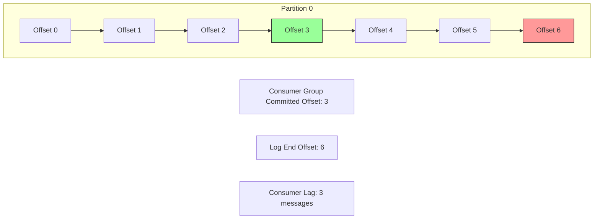

# How to Monitor Apache Kafka Consumer Lag with the OpenTelemetry Collector

Author: [nawazdhandala](https://www.github.com/nawazdhandala)

Tags: OpenTelemetry, Kafka, Consumer Lag, Collector, Monitoring, Metrics, Observability

Description: Learn how to monitor Apache Kafka consumer lag using the OpenTelemetry Collector's Kafka metrics receiver, with alerting strategies and troubleshooting guidance.

---

Consumer lag is the single most important metric in any Kafka deployment. It measures the difference between the latest message produced to a partition and the last message consumed by a consumer group. When lag grows, it means consumers are falling behind producers, and downstream systems are working with stale data. In time-sensitive applications like fraud detection, real-time pricing, or event-driven microservices, even a few seconds of lag can cause business problems.

The OpenTelemetry Collector provides a dedicated Kafka metrics receiver that scrapes consumer lag and other broker metrics without requiring any changes to your application code. This guide covers how to set it up, what metrics to watch, and how to build effective alerts around consumer lag.

## What Consumer Lag Actually Measures

Before configuring anything, it helps to understand what consumer lag represents at the partition level:



The log end offset (LEO) is the offset of the most recent message in the partition. The committed offset is the last offset the consumer group has confirmed processing. The difference between these two numbers is the consumer lag. Each partition has its own lag value, and the total lag for a consumer group is the sum across all partitions it consumes.

Lag can grow for several reasons: the consumer is processing messages too slowly, a consumer instance crashed and its partitions have not been reassigned yet, the consumer is stuck on a poison pill message, or the producer throughput temporarily exceeded consumer capacity.

## Setting Up the Kafka Metrics Receiver

The OpenTelemetry Collector's `kafkametrics` receiver connects to Kafka brokers and scrapes metrics at a configurable interval. Here is the basic configuration:

```yaml
# otel-collector-config.yaml
receivers:
  # Kafka metrics receiver scrapes broker and consumer group metrics
  kafkametrics:
    # List of Kafka broker addresses
    brokers:
      - kafka-broker-1:9092
      - kafka-broker-2:9092
      - kafka-broker-3:9092
    # Kafka protocol version for compatibility
    protocol_version: 3.6.0
    # Which metric categories to collect
    scrapers:
      - brokers    # Broker-level metrics
      - topics     # Topic-level metrics (partition counts, offsets)
      - consumers  # Consumer group metrics (lag, offsets)
    # How often to collect metrics
    collection_interval: 30s

processors:
  memory_limiter:
    check_interval: 1s
    limit_mib: 512

  batch:
    timeout: 10s
    send_batch_size: 256

exporters:
  otlp:
    endpoint: your-observability-backend:4317
    tls:
      insecure: false

service:
  pipelines:
    metrics:
      receivers: [kafkametrics]
      processors: [memory_limiter, batch]
      exporters: [otlp]
```

The `consumers` scraper is the one that provides consumer lag. The `topics` scraper gives you partition-level offsets and message counts. The `brokers` scraper provides broker health information. Together, they give you a complete picture of your Kafka cluster's state.

## Understanding the Metrics

The Kafka metrics receiver produces several metrics. Here are the ones most relevant to consumer lag monitoring:

```
# Consumer lag per partition
kafka.consumer_group.lag
  Attributes:
    - group: "order-processor"
    - topic: "orders"
    - partition: 0

# Consumer group committed offset per partition
kafka.consumer_group.offset
  Attributes:
    - group: "order-processor"
    - topic: "orders"
    - partition: 0

# Topic partition current offset (log end offset)
kafka.topic.partitions.current_offset
  Attributes:
    - topic: "orders"
    - partition: 0

# Number of partitions in a topic
kafka.topic.partitions
  Attributes:
    - topic: "orders"

# Number of brokers in the cluster
kafka.brokers
```

The `kafka.consumer_group.lag` metric is the primary one for lag monitoring. It reports the lag value for each combination of consumer group, topic, and partition. The offset metrics let you calculate lag manually and also understand whether lag is growing because the producer is accelerating or because the consumer is stalling.

## Advanced Collector Configuration

For production environments, you will want a more detailed configuration that handles authentication, filtering, and resource attribution:

```yaml
# otel-collector-config-production.yaml
receivers:
  kafkametrics:
    brokers:
      - kafka-broker-1:9092
      - kafka-broker-2:9092
      - kafka-broker-3:9092
    protocol_version: 3.6.0
    scrapers:
      - brokers
      - topics
      - consumers
    collection_interval: 15s
    # Authentication for secured clusters
    auth:
      sasl:
        mechanism: SCRAM-SHA-512
        username: ${env:KAFKA_USERNAME}
        password: ${env:KAFKA_PASSWORD}
      tls:
        insecure: false
        ca_file: /etc/ssl/certs/kafka-ca.pem
    # Filter to specific topics and consumer groups
    # to reduce metric volume
    topic_match: "^(orders|payments|inventory|notifications).*"
    group_match: "^(order-processor|payment-handler|inventory-sync).*"

processors:
  memory_limiter:
    check_interval: 1s
    limit_mib: 1024
    spike_limit_mib: 256

  batch:
    timeout: 10s
    send_batch_size: 512

  # Add environment context to all metrics
  resource:
    attributes:
      - key: deployment.environment
        value: production
        action: upsert
      - key: kafka.cluster.name
        value: main-cluster
        action: upsert

  # Transform metric attributes for cleaner querying
  transform:
    metric_statements:
      - context: datapoint
        statements:
          # Add a severity label based on lag thresholds
          - set(attributes["lag.severity"], "normal")
            where metric.name == "kafka.consumer_group.lag"
          - set(attributes["lag.severity"], "warning")
            where metric.name == "kafka.consumer_group.lag" and value_int > 1000
          - set(attributes["lag.severity"], "critical")
            where metric.name == "kafka.consumer_group.lag" and value_int > 10000

exporters:
  otlp:
    endpoint: your-observability-backend:4317
    tls:
      insecure: false
    sending_queue:
      enabled: true
      num_consumers: 4
      queue_size: 1000
    retry_on_failure:
      enabled: true
      initial_interval: 5s
      max_interval: 30s

service:
  pipelines:
    metrics:
      receivers: [kafkametrics]
      processors: [memory_limiter, resource, transform, batch]
      exporters: [otlp]
```

The `topic_match` and `group_match` filters are important for large clusters. A Kafka cluster with hundreds of topics and dozens of consumer groups generates a massive number of metric time series. Filtering to just the topics and groups you care about keeps metric volume manageable.

The transform processor adds a `lag.severity` label based on threshold values. This lets you create dashboards that color-code consumer groups by severity and write simpler alert queries.

## Building Consumer Lag Dashboards

With metrics flowing, build dashboards that answer the key questions operators ask during incidents. Here are the essential panels:

```yaml
# Dashboard panel queries (PromQL format)

# Panel 1: Total consumer lag per consumer group
# Shows the aggregate lag across all partitions for each group
# sum by (group) (kafka_consumer_group_lag)

# Panel 2: Consumer lag per partition (heatmap)
# Shows which partitions have the most lag
# kafka_consumer_group_lag{group="order-processor"}

# Panel 3: Lag growth rate
# Positive rate means lag is growing, negative means catching up
# rate(kafka_consumer_group_lag[5m])

# Panel 4: Consumer group offset commit rate
# Shows how fast consumers are making progress
# rate(kafka_consumer_group_offset[5m])

# Panel 5: Producer offset rate vs consumer offset rate
# Compare these to see if consumers can keep up
# rate(kafka_topic_partitions_current_offset[5m])  -- producer rate
# rate(kafka_consumer_group_offset[5m])             -- consumer rate
```

The lag growth rate panel (Panel 3) is the most actionable. If lag is growing, you have a problem developing. If it is shrinking, the consumer is catching up. A steady non-zero lag suggests the consumer is keeping pace but always a fixed distance behind.

## Alerting on Consumer Lag

Effective lag alerts need to account for normal variation. A consumer group that is 100 messages behind during a traffic spike is not the same as one that has been steadily growing lag for 30 minutes. Here are alert rules that capture the important scenarios:

```yaml
# alert-rules.yaml
groups:
  - name: kafka_consumer_lag
    rules:
      # Alert when total lag exceeds a threshold for a sustained period
      - alert: KafkaConsumerLagHigh
        expr: |
          sum by (group, topic) (kafka_consumer_group_lag) > 10000
        for: 10m
        labels:
          severity: warning
        annotations:
          summary: "Consumer group {{ $labels.group }} has high lag on {{ $labels.topic }}"
          description: "Total lag is {{ $value }} messages, sustained for 10 minutes"

      # Alert when lag is growing continuously
      - alert: KafkaConsumerLagGrowing
        expr: |
          sum by (group, topic) (
            rate(kafka_consumer_group_lag[10m])
          ) > 100
        for: 15m
        labels:
          severity: critical
        annotations:
          summary: "Consumer lag is growing for {{ $labels.group }}"
          description: "Lag is increasing at {{ $value }} messages/second"

      # Alert when a consumer group has stopped committing offsets
      - alert: KafkaConsumerStalled
        expr: |
          sum by (group, topic) (
            rate(kafka_consumer_group_offset[5m])
          ) == 0
          and
          sum by (group, topic) (kafka_consumer_group_lag) > 0
        for: 5m
        labels:
          severity: critical
        annotations:
          summary: "Consumer group {{ $labels.group }} has stalled"
          description: "No offset commits in 5 minutes with non-zero lag"

      # Alert when a single partition has disproportionate lag
      - alert: KafkaPartitionLagSkewed
        expr: |
          max by (group, topic) (kafka_consumer_group_lag)
          /
          (avg by (group, topic) (kafka_consumer_group_lag) + 1)
          > 10
        for: 10m
        labels:
          severity: warning
        annotations:
          summary: "Partition lag skew detected for {{ $labels.group }}"
          description: "One partition has 10x more lag than the average"
```

The `KafkaConsumerStalled` alert is critical. It fires when a consumer group has stopped making progress (offset commit rate is zero) but still has messages to process. This usually indicates a crashed consumer, a stuck thread, or a poison pill message that causes repeated failures.

The `KafkaPartitionLagSkewed` alert catches a subtler problem: one partition falling behind while others are fine. This often happens when a single consumer instance is overloaded or when message key distribution is uneven.

## Correlating Lag with Application Traces

Consumer lag metrics tell you there is a problem, but traces tell you why. To connect the two, use the same consumer group and topic labels in both your metrics and your trace attributes:

```java
// In your consumer application
Span span = tracer.spanBuilder("orders receive")
    .setSpanKind(SpanKind.CONSUMER)
    .setAttribute("messaging.system", "kafka")
    .setAttribute("messaging.destination.name", record.topic())
    .setAttribute("messaging.kafka.consumer.group", "order-processor")
    .setAttribute("messaging.kafka.partition", record.partition())
    .setAttribute("messaging.kafka.offset", record.offset())
    // Record the message age for correlation with lag metrics
    .setAttribute("messaging.kafka.message.age_ms",
        System.currentTimeMillis() - record.timestamp())
    .startSpan();
```

When you see high lag on the `order-processor` consumer group in your metrics dashboard, you can jump to traces filtered by `messaging.kafka.consumer.group = "order-processor"` to find slow-processing spans. The `messaging.kafka.message.age_ms` attribute on each trace tells you the actual delay each message experienced.

## Troubleshooting Common Lag Scenarios

Here is a runbook for the most common consumer lag issues.

**Scenario 1: Lag growing steadily across all partitions**

This usually means the consumer cannot keep up with the producer throughput. Check the processing latency traces for the consumer group. If individual message processing is slow, optimize the processing logic. If processing is fast but lag still grows, you need more consumer instances. Kafka allows up to one consumer per partition, so check that your consumer group has enough instances.

**Scenario 2: Lag spikes on a single partition**

One partition falling behind suggests either an uneven key distribution (hot partition) or a problem with the specific consumer instance handling that partition. Check which consumer instance owns the lagging partition using `kafka-consumer-groups.sh --describe`. Then look at that instance's resource usage and processing traces.

**Scenario 3: Sudden lag spike across all groups**

When all consumer groups lag simultaneously, the problem is usually at the broker level. Check broker CPU, disk I/O, and network metrics. A broker running out of disk space or hitting file descriptor limits will slow down all consumers. The Collector's `brokers` scraper metrics will help here.

**Scenario 4: Consumer group offset not advancing but no errors**

This is the "stuck consumer" scenario. The consumer is polling but not committing offsets. Common causes include: the consumer is stuck in a long-running processing loop, a rebalance is in progress, or the consumer is repeatedly failing and retrying the same message without advancing. Check consumer application logs and look for rebalance events.

## Scaling the Collector for Large Clusters

Large Kafka deployments with hundreds of topics and many consumer groups can generate significant metric volume. Scale the Collector configuration accordingly:

```yaml
# High-volume Kafka monitoring configuration
receivers:
  kafkametrics:
    brokers:
      - kafka-broker-1:9092
      - kafka-broker-2:9092
      - kafka-broker-3:9092
    protocol_version: 3.6.0
    scrapers:
      - brokers
      - topics
      - consumers
    # Longer interval for large clusters to reduce load
    collection_interval: 60s
    # Filter to reduce cardinality
    topic_match: "^(orders|payments|inventory).*"
    group_match: "^(order-|payment-|inventory-).*"

processors:
  memory_limiter:
    check_interval: 1s
    limit_mib: 2048
    spike_limit_mib: 512

  # Aggregate per-partition lag into per-group totals
  # to reduce metric cardinality when partition-level detail
  # is not needed
  groupbyattrs:
    keys:
      - group
      - topic

  batch:
    timeout: 15s
    send_batch_size: 1024
    send_batch_max_size: 2048

exporters:
  otlp:
    endpoint: your-backend:4317
    sending_queue:
      enabled: true
      num_consumers: 8
      queue_size: 5000
    retry_on_failure:
      enabled: true

service:
  pipelines:
    metrics:
      receivers: [kafkametrics]
      processors: [memory_limiter, groupbyattrs, batch]
      exporters: [otlp]
```

The `groupbyattrs` processor aggregates metrics by the specified keys, reducing the number of time series at the cost of partition-level granularity. For clusters with thousands of partitions, this tradeoff is often worthwhile since you can always drill into partition-level metrics for specific consumer groups when investigating issues.

## Monitoring the Monitor

The Collector itself needs monitoring to ensure lag metrics are being collected reliably:

```yaml
# Add health check and self-monitoring
extensions:
  health_check:
    endpoint: 0.0.0.0:13133

  zpages:
    endpoint: 0.0.0.0:55679

service:
  extensions: [health_check, zpages]

  telemetry:
    metrics:
      level: detailed
      address: 0.0.0.0:8888
    logs:
      level: info
```

If the Collector loses connectivity to the Kafka brokers, you will see scrape errors in the Collector's internal metrics and logs. Set up a separate alert on the Collector's health to catch cases where lag monitoring itself goes down.

## Conclusion

Monitoring Kafka consumer lag with the OpenTelemetry Collector is straightforward to set up and provides critical visibility into your streaming infrastructure. The `kafkametrics` receiver handles the heavy lifting of connecting to brokers and scraping consumer group offsets. Combined with well-tuned alerting rules that distinguish between temporary spikes and sustained growth, and correlation with application-level traces, you get a complete picture of consumer health. Start with basic lag monitoring, add partition-level visibility for troubleshooting, and scale the Collector configuration as your cluster grows.
