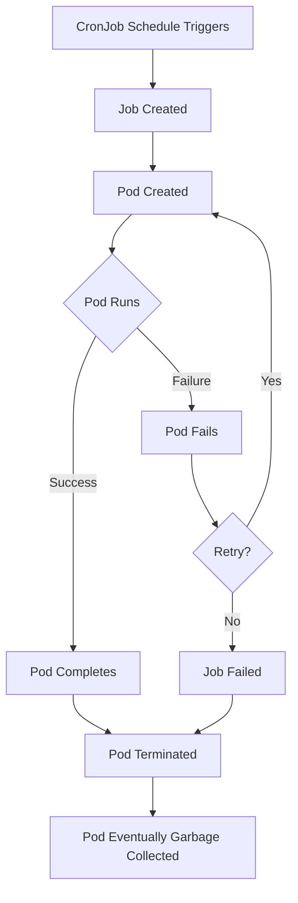
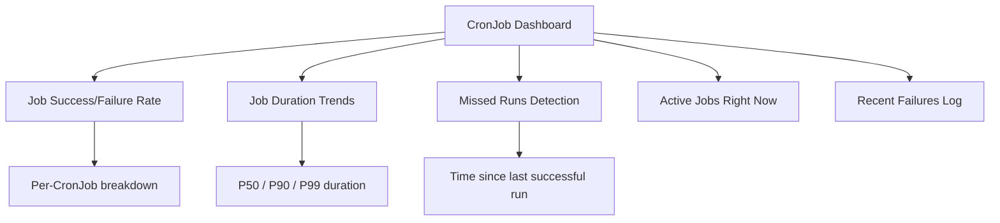

# How to Monitor Kubernetes CronJobs and Jobs with OpenTelemetry

Author: [nawazdhandala](https://www.github.com/nawazdhandala)

Tags: OpenTelemetry, Kubernetes, CronJobs, Jobs, Monitoring, Observability

Description: A practical guide to monitoring Kubernetes CronJobs and Jobs using OpenTelemetry for traces, metrics, and logs to catch failures before they become incidents.

---

Kubernetes CronJobs and Jobs are the workhorses of batch processing. They run database migrations, generate reports, clean up stale data, process queues, and handle countless other periodic tasks. But they are notoriously hard to monitor. A Job runs, completes (or fails), and the pod disappears. If you were not watching at that exact moment, you might not know something went wrong until the downstream effects show up.

OpenTelemetry gives you the tools to capture what happens during every Job execution: how long it took, whether it succeeded, what errors occurred, and how it connects to other services. This guide shows you how to set all of that up.

## The Monitoring Challenge

Regular long-running services are relatively easy to monitor. They expose metrics endpoints, generate continuous logs, and have persistent health checks. Jobs are different in several ways:

- They are ephemeral. The pod is created, runs, and terminates.
- They often run at odd hours (3 AM backups, overnight batch processing).
- Failures may be silent. A CronJob that fails to run does not generate any output at all.
- Retry behavior can mask underlying issues. A Job might succeed on the third attempt, but you want to know about the first two failures.



By the time you notice something is wrong, the evidence might already be gone.

## Approach 1: Instrument the Job Code Directly

The most thorough approach is to add OpenTelemetry instrumentation to the code running inside your Job. This gives you traces that capture the actual business logic.

Here is a Python example for a data cleanup Job that traces its key operations.

```python
# cleanup_job.py
# A Kubernetes Job that cleans up expired records, instrumented with OpenTelemetry

from opentelemetry import trace
from opentelemetry.sdk.trace import TracerProvider
from opentelemetry.sdk.trace.export import BatchSpanProcessor
from opentelemetry.exporter.otlp.proto.grpc.trace_exporter import OTLPSpanExporter
from opentelemetry.sdk.resources import Resource
import sys
import time

# Configure OpenTelemetry with job-specific resource attributes
resource = Resource.create({
    "service.name": "data-cleanup-job",
    "service.namespace": "batch-processing",
    "k8s.cronjob.name": "data-cleanup",
    # These will be set by the Kubernetes downward API
    "k8s.job.name": sys.argv[1] if len(sys.argv) > 1 else "unknown",
    "k8s.pod.name": sys.argv[2] if len(sys.argv) > 2 else "unknown",
})

# Set up the trace provider with OTLP export
provider = TracerProvider(resource=resource)
exporter = OTLPSpanExporter(endpoint="http://otel-collector.monitoring:4317", insecure=True)
provider.add_span_processor(BatchSpanProcessor(exporter))
trace.set_tracer_provider(provider)

tracer = trace.get_tracer("data-cleanup-job")

def cleanup_expired_records(db_connection):
    """Delete records that have passed their expiration date."""
    with tracer.start_as_current_span("cleanup_expired_records") as span:
        # Count records before deletion
        count = db_connection.execute("SELECT COUNT(*) FROM records WHERE expired_at < NOW()").fetchone()[0]
        span.set_attribute("records.expired_count", count)

        if count == 0:
            span.set_attribute("cleanup.action", "skipped")
            return 0

        # Perform the deletion in batches to avoid long transactions
        deleted_total = 0
        batch_size = 1000

        while deleted_total < count:
            with tracer.start_as_current_span("delete_batch") as batch_span:
                result = db_connection.execute(
                    "DELETE FROM records WHERE expired_at < NOW() LIMIT %s", (batch_size,)
                )
                deleted = result.rowcount
                deleted_total += deleted
                batch_span.set_attribute("batch.deleted_count", deleted)
                batch_span.set_attribute("batch.running_total", deleted_total)

        span.set_attribute("records.deleted_total", deleted_total)
        return deleted_total

def main():
    """Main entry point for the cleanup job."""
    with tracer.start_as_current_span("data-cleanup-job") as root_span:
        try:
            # Your database connection setup here
            db = get_database_connection()

            start_time = time.time()
            deleted = cleanup_expired_records(db)
            duration = time.time() - start_time

            root_span.set_attribute("job.duration_seconds", duration)
            root_span.set_attribute("job.records_deleted", deleted)
            root_span.set_attribute("job.status", "success")

            print(f"Cleanup complete: {deleted} records deleted in {duration:.2f}s")

        except Exception as e:
            root_span.set_attribute("job.status", "failed")
            root_span.set_attribute("job.error", str(e))
            root_span.record_exception(e)
            root_span.set_status(trace.StatusCode.ERROR, str(e))
            print(f"Cleanup failed: {e}")
            sys.exit(1)
        finally:
            # Flush all pending spans before the pod terminates
            provider.force_flush()
            provider.shutdown()

if __name__ == "__main__":
    main()
```

The critical part is the `provider.force_flush()` call at the end. Jobs terminate immediately after completion, and the BatchSpanProcessor buffers spans before exporting. Without a flush, the process might exit before the spans are sent. This is the single most common reason people lose telemetry from Jobs.

## Approach 2: Monitor Jobs with the Kubernetes Receiver

Even if you cannot modify the Job code, you can monitor Jobs from the outside using the OpenTelemetry Collector's `k8s_cluster` receiver. This receiver watches the Kubernetes API and generates metrics about cluster resources, including Jobs and CronJobs.

```yaml
# otel-collector-k8s.yaml
# Collector configuration that monitors Kubernetes Jobs and CronJobs
apiVersion: opentelemetry.io/v1beta1
kind: OpenTelemetryCollector
metadata:
  name: k8s-monitor
  namespace: monitoring
spec:
  mode: deployment
  replicas: 1
  config:
    receivers:
      k8s_cluster:
        # How often to poll the Kubernetes API
        collection_interval: 30s
        node_conditions_to_report:
          - Ready
          - MemoryPressure
        allocatable_types_to_report:
          - cpu
          - memory
        # Enable metrics for Jobs and CronJobs
        resource_attributes:
          k8s.cronjob.name:
            enabled: true
          k8s.job.name:
            enabled: true
      k8s_events:
        # Capture Kubernetes events as logs
        namespaces: []
        auth_type: serviceAccount
    processors:
      batch:
        send_batch_size: 512
        timeout: 10s
      filter/jobs:
        # Filter events to only include Job-related ones
        logs:
          include:
            match_type: regexp
            record_attributes:
              - key: k8s.event.reason
                value: "^(Created|Started|Completed|Failed|BackOff|SuccessfulCreate|DeadlineExceeded)$"
    exporters:
      otlp:
        endpoint: "https://your-backend.example.com:4317"
    service:
      pipelines:
        metrics:
          receivers: [k8s_cluster]
          processors: [batch]
          exporters: [otlp]
        logs:
          receivers: [k8s_events]
          processors: [filter/jobs, batch]
          exporters: [otlp]
```

The `k8s_cluster` receiver generates metrics like:

- `k8s.job.active_pods` - Number of currently running pods for a Job
- `k8s.job.desired_successful_pods` - The completions target
- `k8s.job.successful_pods` - How many pods completed successfully
- `k8s.job.failed_pods` - How many pods failed
- `k8s.cronjob.active_jobs` - Number of currently running Jobs for a CronJob

You need RBAC permissions for the collector to access the Kubernetes API.

```yaml
# k8s-monitor-rbac.yaml
# Grants the collector permission to watch Jobs, CronJobs, and events
apiVersion: rbac.authorization.k8s.io/v1
kind: ClusterRole
metadata:
  name: otel-k8s-monitor
rules:
  - apiGroups: [""]
    resources: ["events", "pods", "nodes", "namespaces"]
    verbs: ["get", "list", "watch"]
  - apiGroups: ["batch"]
    resources: ["jobs", "cronjobs"]
    verbs: ["get", "list", "watch"]
  - apiGroups: ["events.k8s.io"]
    resources: ["events"]
    verbs: ["get", "list", "watch"]
---
apiVersion: rbac.authorization.k8s.io/v1
kind: ClusterRoleBinding
metadata:
  name: otel-k8s-monitor
roleRef:
  apiGroup: rbac.authorization.k8s.io
  kind: ClusterRole
  name: otel-k8s-monitor
subjects:
  - kind: ServiceAccount
    name: k8s-monitor-collector
    namespace: monitoring
```

## Approach 3: Push Metrics from the Job Itself

For Jobs where you want custom metrics but do not want full tracing, you can push metrics to the collector using the OTLP protocol. This is lighter-weight than full instrumentation.

Here is a shell-based approach that works for any Job, regardless of language. It uses `curl` to send a simple metric to the collector's OTLP HTTP endpoint.

```bash
#!/bin/bash
# job-wrapper.sh
# Wraps a Job command and reports success/failure metrics via OTLP

COLLECTOR_ENDPOINT="http://otel-collector.monitoring:4318/v1/metrics"
JOB_NAME="${JOB_NAME:-unknown}"
START_TIME=$(date +%s)

# Run the actual job command
"$@"
EXIT_CODE=$?

END_TIME=$(date +%s)
DURATION=$((END_TIME - START_TIME))

# Determine success or failure
if [ $EXIT_CODE -eq 0 ]; then
  STATUS="success"
else
  STATUS="failure"
fi

# Send metrics to the collector via OTLP HTTP
# This JSON payload contains a counter for job completions and a gauge for duration
curl -s -X POST "$COLLECTOR_ENDPOINT" \
  -H "Content-Type: application/json" \
  -d "{
    \"resourceMetrics\": [{
      \"resource\": {
        \"attributes\": [
          {\"key\": \"service.name\", \"value\": {\"stringValue\": \"k8s-jobs\"}},
          {\"key\": \"k8s.job.name\", \"value\": {\"stringValue\": \"$JOB_NAME\"}}
        ]
      },
      \"scopeMetrics\": [{
        \"scope\": {\"name\": \"job-wrapper\"},
        \"metrics\": [{
          \"name\": \"job.completion\",
          \"sum\": {
            \"dataPoints\": [{
              \"asInt\": \"1\",
              \"startTimeUnixNano\": \"${START_TIME}000000000\",
              \"timeUnixNano\": \"${END_TIME}000000000\",
              \"attributes\": [
                {\"key\": \"job.status\", \"value\": {\"stringValue\": \"$STATUS\"}},
                {\"key\": \"job.exit_code\", \"value\": {\"intValue\": \"$EXIT_CODE\"}}
              ]
            }],
            \"aggregationTemporality\": 2,
            \"isMonotonic\": true
          }
        }]
      }]
    }]
  }"

exit $EXIT_CODE
```

Use this wrapper in your CronJob definition.

```yaml
# cronjob-with-metrics.yaml
# CronJob that wraps the actual command with metric reporting
apiVersion: batch/v1
kind: CronJob
metadata:
  name: data-cleanup
  namespace: default
spec:
  schedule: "0 3 * * *"
  concurrencyPolicy: Forbid
  successfulJobsHistoryLimit: 3
  failedJobsHistoryLimit: 3
  jobTemplate:
    spec:
      backoffLimit: 2
      activeDeadlineSeconds: 3600
      template:
        spec:
          restartPolicy: Never
          containers:
            - name: cleanup
              image: my-cleanup-job:latest
              env:
                - name: JOB_NAME
                  valueFrom:
                    fieldRef:
                      # Use the downward API to get the Job name
                      fieldPath: metadata.labels['job-name']
              command: ["/bin/bash", "/scripts/job-wrapper.sh", "python", "/app/cleanup.py"]
```

## Detecting Missed CronJob Runs

One tricky failure mode is a CronJob that simply does not fire. Maybe the scheduler was overloaded, or the `concurrencyPolicy` blocked it. The `k8s_cluster` receiver helps here by tracking `k8s.cronjob.active_jobs`, but you can also set up an alert based on the absence of the `job.completion` metric.

If `job.completion` for a CronJob has not been recorded in a window longer than twice the schedule interval, something is probably wrong. For a daily CronJob, alert if no completion has been recorded in 48 hours.

## Building a CronJob Health Dashboard

With all three approaches combined, you have rich data to build a comprehensive dashboard. Here are the key panels.



Key metrics to display:

- **Success rate** per CronJob over the last 24 hours
- **Duration trend** for each CronJob (is it getting slower?)
- **Failed pod count** broken down by failure reason
- **Time since last successful run** for each CronJob (catches missed schedules)
- **Retry rate** - how often Jobs need more than one attempt

## Alerting Rules

Set up alerts for these conditions:

- A CronJob has not completed successfully in 2x its schedule interval
- A Job's duration exceeds 3x its historical P90
- A Job has exhausted its `backoffLimit` and failed permanently
- A Job has been active for longer than its `activeDeadlineSeconds`

These alerts catch problems early, before a missed backup or a stuck migration causes real damage.

## Tips for Production

A few practical things I have learned from running this in production:

**Always call force_flush() before exiting.** I cannot stress this enough. The number one issue with Job telemetry is data that never makes it out of the pod.

**Set activeDeadlineSeconds on every Job.** Without it, a hung Job runs forever, consuming resources silently.

**Use the Kubernetes downward API** to inject the Job name and pod name as environment variables. This makes your telemetry much easier to correlate.

**Keep successfulJobsHistoryLimit low** (2-3) but keep the telemetry data longer in your backend. You do not need the pods to stick around when you have proper observability.

**Test Job failures deliberately.** Run a Job that exits with an error and verify that the failure shows up in your traces, metrics, and alerts. It is better to discover monitoring gaps during testing than during an actual incident at 3 AM.

Monitoring Jobs and CronJobs is one of those things that teams put off because the Jobs "mostly work." But when a critical nightly batch fails silently, you realize that "mostly works" is not good enough. With the approaches in this guide, you will know about Job failures within minutes, not hours or days.
