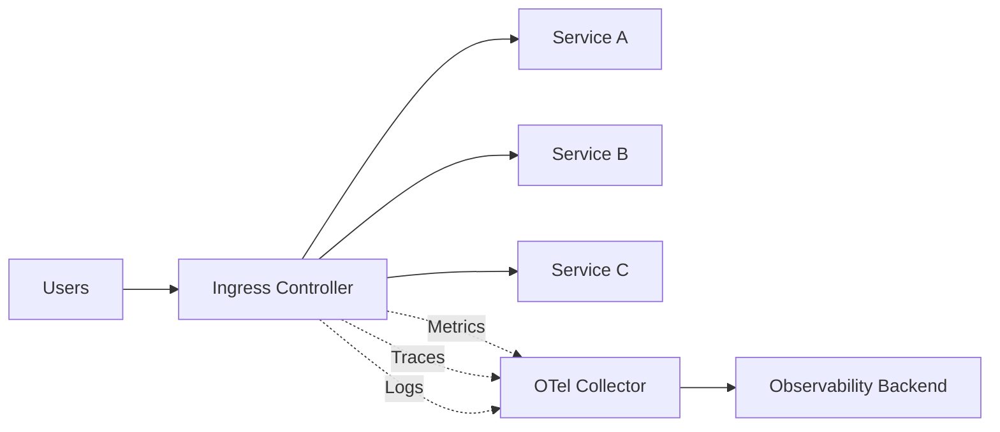

# How to Monitor Kubernetes Ingress Controller Performance with OpenTelemetry

Author: [nawazdhandala](https://www.github.com/nawazdhandala)

Tags: OpenTelemetry, Kubernetes, Ingress, NGINX, Monitoring, Metrics, Tracing

Description: Learn how to monitor Kubernetes Ingress controller performance using OpenTelemetry for metrics collection, distributed tracing, and log analysis.

---

Your Ingress controller is the front door to your Kubernetes cluster. Every external request passes through it. When it misbehaves, your users feel it immediately. Slow response times, 502 errors, connection timeouts - these all trace back to Ingress controller problems more often than you would expect.

Monitoring the Ingress controller with OpenTelemetry gives you metrics, traces, and logs in a single, correlated pipeline. This guide covers how to set that up for NGINX Ingress Controller, the most commonly deployed option, and includes patterns that apply to other controllers like Traefik and HAProxy as well.

## What to Monitor

Before diving into configuration, let us define what matters for Ingress controller performance:

- **Request rate**: Requests per second, broken down by status code and upstream service.
- **Latency**: Request duration percentiles (p50, p95, p99) and upstream response time.
- **Error rate**: 4xx and 5xx responses as a percentage of total traffic.
- **Connection metrics**: Active connections, waiting connections, connection errors.
- **Resource usage**: CPU, memory, and file descriptor consumption of the controller pods.
- **Configuration reload status**: Whether reloads succeed and how long they take.



## Collecting Metrics from NGINX Ingress Controller

The NGINX Ingress Controller exposes Prometheus metrics by default on port 10254 at the `/metrics` endpoint. The OpenTelemetry Collector can scrape these using the Prometheus receiver.

This collector configuration scrapes the NGINX Ingress Controller's Prometheus metrics endpoint using Kubernetes service discovery to find the controller pods automatically.

```yaml
# otel-collector-config.yaml
receivers:
  # Scrape Prometheus metrics from the NGINX Ingress Controller
  prometheus:
    config:
      scrape_configs:
        - job_name: 'nginx-ingress'
          scrape_interval: 15s
          kubernetes_sd_configs:
            - role: pod
              namespaces:
                names:
                  - ingress-nginx
          relabel_configs:
            # Only scrape pods with the ingress-nginx label
            - source_labels: [__meta_kubernetes_pod_label_app_kubernetes_io_name]
              action: keep
              regex: ingress-nginx
            # Use the metrics port
            - source_labels: [__meta_kubernetes_pod_annotation_prometheus_io_port]
              action: replace
              target_label: __address__
              regex: (.+)
              replacement: ${1}:10254

processors:
  batch:
    send_batch_size: 1024
    timeout: 5s

  # Add Kubernetes context to metrics
  k8sattributes:
    auth_type: serviceAccount
    extract:
      metadata:
        - k8s.pod.name
        - k8s.namespace.name
        - k8s.node.name

exporters:
  otlp:
    endpoint: your-backend.example.com:4317

service:
  pipelines:
    metrics:
      receivers: [prometheus]
      processors: [k8sattributes, batch]
      exporters: [otlp]
```

The key metrics you will get from this scrape include:

- `nginx_ingress_controller_requests` - Total request count with status, method, and ingress labels.
- `nginx_ingress_controller_request_duration_seconds` - Histogram of request latencies.
- `nginx_ingress_controller_upstream_latency_seconds` - How long upstream services take to respond.
- `nginx_ingress_controller_nginx_process_connections` - Active, reading, writing, and waiting connections.

## Enabling OpenTelemetry Tracing in NGINX Ingress

The NGINX Ingress Controller has native OpenTelemetry support built in since version 1.9.0. You enable it through a ConfigMap. This is much better than the older Jaeger or Zipkin integration because it speaks OTLP natively.

This ConfigMap configuration enables the NGINX Ingress Controller's built-in OpenTelemetry instrumentation to export traces via OTLP.

```yaml
# ingress-nginx-configmap.yaml
apiVersion: v1
kind: ConfigMap
metadata:
  name: ingress-nginx-controller
  namespace: ingress-nginx
data:
  # Enable the OpenTelemetry module
  enable-opentelemetry: "true"

  # Collector endpoint receiving traces
  opentelemetry-config: "/etc/nginx/opentelemetry.toml"
  opentelemetry-operation-name: "HTTP $request_method $service_name $uri"

  # Trust incoming trace context headers
  opentelemetry-trust-incoming-span: "true"

  # Set the OTLP endpoint for the collector
  otlp-collector-host: "otel-collector.observability.svc.cluster.local"
  otlp-collector-port: "4317"

  # Sample ratio (1.0 = sample everything)
  otel-sampler-ratio: "0.1"
  otel-sampler: "AlwaysOn"

  # Service name for the traces
  otel-service-name: "nginx-ingress"
```

After applying this ConfigMap, the Ingress controller creates a span for every request it proxies. The span includes the upstream service name, the request URI, response status, and timing data. Because it propagates W3C trace context headers, these spans connect seamlessly with your backend service traces.

## Collecting Ingress Controller Logs

NGINX Ingress Controller logs contain rich information about every request, including fields that are not available in metrics. The access log includes client IP, request path, upstream response time, and the actual bytes transferred.

Configure the collector to tail the controller's stdout logs using the filelog receiver. In Kubernetes, container logs are available at a well-known path on each node.

This configuration collects NGINX access logs, parses them into structured fields, and ships them as OpenTelemetry logs.

```yaml
receivers:
  # Collect NGINX Ingress Controller logs from container stdout
  filelog:
    include:
      - /var/log/containers/ingress-nginx-controller-*.log
    operators:
      # Parse the Kubernetes container log wrapper
      - type: regex_parser
        regex: '(?P<time>\d{4}-\d{2}-\d{2}T\d{2}:\d{2}:\d{2}\.\d+Z)\s(?P<stream>stdout|stderr)\s(?P<logtag>\S+)\s(?P<log>.*)'
        timestamp:
          parse_from: attributes.time
          layout: '%Y-%m-%dT%H:%M:%S.%LZ'

      # Parse the NGINX access log format
      - type: regex_parser
        parse_from: attributes.log
        regex: '(?P<remote_addr>\S+)\s-\s(?P<remote_user>\S+)\s\[(?P<time_local>[^\]]+)\]\s"(?P<request_method>\S+)\s(?P<request_uri>\S+)\s(?P<http_version>[^"]+)"\s(?P<status>\d+)\s(?P<body_bytes_sent>\d+)\s"(?P<http_referer>[^"]*)"\s"(?P<http_user_agent>[^"]*)"\s(?P<request_length>\d+)\s(?P<request_time>[\d.]+)\s\[(?P<proxy_upstream_name>[^\]]*)\]'

      # Convert numeric fields from strings
      - type: severity_parser
        parse_from: attributes.status
        mapping:
          info: ['200', '201', '204', '301', '302', '304']
          warn: ['400', '401', '403', '404', '405']
          error: ['500', '502', '503', '504']

processors:
  batch:
    send_batch_size: 512
    timeout: 5s

exporters:
  otlp:
    endpoint: your-backend.example.com:4317

service:
  pipelines:
    logs:
      receivers: [filelog]
      processors: [batch]
      exporters: [otlp]
```

## Correlating Traces with Metrics and Logs

The real power of OpenTelemetry shows up when you correlate signals. A spike in 502 error metrics should lead you to the specific traces that failed, which link to the log entries showing why the upstream was unreachable.

To enable this correlation, ensure trace IDs appear in your NGINX access logs. Add a custom log format to the ConfigMap.

This custom log format includes the trace ID and span ID, making it possible to correlate log entries with specific traces.

```yaml
# Add to the ingress-nginx-controller ConfigMap
data:
  # Custom log format that includes OpenTelemetry trace context
  log-format-upstream: >-
    $remote_addr - $remote_user [$time_local]
    "$request" $status $body_bytes_sent
    "$http_referer" "$http_user_agent"
    $request_length $request_time
    [$proxy_upstream_name] [$proxy_alternative_upstream_name]
    $upstream_addr $upstream_response_length
    $upstream_response_time $upstream_status
    $req_id trace_id=$opentelemetry_trace_id span_id=$opentelemetry_span_id
```

With trace IDs in the logs, your observability backend can link a log entry directly to the trace that generated it. This is invaluable for debugging intermittent 5xx errors.

## Building a Performance Dashboard

With metrics flowing, you can build dashboards that give you a complete picture of Ingress controller health. Here are the queries and panels that matter most.

**Request rate by status code** tracks overall traffic patterns and error ratios:

```promql
# Request rate per second, grouped by HTTP status class
sum(rate(nginx_ingress_controller_requests[5m])) by (status)
```

**P95 latency by upstream service** identifies which backend services are slow:

```promql
# 95th percentile request duration per ingress
histogram_quantile(0.95,
  sum(rate(nginx_ingress_controller_request_duration_seconds_bucket[5m]))
  by (le, ingress)
)
```

**Connection saturation** shows when you are approaching connection limits:

```promql
# Ratio of active connections to max allowed
nginx_ingress_controller_nginx_process_connections{state="active"}
  /
nginx_ingress_controller_nginx_process_connections_total
```

## Alerting on Ingress Issues

Set up alerts for conditions that impact users. Here are the critical ones.

This PrometheusRule defines alerts for high error rates, elevated latency, and configuration reload failures.

```yaml
# ingress-alerts.yaml
apiVersion: monitoring.coreos.com/v1
kind: PrometheusRule
metadata:
  name: ingress-nginx-alerts
  namespace: observability
spec:
  groups:
    - name: ingress-nginx
      rules:
        # Alert when error rate exceeds 5%
        - alert: IngressHighErrorRate
          expr: |
            sum(rate(nginx_ingress_controller_requests{status=~"5.."}[5m]))
            /
            sum(rate(nginx_ingress_controller_requests[5m]))
            > 0.05
          for: 5m
          labels:
            severity: critical
          annotations:
            summary: "Ingress controller 5xx error rate above 5%"

        # Alert when p99 latency exceeds 5 seconds
        - alert: IngressHighLatency
          expr: |
            histogram_quantile(0.99,
              sum(rate(nginx_ingress_controller_request_duration_seconds_bucket[5m]))
              by (le)
            ) > 5
          for: 5m
          labels:
            severity: warning
          annotations:
            summary: "Ingress controller p99 latency above 5 seconds"

        # Alert on config reload failures
        - alert: IngressReloadFailed
          expr: nginx_ingress_controller_config_last_reload_successful == 0
          for: 1m
          labels:
            severity: critical
          annotations:
            summary: "NGINX Ingress config reload failed"
```

## Monitoring Other Ingress Controllers

If you use Traefik or HAProxy instead of NGINX, the same principles apply with different specifics.

**Traefik** has native OpenTelemetry support. Enable it in the Traefik static configuration:

```yaml
# Traefik OpenTelemetry configuration
tracing:
  otlp:
    grpc:
      endpoint: otel-collector.observability.svc:4317
      insecure: true

metrics:
  otlp:
    grpc:
      endpoint: otel-collector.observability.svc:4317
      insecure: true
```

**HAProxy Ingress** exposes Prometheus metrics that you can scrape the same way as NGINX. Tracing support varies by version but newer releases support OpenTelemetry natively.

## Conclusion

Monitoring your Ingress controller is not optional at production scale. It is the single point that sees all inbound traffic, making it the best place to detect problems early. OpenTelemetry gives you a unified approach: scrape Prometheus metrics for dashboards and alerts, enable native tracing to see request flow through the proxy, and collect structured logs for deep debugging.

Start with metrics since they give you the quickest value. Add tracing when you need to understand latency across the request path. Layer in log collection when you need to investigate specific requests. Together, these three signals give you complete visibility into your cluster's front door.
