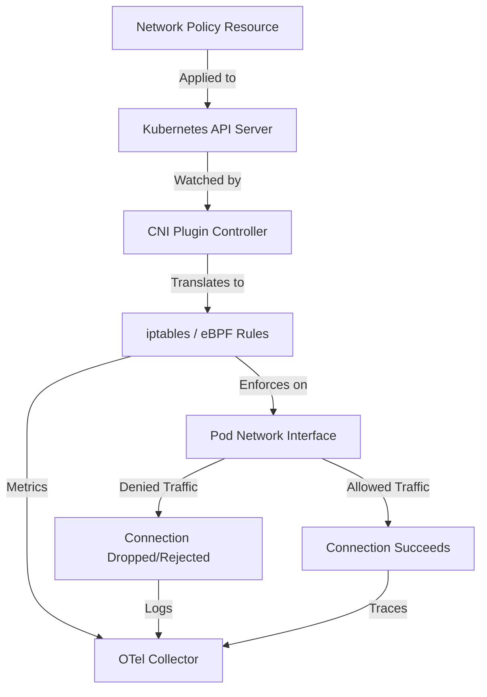
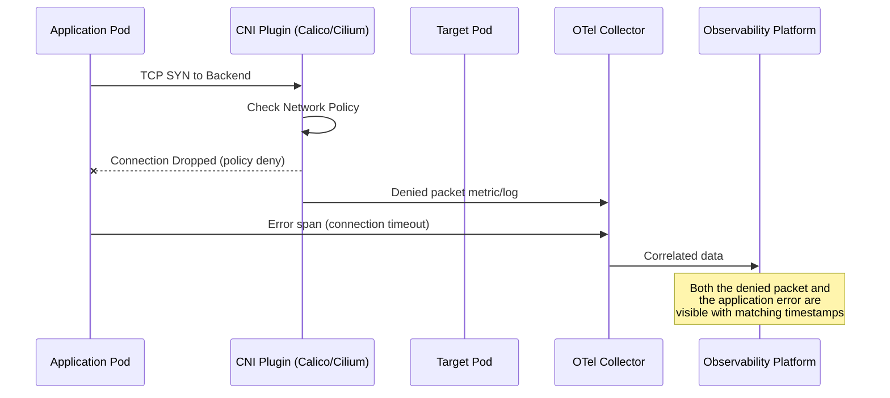

# How to Monitor Kubernetes Network Policies with OpenTelemetry

Author: [nawazdhandala](https://www.github.com/nawazdhandala)

Tags: OpenTelemetry, Kubernetes, Network Policies, Security, Monitoring, Observability

Description: Learn how to monitor and observe Kubernetes network policy enforcement, blocked traffic, and connectivity issues using OpenTelemetry.

---

Kubernetes network policies let you control which pods can talk to each other. They are the firewall rules of your cluster. But deploying a network policy and knowing it actually works are two different things. Without monitoring, you might have policies that silently block legitimate traffic or, worse, policies that do not enforce what you think they enforce.

OpenTelemetry can help you observe network policy behavior by collecting metrics from the CNI plugin, tracking blocked connections, and correlating network failures with application traces. This guide covers the full approach.

## How Kubernetes Network Policies Work

Before diving into monitoring, let's review how network policies actually function. A network policy is a Kubernetes resource that selects pods using labels and defines ingress and egress rules. The actual enforcement happens at the CNI plugin level, not in Kubernetes itself.

Different CNI plugins implement network policies differently:
- **Calico** uses iptables or eBPF to enforce rules
- **Cilium** uses eBPF programs attached to pod network interfaces
- **Weave Net** uses iptables chains

The monitoring approach varies based on which CNI plugin you use, because the metrics and logs come from the CNI, not from Kubernetes directly.



## Step 1: Collect CNI Plugin Metrics

Most CNI plugins expose Prometheus metrics that include network policy enforcement data. The OpenTelemetry Collector's Prometheus receiver can scrape these metrics.

Here is a collector configuration for scraping Calico's Felix component, which handles policy enforcement.

```yaml
# otel-collector-netpol.yaml
# Scrape network policy metrics from the CNI plugin
receivers:
  prometheus:
    config:
      scrape_configs:
        # Scrape Calico Felix metrics for policy enforcement data
        - job_name: "calico-felix"
          kubernetes_sd_configs:
            - role: pod
          relabel_configs:
            # Only scrape pods with the calico-node label
            - source_labels: [__meta_kubernetes_pod_label_k8s_app]
              regex: calico-node
              action: keep
            # Use the Felix metrics port
            - source_labels: [__meta_kubernetes_pod_ip]
              target_label: __address__
              replacement: "$1:9091"
          metric_relabel_configs:
            # Keep only network policy related metrics
            - source_labels: [__name__]
              regex: "felix_iptables.*|felix_policy.*|felix_denied_packets.*|felix_active_.*"
              action: keep

        # For Cilium CNI - scrape the agent metrics
        - job_name: "cilium-agent"
          kubernetes_sd_configs:
            - role: pod
          relabel_configs:
            - source_labels: [__meta_kubernetes_pod_label_k8s_app]
              regex: cilium
              action: keep
            - source_labels: [__meta_kubernetes_pod_ip]
              target_label: __address__
              replacement: "$1:9962"
          metric_relabel_configs:
            - source_labels: [__name__]
              regex: "cilium_policy.*|cilium_drop_count.*|cilium_forward_count.*"
              action: keep

processors:
  batch:
    timeout: 30s

  resource:
    attributes:
      - key: k8s.cluster.name
        value: "production"
        action: upsert

exporters:
  otlp:
    endpoint: "your-metrics-backend:4317"
    tls:
      insecure: false

service:
  pipelines:
    metrics:
      receivers: [prometheus]
      processors: [resource, batch]
      exporters: [otlp]
```

## Step 2: Monitor Denied Connections

When a network policy blocks traffic, the CNI plugin usually logs the event or increments a counter. Capturing these denial events is the most valuable part of network policy monitoring.

For Calico, denied packets are tracked per-rule. For Cilium, you can enable policy audit mode to log every policy decision. Here is how to collect Cilium's policy verdict logs using the filelog receiver.

```yaml
# Collect Cilium policy verdict logs
receivers:
  filelog:
    include:
      # Cilium agent logs contain policy verdicts
      - /var/run/cilium/hubble/events.log
    operators:
      # Parse the JSON log entries
      - type: json_parser
        id: cilium_log
      # Filter for policy verdict events
      - type: filter
        expr: 'attributes.Type != "PolicyVerdict"'
      # Extract relevant fields
      - type: move
        from: attributes.verdict
        to: attributes.network.policy.verdict
      - type: move
        from: attributes.source.identity
        to: attributes.network.source.identity
      - type: move
        from: attributes.destination.identity
        to: attributes.network.destination.identity
      # Set severity based on verdict
      - type: severity_parser
        parse_from: attributes.network.policy.verdict
        mapping:
          info: "FORWARDED"
          warn: "DROPPED"
          error: "ERROR"
```

If you are using Cilium with Hubble enabled, you get much richer visibility. Hubble provides a dedicated gRPC API for flow observation. Here is an alternative approach using a custom receiver that connects to Hubble.

```yaml
# Alternative: Use Hubble for Cilium flow visibility
# This requires deploying hubble-relay in your cluster
receivers:
  # Scrape Hubble metrics which include policy verdicts
  prometheus:
    config:
      scrape_configs:
        - job_name: "hubble"
          static_configs:
            - targets: ["hubble-metrics.kube-system:9965"]
          metric_relabel_configs:
            # Focus on policy-related drop metrics
            - source_labels: [__name__]
              regex: "hubble_drop_total|hubble_flows_processed_total|hubble_policy_.*"
              action: keep
```

## Step 3: Track Network Policy Coverage

It is important to know which namespaces and pods are actually covered by network policies. A pod without any network policy selecting it has unrestricted network access - this might be intentional or it might be an oversight.

You can use the Kubernetes API to periodically check policy coverage. Here is a script that generates custom metrics about policy coverage, which you can expose to the collector.

```python
# netpol-coverage-exporter.py
# Generates metrics about network policy coverage in the cluster
# Run as a sidecar or standalone deployment

from kubernetes import client, config
from prometheus_client import Gauge, start_http_server
import time

# Metrics that track policy coverage
pods_with_policy = Gauge(
    'netpol_pods_covered_total',
    'Number of pods covered by at least one network policy',
    ['namespace']
)
pods_without_policy = Gauge(
    'netpol_pods_uncovered_total',
    'Number of pods not covered by any network policy',
    ['namespace']
)
policy_count = Gauge(
    'netpol_policy_count',
    'Number of network policies in namespace',
    ['namespace']
)

def check_coverage():
    """Check which pods are covered by network policies."""
    config.load_incluster_config()
    v1 = client.CoreV1Api()
    net_v1 = client.NetworkingV1Api()

    # Get all namespaces
    namespaces = v1.list_namespace().items

    for ns in namespaces:
        ns_name = ns.metadata.name

        # Get all network policies in this namespace
        policies = net_v1.list_namespaced_network_policy(ns_name).items
        policy_count.labels(namespace=ns_name).set(len(policies))

        # Get all pods in this namespace
        pods = v1.list_namespaced_pod(ns_name).items

        covered = 0
        uncovered = 0

        for pod in pods:
            pod_labels = pod.metadata.labels or {}
            is_covered = False

            # Check if any policy selects this pod
            for pol in policies:
                selector = pol.spec.pod_selector.match_labels or {}
                # Simple label matching (does not handle matchExpressions)
                if all(pod_labels.get(k) == v for k, v in selector.items()):
                    is_covered = True
                    break

            if is_covered:
                covered += 1
            else:
                uncovered += 1

        pods_with_policy.labels(namespace=ns_name).set(covered)
        pods_without_policy.labels(namespace=ns_name).set(uncovered)

# Start Prometheus metrics server on port 8080
start_http_server(8080)

# Check coverage every 60 seconds
while True:
    check_coverage()
    time.sleep(60)
```

Add a scrape target in the collector to pick up these coverage metrics.

```yaml
# Add to the prometheus receiver scrape configs
- job_name: "netpol-coverage"
  kubernetes_sd_configs:
    - role: pod
  relabel_configs:
    # Scrape the coverage exporter pod
    - source_labels: [__meta_kubernetes_pod_label_app]
      regex: netpol-coverage-exporter
      action: keep
    - source_labels: [__meta_kubernetes_pod_ip]
      target_label: __address__
      replacement: "$1:8080"
```

## Step 4: Correlate Network Denials with Application Errors

When a network policy blocks a connection, the calling application sees a connection timeout or reset. Without correlation, the application team sees "connection refused" errors and the network team has no idea it is related to a policy.

By collecting both application traces and network policy metrics in the same observability platform, you can correlate them. The key is to have matching resource attributes.



When debugging a connectivity issue, you can now search for denied packets on the network side that match the timestamp and source/destination pods from the application error. This dramatically reduces mean time to resolution.

## Step 5: Set Up Alerts

With metrics flowing, set up alerts that catch network policy issues early.

```yaml
# Network policy alerting rules
groups:
  - name: network-policy-monitoring
    rules:
      # Alert when denied packets spike, possibly indicating a misconfigured policy
      - alert: NetworkPolicyDenialSpike
        expr: |
          rate(felix_denied_packets_total[5m]) > 100
          or rate(hubble_drop_total{reason="POLICY_DENIED"}[5m]) > 100
        for: 5m
        labels:
          severity: warning
        annotations:
          summary: "High rate of network policy denials"
          description: "More than 100 packets/sec are being denied. Check for misconfigured policies."

      # Alert when a namespace has no network policies (potential security gap)
      - alert: NamespaceMissingNetworkPolicy
        expr: |
          netpol_policy_count == 0
          and netpol_pods_uncovered_total > 0
        for: 1h
        labels:
          severity: info
        annotations:
          summary: "Namespace {{ $labels.namespace }} has no network policies"
          description: "Pods in this namespace have unrestricted network access."

      # Alert when new pods are deployed without policy coverage
      - alert: UncoveredPodsIncreasing
        expr: |
          delta(netpol_pods_uncovered_total[30m]) > 5
        for: 15m
        labels:
          severity: warning
        annotations:
          summary: "Uncovered pods increasing in {{ $labels.namespace }}"
          description: "New pods are being deployed without network policy coverage."
```

## Testing Network Policies with Observability

One of the most practical uses of this monitoring setup is validating network policy changes before enforcing them. Both Calico and Cilium support audit/log mode where policies log what they would deny without actually blocking traffic.

The workflow looks like this:

1. Deploy the network policy in audit mode
2. Monitor the denial logs through the collector
3. Review which connections would be blocked
4. Fix any legitimate traffic that would be denied
5. Switch the policy to enforce mode
6. Continue monitoring for unexpected denials

This approach turns network policy deployment from a high-risk change into a data-driven process.

## Wrapping Up

Monitoring Kubernetes network policies with OpenTelemetry bridges the gap between defining policies and knowing they work correctly. By collecting CNI plugin metrics, tracking denied connections, measuring policy coverage, and correlating network events with application errors, you get full visibility into your cluster's network security posture. The most impactful thing you can do is set up denied-packet alerting. When a network policy blocks something it should not, you want to know immediately rather than waiting for an application team to file a ticket about mysterious connection timeouts. Start with the CNI metrics, add the coverage exporter, and build from there.
