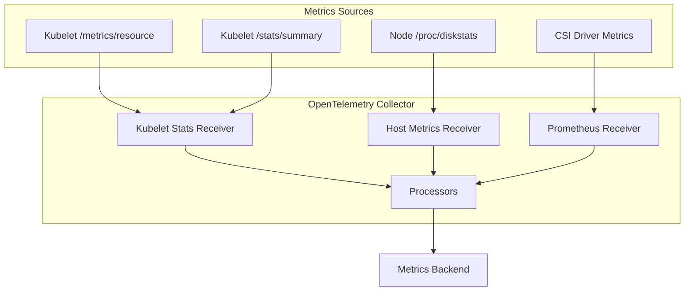
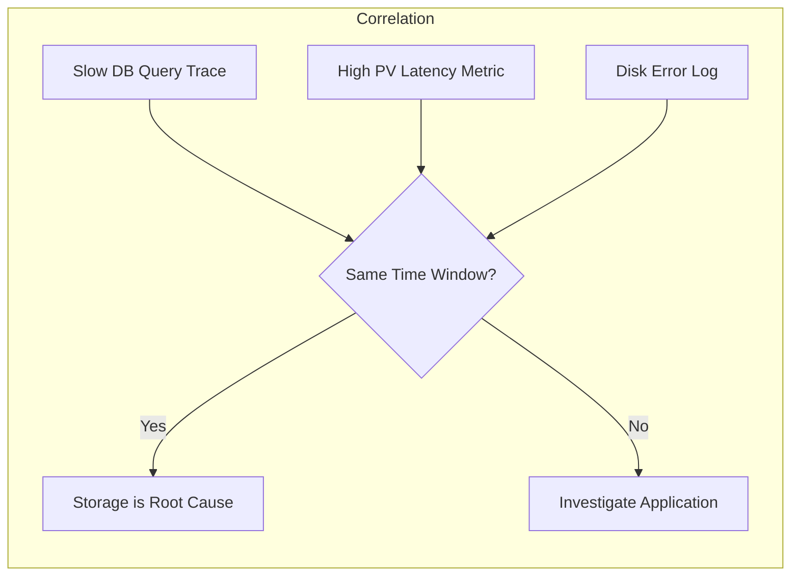

# How to Monitor Kubernetes PersistentVolume Performance with OpenTelemetry

Author: [nawazdhandala](https://www.github.com/nawazdhandala)

Tags: OpenTelemetry, Kubernetes, PersistentVolume, Storage, Monitoring, Metrics

Description: How to monitor Kubernetes PersistentVolume performance metrics like IOPS, throughput, and latency using the OpenTelemetry Collector.

---

Storage performance can make or break your Kubernetes workloads. A database pod that runs fine for months can suddenly grind to a halt because the underlying PersistentVolume hit its IOPS limit or the disk is nearly full. These problems are notoriously hard to debug if you are not monitoring storage metrics proactively.

OpenTelemetry provides a way to collect PersistentVolume performance data from multiple sources and funnel it into your observability platform. This guide covers how to set up monitoring for PV capacity, IOPS, throughput, and latency using the OpenTelemetry Collector.

## Understanding PersistentVolume Metrics

Kubernetes itself exposes limited storage metrics. The kubelet provides volume stats for mounted PVCs through the `/metrics` and `/stats/summary` endpoints. These include capacity, available space, and inode counts. For deeper metrics like IOPS and latency, you need to pull from the node level or the storage provider.



## Step 1: Collect Kubelet Volume Metrics

The kubelet stats receiver in the OpenTelemetry Collector pulls volume statistics directly from the kubelet. It gives you PVC capacity, used space, available space, and inode metrics.

This configuration sets up the kubelet stats receiver to collect volume metrics from the local kubelet. The receiver authenticates using the service account token.

```yaml
# otel-collector-pv-config.yaml
# Collect PersistentVolume metrics from kubelet stats
receivers:
  kubeletstats:
    # Connect to the local kubelet
    collection_interval: 30s
    auth_type: "serviceAccount"
    endpoint: "https://${env:NODE_IP}:10250"
    insecure_skip_verify: true
    # Collect volume-specific metrics
    metric_groups:
      - volume
    # Extra metadata for PVC identification
    extra_metadata_labels:
      - container.id
      - k8s.volume.type
    k8s_api_config:
      auth_type: serviceAccount

processors:
  batch:
    timeout: 30s
    send_batch_size: 512

  # Add cluster identification
  resource:
    attributes:
      - key: k8s.cluster.name
        value: "production"
        action: upsert

exporters:
  otlp:
    endpoint: "your-metrics-backend:4317"
    tls:
      insecure: false

service:
  pipelines:
    metrics:
      receivers: [kubeletstats]
      processors: [resource, batch]
      exporters: [otlp]
```

The kubelet stats receiver produces these key metrics:

- `k8s.volume.capacity` - Total capacity of the volume in bytes
- `k8s.volume.available` - Available space in bytes
- `k8s.volume.inodes` - Total inodes
- `k8s.volume.inodes.free` - Available inodes
- `k8s.volume.inodes.used` - Used inodes

## Step 2: Collect Disk-Level Performance Metrics

The kubelet does not expose IOPS or latency. For those, you need the host metrics receiver, which reads from `/proc/diskstats` on the node. This gives you read/write operations, bytes transferred, and I/O time.

This configuration adds the host metrics receiver alongside the kubelet stats receiver to get both volume-level and disk-level metrics.

```yaml
# Extended receiver configuration for disk I/O metrics
receivers:
  kubeletstats:
    collection_interval: 30s
    auth_type: "serviceAccount"
    endpoint: "https://${env:NODE_IP}:10250"
    insecure_skip_verify: true
    metric_groups:
      - volume

  # Host metrics for disk I/O performance
  hostmetrics:
    collection_interval: 30s
    scrapers:
      # Disk I/O metrics from /proc/diskstats
      disk:
        # Only collect metrics for relevant devices
        # Adjust these patterns for your storage setup
        include:
          devices:
            - "sd*"    # SCSI disks
            - "nvme*"  # NVMe disks
            - "xvd*"   # AWS EBS volumes
          match_type: regexp
      # Filesystem capacity and usage
      filesystem:
        include:
          fs_types:
            - ext4
            - xfs
          mount_points:
            - "/var/lib/kubelet/pods/*"
          match_type: regexp
```

The host metrics receiver produces these performance metrics:

- `system.disk.operations` - Read and write operation counts (IOPS)
- `system.disk.io` - Bytes read and written (throughput)
- `system.disk.io_time` - Time spent in I/O operations
- `system.disk.operation_time` - Total time for read/write operations (latency)
- `system.disk.pending_operations` - Current queue depth

## Step 3: Map Disk Devices to PersistentVolumes

One challenge is connecting node-level disk metrics to specific PersistentVolumes. The host metrics receiver gives you device names like `sda` or `nvme0n1p1`, but you need to know which PVC they belong to.

The approach depends on your storage driver. For CSI drivers, you can often map the volume handle to a device using attributes. Here is a transform processor configuration that helps correlate the data.

```yaml
# Transform processor to add PV context to disk metrics
processors:
  # Use the k8s attributes processor to link disk devices to pods
  k8sattributes:
    auth_type: "serviceAccount"
    extract:
      metadata:
        - k8s.pod.name
        - k8s.namespace.name
        - k8s.node.name
    pod_association:
      - sources:
          - from: resource_attribute
            name: k8s.pod.uid

  # Add computed metrics for easier alerting
  transform:
    metric_statements:
      - context: datapoint
        statements:
          # Calculate volume usage percentage from kubelet stats
          # Helps set threshold-based alerts
          - set(attributes["volume.usage_percent"],
              (attributes["k8s.volume.capacity"] - attributes["k8s.volume.available"])
              / attributes["k8s.volume.capacity"] * 100.0)
            where resource.attributes["k8s.volume.capacity"] != nil
```

## Step 4: Deploy as a DaemonSet

The collector needs to run on every node to collect both kubelet stats and host-level disk metrics. Here is the DaemonSet configuration with the necessary RBAC permissions.

This deployment gives the collector access to the kubelet API and the host proc filesystem for disk metrics.

```yaml
# pv-monitor-daemonset.yaml
# Deploy collector on every node for volume monitoring
apiVersion: v1
kind: ServiceAccount
metadata:
  name: otel-pv-monitor
  namespace: observability
---
apiVersion: rbac.authorization.k8s.io/v1
kind: ClusterRole
metadata:
  name: otel-pv-monitor
rules:
  # Access kubelet stats endpoint
  - apiGroups: [""]
    resources: ["nodes/stats", "nodes/proxy"]
    verbs: ["get"]
  # Read PV and PVC information
  - apiGroups: [""]
    resources: ["persistentvolumes", "persistentvolumeclaims", "pods"]
    verbs: ["get", "list", "watch"]
---
apiVersion: rbac.authorization.k8s.io/v1
kind: ClusterRoleBinding
metadata:
  name: otel-pv-monitor
subjects:
  - kind: ServiceAccount
    name: otel-pv-monitor
    namespace: observability
roleRef:
  kind: ClusterRole
  name: otel-pv-monitor
  apiGroup: rbac.authorization.k8s.io
---
apiVersion: apps/v1
kind: DaemonSet
metadata:
  name: otel-pv-monitor
  namespace: observability
spec:
  selector:
    matchLabels:
      app: otel-pv-monitor
  template:
    metadata:
      labels:
        app: otel-pv-monitor
    spec:
      serviceAccountName: otel-pv-monitor
      containers:
        - name: collector
          image: otel/opentelemetry-collector-contrib:0.96.0
          args: ["--config=/etc/otel/config.yaml"]
          env:
            # Pass node IP for kubelet connection
            - name: NODE_IP
              valueFrom:
                fieldRef:
                  fieldPath: status.hostIP
          volumeMounts:
            - name: config
              mountPath: /etc/otel
            # Mount host proc for disk metrics
            - name: proc
              mountPath: /hostfs/proc
              readOnly: true
          resources:
            requests:
              cpu: 100m
              memory: 128Mi
            limits:
              cpu: 250m
              memory: 256Mi
      volumes:
        - name: config
          configMap:
            name: otel-pv-monitor-config
        - name: proc
          hostPath:
            path: /proc
```

## Step 5: Build Alerts for Common Storage Issues

With metrics flowing, you should set up alerts for the storage problems that catch teams off guard. Here are the ones that matter most.

**Volume almost full.** This is the most common storage incident. Set alerts at 80% and 90% thresholds for `k8s.volume.available` relative to `k8s.volume.capacity`.

**Inode exhaustion.** A volume can have plenty of free space but run out of inodes if there are too many small files. Monitor `k8s.volume.inodes.free` and alert when it drops below 10% of total inodes.

**High I/O latency.** If `system.disk.operation_time` divided by `system.disk.operations` exceeds your expected latency, the storage subsystem is struggling. For SSDs, average latency above 10ms is usually a problem.

**IOPS throttling.** Cloud storage providers impose IOPS limits based on volume size and type. If your measured IOPS from `system.disk.operations` plateaus at the limit, you need a larger or faster volume.

Here is a Prometheus-compatible recording rule you can generate from the collector metrics to make alerting easier.

```yaml
# Example alerting rules (for use with a Prometheus-compatible backend)
# These translate the OTel metrics into actionable alerts
groups:
  - name: pv-performance
    rules:
      # Alert when volume usage exceeds 85%
      - alert: PersistentVolumeAlmostFull
        expr: |
          (1 - (k8s_volume_available / k8s_volume_capacity)) * 100 > 85
        for: 5m
        labels:
          severity: warning
        annotations:
          summary: "PV {{ $labels.k8s_volume_name }} is {{ $value }}% full"

      # Alert when inodes are running low
      - alert: PersistentVolumeInodeExhaustion
        expr: |
          (k8s_volume_inodes_used / k8s_volume_inodes) * 100 > 90
        for: 10m
        labels:
          severity: critical
        annotations:
          summary: "PV {{ $labels.k8s_volume_name }} inode usage at {{ $value }}%"

      # Alert on high disk I/O latency
      - alert: HighDiskIOLatency
        expr: |
          rate(system_disk_operation_time[5m]) / rate(system_disk_operations[5m]) > 0.01
        for: 10m
        labels:
          severity: warning
        annotations:
          summary: "Disk {{ $labels.device }} average I/O latency above 10ms"
```

## Correlating Storage Metrics with Application Performance

The real power comes from correlating PV metrics with application traces and logs. When a database query is slow, you can check whether the underlying PV was experiencing high I/O latency at the same time. This requires having consistent resource attributes across your metrics, traces, and logs.



Make sure your collector adds `k8s.pod.name`, `k8s.namespace.name`, and `k8s.node.name` to all signals. When these match across metrics, traces, and logs, you can quickly determine whether a performance issue is caused by the storage layer or the application itself.

## Wrapping Up

Monitoring PersistentVolume performance in Kubernetes requires pulling data from multiple sources. The kubelet gives you capacity and inode metrics, while the host metrics receiver provides IOPS, throughput, and latency. By combining both in an OpenTelemetry Collector pipeline, you get comprehensive storage visibility. Set up alerts for volume capacity, inode exhaustion, and I/O latency to catch problems before they become incidents. And correlate your storage metrics with application traces to quickly identify whether storage is the root cause of performance issues.
