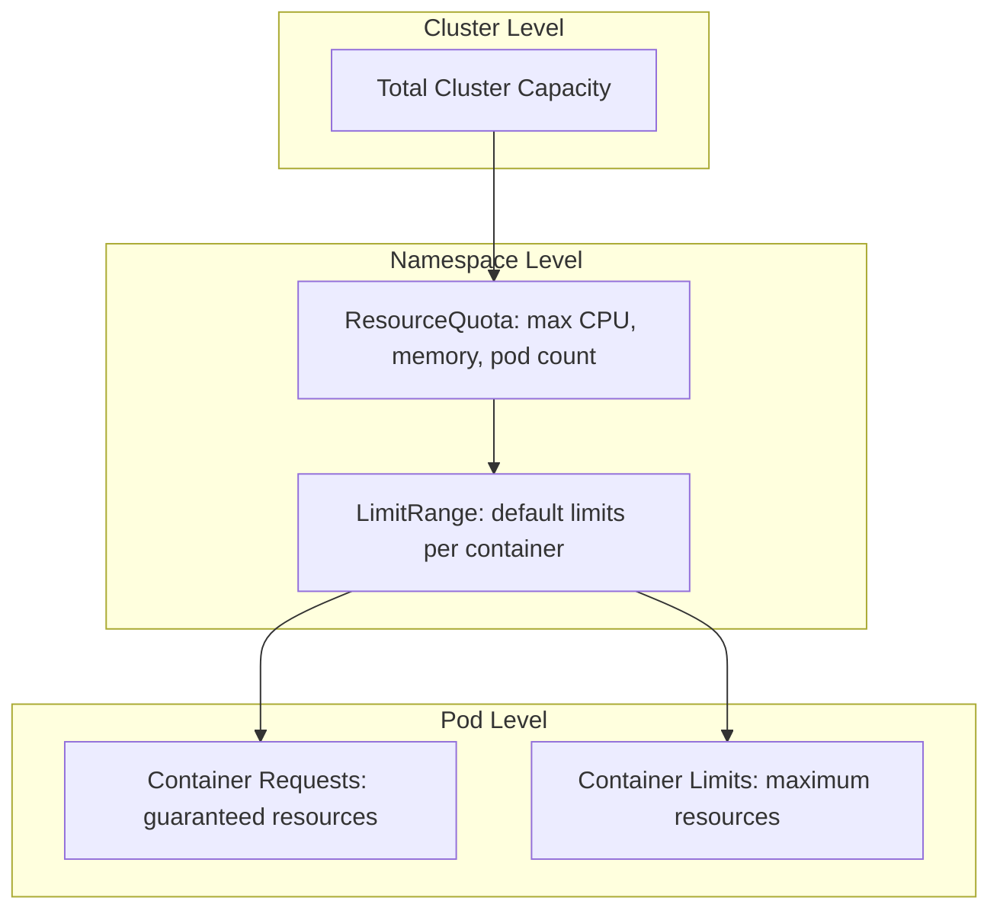
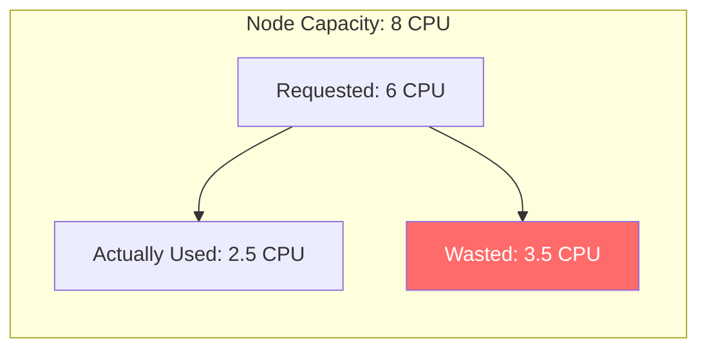

# How to Monitor Kubernetes Resource Quotas and Limits with OpenTelemetry

Author: [nawazdhandala](https://www.github.com/nawazdhandala)

Tags: OpenTelemetry, Kubernetes, Resource Quotas, Limits, Capacity Planning, Observability

Description: Learn how to monitor Kubernetes resource quotas, limits, and requests using OpenTelemetry to prevent capacity issues and optimize cluster utilization.

---

Resource quotas and limits are how Kubernetes prevents any single team or application from consuming an entire cluster. Quotas cap how much of a shared resource a namespace can use. Limits and requests on individual containers control scheduling and prevent runaway processes.

When these are not monitored, bad things happen quietly. A namespace hits its quota and new pods stop scheduling. Containers get OOM-killed because their limits are too low. Or worse, no limits are set and a single misbehaving pod starves everything else on the node.

This guide walks through how to collect, track, and alert on resource quota and limit data using OpenTelemetry.

## Understanding the Resource Model

Before diving into monitoring, let's clarify the three layers of resource management in Kubernetes.



**Requests** are what the scheduler uses to place pods. If a container requests 256Mi of memory, the scheduler finds a node with at least that much available.

**Limits** are the ceiling. If a container tries to use more memory than its limit, it gets OOM-killed. If it tries to use more CPU, it gets throttled.

**ResourceQuotas** apply to an entire namespace. They cap the total sum of requests and limits across all pods in that namespace.

## Setting Up the Kubernetes Cluster Receiver

The OpenTelemetry Collector has a `k8s_cluster` receiver that collects resource quota and limit metrics directly from the Kubernetes API. This is the most straightforward approach.

```yaml
# OpenTelemetry Collector configuration for Kubernetes resource monitoring
apiVersion: opentelemetry.io/v1beta1
kind: OpenTelemetryCollector
metadata:
  name: k8s-resource-monitor
  namespace: otel-system
spec:
  mode: deployment
  replicas: 1
  serviceAccount: otel-collector-sa
  config:
    receivers:
      # Kubernetes cluster receiver collects quota and resource metrics
      k8s_cluster:
        collection_interval: 30s
        node_conditions_to_report:
          - Ready
          - MemoryPressure
          - DiskPressure
          - PIDPressure
        allocatable_types_to_report:
          - cpu
          - memory
          - storage
        resource_attributes:
          k8s.namespace.name:
            enabled: true
          k8s.node.name:
            enabled: true

      # Also collect node-level resource usage from the kubelet
      kubeletstats:
        collection_interval: 30s
        auth_type: serviceAccount
        endpoint: "https://${env:K8S_NODE_NAME}:10250"
        insecure_skip_verify: true
        metric_groups:
          - node
          - pod
          - container
        extra_metadata_labels:
          - container.id
        metrics:
          # Enable container-level resource usage metrics
          k8s.container.cpu_request:
            enabled: true
          k8s.container.cpu_limit:
            enabled: true
          k8s.container.memory_request:
            enabled: true
          k8s.container.memory_limit:
            enabled: true

    processors:
      batch:
        send_batch_size: 1024
        timeout: 10s

      # Add cluster context
      resource:
        attributes:
          - key: k8s.cluster.name
            value: "production"
            action: upsert

    exporters:
      otlp:
        endpoint: "https://oneuptime-ingest.example.com:4317"
        headers:
          Authorization: "Bearer ${ONEUPTIME_API_KEY}"

    service:
      pipelines:
        metrics:
          receivers: [k8s_cluster, kubeletstats]
          processors: [batch, resource]
          exporters: [otlp]
```

## RBAC for Resource Monitoring

The collector needs read access to quotas, pods, nodes, and other resources.

```yaml
# ClusterRole for monitoring resource quotas and usage
apiVersion: rbac.authorization.k8s.io/v1
kind: ClusterRole
metadata:
  name: otel-resource-monitor
rules:
  - apiGroups: [""]
    resources:
      - pods
      - nodes
      - namespaces
      - resourcequotas
      - limitranges
      - services
      - replicationcontrollers
    verbs: ["get", "list", "watch"]
  - apiGroups: ["apps"]
    resources:
      - deployments
      - replicasets
      - statefulsets
      - daemonsets
    verbs: ["get", "list", "watch"]
  - apiGroups: ["batch"]
    resources: ["jobs", "cronjobs"]
    verbs: ["get", "list", "watch"]
  # Need stats access for kubeletstats receiver
  - apiGroups: [""]
    resources: ["nodes/stats", "nodes/proxy"]
    verbs: ["get"]
---
apiVersion: rbac.authorization.k8s.io/v1
kind: ClusterRoleBinding
metadata:
  name: otel-resource-monitor-binding
roleRef:
  apiGroup: rbac.authorization.k8s.io
  kind: ClusterRole
  name: otel-resource-monitor
subjects:
  - kind: ServiceAccount
    name: otel-collector-sa
    namespace: otel-system
```

## Collecting Custom Quota Utilization Metrics

The built-in receivers give you raw numbers. But what you really want is quota utilization percentage. You can compute this using the `transform` processor.

```yaml
# Transform processor to calculate quota utilization percentages
processors:
  transform/quota:
    metric_statements:
      - context: datapoint
        statements:
          # Tag metrics with a utilization category for easier alerting
          - set(attributes["quota.utilization.level"], "critical")
            where resource.attributes["k8s.resourcequota.name"] != nil
            and value_double > 0.9
          - set(attributes["quota.utilization.level"], "warning")
            where resource.attributes["k8s.resourcequota.name"] != nil
            and value_double > 0.75 and value_double <= 0.9
          - set(attributes["quota.utilization.level"], "healthy")
            where resource.attributes["k8s.resourcequota.name"] != nil
            and value_double <= 0.75
```

For more detailed custom metrics, you can write a small exporter that queries the Kubernetes API and produces OpenTelemetry metrics.

```python
# Custom script to collect resource quota utilization metrics
from kubernetes import client, config
from opentelemetry import metrics
from opentelemetry.sdk.metrics import MeterProvider
from opentelemetry.sdk.metrics.export import PeriodicExportingMetricReader
from opentelemetry.exporter.otlp.proto.grpc.metric_exporter import OTLPMetricExporter
from opentelemetry.sdk.resources import Resource
import time

# Load in-cluster Kubernetes config
config.load_incluster_config()
v1 = client.CoreV1Api()

# Set up OpenTelemetry metrics
resource = Resource.create({"service.name": "quota-monitor"})
exporter = OTLPMetricExporter(
    endpoint="otel-collector.otel-system:4317",
    insecure=True,
)
reader = PeriodicExportingMetricReader(exporter, export_interval_millis=30000)
provider = MeterProvider(resource=resource, metric_readers=[reader])
metrics.set_meter_provider(provider)

meter = metrics.get_meter("quota-monitor")

# Create gauges for quota utilization
quota_used = meter.create_gauge(
    name="k8s.resourcequota.used",
    description="Current usage of a resource quota",
    unit="{resource}",
)
quota_hard = meter.create_gauge(
    name="k8s.resourcequota.hard",
    description="Hard limit of a resource quota",
    unit="{resource}",
)
quota_utilization = meter.create_gauge(
    name="k8s.resourcequota.utilization",
    description="Percentage of resource quota used (0-1)",
    unit="1",
)

def collect_quota_metrics():
    """Fetch all resource quotas and record their utilization."""
    quotas = v1.list_resource_quota_for_all_namespaces()

    for quota in quotas.items:
        namespace = quota.metadata.namespace
        quota_name = quota.metadata.name

        # Common attributes for all metrics from this quota
        attrs = {
            "k8s.namespace.name": namespace,
            "k8s.resourcequota.name": quota_name,
        }

        if quota.status.hard and quota.status.used:
            for resource_name, hard_value in quota.status.hard.items():
                used_value = quota.status.used.get(resource_name, "0")

                # Parse quantity strings (e.g., "4", "8Gi", "16000m")
                hard_num = parse_quantity(hard_value)
                used_num = parse_quantity(used_value)

                resource_attrs = {**attrs, "resource": resource_name}

                quota_hard.set(hard_num, resource_attrs)
                quota_used.set(used_num, resource_attrs)

                # Calculate utilization ratio
                if hard_num > 0:
                    utilization = used_num / hard_num
                    quota_utilization.set(utilization, resource_attrs)

def parse_quantity(value):
    """Parse Kubernetes quantity strings to float values."""
    value = str(value)
    if value.endswith("m"):
        # Millicores - convert to cores
        return float(value[:-1]) / 1000
    elif value.endswith("Gi"):
        return float(value[:-2]) * 1024 * 1024 * 1024
    elif value.endswith("Mi"):
        return float(value[:-2]) * 1024 * 1024
    elif value.endswith("Ki"):
        return float(value[:-2]) * 1024
    else:
        return float(value)

# Main collection loop
while True:
    collect_quota_metrics()
    time.sleep(30)
```

## Monitoring LimitRanges

LimitRanges set default requests and limits for containers in a namespace. When someone deploys a pod without explicit limits, the LimitRange fills them in. Monitoring these defaults helps you understand the baseline resource allocation per namespace.

```yaml
# Example LimitRange that sets defaults
apiVersion: v1
kind: LimitRange
metadata:
  name: default-limits
  namespace: production
spec:
  limits:
    - type: Container
      default:
        cpu: "500m"
        memory: "256Mi"
      defaultRequest:
        cpu: "100m"
        memory: "128Mi"
      max:
        cpu: "2"
        memory: "2Gi"
      min:
        cpu: "50m"
        memory: "64Mi"
```

The `k8s_cluster` receiver does not expose LimitRange details directly. You can extend the custom metrics script above to include LimitRange monitoring.

```python
# Add LimitRange monitoring to the quota collection script
def collect_limitrange_metrics():
    """Record LimitRange configurations as metrics for visibility."""
    limit_ranges = v1.list_limit_range_for_all_namespaces()

    # Gauge for default limits configured per namespace
    default_cpu_limit = meter.create_gauge(
        name="k8s.limitrange.default.cpu.limit",
        description="Default CPU limit for containers in namespace",
        unit="{cores}",
    )
    default_memory_limit = meter.create_gauge(
        name="k8s.limitrange.default.memory.limit",
        description="Default memory limit for containers in namespace",
        unit="By",
    )

    for lr in limit_ranges.items:
        namespace = lr.metadata.namespace
        for limit in lr.spec.limits:
            if limit.type == "Container" and limit.default:
                attrs = {
                    "k8s.namespace.name": namespace,
                    "k8s.limitrange.name": lr.metadata.name,
                }
                if "cpu" in limit.default:
                    default_cpu_limit.set(
                        parse_quantity(limit.default["cpu"]), attrs
                    )
                if "memory" in limit.default:
                    default_memory_limit.set(
                        parse_quantity(limit.default["memory"]), attrs
                    )
```

## Detecting Containers Without Limits

One of the most valuable things you can monitor is containers running without resource limits. These are ticking time bombs that can consume unbounded resources and destabilize a node.

```python
# Find and report containers missing resource limits
def check_containers_without_limits():
    """Identify pods with containers that lack resource limits."""
    # Counter for containers without limits
    no_limits_counter = meter.create_gauge(
        name="k8s.containers.without_limits",
        description="Number of containers running without resource limits",
        unit="{container}",
    )

    pods = v1.list_pod_for_all_namespaces()

    # Count containers without limits per namespace
    namespace_counts = {}

    for pod in pods.items:
        ns = pod.metadata.namespace
        if ns not in namespace_counts:
            namespace_counts[ns] = {"no_cpu_limit": 0, "no_memory_limit": 0}

        for container in pod.spec.containers:
            limits = {}
            if container.resources and container.resources.limits:
                limits = container.resources.limits

            if "cpu" not in limits:
                namespace_counts[ns]["no_cpu_limit"] += 1
            if "memory" not in limits:
                namespace_counts[ns]["no_memory_limit"] += 1

    # Report the counts
    for ns, counts in namespace_counts.items():
        no_limits_counter.set(counts["no_cpu_limit"], {
            "k8s.namespace.name": ns,
            "resource.type": "cpu",
        })
        no_limits_counter.set(counts["no_memory_limit"], {
            "k8s.namespace.name": ns,
            "resource.type": "memory",
        })
```

## Capacity Planning Dashboard Metrics

For capacity planning, you need to see the gap between what is requested and what is actually used. This helps right-size your workloads.



The kubeletstats receiver gives you actual usage. The k8s_cluster receiver gives you requests and limits. Compare them to find over-provisioned workloads.

Key metrics to track and alert on:

| Metric | Source | Alert When |
|--------|--------|------------|
| `k8s.resourcequota.utilization` | Custom script | > 80% |
| `k8s.container.memory_limit_utilization` | kubeletstats | > 90% |
| `k8s.container.cpu_limit_utilization` | kubeletstats | sustained > 95% |
| `k8s.containers.without_limits` | Custom script | > 0 in production |
| `k8s.node.allocatable` vs `k8s.pod.cpu.request` | k8s_cluster | node > 85% allocated |

## Setting Up Alerts

With the metrics flowing into your observability backend, set up these alerts to catch problems before they impact users.

```yaml
# Example alert rules (expressed as pseudo-configuration)
# Adapt to your alerting system's format

alerts:
  # Namespace is running out of quota
  - name: ResourceQuotaNearLimit
    condition: k8s.resourcequota.utilization > 0.85
    for: 5m
    severity: warning
    message: "Namespace {{ k8s.namespace.name }} is using {{ value }}% of its {{ resource }} quota"

  # Container is getting OOM-killed risk
  - name: ContainerMemoryNearLimit
    condition: k8s.container.memory_limit_utilization > 0.9
    for: 10m
    severity: critical
    message: "Container {{ k8s.container.name }} in {{ k8s.namespace.name }} is at {{ value }}% of memory limit"

  # Containers deployed without limits in production
  - name: ContainersMissingLimits
    condition: k8s.containers.without_limits > 0
    labels:
      k8s.namespace.name: production
    severity: warning
    message: "{{ value }} containers in {{ k8s.namespace.name }} are running without resource limits"

  # Node is overcommitted
  - name: NodeOvercommitted
    condition: (sum(k8s.pod.cpu.request) by (node) / k8s.node.allocatable.cpu) > 0.9
    for: 15m
    severity: warning
    message: "Node {{ k8s.node.name }} CPU requests are at {{ value }}% of allocatable"
```

## Summary

Monitoring Kubernetes resource quotas and limits with OpenTelemetry gives you the data needed to prevent capacity disasters and optimize spending. The `k8s_cluster` receiver and `kubeletstats` receiver handle most of the heavy lifting. For quota utilization percentages and containers missing limits, a small custom metrics exporter fills in the gaps.

The most important thing is acting on the data. Set alerts for quota exhaustion before it blocks deployments. Track containers without limits and enforce them through policy. Compare requested resources to actual usage and right-size your workloads. The monitoring is only valuable when it drives action.
