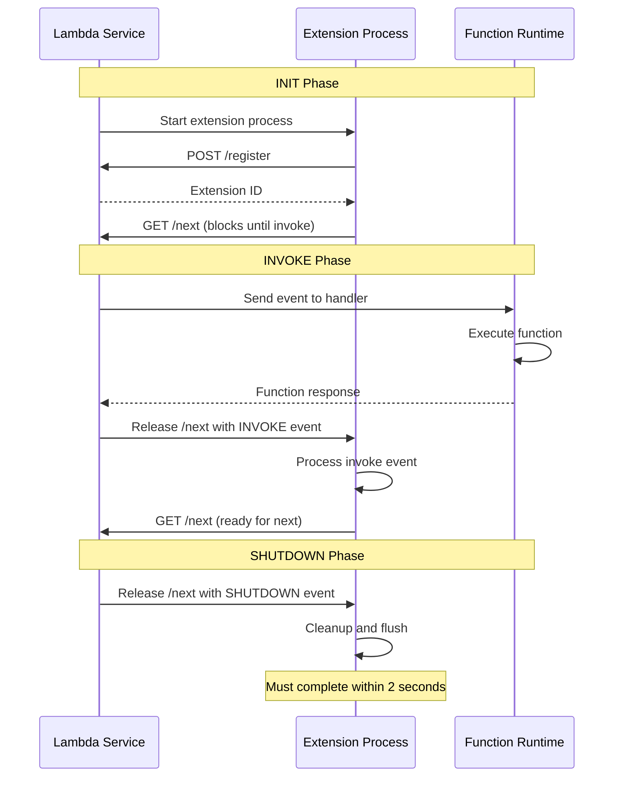

# How to Monitor Lambda Extension Lifecycle with OpenTelemetry

Author: [nawazdhandala](https://www.github.com/nawazdhandala)

Tags: OpenTelemetry, AWS Lambda, Lambda Extensions, Lifecycle, Monitoring, Serverless, Observability

Description: Learn how to monitor and trace the AWS Lambda extension lifecycle phases using OpenTelemetry for deeper visibility into init, invoke, and shutdown behavior.

---

Lambda extensions run alongside your function code and have their own lifecycle. They initialize before your function, run during invocations, and get a shutdown signal when the execution environment is being recycled. If you are running an OpenTelemetry Collector as a Lambda extension, or if you have built custom extensions for caching, logging, or configuration loading, monitoring their lifecycle is important. A slow extension init adds to your cold start time. A failed shutdown can mean lost telemetry.

This guide shows you how to instrument the Lambda extension lifecycle with OpenTelemetry so you can see exactly how extensions behave in production.

## The Lambda Extension Lifecycle

Lambda extensions go through three distinct phases. Understanding these phases is the foundation for meaningful instrumentation.



The INIT phase is where cold start overhead lives. The INVOKE phase runs for every function invocation. The SHUTDOWN phase is your last chance to flush any buffered data. Each of these deserves its own span and metrics.

## Building a Lifecycle-Aware Extension with Tracing

Here is a Lambda extension written in Go that registers with the Lambda Extensions API and traces each lifecycle phase. Go is the most common language for Lambda extensions because it compiles to a single binary with no runtime dependencies.

```go
// main.go
package main

import (
	"context"
	"fmt"
	"net/http"
	"os"
	"time"

	"go.opentelemetry.io/otel"
	"go.opentelemetry.io/otel/attribute"
	"go.opentelemetry.io/otel/exporters/otlp/otlptrace/otlptracehttp"
	"go.opentelemetry.io/otel/sdk/resource"
	sdktrace "go.opentelemetry.io/otel/sdk/trace"
	semconv "go.opentelemetry.io/otel/semconv/v1.26.0"
	"go.opentelemetry.io/otel/trace"
)

// initTracer sets up the OpenTelemetry trace provider for the extension.
// We use HTTP export because the extension runs in a constrained
// networking environment inside Lambda.
func initTracer() (*sdktrace.TracerProvider, error) {
	exporter, err := otlptracehttp.New(
		context.Background(),
		otlptracehttp.WithEndpoint(
			os.Getenv("OTEL_EXPORTER_OTLP_ENDPOINT"),
		),
		otlptracehttp.WithInsecure(),
	)
	if err != nil {
		return nil, fmt.Errorf("failed to create exporter: %w", err)
	}

	res := resource.NewWithAttributes(
		semconv.SchemaURL,
		semconv.ServiceName("lambda-extension-monitor"),
		attribute.String("cloud.platform", "aws_lambda"),
		attribute.String("extension.name", "lifecycle-monitor"),
	)

	tp := sdktrace.NewTracerProvider(
		sdktrace.WithBatcher(exporter,
			// Use a short batch delay for Lambda's constrained lifecycle
			sdktrace.WithBatchTimeout(1*time.Second),
		),
		sdktrace.WithResource(res),
	)

	otel.SetTracerProvider(tp)
	return tp, nil
}

func main() {
	tp, err := initTracer()
	if err != nil {
		fmt.Fprintf(os.Stderr, "failed to init tracer: %v\n", err)
		os.Exit(1)
	}
	defer tp.Shutdown(context.Background())

	tracer := otel.Tracer("extension-lifecycle")

	// Trace the INIT phase, which covers registration and setup
	ctx, initSpan := tracer.Start(context.Background(), "extension.init",
		trace.WithAttributes(
			attribute.String("lifecycle.phase", "init"),
		),
	)

	extensionID, err := registerExtension()
	if err != nil {
		initSpan.RecordError(err)
		initSpan.End()
		os.Exit(1)
	}

	initSpan.SetAttributes(attribute.String("extension.id", extensionID))
	initSpan.End()

	// Enter the main event loop
	processEvents(ctx, tracer, extensionID, tp)
}
```

The extension starts by registering with the Lambda Extensions API during the INIT phase. That registration call is traced so you can see how long it takes. If registration is slow, it directly adds to your function's cold start time.

## Registering with the Extensions API

The registration call tells Lambda what lifecycle events your extension wants to receive.

```go
// register.go
package main

import (
	"bytes"
	"encoding/json"
	"fmt"
	"net/http"
	"os"
)

// registerExtension registers this extension with the Lambda Extensions API.
// The API runs on localhost and is available during the INIT phase.
func registerExtension() (string, error) {
	// The Extensions API base URL is provided by Lambda
	baseURL := fmt.Sprintf(
		"http://%s/2020-01-01/extension",
		os.Getenv("AWS_LAMBDA_RUNTIME_API"),
	)

	// Request both INVOKE and SHUTDOWN events so we can
	// trace the full lifecycle of the extension
	payload, _ := json.Marshal(map[string][]string{
		"events": {"INVOKE", "SHUTDOWN"},
	})

	req, err := http.NewRequest("POST", baseURL+"/register", bytes.NewReader(payload))
	if err != nil {
		return "", err
	}

	// The extension name must match the filename in /opt/extensions/
	req.Header.Set("Lambda-Extension-Name", "lifecycle-monitor")

	resp, err := http.DefaultClient.Do(req)
	if err != nil {
		return "", fmt.Errorf("registration request failed: %w", err)
	}
	defer resp.Body.Close()

	if resp.StatusCode != http.StatusOK {
		return "", fmt.Errorf("registration failed with status %d", resp.StatusCode)
	}

	// The extension ID is returned in the response header.
	// We need it for all subsequent API calls.
	return resp.Header.Get("Lambda-Extension-Identifier"), nil
}
```

## Processing Lifecycle Events with Tracing

The event loop is where the extension spends most of its time. It calls the `/next` endpoint, which blocks until Lambda sends an event. Each event gets its own span.

```go
// events.go
package main

import (
	"context"
	"encoding/json"
	"fmt"
	"net/http"
	"os"
	"time"

	"go.opentelemetry.io/otel/attribute"
	sdktrace "go.opentelemetry.io/otel/sdk/trace"
	"go.opentelemetry.io/otel/trace"
)

// ExtensionEvent represents an event from the Lambda Extensions API
type ExtensionEvent struct {
	EventType        string `json:"eventType"`
	DeadlineMs       int64  `json:"deadlineMs"`
	InvokedFunctionArn string `json:"invokedFunctionArn,omitempty"`
	ShutdownReason   string `json:"shutdownReason,omitempty"`
}

// processEvents is the main event loop for the extension.
// It blocks on /next and processes each event with tracing.
func processEvents(
	ctx context.Context,
	tracer trace.Tracer,
	extensionID string,
	tp *sdktrace.TracerProvider,
) {
	baseURL := fmt.Sprintf(
		"http://%s/2020-01-01/extension",
		os.Getenv("AWS_LAMBDA_RUNTIME_API"),
	)

	for {
		// Call /next which blocks until Lambda sends an event.
		// This is the idle period between invocations.
		req, _ := http.NewRequest("GET", baseURL+"/event/next", nil)
		req.Header.Set("Lambda-Extension-Identifier", extensionID)

		resp, err := http.DefaultClient.Do(req)
		if err != nil {
			fmt.Fprintf(os.Stderr, "error getting next event: %v\n", err)
			return
		}

		var event ExtensionEvent
		json.NewDecoder(resp.Body).Decode(&event)
		resp.Body.Close()

		switch event.EventType {
		case "INVOKE":
			handleInvokeEvent(ctx, tracer, event, tp)
		case "SHUTDOWN":
			handleShutdownEvent(ctx, tracer, event, tp)
			return
		}
	}
}

// handleInvokeEvent traces the extension's processing during a function invocation
func handleInvokeEvent(
	ctx context.Context,
	tracer trace.Tracer,
	event ExtensionEvent,
	tp *sdktrace.TracerProvider,
) {
	_, span := tracer.Start(ctx, "extension.invoke",
		trace.WithAttributes(
			attribute.String("lifecycle.phase", "invoke"),
			attribute.String("faas.invoked_arn", event.InvokedFunctionArn),
			attribute.Int64("faas.deadline_ms", event.DeadlineMs),
		),
	)

	// Calculate remaining time until the invocation deadline.
	// This helps identify if the extension is running too close
	// to the function timeout.
	deadline := time.UnixMilli(event.DeadlineMs)
	remaining := time.Until(deadline)
	span.SetAttributes(
		attribute.Float64("faas.remaining_seconds", remaining.Seconds()),
	)

	// Do your extension's invoke-phase work here.
	// For example: collect metrics, process logs, update caches.

	span.End()

	// Flush after each invocation to avoid losing data
	// if the environment freezes before the next event
	tp.ForceFlush(ctx)
}

// handleShutdownEvent traces the extension's shutdown behavior
func handleShutdownEvent(
	ctx context.Context,
	tracer trace.Tracer,
	event ExtensionEvent,
	tp *sdktrace.TracerProvider,
) {
	_, span := tracer.Start(ctx, "extension.shutdown",
		trace.WithAttributes(
			attribute.String("lifecycle.phase", "shutdown"),
			// The shutdown reason tells you why the environment
			// is being recycled: timeout, failure, or normal spindown
			attribute.String("shutdown.reason", event.ShutdownReason),
			attribute.Int64("shutdown.deadline_ms", event.DeadlineMs),
		),
	)

	// Perform cleanup: close connections, flush buffers, etc.
	// You have a maximum of 2 seconds to complete shutdown.

	span.End()

	// This is your last chance to export telemetry.
	// Use a short timeout because Lambda will kill the process
	// after the 2-second shutdown window.
	shutdownCtx, cancel := context.WithTimeout(ctx, 1500*time.Millisecond)
	defer cancel()
	tp.ForceFlush(shutdownCtx)
}
```

The `ForceFlush` call after each invoke event is a defensive pattern. Lambda can freeze the execution environment between invocations. If you buffer spans and only flush during shutdown, you risk losing data when the environment is recycled without a clean shutdown.

## Recording Lifecycle Metrics

Beyond traces, you want metrics that show lifecycle behavior over time. How often do extensions get shut down? How long does init take on average? These metrics help you understand the overall health of your extension fleet.

```go
// metrics.go
package main

import (
	"context"
	"time"

	"go.opentelemetry.io/otel/metric"
)

// LifecycleMetrics holds the metric instruments for extension monitoring
type LifecycleMetrics struct {
	// Track how long each lifecycle phase takes
	initDuration    metric.Float64Histogram
	invokeDuration  metric.Float64Histogram
	shutdownDuration metric.Float64Histogram

	// Count lifecycle events by type
	lifecycleEvents metric.Int64Counter

	// Track shutdown reasons to detect unhealthy patterns
	shutdownReasons metric.Int64Counter
}

// NewLifecycleMetrics creates and registers all lifecycle metric instruments
func NewLifecycleMetrics(meter metric.Meter) (*LifecycleMetrics, error) {
	initDuration, err := meter.Float64Histogram(
		"extension.init.duration",
		metric.WithDescription("Time spent in the INIT lifecycle phase"),
		metric.WithUnit("ms"),
	)
	if err != nil {
		return nil, err
	}

	invokeDuration, err := meter.Float64Histogram(
		"extension.invoke.duration",
		metric.WithDescription("Time spent processing each INVOKE event"),
		metric.WithUnit("ms"),
	)
	if err != nil {
		return nil, err
	}

	shutdownDuration, err := meter.Float64Histogram(
		"extension.shutdown.duration",
		metric.WithDescription("Time spent in the SHUTDOWN phase"),
		metric.WithUnit("ms"),
	)
	if err != nil {
		return nil, err
	}

	lifecycleEvents, err := meter.Int64Counter(
		"extension.lifecycle.events",
		metric.WithDescription("Count of lifecycle events by type"),
	)
	if err != nil {
		return nil, err
	}

	shutdownReasons, err := meter.Int64Counter(
		"extension.shutdown.reasons",
		metric.WithDescription("Count of shutdown events by reason"),
	)
	if err != nil {
		return nil, err
	}

	return &LifecycleMetrics{
		initDuration:     initDuration,
		invokeDuration:   invokeDuration,
		shutdownDuration: shutdownDuration,
		lifecycleEvents:  lifecycleEvents,
		shutdownReasons:  shutdownReasons,
	}, nil
}
```

These histograms and counters give you a statistical view of your extension's behavior. You can alert on init durations that exceed a threshold, or on shutdown reason distributions that indicate environmental problems.

## Monitoring the OTel Collector Extension Specifically

If you are running the OpenTelemetry Collector as a Lambda extension, you especially want to know about its lifecycle. The collector needs to initialize before your function starts, and it needs enough time during shutdown to flush all buffered telemetry.

```yaml
# collector-config.yaml for a Lambda extension collector
receivers:
  otlp:
    protocols:
      http:
        endpoint: 0.0.0.0:4318

processors:
  batch:
    # Short timeout for Lambda's constrained environment.
    # The default 200ms send batch size and 5000ms timeout
    # are too long for Lambda where every millisecond counts.
    timeout: 1s
    send_batch_size: 64

extensions:
  # The health check extension lets you verify the collector
  # is ready to receive telemetry during the init phase
  health_check:
    endpoint: 0.0.0.0:13133

exporters:
  otlp:
    endpoint: https://your-backend:4317
    # Set a retry policy that works within Lambda's time constraints
    retry_on_failure:
      enabled: true
      initial_interval: 100ms
      max_interval: 1s
      max_elapsed_time: 5s

service:
  extensions: [health_check]
  pipelines:
    traces:
      receivers: [otlp]
      processors: [batch]
      exporters: [otlp]
```

The shortened batch timeout and retry intervals are tuned for Lambda. In a normal server environment, you would use larger batches and longer timeouts. In Lambda, speed of export matters more than export efficiency because the environment can be frozen or terminated at any time.

## Detecting Lifecycle Problems

With the instrumentation in place, here are the patterns to watch for in your telemetry data:

Slow init phases show up as long `extension.init` spans. If your extension takes more than 500ms to initialize, it is meaningfully contributing to cold start latency. Look at what the extension does during init and see if any of it can be deferred to the first invoke.

Frequent shutdown events with reason "timeout" indicate that your function is hitting its configured timeout limit. The extension gets a SHUTDOWN event, but your function's response may have already been lost.

Shutdown events with reason "failure" mean something went wrong. Correlate these with the function's error logs to find the root cause.

Missing telemetry at the end of a trace often points to the extension not having enough time to flush during shutdown. If you see this pattern, reduce your batch sizes and ensure `ForceFlush` is called before the shutdown deadline.

## Wrapping Up

Lambda extension lifecycle monitoring gives you visibility into a layer of your serverless architecture that is usually invisible. By tracing each lifecycle phase and recording duration metrics, you can identify cold start bottlenecks, catch shutdown failures, and ensure your extensions are not the weakest link in your observability pipeline. The key patterns are: trace every phase, flush aggressively, and watch the shutdown reason distribution for signs of trouble.
