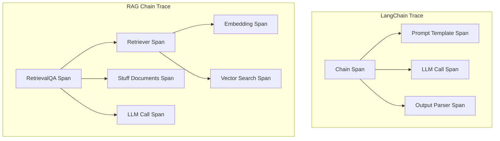
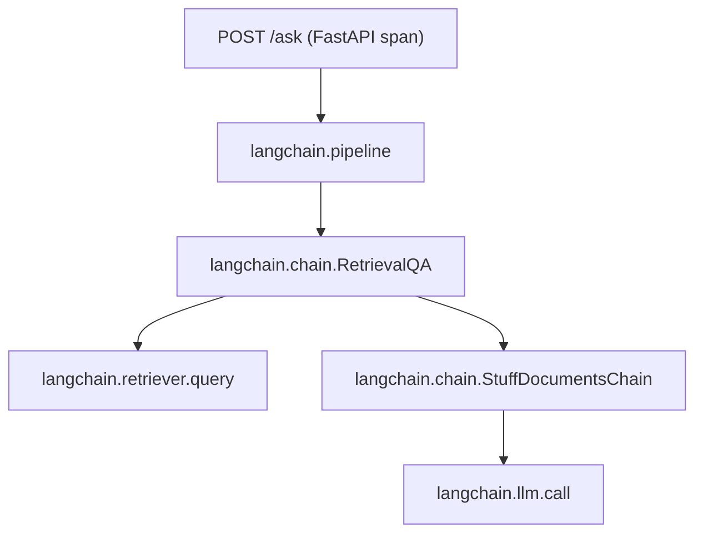

# How to Monitor LangChain Applications with OpenTelemetry

Author: [nawazdhandala](https://www.github.com/nawazdhandala)

Tags: OpenTelemetry, LangChain, LLM, Observability, Tracing, Python, AI Applications, Monitoring

Description: A practical guide to monitoring LangChain applications with OpenTelemetry, covering chain tracing, callback handlers, custom metrics, and production debugging.

---

LangChain makes it easy to build LLM-powered applications by chaining together prompts, models, retrievers, and tools. But that abstraction comes with a cost: when something goes wrong, you're staring at a chain of components and wondering which one is responsible. Was it the retriever that returned bad results? The prompt template that lost important context? Or was the LLM just having a bad day?

OpenTelemetry solves this by giving you visibility into every component in your LangChain pipeline. This guide shows you how to instrument LangChain applications with proper tracing, from simple chains to complex agent workflows.

---

## How LangChain Components Map to Spans

LangChain's architecture maps cleanly to OpenTelemetry's span model. Each component in a chain becomes a span, and the chain itself becomes the parent trace.



---

## Setting Up OpenTelemetry with LangChain

First, install the required packages. LangChain has a callback system that we'll hook into for tracing.

```bash
# Install LangChain and OpenTelemetry packages
pip install langchain langchain-openai langchain-community
pip install opentelemetry-api opentelemetry-sdk opentelemetry-exporter-otlp
```

Configure the OpenTelemetry tracer provider before creating any LangChain components.

```python
from opentelemetry import trace, metrics
from opentelemetry.sdk.trace import TracerProvider
from opentelemetry.sdk.trace.export import BatchSpanProcessor
from opentelemetry.sdk.metrics import MeterProvider
from opentelemetry.sdk.metrics.export import PeriodicExportingMetricReader
from opentelemetry.exporter.otlp.proto.grpc.trace_exporter import OTLPSpanExporter
from opentelemetry.exporter.otlp.proto.grpc.metric_exporter import OTLPMetricExporter
from opentelemetry.sdk.resources import Resource

# Configure the service identity
resource = Resource.create({
    "service.name": "langchain-app",
    "service.version": "1.0.0",
    "deployment.environment": "production"
})

# Set up tracing with OTLP export
tracer_provider = TracerProvider(resource=resource)
tracer_provider.add_span_processor(
    BatchSpanProcessor(OTLPSpanExporter(endpoint="https://oneuptime.com/otlp"))
)
trace.set_tracer_provider(tracer_provider)

# Set up metrics for aggregate monitoring
metric_reader = PeriodicExportingMetricReader(
    OTLPMetricExporter(endpoint="https://oneuptime.com/otlp"),
    export_interval_millis=30000
)
metrics.set_meter_provider(MeterProvider(
    resource=resource,
    metric_readers=[metric_reader]
))

tracer = trace.get_tracer("langchain.app", "1.0.0")
meter = metrics.get_meter("langchain.app", "1.0.0")
```

---

## Building a Custom Callback Handler

LangChain's callback system is the hook point for OpenTelemetry instrumentation. By implementing a callback handler, you can automatically trace every chain invocation, LLM call, tool use, and retriever query.

```python
import time
from typing import Any, Dict, List, Optional, Union
from uuid import UUID

from langchain.callbacks.base import BaseCallbackHandler
from opentelemetry import trace
from opentelemetry.trace import StatusCode

tracer = trace.get_tracer("langchain.callbacks")

class OpenTelemetryCallbackHandler(BaseCallbackHandler):
    """
    LangChain callback handler that creates OpenTelemetry spans
    for each component invocation in the chain.
    """

    def __init__(self):
        # Track active spans by their run ID
        # LangChain assigns a unique run_id to each component invocation
        self._spans: Dict[UUID, trace.Span] = {}
        self._timers: Dict[UUID, float] = {}

    # --- Chain callbacks ---

    def on_chain_start(self, serialized: Dict[str, Any],
                       inputs: Dict[str, Any],
                       run_id: UUID, **kwargs) -> None:
        """Called when a chain starts running."""
        chain_name = serialized.get("name", serialized.get("id", ["unknown"])[-1])

        # Create a span for this chain invocation
        span = tracer.start_span(f"langchain.chain.{chain_name}")
        span.set_attribute("langchain.component", "chain")
        span.set_attribute("langchain.chain.name", chain_name)
        span.set_attribute("langchain.run_id", str(run_id))

        # Record input keys but not values (which may be large or sensitive)
        if isinstance(inputs, dict):
            span.set_attribute("langchain.chain.input_keys", str(list(inputs.keys())))

        self._spans[run_id] = span
        self._timers[run_id] = time.perf_counter()

    def on_chain_end(self, outputs: Dict[str, Any],
                     run_id: UUID, **kwargs) -> None:
        """Called when a chain finishes successfully."""
        span = self._spans.pop(run_id, None)
        start_time = self._timers.pop(run_id, None)

        if span:
            elapsed_ms = (time.perf_counter() - start_time) * 1000 if start_time else 0
            span.set_attribute("langchain.chain.duration_ms", elapsed_ms)
            if isinstance(outputs, dict):
                span.set_attribute("langchain.chain.output_keys",
                                 str(list(outputs.keys())))
            span.set_status(StatusCode.OK)
            span.end()

    def on_chain_error(self, error: BaseException,
                       run_id: UUID, **kwargs) -> None:
        """Called when a chain encounters an error."""
        span = self._spans.pop(run_id, None)
        if span:
            span.set_status(StatusCode.ERROR, str(error))
            span.record_exception(error)
            span.end()

    # --- LLM callbacks ---

    def on_llm_start(self, serialized: Dict[str, Any],
                     prompts: List[str],
                     run_id: UUID, **kwargs) -> None:
        """Called when an LLM call starts."""
        model_name = serialized.get("name", "unknown")

        span = tracer.start_span("langchain.llm.call")
        span.set_attribute("langchain.component", "llm")
        span.set_attribute("langchain.llm.model", model_name)
        span.set_attribute("langchain.llm.num_prompts", len(prompts))
        span.set_attribute("langchain.run_id", str(run_id))

        # Track prompt sizes without logging the actual content
        total_chars = sum(len(p) for p in prompts)
        span.set_attribute("langchain.llm.total_input_chars", total_chars)

        self._spans[run_id] = span
        self._timers[run_id] = time.perf_counter()

    def on_llm_end(self, response, run_id: UUID, **kwargs) -> None:
        """Called when an LLM call completes."""
        span = self._spans.pop(run_id, None)
        start_time = self._timers.pop(run_id, None)

        if span:
            elapsed_ms = (time.perf_counter() - start_time) * 1000 if start_time else 0
            span.set_attribute("langchain.llm.duration_ms", elapsed_ms)

            # Extract token usage if available
            if hasattr(response, 'llm_output') and response.llm_output:
                token_usage = response.llm_output.get("token_usage", {})
                if token_usage:
                    span.set_attribute("langchain.llm.prompt_tokens",
                                     token_usage.get("prompt_tokens", 0))
                    span.set_attribute("langchain.llm.completion_tokens",
                                     token_usage.get("completion_tokens", 0))
                    span.set_attribute("langchain.llm.total_tokens",
                                     token_usage.get("total_tokens", 0))

            span.set_status(StatusCode.OK)
            span.end()

    def on_llm_error(self, error: BaseException,
                     run_id: UUID, **kwargs) -> None:
        """Called when an LLM call fails."""
        span = self._spans.pop(run_id, None)
        if span:
            span.set_status(StatusCode.ERROR, str(error))
            span.record_exception(error)
            span.end()

    # --- Retriever callbacks ---

    def on_retriever_start(self, serialized: Dict[str, Any],
                           query: str, run_id: UUID, **kwargs) -> None:
        """Called when a retriever starts fetching documents."""
        span = tracer.start_span("langchain.retriever.query")
        span.set_attribute("langchain.component", "retriever")
        span.set_attribute("langchain.retriever.query_length", len(query))
        span.set_attribute("langchain.run_id", str(run_id))

        self._spans[run_id] = span
        self._timers[run_id] = time.perf_counter()

    def on_retriever_end(self, documents, run_id: UUID, **kwargs) -> None:
        """Called when a retriever returns documents."""
        span = self._spans.pop(run_id, None)
        start_time = self._timers.pop(run_id, None)

        if span:
            elapsed_ms = (time.perf_counter() - start_time) * 1000 if start_time else 0
            span.set_attribute("langchain.retriever.duration_ms", elapsed_ms)
            span.set_attribute("langchain.retriever.documents_count", len(documents))

            # Record total content size from retrieved documents
            total_content = sum(len(doc.page_content) for doc in documents)
            span.set_attribute("langchain.retriever.total_content_chars", total_content)

            span.set_status(StatusCode.OK)
            span.end()

    # --- Tool callbacks ---

    def on_tool_start(self, serialized: Dict[str, Any],
                      input_str: str, run_id: UUID, **kwargs) -> None:
        """Called when a tool starts executing."""
        tool_name = serialized.get("name", "unknown")

        span = tracer.start_span(f"langchain.tool.{tool_name}")
        span.set_attribute("langchain.component", "tool")
        span.set_attribute("langchain.tool.name", tool_name)
        span.set_attribute("langchain.tool.input_length", len(input_str))
        span.set_attribute("langchain.run_id", str(run_id))

        self._spans[run_id] = span
        self._timers[run_id] = time.perf_counter()

    def on_tool_end(self, output: str, run_id: UUID, **kwargs) -> None:
        """Called when a tool finishes executing."""
        span = self._spans.pop(run_id, None)
        start_time = self._timers.pop(run_id, None)

        if span:
            elapsed_ms = (time.perf_counter() - start_time) * 1000 if start_time else 0
            span.set_attribute("langchain.tool.duration_ms", elapsed_ms)
            span.set_attribute("langchain.tool.output_length", len(str(output)))
            span.set_status(StatusCode.OK)
            span.end()

    def on_tool_error(self, error: BaseException,
                      run_id: UUID, **kwargs) -> None:
        """Called when a tool encounters an error."""
        span = self._spans.pop(run_id, None)
        if span:
            span.set_status(StatusCode.ERROR, str(error))
            span.record_exception(error)
            span.end()
```

---

## Using the Callback Handler

Once you have the callback handler, you can attach it to any LangChain component. It works with chains, agents, retrieval pipelines, and everything else in the LangChain ecosystem.

### Simple Chain Example

Here's a basic chain with tracing enabled.

```python
from langchain_openai import ChatOpenAI
from langchain.prompts import ChatPromptTemplate
from langchain.schema.output_parser import StrOutputParser

# Create the callback handler instance
otel_handler = OpenTelemetryCallbackHandler()

# Build a simple chain using LCEL (LangChain Expression Language)
prompt = ChatPromptTemplate.from_messages([
    ("system", "You are a helpful assistant that answers questions concisely."),
    ("human", "{question}")
])

llm = ChatOpenAI(model="gpt-4", temperature=0)
chain = prompt | llm | StrOutputParser()

# Invoke the chain with the OpenTelemetry callback handler
# Every component in the chain will produce a span
response = chain.invoke(
    {"question": "What is OpenTelemetry?"},
    config={"callbacks": [otel_handler]}
)
```

### RAG Chain Example

For a retrieval-augmented chain, the handler automatically traces the retriever alongside the LLM calls.

```python
from langchain_openai import ChatOpenAI, OpenAIEmbeddings
from langchain_community.vectorstores import Chroma
from langchain.chains import RetrievalQA
from langchain.text_splitter import RecursiveCharacterTextSplitter

otel_handler = OpenTelemetryCallbackHandler()

# Set up the vector store with documents
embeddings = OpenAIEmbeddings()
vectorstore = Chroma.from_texts(
    texts=["OpenTelemetry is an observability framework...",
           "LangChain is a framework for LLM applications..."],
    embedding=embeddings,
    collection_name="docs"
)

# Build a RetrievalQA chain
# The retriever, stuff-documents chain, and LLM will all be traced
qa_chain = RetrievalQA.from_chain_type(
    llm=ChatOpenAI(model="gpt-4", temperature=0),
    chain_type="stuff",
    retriever=vectorstore.as_retriever(search_kwargs={"k": 3})
)

# Run with tracing enabled
result = qa_chain.invoke(
    {"query": "How does OpenTelemetry work with LangChain?"},
    config={"callbacks": [otel_handler]}
)
```

---

## Adding Custom Metrics

Beyond tracing, you'll want aggregate metrics that help you monitor the health of your LangChain application over time.

```python
from opentelemetry import metrics

meter = metrics.get_meter("langchain.metrics")

# Track LLM call latency distribution
llm_latency = meter.create_histogram(
    "langchain.llm.latency",
    description="LLM call latency in milliseconds",
    unit="ms"
)

# Count total LLM calls by model
llm_calls = meter.create_counter(
    "langchain.llm.calls",
    description="Total LLM invocations"
)

# Track token usage for cost monitoring
token_usage = meter.create_counter(
    "langchain.llm.tokens",
    description="Total tokens consumed"
)

# Track retriever performance
retriever_latency = meter.create_histogram(
    "langchain.retriever.latency",
    description="Retriever query latency in milliseconds",
    unit="ms"
)

# Count chain errors by type
chain_errors = meter.create_counter(
    "langchain.chain.errors",
    description="Chain execution errors"
)
```

You can integrate these metrics into the callback handler. Here's how to add metric recording to the LLM callbacks.

```python
class MetricAwareCallbackHandler(OpenTelemetryCallbackHandler):
    """Extends the base handler to also record aggregate metrics."""

    def on_llm_end(self, response, run_id: UUID, **kwargs) -> None:
        # Call the parent to handle span management
        start_time = self._timers.get(run_id)
        if start_time:
            elapsed_ms = (time.perf_counter() - start_time) * 1000
            model = "unknown"

            # Record latency and call count metrics
            llm_latency.record(elapsed_ms, {"model": model})
            llm_calls.add(1, {"model": model})

            # Record token usage if available
            if hasattr(response, 'llm_output') and response.llm_output:
                usage = response.llm_output.get("token_usage", {})
                total = usage.get("total_tokens", 0)
                if total:
                    token_usage.add(total, {"model": model})

        super().on_llm_end(response, run_id, **kwargs)

    def on_chain_error(self, error: BaseException,
                       run_id: UUID, **kwargs) -> None:
        # Record error metrics before handling the span
        error_type = type(error).__name__
        chain_errors.add(1, {"error_type": error_type})
        super().on_chain_error(error, run_id, **kwargs)
```

---

## Tracing LangChain Agents

Agents add complexity because they loop through think-act-observe cycles. The callback handler we built handles this automatically since agents use chains and tools internally.

```python
from langchain_openai import ChatOpenAI
from langchain.agents import AgentExecutor, create_openai_tools_agent
from langchain.tools import tool
from langchain.prompts import ChatPromptTemplate, MessagesPlaceholder

otel_handler = MetricAwareCallbackHandler()

# Define some tools for the agent
@tool
def search_database(query: str) -> str:
    """Search the internal database for information."""
    # Your database search logic here
    return f"Found 3 results for: {query}"

@tool
def calculate(expression: str) -> str:
    """Evaluate a mathematical expression."""
    try:
        result = eval(expression)  # In production, use a safe math parser
        return str(result)
    except Exception as e:
        return f"Error: {e}"

# Create the agent with tools
llm = ChatOpenAI(model="gpt-4", temperature=0)
prompt = ChatPromptTemplate.from_messages([
    ("system", "You are a helpful assistant with access to tools."),
    ("human", "{input}"),
    MessagesPlaceholder(variable_name="agent_scratchpad")
])

agent = create_openai_tools_agent(llm, [search_database, calculate], prompt)
agent_executor = AgentExecutor(agent=agent, tools=[search_database, calculate])

# Run the agent with full tracing
# Each think-act-observe loop will produce nested spans
result = agent_executor.invoke(
    {"input": "Search for revenue data and calculate the total"},
    config={"callbacks": [otel_handler]}
)
```

---

## Wrapping Chains with Context Propagation

When your LangChain application is part of a larger system (for example, called from a FastAPI endpoint), you want the LangChain spans to appear as children of the HTTP request span.

```python
from fastapi import FastAPI, Request
from opentelemetry.instrumentation.fastapi import FastAPIInstrumentor

app = FastAPI()

# Auto-instrument FastAPI to create HTTP spans
FastAPIInstrumentor.instrument_app(app)

otel_handler = MetricAwareCallbackHandler()

@app.post("/ask")
async def ask_question(request: Request):
    body = await request.json()
    question = body.get("question", "")

    # The LangChain callback handler will automatically create child spans
    # under the current FastAPI request span
    with tracer.start_as_current_span("langchain.pipeline") as span:
        span.set_attribute("langchain.question_length", len(question))

        result = qa_chain.invoke(
            {"query": question},
            config={"callbacks": [otel_handler]}
        )

        span.set_attribute("langchain.response_length", len(str(result)))
        return {"answer": result}
```

This produces a trace tree like:



---

## Production Debugging Checklist

Once your instrumentation is running, here's what to watch for:

**High LLM latency**: Filter spans by `langchain.component == "llm"` and check the `langchain.llm.duration_ms` histogram. Sudden spikes could mean the model provider is having issues, or your prompts have grown too large.

**Retriever returning empty results**: Check `langchain.retriever.documents_count == 0`. This usually means your vector store doesn't have relevant content for the query, or your embedding model is producing poor vectors.

**Token budget overruns**: Track `langchain.llm.total_tokens` across calls. If a single chain invocation is using 10,000+ tokens, your context stuffing might be too aggressive.

**Chain errors**: Group errors by `langchain.chain.name` to find which components fail most often. Common causes include rate limits, malformed inputs, and timeout issues.

**Agent loops**: For agent workflows, watch `langchain.tool.*` spans. If the same tool is called repeatedly with similar inputs, the agent might be stuck in a loop.

---

## Wrapping Up

LangChain's callback system provides a clean integration point for OpenTelemetry instrumentation. By implementing a callback handler that creates spans for chains, LLMs, retrievers, and tools, you get complete visibility into your LangChain application's behavior. Add custom metrics for aggregate monitoring, and you have a solid foundation for running LangChain in production with confidence.

The callback handler pattern shown here works with all LangChain components, including LCEL chains, legacy chains, and agent executors. Start with the base handler, add metrics as you learn what matters for your application, and build dashboards that surface the issues before your users notice them.
