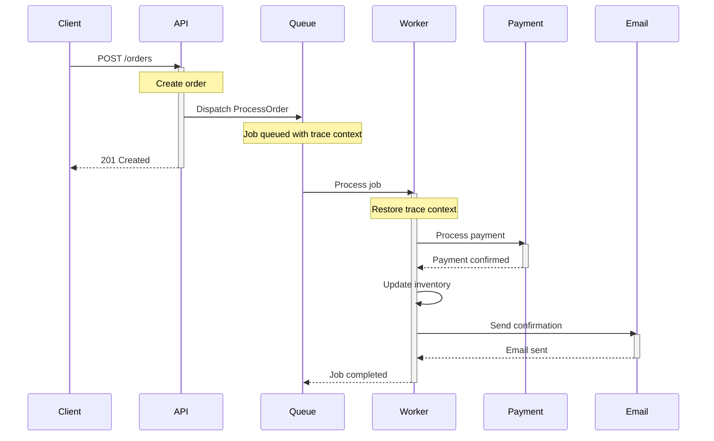

# How to Monitor Laravel Queue Jobs with OpenTelemetry Distributed Tracing

Author: [nawazdhandala](https://www.github.com/nawazdhandala)

Tags: OpenTelemetry, PHP, Laravel, Queue, Jobs, Distributed Tracing

Description: Implement distributed tracing for Laravel queue jobs with OpenTelemetry to track asynchronous operations and debug failures.

Queue jobs run outside the request-response cycle. A user triggers an action, the response returns immediately, and minutes later a job fails silently in the background. Without proper tracing, debugging these failures means digging through logs and guessing at the context.

OpenTelemetry distributed tracing connects queue jobs back to the requests that created them. You see the complete story: what triggered the job, how long it took, what it did, and why it failed.

## The Queue Observability Challenge

Laravel queues are powerful but create observability gaps:

**Delayed execution**: Jobs run seconds or hours after dispatch. By the time they fail, the original request context is long gone.

**Multiple workers**: Jobs execute across different worker processes or even different servers. Correlation becomes difficult.

**Chained jobs**: One job dispatches another, which dispatches another. Without tracing, you can't reconstruct the chain.

**Silent failures**: A job fails, retries three times, and gives up. The user never knows, and you only find out when they complain.

OpenTelemetry solves these problems by creating a continuous trace from the initial request through every queued job, regardless of when or where they execute.

## Setting Up Queue Job Tracing

Install the required OpenTelemetry packages:

```bash
composer require open-telemetry/sdk
composer require open-telemetry/opentelemetry-auto-laravel
```

Create a queue job tracing service in `app/Services/QueueTracing.php`:

```php
<?php

namespace App\Services;

use Illuminate\Queue\Events\JobProcessing;
use Illuminate\Queue\Events\JobProcessed;
use Illuminate\Queue\Events\JobFailed;
use Illuminate\Support\Facades\Queue;
use OpenTelemetry\API\Globals;
use OpenTelemetry\API\Trace\SpanKind;
use OpenTelemetry\API\Trace\StatusCode;
use OpenTelemetry\Context\Context;

class QueueTracing
{
    private $tracer;
    private $activeSpans = [];

    public function __construct()
    {
        $this->tracer = Globals::tracerProvider()->getTracer('laravel-queue');
    }

    /**
     * Register queue event listeners
     */
    public function register(): void
    {
        Queue::before(function (JobProcessing $event) {
            $this->startJobSpan($event);
        });

        Queue::after(function (JobProcessed $event) {
            $this->endJobSpan($event);
        });

        Queue::failing(function (JobFailed $event) {
            $this->recordJobFailure($event);
        });
    }

    /**
     * Create a span when job processing starts
     */
    private function startJobSpan(JobProcessing $event): void
    {
        $jobName = $event->job->resolveName();
        $jobId = $event->job->getJobId();

        // Extract parent context from job payload if available
        $parentContext = $this->extractParentContext($event->job);

        $span = $this->tracer->spanBuilder("queue.job.{$jobName}")
            ->setParent($parentContext)
            ->setSpanKind(SpanKind::KIND_CONSUMER)
            ->startSpan();

        // Add job metadata
        $span->setAttribute('messaging.system', 'laravel-queue');
        $span->setAttribute('messaging.destination', $event->connectionName);
        $span->setAttribute('messaging.operation', 'process');
        $span->setAttribute('job.name', $jobName);
        $span->setAttribute('job.id', $jobId);
        $span->setAttribute('job.queue', $event->job->getQueue());
        $span->setAttribute('job.attempts', $event->job->attempts());
        $span->setAttribute('job.max_tries', $event->job->maxTries());

        // Store span for later retrieval
        $this->activeSpans[$jobId] = [
            'span' => $span,
            'scope' => $span->activate(),
            'start_time' => microtime(true),
        ];
    }

    /**
     * End the span when job processing completes
     */
    private function endJobSpan(JobProcessed $event): void
    {
        $jobId = $event->job->getJobId();

        if (!isset($this->activeSpans[$jobId])) {
            return;
        }

        $spanData = $this->activeSpans[$jobId];
        $span = $spanData['span'];
        $scope = $spanData['scope'];

        // Calculate execution time
        $executionTime = (microtime(true) - $spanData['start_time']) * 1000;
        $span->setAttribute('job.execution_time_ms', $executionTime);

        // Mark if job was slow
        if ($executionTime > 5000) {
            $span->addEvent('slow_job_detected', [
                'threshold_ms' => 5000,
                'actual_ms' => $executionTime,
            ]);
        }

        $span->setStatus(StatusCode::OK);
        $span->end();
        $scope->detach();

        unset($this->activeSpans[$jobId]);
    }

    /**
     * Record job failure in the span
     */
    private function recordJobFailure(JobFailed $event): void
    {
        $jobId = $event->job->getJobId();

        if (!isset($this->activeSpans[$jobId])) {
            // Job failed but we don't have an active span
            // Create a new span to record the failure
            $this->startJobSpan(new JobProcessing($event->connectionName, $event->job));
        }

        $spanData = $this->activeSpans[$jobId];
        $span = $spanData['span'];
        $scope = $spanData['scope'];

        // Record the exception
        $span->recordException($event->exception);
        $span->setStatus(StatusCode::ERROR, $event->exception->getMessage());

        // Add failure metadata
        $span->setAttribute('job.failed', true);
        $span->setAttribute('job.failure_reason', get_class($event->exception));
        $span->setAttribute('job.will_retry', $event->job->attempts() < $event->job->maxTries());

        $span->addEvent('job_failed', [
            'exception_class' => get_class($event->exception),
            'exception_message' => $event->exception->getMessage(),
            'attempts' => $event->job->attempts(),
            'max_tries' => $event->job->maxTries(),
        ]);

        $span->end();
        $scope->detach();

        unset($this->activeSpans[$jobId]);
    }

    /**
     * Extract parent trace context from job payload
     */
    private function extractParentContext($job): ?Context
    {
        $payload = $job->payload();

        // Check if trace context was injected when job was dispatched
        if (isset($payload['tracecontext'])) {
            return Context::restore($payload['tracecontext']);
        }

        return null;
    }
}
```

Register this service in `app/Providers/AppServiceProvider.php`:

```php
<?php

namespace App\Providers;

use Illuminate\Support\ServiceProvider;
use App\Services\QueueTracing;

class AppServiceProvider extends ServiceProvider
{
    public function boot()
    {
        if (config('queue.tracing.enabled', true)) {
            $tracing = new QueueTracing();
            $tracing->register();
        }
    }
}
```

## Propagating Trace Context to Jobs

The critical piece is propagating trace context from the dispatching request to the queued job. Without this, jobs start new traces instead of continuing existing ones.

Create a trait to inject trace context in `app/Jobs/Concerns/PropagatesTraceContext.php`:

```php
<?php

namespace App\Jobs\Concerns;

use OpenTelemetry\API\Globals;
use OpenTelemetry\Context\Context;

trait PropagatesTraceContext
{
    /**
     * Inject current trace context into job payload
     */
    public function middleware(): array
    {
        return [
            function ($job, $next) {
                // Capture current context when job is dispatched
                $context = Context::getCurrent();
                $job->traceContext = Context::storage()->serialize($context);

                return $next($job);
            },
        ];
    }

    /**
     * Restore trace context when job executes
     */
    public function restoreTraceContext(): void
    {
        if (isset($this->traceContext)) {
            Context::storage()->attach(
                Context::storage()->unserialize($this->traceContext)
            );
        }
    }
}
```

Use this trait in your jobs:

```php
<?php

namespace App\Jobs;

use Illuminate\Bus\Queueable;
use Illuminate\Contracts\Queue\ShouldQueue;
use Illuminate\Foundation\Bus\Dispatchable;
use Illuminate\Queue\InteractsWithQueue;
use Illuminate\Queue\SerializesModels;
use App\Jobs\Concerns\PropagatesTraceContext;

class ProcessOrder implements ShouldQueue
{
    use Dispatchable, InteractsWithQueue, Queueable, SerializesModels;
    use PropagatesTraceContext;

    public $tries = 3;
    public $timeout = 120;

    private $orderId;

    public function __construct(int $orderId)
    {
        $this->orderId = $orderId;
    }

    public function handle()
    {
        // Restore trace context from dispatch
        $this->restoreTraceContext();

        $tracer = Globals::tracerProvider()->getTracer('order-processing');

        $span = $tracer->spanBuilder('order.process')
            ->startSpan();

        $scope = $span->activate();

        try {
            $span->setAttribute('order.id', $this->orderId);

            // Process payment
            $this->processPayment();

            // Update inventory
            $this->updateInventory();

            // Send confirmation email
            $this->sendConfirmationEmail();

            $span->addEvent('order_processed_successfully');

        } catch (\Exception $e) {
            $span->recordException($e);
            $span->setStatus(StatusCode::ERROR, $e->getMessage());
            throw $e;
        } finally {
            $span->end();
            $scope->detach();
        }
    }

    private function processPayment()
    {
        $tracer = Globals::tracerProvider()->getTracer('order-processing');
        $span = $tracer->spanBuilder('order.payment')->startSpan();

        // Payment processing logic...

        $span->end();
    }

    private function updateInventory()
    {
        $tracer = Globals::tracerProvider()->getTracer('order-processing');
        $span = $tracer->spanBuilder('order.inventory')->startSpan();

        // Inventory update logic...

        $span->end();
    }

    private function sendConfirmationEmail()
    {
        $tracer = Globals::tracerProvider()->getTracer('order-processing');
        $span = $tracer->spanBuilder('order.email')->startSpan();

        // Email sending logic...

        $span->end();
    }
}
```

Now when you dispatch the job from a controller:

```php
public function store(Request $request)
{
    // Current trace context automatically propagates
    $order = Order::create($request->validated());

    // This job continues the current trace
    ProcessOrder::dispatch($order->id);

    return response()->json(['order_id' => $order->id]);
}
```

The trace shows the complete flow:



## Tracing Job Chains and Batches

Laravel allows chaining jobs and processing batches. Trace these complex workflows.

```php
<?php

namespace App\Jobs;

use Illuminate\Bus\Queueable;
use Illuminate\Contracts\Queue\ShouldQueue;
use Illuminate\Foundation\Bus\Dispatchable;
use Illuminate\Queue\InteractsWithQueue;
use App\Jobs\Concerns\PropagatesTraceContext;
use OpenTelemetry\API\Globals;

class ImportUsers implements ShouldQueue
{
    use Dispatchable, InteractsWithQueue, Queueable;
    use PropagatesTraceContext;

    private $filePath;

    public function __construct(string $filePath)
    {
        $this->filePath = $filePath;
    }

    public function handle()
    {
        $this->restoreTraceContext();

        $tracer = Globals::tracerProvider()->getTracer('import');

        $span = $tracer->spanBuilder('import.users')
            ->startSpan();

        $scope = $span->activate();

        try {
            $users = $this->parseFile();

            $span->setAttribute('import.file', $this->filePath);
            $span->setAttribute('import.user_count', count($users));

            // Chain jobs for each user batch
            $chunks = array_chunk($users, 100);

            $span->setAttribute('import.batch_count', count($chunks));

            foreach ($chunks as $index => $chunk) {
                ProcessUserBatch::dispatch($chunk, $index)
                    ->chain([
                        new SendImportNotification($index, count($chunk)),
                    ]);
            }

            $span->addEvent('import_jobs_dispatched', [
                'batches' => count($chunks),
                'total_users' => count($users),
            ]);

        } finally {
            $span->end();
            $scope->detach();
        }
    }

    private function parseFile(): array
    {
        // File parsing logic...
        return [];
    }
}

class ProcessUserBatch implements ShouldQueue
{
    use Dispatchable, InteractsWithQueue, Queueable;
    use PropagatesTraceContext;

    private $users;
    private $batchIndex;

    public function __construct(array $users, int $batchIndex)
    {
        $this->users = $users;
        $this->batchIndex = $batchIndex;
    }

    public function handle()
    {
        $this->restoreTraceContext();

        $tracer = Globals::tracerProvider()->getTracer('import');

        $span = $tracer->spanBuilder('import.batch.process')
            ->startSpan();

        $scope = $span->activate();

        try {
            $span->setAttribute('batch.index', $this->batchIndex);
            $span->setAttribute('batch.size', count($this->users));

            foreach ($this->users as $userData) {
                $this->createUser($userData);
            }

            $span->addEvent('batch_processed');

        } finally {
            $span->end();
            $scope->detach();
        }
    }

    private function createUser(array $userData): void
    {
        // User creation logic...
    }
}
```

Use Laravel's batch functionality with tracing:

```php
use Illuminate\Bus\Batch;
use Illuminate\Support\Facades\Bus;

public function importLargeDataset()
{
    $tracer = Globals::tracerProvider()->getTracer('import');

    $span = $tracer->spanBuilder('import.batch_dispatch')
        ->startSpan();

    $scope = $span->activate();

    try {
        $jobs = [];

        for ($i = 0; $i < 100; $i++) {
            $jobs[] = new ProcessDataChunk($i);
        }

        $batch = Bus::batch($jobs)
            ->then(function (Batch $batch) use ($span) {
                $span->addEvent('batch_completed', [
                    'total_jobs' => $batch->totalJobs,
                    'processed_jobs' => $batch->processedJobs(),
                ]);
            })
            ->catch(function (Batch $batch, \Throwable $e) use ($span) {
                $span->recordException($e);
                $span->addEvent('batch_failed', [
                    'failed_jobs' => $batch->failedJobs,
                ]);
            })
            ->finally(function (Batch $batch) {
                // Cleanup logic...
            })
            ->dispatch();

        $span->setAttribute('batch.id', $batch->id);
        $span->setAttribute('batch.job_count', count($jobs));

    } finally {
        $span->end();
        $scope->detach();
    }
}
```

## Monitoring Job Retry Behavior

Jobs fail and retry. Track this behavior to understand reliability.

```php
<?php

namespace App\Jobs;

use Illuminate\Bus\Queueable;
use Illuminate\Contracts\Queue\ShouldQueue;
use Illuminate\Queue\InteractsWithQueue;
use App\Jobs\Concerns\PropagatesTraceContext;
use OpenTelemetry\API\Globals;

class SendEmailNotification implements ShouldQueue
{
    use InteractsWithQueue, Queueable;
    use PropagatesTraceContext;

    public $tries = 5;
    public $backoff = [60, 300, 900, 3600]; // Exponential backoff

    private $userId;
    private $message;

    public function __construct(int $userId, string $message)
    {
        $this->userId = $userId;
        $this->message = $message;
    }

    public function handle()
    {
        $this->restoreTraceContext();

        $tracer = Globals::tracerProvider()->getTracer('notifications');

        $span = $tracer->spanBuilder('notification.send_email')
            ->startSpan();

        $scope = $span->activate();

        try {
            $attempt = $this->attempts();

            $span->setAttribute('notification.user_id', $this->userId);
            $span->setAttribute('notification.attempt', $attempt);
            $span->setAttribute('notification.max_tries', $this->tries);

            // Record retry information
            if ($attempt > 1) {
                $span->addEvent('job_retry', [
                    'attempt' => $attempt,
                    'backoff_seconds' => $this->backoff[$attempt - 2] ?? 0,
                    'reason' => 'Previous attempt failed',
                ]);
            }

            // Simulate email sending
            if (rand(1, 10) <= 3 && $attempt < 3) {
                throw new \Exception('Email service temporarily unavailable');
            }

            // Success
            $span->addEvent('email_sent_successfully');

        } catch (\Exception $e) {
            $span->recordException($e);

            // Determine if we'll retry
            $willRetry = $this->attempts() < $this->tries;

            $span->setAttribute('notification.will_retry', $willRetry);

            if ($willRetry) {
                $nextBackoff = $this->backoff[$this->attempts() - 1] ?? end($this->backoff);
                $span->addEvent('scheduling_retry', [
                    'next_attempt' => $this->attempts() + 1,
                    'backoff_seconds' => $nextBackoff,
                ]);

                // Release job back to queue with backoff
                $this->release($nextBackoff);
            } else {
                $span->addEvent('max_retries_exceeded');
                $span->setStatus(StatusCode::ERROR, 'Max retries exceeded');
                $this->fail($e);
            }

        } finally {
            $span->end();
            $scope->detach();
        }
    }

    /**
     * Handle job failure after max retries
     */
    public function failed(\Throwable $exception)
    {
        $tracer = Globals::tracerProvider()->getTracer('notifications');

        $span = $tracer->spanBuilder('notification.permanent_failure')
            ->startSpan();

        $span->setAttribute('notification.user_id', $this->userId);
        $span->setAttribute('notification.total_attempts', $this->tries);
        $span->recordException($exception);

        // Log permanent failure, alert team, etc.

        $span->end();
    }
}
```

## Creating Custom Span Events for Job Milestones

Add granular events within long-running jobs:

```php
<?php

namespace App\Jobs;

use Illuminate\Bus\Queueable;
use Illuminate\Contracts\Queue\ShouldQueue;
use App\Jobs\Concerns\PropagatesTraceContext;
use OpenTelemetry\API\Globals;

class GenerateMonthlyReport implements ShouldQueue
{
    use Queueable;
    use PropagatesTraceContext;

    public $timeout = 600; // 10 minutes

    public function handle()
    {
        $this->restoreTraceContext();

        $tracer = Globals::tracerProvider()->getTracer('reports');

        $span = $tracer->spanBuilder('report.generate_monthly')
            ->startSpan();

        $scope = $span->activate();

        try {
            // Fetch data
            $span->addEvent('fetching_data', ['source' => 'database']);
            $data = $this->fetchMonthlyData();
            $span->addEvent('data_fetched', ['rows' => count($data)]);

            // Process data
            $span->addEvent('processing_data');
            $processed = $this->processData($data);
            $span->addEvent('data_processed', ['records' => count($processed)]);

            // Generate charts
            $span->addEvent('generating_charts');
            $charts = $this->generateCharts($processed);
            $span->addEvent('charts_generated', ['count' => count($charts)]);

            // Create PDF
            $span->addEvent('creating_pdf');
            $pdfPath = $this->createPDF($processed, $charts);
            $span->addEvent('pdf_created', ['path' => $pdfPath]);

            // Upload to storage
            $span->addEvent('uploading_to_storage');
            $url = $this->uploadToStorage($pdfPath);
            $span->addEvent('upload_completed', ['url' => $url]);

            // Send notification
            $span->addEvent('sending_notification');
            $this->sendNotification($url);
            $span->addEvent('notification_sent');

            $span->setAttribute('report.success', true);

        } catch (\Exception $e) {
            $span->recordException($e);
            $span->setStatus(StatusCode::ERROR, $e->getMessage());
            throw $e;
        } finally {
            $span->end();
            $scope->detach();
        }
    }

    private function fetchMonthlyData(): array
    {
        return [];
    }

    private function processData(array $data): array
    {
        return [];
    }

    private function generateCharts(array $data): array
    {
        return [];
    }

    private function createPDF(array $data, array $charts): string
    {
        return '/tmp/report.pdf';
    }

    private function uploadToStorage(string $path): string
    {
        return 'https://storage.example.com/reports/monthly.pdf';
    }

    private function sendNotification(string $url): void
    {
        // Send notification...
    }
}
```

## Dashboard Metrics from Job Traces

Aggregate trace data to build queue performance dashboards:

**Job throughput**: Jobs processed per minute
**Job latency**: Time from dispatch to completion
**Failure rate**: Percentage of jobs that fail
**Retry rate**: Percentage of jobs that retry
**Queue depth**: Number of pending jobs

Create a scheduled command to export these metrics:

```php
<?php

namespace App\Console\Commands;

use Illuminate\Console\Command;
use Illuminate\Support\Facades\Redis;
use OpenTelemetry\API\Globals;
use OpenTelemetry\API\Metrics\ObserverInterface;

class ExportQueueMetrics extends Command
{
    protected $signature = 'metrics:queue';
    protected $description = 'Export queue metrics to OpenTelemetry';

    public function handle()
    {
        $meter = Globals::meterProvider()->getMeter('laravel-queue');

        // Queue depth gauge
        $queueDepth = $meter->createObservableGauge('queue.depth');
        $queueDepth->observe(function (ObserverInterface $observer) {
            $queues = ['default', 'high', 'low'];

            foreach ($queues as $queue) {
                $depth = Redis::llen("queues:{$queue}");
                $observer->observe($depth, ['queue' => $queue]);
            }
        });

        // Job processing rate counter
        $processedJobs = $meter->createCounter('queue.jobs.processed');

        // Job failure rate counter
        $failedJobs = $meter->createCounter('queue.jobs.failed');

        // Job duration histogram
        $jobDuration = $meter->createHistogram('queue.job.duration');
    }
}
```

Queue job tracing with OpenTelemetry connects asynchronous operations back to their origins. You see the complete distributed flow, understand why jobs fail, and optimize retry behavior based on real execution patterns.
