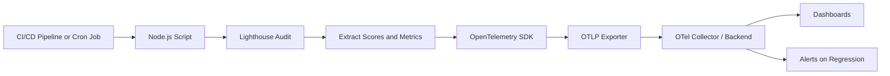

# How to Monitor Lighthouse Scores Programmatically with OpenTelemetry

Author: [nawazdhandala](https://www.github.com/nawazdhandala)

Tags: OpenTelemetry, Lighthouse, Performance, Web Vitals, CI/CD, Monitoring, Automation

Description: Learn how to run Lighthouse audits programmatically, export scores as OpenTelemetry metrics and traces, and set up continuous performance monitoring with alerting on regressions.

---

Lighthouse gives you a snapshot of your web application's performance, accessibility, SEO, and best practices scores. Running it manually in Chrome DevTools is fine for one-off checks, but it does not scale. You need to track these scores over time, across deployments, and for every critical page in your application.

By running Lighthouse programmatically and exporting the results as OpenTelemetry metrics, you turn a manual audit tool into a continuous monitoring system. Scores become time series data. Regressions trigger alerts. Every deployment gets a performance grade that lives alongside your existing traces and metrics.

## The Approach

The plan is to run Lighthouse from Node.js, extract the scores and detailed timing data, and push everything into your OpenTelemetry backend as metrics and traces:



## Setting Up the Project

Install the required dependencies:

```bash
npm install lighthouse chrome-launcher \
  @opentelemetry/api \
  @opentelemetry/sdk-node \
  @opentelemetry/sdk-metrics \
  @opentelemetry/sdk-trace-node \
  @opentelemetry/exporter-metrics-otlp-http \
  @opentelemetry/exporter-trace-otlp-http \
  @opentelemetry/resources \
  @opentelemetry/semantic-conventions
```

## Configuring the OpenTelemetry SDK

Set up both metrics and traces. Metrics track scores over time, while traces capture the detailed breakdown of each audit run:

```javascript
// src/otel-setup.js
const { NodeSDK } = require('@opentelemetry/sdk-node');
const { OTLPTraceExporter } = require('@opentelemetry/exporter-trace-otlp-http');
const { OTLPMetricExporter } = require('@opentelemetry/exporter-metrics-otlp-http');
const { PeriodicExportingMetricReader } = require('@opentelemetry/sdk-metrics');
const { Resource } = require('@opentelemetry/resources');
const { ATTR_SERVICE_NAME } = require('@opentelemetry/semantic-conventions');
const { trace, metrics } = require('@opentelemetry/api');

// Create a resource that identifies this as a Lighthouse monitor
const resource = new Resource({
  [ATTR_SERVICE_NAME]: 'lighthouse-monitor',
  'deployment.environment': process.env.ENVIRONMENT || 'production',
});

const sdk = new NodeSDK({
  resource,
  traceExporter: new OTLPTraceExporter({
    url: process.env.OTEL_EXPORTER_OTLP_ENDPOINT + '/v1/traces',
  }),
  metricReader: new PeriodicExportingMetricReader({
    exporter: new OTLPMetricExporter({
      url: process.env.OTEL_EXPORTER_OTLP_ENDPOINT + '/v1/metrics',
    }),
    // Export every 30 seconds
    exportIntervalMillis: 30000,
  }),
});

sdk.start();

// Export helpers for use in the audit script
const tracer = trace.getTracer('lighthouse-auditor', '1.0.0');
const meter = metrics.getMeter('lighthouse-metrics', '1.0.0');

module.exports = { sdk, tracer, meter };
```

This gives you both a tracer for detailed audit spans and a meter for recording scores as metric data points.

## Running Lighthouse Programmatically

The core audit function launches Chrome, runs Lighthouse, and returns the results:

```javascript
// src/lighthouse-runner.js
const lighthouse = require('lighthouse');
const chromeLauncher = require('chrome-launcher');

async function runLighthouseAudit(url, options = {}) {
  // Launch a headless Chrome instance
  const chrome = await chromeLauncher.launch({
    chromeFlags: [
      '--headless',
      '--no-sandbox',
      '--disable-gpu',
    ],
  });

  // Configure Lighthouse options
  const lighthouseOptions = {
    logLevel: 'error',
    output: 'json',
    port: chrome.port,
    // Use mobile configuration by default
    formFactor: options.formFactor || 'mobile',
    // Simulate throttled network and CPU
    throttling: options.throttling || {
      cpuSlowdownMultiplier: 4,
      downloadThroughputKbps: 1600,
      uploadThroughputKbps: 750,
      rttMs: 150,
    },
    // Only run specific categories if specified
    onlyCategories: options.categories || [
      'performance',
      'accessibility',
      'best-practices',
      'seo',
    ],
  };

  try {
    // Run the audit
    const result = await lighthouse(url, lighthouseOptions);
    return result.lhr; // Lighthouse Result object
  } finally {
    // Always close Chrome, even if the audit fails
    await chrome.kill();
  }
}

module.exports = { runLighthouseAudit };
```

The `lhr` object contains everything: category scores, individual audit results, timing data, and diagnostic information. It is a goldmine of performance data that we will extract and send to OpenTelemetry.

## Extracting and Exporting Scores as Metrics

Create gauges for each Lighthouse category score and record them after every audit:

```javascript
// src/metrics-recorder.js
const { meter } = require('./otel-setup');

// Create gauge instruments for each Lighthouse category
// Scores range from 0 to 100
const performanceScore = meter.createGauge('lighthouse.score.performance', {
  description: 'Lighthouse performance score (0-100)',
  unit: 'score',
});

const accessibilityScore = meter.createGauge('lighthouse.score.accessibility', {
  description: 'Lighthouse accessibility score (0-100)',
  unit: 'score',
});

const bestPracticesScore = meter.createGauge('lighthouse.score.best_practices', {
  description: 'Lighthouse best practices score (0-100)',
  unit: 'score',
});

const seoScore = meter.createGauge('lighthouse.score.seo', {
  description: 'Lighthouse SEO score (0-100)',
  unit: 'score',
});

// Create gauges for Core Web Vitals
const lcpGauge = meter.createGauge('lighthouse.lcp_ms', {
  description: 'Largest Contentful Paint in milliseconds',
  unit: 'ms',
});

const clsGauge = meter.createGauge('lighthouse.cls', {
  description: 'Cumulative Layout Shift score',
});

const tbtGauge = meter.createGauge('lighthouse.tbt_ms', {
  description: 'Total Blocking Time in milliseconds',
  unit: 'ms',
});

const fcpGauge = meter.createGauge('lighthouse.fcp_ms', {
  description: 'First Contentful Paint in milliseconds',
  unit: 'ms',
});

const siGauge = meter.createGauge('lighthouse.si_ms', {
  description: 'Speed Index in milliseconds',
  unit: 'ms',
});

function recordScores(lhr, url, additionalAttributes = {}) {
  // Common attributes for all metrics from this audit
  const attributes = {
    'lighthouse.url': url,
    'lighthouse.form_factor': lhr.configSettings.formFactor,
    'lighthouse.version': lhr.lighthouseVersion,
    ...additionalAttributes,
  };

  // Record category scores (multiply by 100 for percentage)
  const categories = lhr.categories;

  if (categories.performance) {
    performanceScore.record(categories.performance.score * 100, attributes);
  }
  if (categories.accessibility) {
    accessibilityScore.record(categories.accessibility.score * 100, attributes);
  }
  if (categories['best-practices']) {
    bestPracticesScore.record(categories['best-practices'].score * 100, attributes);
  }
  if (categories.seo) {
    seoScore.record(categories.seo.score * 100, attributes);
  }

  // Record Core Web Vitals from audit results
  const audits = lhr.audits;

  if (audits['largest-contentful-paint']) {
    lcpGauge.record(audits['largest-contentful-paint'].numericValue, attributes);
  }
  if (audits['cumulative-layout-shift']) {
    clsGauge.record(audits['cumulative-layout-shift'].numericValue, attributes);
  }
  if (audits['total-blocking-time']) {
    tbtGauge.record(audits['total-blocking-time'].numericValue, attributes);
  }
  if (audits['first-contentful-paint']) {
    fcpGauge.record(audits['first-contentful-paint'].numericValue, attributes);
  }
  if (audits['speed-index']) {
    siGauge.record(audits['speed-index'].numericValue, attributes);
  }
}

module.exports = { recordScores };
```

Each metric is tagged with the URL and form factor, so you can track scores for different pages and device types independently. The Core Web Vitals (LCP, CLS, TBT) are especially important because they directly impact search rankings and user experience.

## Creating Detailed Trace Spans

Metrics give you the numbers, but traces give you the story of each audit run. Create spans that capture the full breakdown:

```javascript
// src/trace-recorder.js
const { tracer } = require('./otel-setup');
const { SpanStatusCode } = require('@opentelemetry/api');

async function recordAuditTrace(url, lhr, auditDurationMs) {
  // Create a parent span for the entire audit
  const rootSpan = tracer.startSpan('lighthouse.audit', {
    attributes: {
      'lighthouse.url': url,
      'lighthouse.version': lhr.lighthouseVersion,
      'lighthouse.form_factor': lhr.configSettings.formFactor,
      'lighthouse.total_duration_ms': auditDurationMs,
    },
  });

  // Add category scores as span attributes
  Object.entries(lhr.categories).forEach(([key, category]) => {
    rootSpan.setAttribute(
      `lighthouse.category.${key}`,
      Math.round(category.score * 100)
    );
  });

  // Create child spans for each Core Web Vital
  const vitals = [
    'largest-contentful-paint',
    'cumulative-layout-shift',
    'total-blocking-time',
    'first-contentful-paint',
    'speed-index',
    'interactive',
  ];

  vitals.forEach((auditId) => {
    const audit = lhr.audits[auditId];
    if (!audit) return;

    const vitalSpan = tracer.startSpan(`lighthouse.vital.${auditId}`, {
      attributes: {
        'lighthouse.audit_id': auditId,
        'lighthouse.display_value': audit.displayValue || '',
        'lighthouse.numeric_value': audit.numericValue || 0,
        'lighthouse.score': audit.score !== null ? audit.score : -1,
      },
    });

    // Mark as error if the vital fails (score below 0.5)
    if (audit.score !== null && audit.score < 0.5) {
      vitalSpan.setStatus({
        code: SpanStatusCode.ERROR,
        message: `${auditId} score ${audit.score} below threshold`,
      });
    } else {
      vitalSpan.setStatus({ code: SpanStatusCode.OK });
    }

    vitalSpan.end();
  });

  // Record failed audits as span events for quick diagnosis
  Object.entries(lhr.audits).forEach(([auditId, audit]) => {
    if (audit.score !== null && audit.score === 0) {
      rootSpan.addEvent('failed_audit', {
        'audit.id': auditId,
        'audit.title': audit.title,
        'audit.description': audit.description?.substring(0, 200) || '',
      });
    }
  });

  rootSpan.setStatus({ code: SpanStatusCode.OK });
  rootSpan.end();
}

module.exports = { recordAuditTrace };
```

The trace structure gives you a parent span for the overall audit and child spans for each Core Web Vital. Failed audits (score of 0) are recorded as events on the parent span, making them easy to spot when browsing traces.

## The Main Audit Script

Bring everything together in a script that audits multiple pages:

```javascript
// src/audit.js
const { runLighthouseAudit } = require('./lighthouse-runner');
const { recordScores } = require('./metrics-recorder');
const { recordAuditTrace } = require('./trace-recorder');
const { sdk } = require('./otel-setup');

// Pages to audit - configure these for your application
const PAGES_TO_AUDIT = [
  { url: 'https://example.com/', name: 'homepage' },
  { url: 'https://example.com/pricing', name: 'pricing' },
  { url: 'https://example.com/docs', name: 'docs' },
  { url: 'https://example.com/dashboard', name: 'dashboard' },
];

async function runAllAudits() {
  console.log(`Starting Lighthouse audits for ${PAGES_TO_AUDIT.length} pages`);

  for (const page of PAGES_TO_AUDIT) {
    console.log(`Auditing ${page.name}: ${page.url}`);
    const startTime = Date.now();

    try {
      // Run the Lighthouse audit
      const lhr = await runLighthouseAudit(page.url);
      const duration = Date.now() - startTime;

      // Record metrics (scores and web vitals)
      recordScores(lhr, page.url, { 'page.name': page.name });

      // Record detailed trace
      await recordAuditTrace(page.url, lhr, duration);

      // Log a summary to the console
      const perf = Math.round(lhr.categories.performance.score * 100);
      const a11y = Math.round(lhr.categories.accessibility.score * 100);
      console.log(`  Performance: ${perf}, Accessibility: ${a11y} (${duration}ms)`);

    } catch (error) {
      console.error(`  Failed to audit ${page.url}: ${error.message}`);
    }
  }

  // Give the SDK time to flush all pending data
  await sdk.shutdown();
  console.log('All audits complete and data exported');
}

runAllAudits().catch(console.error);
```

Run audits sequentially rather than in parallel. Each Lighthouse audit launches its own Chrome instance and needs significant CPU and memory. Running them concurrently would skew the results because they would compete for resources.

## Running in CI/CD

Add the audit to your deployment pipeline so every release gets a performance score:

```yaml
# .github/workflows/lighthouse.yml
name: Lighthouse Audit
on:
  deployment_status:
    # Run after successful deployments
  schedule:
    # Also run every 6 hours to catch regressions
    - cron: '0 */6 * * *'

jobs:
  audit:
    runs-on: ubuntu-latest
    steps:
      - uses: actions/checkout@v4

      - uses: actions/setup-node@v4
        with:
          node-version: '20'

      - name: Install dependencies
        run: npm ci

      - name: Run Lighthouse audits
        env:
          OTEL_EXPORTER_OTLP_ENDPOINT: ${{ secrets.OTEL_ENDPOINT }}
          ENVIRONMENT: production
          # Pass the deployment SHA for correlation
          DEPLOYMENT_SHA: ${{ github.sha }}
        run: node src/audit.js
```

The combination of post-deployment and scheduled runs gives you two things. Post-deployment runs catch regressions immediately. Scheduled runs detect gradual degradation that might not show up in a single deployment diff.

## Setting Up Alerts

With Lighthouse scores flowing into your observability backend as metrics, set up alerts for the conditions that matter most:

- **Performance score drops below 80**: This is Google's threshold for a "good" performance score. Dropping below it can impact search rankings.
- **LCP exceeds 2.5 seconds**: The Core Web Vitals threshold for a good LCP. Beyond this, users perceive the page as slow.
- **CLS exceeds 0.1**: Layout shift above this value causes a frustrating visual experience.
- **TBT exceeds 200ms**: High total blocking time means the main thread is busy and the page feels unresponsive.
- **Score drops more than 10 points between runs**: A sudden regression likely means a recent deployment introduced a performance problem.

## Comparing Scores Across Deployments

Tag your metrics with the deployment commit SHA to compare scores across versions:

```javascript
// Add to your audit script
const deploymentAttributes = {
  'deployment.sha': process.env.DEPLOYMENT_SHA || 'unknown',
  'deployment.environment': process.env.ENVIRONMENT || 'local',
  'deployment.timestamp': new Date().toISOString(),
};

// Pass these when recording scores
recordScores(lhr, page.url, {
  'page.name': page.name,
  ...deploymentAttributes,
});
```

This lets you build a dashboard that shows performance scores over time with deployment markers. When a score drops, you can see exactly which commit caused the regression.

## Wrapping Up

Running Lighthouse manually tells you where you are right now. Running Lighthouse programmatically with OpenTelemetry tells you where you have been, where you are, and when something goes wrong. By exporting scores as metrics and audit details as traces, you integrate web performance monitoring into the same observability pipeline that handles your server metrics, application traces, and error tracking.

The most impactful setup is the CI/CD integration. Every deployment gets a performance report. Every regression gets caught before it impacts users for long. Combined with scheduled runs, you have continuous visibility into the performance characteristics that matter most for both user experience and search engine ranking.
