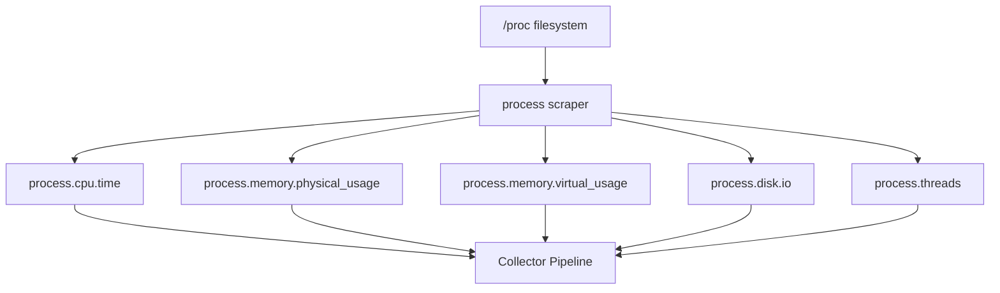

# How to Monitor Linux Process Metrics with the OpenTelemetry Collector

Author: [nawazdhandala](https://www.github.com/nawazdhandala)

Tags: OpenTelemetry, Collector, Linux, Process Metrics, Monitoring, Infrastructure, Observability

Description: Learn how to monitor Linux process-level metrics like CPU usage, memory consumption, and thread counts using the OpenTelemetry Collector's process scraper.

---

Server-level CPU and memory metrics tell you that something is wrong, but they do not tell you which process is causing the problem. Was it the database eating all the memory? Did a background job spike the CPU? Process-level metrics fill this gap by breaking down resource consumption per process, giving you the granularity needed to pinpoint the source of issues.

The OpenTelemetry Collector provides a `process` scraper within the hostmetrics receiver that collects per-process metrics on Linux systems. This guide covers how to configure it, filter for specific processes, and handle the permissions needed to read process-level data from `/proc`.

## What the Process Scraper Collects

The process scraper reads from the Linux `/proc` filesystem to gather per-process statistics. Each scrape produces metrics tagged with the process name, PID, executable path, and command line arguments.

The key metrics include:

- **process.cpu.time**: Cumulative CPU time consumed by the process, split by user and system
- **process.memory.physical_usage**: Resident set size (RSS) of the process in bytes
- **process.memory.virtual_usage**: Virtual memory size of the process
- **process.disk.io**: Bytes read and written by the process
- **process.threads**: Number of threads in the process

These metrics follow OpenTelemetry semantic conventions and carry resource attributes that identify each process uniquely.



## Basic Configuration

To enable process metric collection, add the `process` scraper to the hostmetrics receiver:

```yaml
# otel-collector-config.yaml
receivers:
  hostmetrics:
    collection_interval: 30s
    scrapers:
      # Enable per-process metric collection
      process:
        # Include metrics for all running processes
        metrics:
          process.cpu.time:
            enabled: true
          process.memory.physical_usage:
            enabled: true
          process.memory.virtual_usage:
            enabled: true
          process.disk.io:
            enabled: true
          process.threads:
            enabled: true

processors:
  batch:
    timeout: 10s

exporters:
  otlp:
    endpoint: "otel-backend.example.com:4317"

service:
  pipelines:
    metrics:
      receivers: [hostmetrics]
      processors: [batch]
      exporters: [otlp]
```

With this configuration, the collector scrapes metrics for every running process on the host every 30 seconds. On a typical Linux server with hundreds of active processes, this can produce a significant number of time series. The next section covers how to filter this down.

## Filtering by Process Name

Most of the time, you only care about a handful of processes: your application servers, databases, and critical system services. The process scraper supports include and exclude filters based on process name, executable path, or command line.

```yaml
receivers:
  hostmetrics:
    collection_interval: 30s
    scrapers:
      process:
        # Only collect metrics for these specific processes
        include:
          names: ["nginx", "postgres", "redis-server", "node", "python3"]
          match_type: strict
        # Alternatively, use regex for more flexible matching
        # include:
        #   names: ["java.*", "python.*", "node"]
        #   match_type: regexp
```

Strict matching requires the process name to match exactly. Regexp matching lets you use regular expressions for broader patterns. For example, `java.*` catches both `java` and `javac`, while `python.*` matches `python3`, `python3.11`, and any other Python variant.

You can also filter by executable path if process names are ambiguous:

```yaml
receivers:
  hostmetrics:
    collection_interval: 30s
    scrapers:
      process:
        include:
          names: ["java"]
          match_type: strict
        # Mute metrics for processes we know are irrelevant
        mute_process_name_error: true
        mute_process_exe_error: true
        mute_process_io_error: true
```

The `mute_*_error` options suppress log warnings when the collector cannot read certain process attributes. This is common for short-lived processes that exit between the time the collector enumerates them and the time it tries to read their `/proc` entries.

## Permissions and Running as Root

Reading process metrics from `/proc` requires appropriate permissions. By default, a non-root user can only read metrics for processes it owns. To collect metrics for all processes on the host, the collector needs elevated permissions.

The recommended approach is to use Linux capabilities instead of running the entire collector as root:

```bash
# Grant the collector binary the ability to read all process information
sudo setcap cap_sys_ptrace,cap_dac_read_search=ep /usr/bin/otelcol-contrib
```

The `cap_sys_ptrace` capability allows the collector to read `/proc/[pid]/io` for any process, while `cap_dac_read_search` grants read access to `/proc/[pid]/exe` and other restricted files.

If you are running the collector via systemd, you can also configure capabilities in the service file:

```ini
# /etc/systemd/system/otelcol-contrib.service.d/capabilities.conf
[Service]
# Grant process reading capabilities without running as root
AmbientCapabilities=CAP_SYS_PTRACE CAP_DAC_READ_SEARCH
CapabilityBoundingSet=CAP_SYS_PTRACE CAP_DAC_READ_SEARCH
```

After modifying the systemd configuration, reload and restart the service:

```bash
# Reload systemd and restart the collector with new capabilities
sudo systemctl daemon-reload
sudo systemctl restart otelcol-contrib
```

## Enriching Process Metrics with Resource Attributes

Raw process metrics tagged only with PID and process name can be hard to correlate. Adding host-level resource attributes and custom labels makes the data more useful for querying and alerting.

```yaml
processors:
  # Attach host identity to all metrics
  resourcedetection:
    detectors: [system]
    system:
      hostname_sources: ["os"]
      resource_attributes:
        host.name:
          enabled: true
        os.type:
          enabled: true

  # Add custom attributes to help identify process roles
  attributes:
    actions:
      - key: environment
        value: production
        action: upsert
      - key: team
        value: platform
        action: upsert

  batch:
    timeout: 10s

service:
  pipelines:
    metrics:
      receivers: [hostmetrics]
      processors: [resourcedetection, attributes, batch]
      exporters: [otlp]
```

With these processors in the pipeline, every process metric carries the hostname, OS type, environment, and team labels. This makes it easy to build dashboards that group processes by host and filter by environment.

## Monitoring Containerized Processes

When the collector runs on a host that also runs containers, the process scraper picks up all processes, including those inside containers. Container processes typically appear with names like the main binary inside the container (e.g., `nginx`, `java`, `python`).

To collect process metrics from within containers accurately, mount the host's `/proc` filesystem and set the `root_path`:

```yaml
# Docker Compose configuration for process monitoring
services:
  otel-collector:
    image: otel/opentelemetry-collector-contrib:0.96.0
    pid: host
    volumes:
      # Mount host proc for process visibility
      - /proc:/hostfs/proc:ro
      - /sys:/hostfs/sys:ro
    environment:
      - HOST_PROC=/hostfs/proc
```

The `pid: host` setting is important. It places the collector in the host PID namespace, allowing it to see all processes on the host rather than only processes in its own container namespace.

In the collector config:

```yaml
receivers:
  hostmetrics:
    # Point to the mounted host filesystem
    root_path: /hostfs
    collection_interval: 30s
    scrapers:
      process:
        include:
          names: ["nginx", "postgres", "java", "python3"]
          match_type: strict
```

## Building Alerts on Process Metrics

Process metrics are most valuable when they drive alerts. Here are some common alerting patterns to consider once the data reaches your backend:

**High process CPU usage**: Alert when a single process consistently uses more than 90% of a CPU core. The metric `process.cpu.time` is cumulative, so you need to compute the rate of change and compare it against the scrape interval.

**Memory growth (potential leak)**: Track `process.memory.physical_usage` over time. If a process shows a steady upward trend without corresponding workload increase, it may have a memory leak.

**Process disappearance**: If a process you expect to be running (like your primary application server) stops appearing in the metrics, that signals a crash or unexpected shutdown.

**Thread count explosion**: A sudden spike in `process.threads` often indicates a thread leak or runaway connection handling. Set thresholds based on your application's normal operating range.

## Reducing Cardinality

On busy hosts, hundreds of processes generate thousands of time series. If your backend charges by time series or you are hitting storage limits, consider these strategies:

First, use strict include filters to only monitor the processes you care about. Second, disable metrics you do not need. If you only care about CPU and memory, turn off disk I/O and thread count metrics. Third, increase the collection interval for process metrics. A 60-second interval is often sufficient for trend analysis while halving the data volume compared to 30 seconds.

```yaml
receivers:
  hostmetrics:
    # Longer interval to reduce data volume
    collection_interval: 60s
    scrapers:
      process:
        include:
          names: ["nginx", "postgres", "java"]
          match_type: strict
        metrics:
          # Only collect the metrics we actually alert on
          process.cpu.time:
            enabled: true
          process.memory.physical_usage:
            enabled: true
          process.memory.virtual_usage:
            enabled: false
          process.disk.io:
            enabled: false
          process.threads:
            enabled: false
```

## Wrap Up

Process-level metrics bridge the gap between host-level overviews and application-level telemetry. By configuring the process scraper in the hostmetrics receiver, you gain visibility into which processes consume resources, how they trend over time, and when they behave unexpectedly. Combined with proper filtering, Linux capabilities for permissions, and resource attribute enrichment, the OpenTelemetry Collector provides a clean, standardized approach to process monitoring that integrates with the rest of your observability stack.
