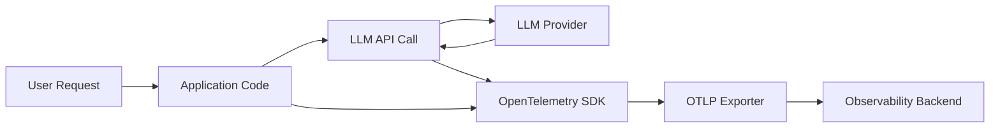

# How to Monitor LLM Applications with OpenTelemetry GenAI Semantic Conventions

Author: [nawazdhandala](https://www.github.com/nawazdhandala)

Tags: OpenTelemetry, LLM, GenAI, Semantic Conventions, Observability, AI Monitoring, Python

Description: Learn how to monitor LLM applications using OpenTelemetry's GenAI semantic conventions, including tracing prompts, completions, token usage, and model performance in production.

---

Large language models are becoming core infrastructure in modern applications. They power chatbots, summarization engines, code assistants, and search systems. But running LLMs in production introduces problems that traditional monitoring can't solve. You need to track prompt latency, token consumption, model errors, and response quality - all in a standardized way.

OpenTelemetry introduced GenAI semantic conventions specifically for this purpose. These conventions define a standard vocabulary for describing generative AI operations, so your telemetry data is consistent regardless of which LLM provider you use. In this guide, we'll walk through how to set up monitoring for LLM applications using these conventions.

---

## What Are GenAI Semantic Conventions?

OpenTelemetry semantic conventions are agreed-upon attribute names and values that describe specific types of operations. The GenAI semantic conventions extend this to cover generative AI workloads. They standardize how you record things like:

- The model being called (e.g., `gpt-4o`, `claude-sonnet-4-20250514`)
- The type of operation (chat, embedding, text completion)
- Token counts for input and output
- The system or provider being used
- Request and response content

The key namespace is `gen_ai.*`, and it includes attributes like `gen_ai.system`, `gen_ai.request.model`, `gen_ai.usage.input_tokens`, and `gen_ai.usage.output_tokens`.

Here is how the data flow looks when monitoring an LLM application:



---

## Setting Up the OpenTelemetry SDK for GenAI

First, you need the OpenTelemetry Python SDK and the OTLP exporter. If you're already using OpenTelemetry in your application, you can skip the base installation.

```bash
# Install core OpenTelemetry packages
pip install opentelemetry-api opentelemetry-sdk opentelemetry-exporter-otlp

# Install the semantic conventions package for GenAI attribute constants
pip install opentelemetry-semantic-conventions
```

Now configure the tracer provider. This sets up where your telemetry data will be sent.

```python
from opentelemetry import trace
from opentelemetry.sdk.trace import TracerProvider
from opentelemetry.sdk.trace.export import BatchSpanProcessor
from opentelemetry.exporter.otlp.proto.grpc.trace_exporter import OTLPSpanExporter
from opentelemetry.sdk.resources import Resource

# Define the service resource so traces are tagged with your service name
resource = Resource.create({
    "service.name": "llm-chat-service",
    "service.version": "1.2.0",
})

# Create the tracer provider with the OTLP exporter
provider = TracerProvider(resource=resource)
otlp_exporter = OTLPSpanExporter(endpoint="https://oneuptime.com/otlp")
provider.add_span_processor(BatchSpanProcessor(otlp_exporter))
trace.set_tracer_provider(provider)

tracer = trace.get_tracer("llm-chat-service")
```

---

## Instrumenting an LLM Call with GenAI Attributes

The core idea is to create a span for each LLM call and attach the standard GenAI attributes. Let's say you're calling OpenAI's chat completions API. Here is how you'd instrument it.

```python
import openai
from opentelemetry import trace

tracer = trace.get_tracer("llm-chat-service")

def chat_completion(user_message: str, model: str = "gpt-4o") -> str:
    # Start a span using the GenAI semantic convention naming pattern
    with tracer.start_as_current_span("gen_ai.chat") as span:
        # Set standard GenAI attributes on the span
        span.set_attribute("gen_ai.system", "openai")
        span.set_attribute("gen_ai.request.model", model)
        span.set_attribute("gen_ai.request.max_tokens", 1024)
        span.set_attribute("gen_ai.request.temperature", 0.7)

        try:
            # Make the actual API call to OpenAI
            client = openai.OpenAI()
            response = client.chat.completions.create(
                model=model,
                messages=[{"role": "user", "content": user_message}],
                max_tokens=1024,
                temperature=0.7,
            )

            # Record the response metadata using GenAI conventions
            choice = response.choices[0]
            span.set_attribute("gen_ai.response.model", response.model)
            span.set_attribute("gen_ai.response.finish_reasons", [choice.finish_reason])
            span.set_attribute("gen_ai.usage.input_tokens", response.usage.prompt_tokens)
            span.set_attribute("gen_ai.usage.output_tokens", response.usage.completion_tokens)

            return choice.message.content

        except Exception as e:
            # Record any errors that occur during the LLM call
            span.set_status(trace.StatusCode.ERROR, str(e))
            span.record_exception(e)
            raise
```

This gives you full visibility into every LLM call: which model was used, how many tokens were consumed, the finish reason, and whether it succeeded or failed.

---

## Recording Prompt and Completion Events

Beyond attributes, the GenAI semantic conventions also define span events for capturing the actual content of prompts and completions. This is useful for debugging but should be handled carefully in production due to privacy and data size concerns.

```python
from opentelemetry import trace

def chat_with_content_logging(user_message: str, model: str = "gpt-4o") -> str:
    tracer = trace.get_tracer("llm-chat-service")

    with tracer.start_as_current_span("gen_ai.chat") as span:
        span.set_attribute("gen_ai.system", "openai")
        span.set_attribute("gen_ai.request.model", model)

        # Log the user prompt as a span event
        # Use this in development/staging - consider disabling in production
        span.add_event("gen_ai.content.prompt", attributes={
            "gen_ai.prompt": user_message,
        })

        client = openai.OpenAI()
        response = client.chat.completions.create(
            model=model,
            messages=[{"role": "user", "content": user_message}],
        )

        result = response.choices[0].message.content

        # Log the completion as a span event
        span.add_event("gen_ai.content.completion", attributes={
            "gen_ai.completion": result,
        })

        # Record token usage
        span.set_attribute("gen_ai.usage.input_tokens", response.usage.prompt_tokens)
        span.set_attribute("gen_ai.usage.output_tokens", response.usage.completion_tokens)

        return result
```

You can toggle content logging with an environment variable so you don't accidentally ship sensitive prompt data to your observability backend.

---

## Tracking Embeddings

LLM applications often use embedding models for retrieval-augmented generation (RAG). The GenAI conventions cover embeddings too.

```python
def generate_embedding(text: str, model: str = "text-embedding-3-small") -> list:
    tracer = trace.get_tracer("llm-chat-service")

    # Use gen_ai.embeddings as the span name for embedding operations
    with tracer.start_as_current_span("gen_ai.embeddings") as span:
        span.set_attribute("gen_ai.system", "openai")
        span.set_attribute("gen_ai.request.model", model)

        client = openai.OpenAI()
        response = client.embeddings.create(
            model=model,
            input=text,
        )

        # Record token usage for the embedding call
        span.set_attribute("gen_ai.usage.input_tokens", response.usage.prompt_tokens)
        span.set_attribute("gen_ai.response.model", response.model)

        return response.data[0].embedding
```

---

## Building Custom Metrics from GenAI Spans

While traces give you per-request detail, metrics give you aggregated views. You can create custom metrics from the GenAI attributes you're already recording.

```python
from opentelemetry import metrics

meter = metrics.get_meter("llm-chat-service")

# Create histograms for tracking token usage distributions
input_token_histogram = meter.create_histogram(
    name="gen_ai.client.token.usage",
    description="Number of tokens used per LLM request",
    unit="tokens",
)

# Create a counter for total LLM requests by model
request_counter = meter.create_counter(
    name="gen_ai.client.operation.count",
    description="Total number of GenAI operations",
)

def tracked_chat(user_message: str, model: str = "gpt-4o") -> str:
    tracer = trace.get_tracer("llm-chat-service")

    with tracer.start_as_current_span("gen_ai.chat") as span:
        span.set_attribute("gen_ai.system", "openai")
        span.set_attribute("gen_ai.request.model", model)

        client = openai.OpenAI()
        response = client.chat.completions.create(
            model=model,
            messages=[{"role": "user", "content": user_message}],
        )

        input_tokens = response.usage.prompt_tokens
        output_tokens = response.usage.completion_tokens

        # Record metrics with model and system labels for filtering
        labels = {"gen_ai.system": "openai", "gen_ai.request.model": model}
        input_token_histogram.record(input_tokens + output_tokens, labels)
        request_counter.add(1, labels)

        span.set_attribute("gen_ai.usage.input_tokens", input_tokens)
        span.set_attribute("gen_ai.usage.output_tokens", output_tokens)

        return response.choices[0].message.content
```

---

## Environment-Based Configuration

For production deployments, you'll want to configure OpenTelemetry through environment variables rather than hardcoding values.

```bash
# Service identification
export OTEL_SERVICE_NAME="llm-chat-service"
export OTEL_RESOURCE_ATTRIBUTES="service.version=1.2.0,deployment.environment=production"

# Exporter configuration - send to your observability backend
export OTEL_EXPORTER_OTLP_ENDPOINT="https://oneuptime.com/otlp"
export OTEL_EXPORTER_OTLP_PROTOCOL="grpc"

# Control whether prompt/completion content is captured
export GENAI_LOG_CONTENT="false"

# Sampling - you may not need 100% of LLM traces in high-traffic scenarios
export OTEL_TRACES_SAMPLER="parentbased_traceidratio"
export OTEL_TRACES_SAMPLER_ARG="0.1"
```

---

## What to Alert On

Once you have GenAI telemetry flowing, here are the key things to monitor:

- **Token usage spikes**: A sudden increase in `gen_ai.usage.output_tokens` might indicate a prompt injection or runaway generation.
- **Error rates by model**: Track the rate of spans with error status, grouped by `gen_ai.request.model`.
- **Latency percentiles**: P50 and P99 latency for `gen_ai.chat` spans tells you if your LLM calls are getting slower.
- **Finish reason distribution**: If you start seeing `length` instead of `stop` as the finish reason, your responses are getting truncated.
- **Model version changes**: Track `gen_ai.response.model` to catch when providers silently update model versions.

---

## Wrapping Up

The GenAI semantic conventions give you a vendor-neutral way to instrument LLM calls. Whether you're using OpenAI, Anthropic, Cohere, or a self-hosted model, the telemetry looks the same. This means your dashboards, alerts, and analysis tooling work across providers without modification.

The conventions are still evolving as the OpenTelemetry community refines them, so keep an eye on the [OpenTelemetry Semantic Conventions repository](https://github.com/open-telemetry/semantic-conventions) for updates. But the core attributes covered here are stable enough to build your monitoring stack on today.

Start with basic span instrumentation and token tracking. Then layer on content logging and custom metrics as your needs grow. The important thing is getting visibility into your LLM calls before something goes wrong in production, not after.
