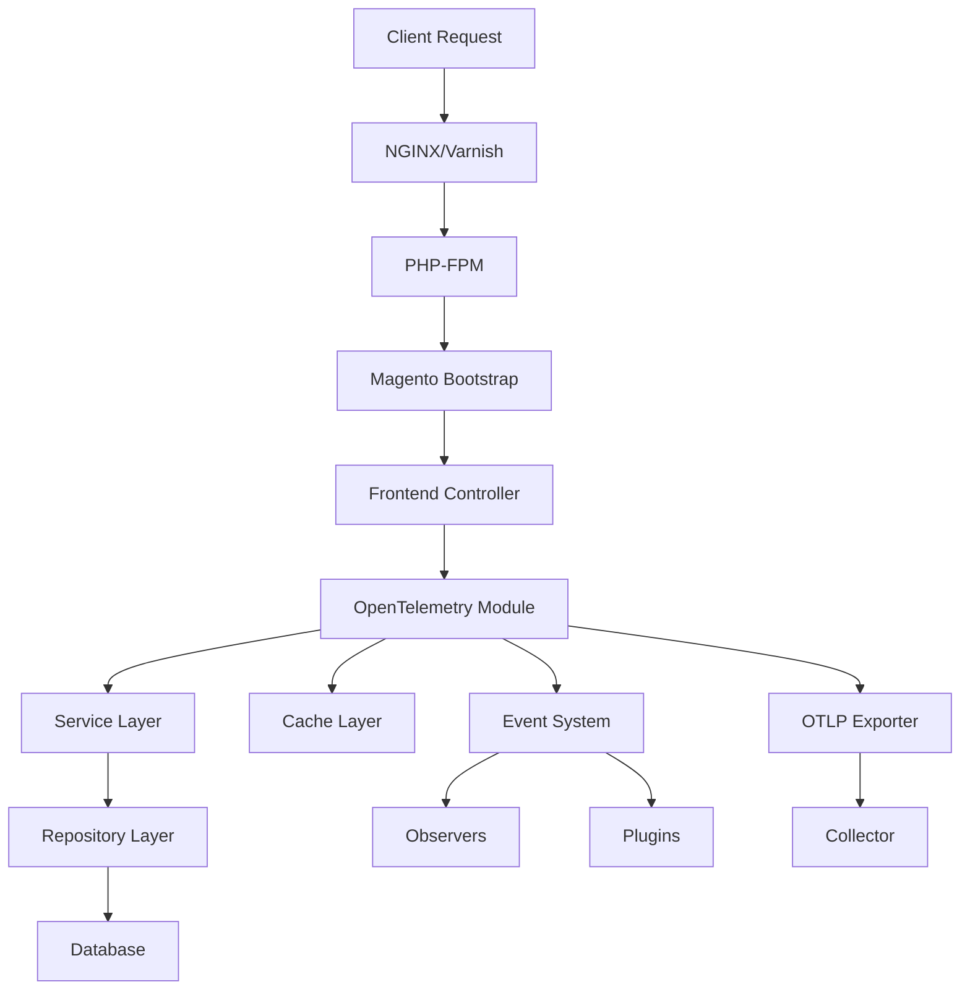

# How to Monitor Magento Performance with OpenTelemetry

Author: [nawazdhandala](https://www.github.com/nawazdhandala)

Tags: OpenTelemetry, PHP, Magento, E-Commerce, Performance, Monitoring

Description: Learn how to instrument Magento 2 with OpenTelemetry to monitor page load times, track checkout performance, identify slow database queries, and optimize your e-commerce platform.

Magento 2 is a complex e-commerce platform with hundreds of modules, extensive database operations, and intricate caching layers. Performance issues can directly impact revenue, making observability critical. OpenTelemetry provides comprehensive insights into Magento's request lifecycle, helping you identify bottlenecks in the checkout flow, catalog operations, and backend processes.

## Why Magento Needs Specialized Monitoring

Magento applications face unique performance challenges. A single product page might execute hundreds of database queries, load dozens of layout XML files, and process multiple layers of caching. Traditional APM tools often miss Magento-specific bottlenecks like inefficient observers, slow plugins, or cascading cache invalidations. OpenTelemetry's distributed tracing shows exactly what happens during each request, from the frontend controller through the service layer to database queries.

## Architecture Overview

Here's how OpenTelemetry integrates with Magento's layered architecture:



## Installing OpenTelemetry in Magento

Create a custom Magento module for OpenTelemetry instrumentation. First, create the module structure:

```bash
mkdir -p app/code/Vendor/OpenTelemetry
```

Create `app/code/Vendor/OpenTelemetry/registration.php`:

```php
<?php
\Magento\Framework\Component\ComponentRegistrar::register(
    \Magento\Framework\Component\ComponentRegistrar::MODULE,
    'Vendor_OpenTelemetry',
    __DIR__
);
```

Create `app/code/Vendor/OpenTelemetry/module.xml`:

```xml
<?xml version="1.0"?>
<config xmlns:xsi="http://www.w3.org/2001/XMLSchema-instance" xsi:noNamespaceSchemaLocation="urn:magento:framework:Module/etc/module.xsd">
    <module name="Vendor_OpenTelemetry" setup_version="1.0.0">
        <sequence>
            <module name="Magento_Store"/>
            <module name="Magento_Backend"/>
        </sequence>
    </module>
</config>
```

Create `app/code/Vendor/OpenTelemetry/composer.json`:

```json
{
    "name": "vendor/module-opentelemetry",
    "description": "OpenTelemetry instrumentation for Magento 2",
    "type": "magento2-module",
    "version": "1.0.0",
    "require": {
        "php": "^8.1",
        "magento/framework": "*",
        "open-telemetry/sdk": "^1.0",
        "open-telemetry/exporter-otlp": "^1.0"
    },
    "autoload": {
        "files": [
            "registration.php"
        ],
        "psr-4": {
            "Vendor\\OpenTelemetry\\": ""
        }
    }
}
```

## Creating the Tracer Service

Create `app/code/Vendor/OpenTelemetry/Service/TracerService.php`:

```php
<?php
declare(strict_types=1);

namespace Vendor\OpenTelemetry\Service;

use OpenTelemetry\API\Globals;
use OpenTelemetry\API\Trace\SpanKind;
use OpenTelemetry\API\Trace\StatusCode;
use OpenTelemetry\API\Trace\TracerInterface;
use OpenTelemetry\SDK\Trace\TracerProvider;
use OpenTelemetry\SDK\Trace\SpanProcessor\BatchSpanProcessor;
use OpenTelemetry\Contrib\Otlp\SpanExporter;
use OpenTelemetry\SDK\Resource\ResourceInfo;
use OpenTelemetry\SDK\Resource\ResourceInfoFactory;
use OpenTelemetry\SDK\Common\Attribute\Attributes;
use OpenTelemetry\SemConv\ResourceAttributes;

class TracerService
{
    private TracerInterface $tracer;
    private static $instance = null;

    private function __construct()
    {
        $this->initializeTracer();
    }

    public static function getInstance(): self
    {
        if (self::$instance === null) {
            self::$instance = new self();
        }
        return self::$instance;
    }

    private function initializeTracer(): void
    {
        $resource = ResourceInfoFactory::defaultResource()->merge(
            ResourceInfo::create(Attributes::create([
                ResourceAttributes::SERVICE_NAME => 'magento',
                ResourceAttributes::SERVICE_VERSION => '2.4.6',
                ResourceAttributes::DEPLOYMENT_ENVIRONMENT => getenv('MAGE_MODE') ?: 'production',
                'magento.edition' => 'Community',
            ]))
        );

        $exporter = new SpanExporter(
            \OpenTelemetry\Contrib\Otlp\HttpTransportFactory::create(
                getenv('OTEL_EXPORTER_OTLP_ENDPOINT') ?: 'http://localhost:4318/v1/traces',
                'application/json'
            )
        );

        $tracerProvider = TracerProvider::builder()
            ->addSpanProcessor(new BatchSpanProcessor($exporter))
            ->setResource($resource)
            ->build();

        Globals::registerInitializer(fn() => $tracerProvider);
        $this->tracer = $tracerProvider->getTracer('magento-instrumentation');
    }

    public function getTracer(): TracerInterface
    {
        return $this->tracer;
    }
}
```

## Instrumenting Controllers

Create a plugin to trace all controller actions. Create `app/code/Vendor/OpenTelemetry/Plugin/ControllerPlugin.php`:

```php
<?php
declare(strict_types=1);

namespace Vendor\OpenTelemetry\Plugin;

use Magento\Framework\App\ActionInterface;
use Magento\Framework\App\RequestInterface;
use Vendor\OpenTelemetry\Service\TracerService;
use OpenTelemetry\API\Trace\SpanKind;
use OpenTelemetry\API\Trace\StatusCode;

class ControllerPlugin
{
    private TracerService $tracerService;
    private $currentSpan = null;

    public function __construct(TracerService $tracerService)
    {
        $this->tracerService = $tracerService;
    }

    public function aroundExecute(
        ActionInterface $subject,
        callable $proceed,
        RequestInterface $request
    ) {
        $tracer = $this->tracerService->getTracer();

        // Create span for this controller action
        $actionName = get_class($subject);
        $routePath = $request->getModuleName() . '/' .
                     $request->getControllerName() . '/' .
                     $request->getActionName();

        $this->currentSpan = $tracer
            ->spanBuilder($request->getMethod() . ' ' . $routePath)
            ->setSpanKind(SpanKind::KIND_SERVER)
            ->setAttribute('http.method', $request->getMethod())
            ->setAttribute('http.route', $routePath)
            ->setAttribute('http.url', $request->getRequestUri())
            ->setAttribute('magento.controller.class', $actionName)
            ->setAttribute('magento.store.code', $request->getParam('___store'))
            ->setAttribute('magento.area', $this->getArea($request))
            ->startSpan();

        $scope = $this->currentSpan->activate();

        try {
            $result = $proceed($request);
            $this->currentSpan->setStatus(StatusCode::STATUS_OK);
            return $result;
        } catch (\Throwable $e) {
            $this->currentSpan
                ->recordException($e)
                ->setStatus(StatusCode::STATUS_ERROR, $e->getMessage());
            throw $e;
        } finally {
            $this->currentSpan->end();
            $scope->detach();
        }
    }

    private function getArea(RequestInterface $request): string
    {
        if ($request->getParam('isAjax')) {
            return 'ajax';
        }

        $path = $request->getPathInfo();
        if (strpos($path, '/admin') === 0) {
            return 'adminhtml';
        }

        return 'frontend';
    }
}
```

Register the plugin in `app/code/Vendor/OpenTelemetry/etc/di.xml`:

```xml
<?xml version="1.0"?>
<config xmlns:xsi="http://www.w3.org/2001/XMLSchema-instance" xsi:noNamespaceSchemaLocation="urn:magento:framework:ObjectManager/etc/config.xsd">
    <type name="Magento\Framework\App\ActionInterface">
        <plugin name="vendor_opentelemetry_controller" type="Vendor\OpenTelemetry\Plugin\ControllerPlugin" sortOrder="1"/>
    </type>
</config>
```

## Tracing Database Operations

Create a plugin to monitor all database queries. Create `app/code/Vendor/OpenTelemetry/Plugin/DatabasePlugin.php`:

```php
<?php
declare(strict_types=1);

namespace Vendor\OpenTelemetry\Plugin;

use Magento\Framework\DB\Adapter\AdapterInterface;
use Vendor\OpenTelemetry\Service\TracerService;
use OpenTelemetry\API\Trace\SpanKind;
use OpenTelemetry\API\Trace\StatusCode;

class DatabasePlugin
{
    private TracerService $tracerService;

    public function __construct(TracerService $tracerService)
    {
        $this->tracerService = $tracerService;
    }

    public function aroundQuery(
        AdapterInterface $subject,
        callable $proceed,
        $sql,
        $bind = []
    ) {
        $tracer = $this->tracerService->getTracer();

        // Extract operation type from SQL
        $operation = $this->extractOperation($sql);

        $span = $tracer
            ->spanBuilder('db.query')
            ->setSpanKind(SpanKind::KIND_CLIENT)
            ->setAttribute('db.system', 'mysql')
            ->setAttribute('db.statement', $this->sanitizeSQL($sql))
            ->setAttribute('db.operation', $operation)
            ->setAttribute('db.bind_params_count', count($bind))
            ->startSpan();

        $scope = $span->activate();

        try {
            $result = $proceed($sql, $bind);

            // Add result metadata
            if ($result instanceof \Magento\Framework\DB\Statement\Pdo\Mysql) {
                $span->setAttribute('db.rows_affected', $result->rowCount());
            }

            $span->setStatus(StatusCode::STATUS_OK);
            return $result;
        } catch (\Throwable $e) {
            $span
                ->recordException($e)
                ->setStatus(StatusCode::STATUS_ERROR, $e->getMessage());
            throw $e;
        } finally {
            $span->end();
            $scope->detach();
        }
    }

    private function extractOperation(string $sql): string
    {
        preg_match('/^(SELECT|INSERT|UPDATE|DELETE|CREATE|ALTER|DROP)/i', trim($sql), $matches);
        return strtoupper($matches[1] ?? 'UNKNOWN');
    }

    private function sanitizeSQL(string $sql): string
    {
        // Limit SQL length to avoid huge spans
        if (strlen($sql) > 1000) {
            return substr($sql, 0, 997) . '...';
        }
        return $sql;
    }
}
```

Register in `app/code/Vendor/OpenTelemetry/etc/di.xml`:

```xml
<type name="Magento\Framework\DB\Adapter\Pdo\Mysql">
    <plugin name="vendor_opentelemetry_database" type="Vendor\OpenTelemetry\Plugin\DatabasePlugin" sortOrder="1"/>
</type>
```

## Monitoring Cache Operations

Cache performance is critical in Magento. Create `app/code/Vendor/OpenTelemetry/Plugin/CachePlugin.php`:

```php
<?php
declare(strict_types=1);

namespace Vendor\OpenTelemetry\Plugin;

use Magento\Framework\Cache\FrontendInterface;
use Vendor\OpenTelemetry\Service\TracerService;
use OpenTelemetry\API\Trace\SpanKind;

class CachePlugin
{
    private TracerService $tracerService;

    public function __construct(TracerService $tracerService)
    {
        $this->tracerService = $tracerService;
    }

    public function aroundLoad(FrontendInterface $subject, callable $proceed, $identifier)
    {
        return $this->traceOperation('cache.load', $identifier, function() use ($proceed, $identifier) {
            return $proceed($identifier);
        });
    }

    public function aroundSave(
        FrontendInterface $subject,
        callable $proceed,
        $data,
        $identifier,
        array $tags = [],
        $lifeTime = null
    ) {
        return $this->traceOperation('cache.save', $identifier, function() use ($proceed, $data, $identifier, $tags, $lifeTime) {
            return $proceed($data, $identifier, $tags, $lifeTime);
        }, [
            'cache.tags' => implode(',', $tags),
            'cache.lifetime' => $lifeTime,
        ]);
    }

    private function traceOperation(string $operation, string $key, callable $callback, array $extraAttributes = [])
    {
        $tracer = $this->tracerService->getTracer();

        $span = $tracer
            ->spanBuilder($operation)
            ->setSpanKind(SpanKind::KIND_CLIENT)
            ->setAttribute('cache.system', 'redis')
            ->setAttribute('cache.operation', $operation)
            ->setAttribute('cache.key', $key);

        foreach ($extraAttributes as $attrKey => $attrValue) {
            $span->setAttribute($attrKey, $attrValue);
        }

        $span = $span->startSpan();
        $scope = $span->activate();

        try {
            $result = $callback();
            $span->setAttribute('cache.hit', $result !== false);
            return $result;
        } finally {
            $span->end();
            $scope->detach();
        }
    }
}
```

## Tracing Checkout Flow

The checkout process is critical for e-commerce. Create specialized instrumentation:

```php
<?php
declare(strict_types=1);

namespace Vendor\OpenTelemetry\Observer;

use Magento\Framework\Event\Observer;
use Magento\Framework\Event\ObserverInterface;
use Vendor\OpenTelemetry\Service\TracerService;
use OpenTelemetry\API\Trace\SpanKind;

class CheckoutObserver implements ObserverInterface
{
    private TracerService $tracerService;

    public function __construct(TracerService $tracerService)
    {
        $this->tracerService = $tracerService;
    }

    public function execute(Observer $observer)
    {
        $event = $observer->getEvent();
        $eventName = $event->getName();

        $tracer = $this->tracerService->getTracer();

        $span = $tracer
            ->spanBuilder('checkout.' . $eventName)
            ->setSpanKind(SpanKind::KIND_INTERNAL)
            ->setAttribute('magento.event', $eventName);

        if ($eventName === 'checkout_submit_all_after') {
            $order = $event->getOrder();
            $span
                ->setAttribute('order.id', $order->getIncrementId())
                ->setAttribute('order.total', $order->getGrandTotal())
                ->setAttribute('order.items_count', $order->getTotalItemCount());
        }

        $span->startSpan()->end();
    }
}
```

Register the observer in `app/code/Vendor/OpenTelemetry/etc/events.xml`:

```xml
<?xml version="1.0"?>
<config xmlns:xsi="http://www.w3.org/2001/XMLSchema-instance" xsi:noNamespaceSchemaLocation="urn:magento:framework:Event/etc/events.xsd">
    <event name="checkout_submit_before">
        <observer name="vendor_opentelemetry_checkout" instance="Vendor\OpenTelemetry\Observer\CheckoutObserver"/>
    </event>
    <event name="checkout_submit_all_after">
        <observer name="vendor_opentelemetry_checkout" instance="Vendor\OpenTelemetry\Observer\CheckoutObserver"/>
    </event>
</config>
```

## Enabling the Module

Enable and install the module:

```bash
php bin/magento module:enable Vendor_OpenTelemetry
php bin/magento setup:upgrade
php bin/magento setup:di:compile
php bin/magento cache:flush
```

Configure environment variables in your `app/etc/env.php`:

```php
return [
    // ... existing configuration
    'system' => [
        'default' => [
            'dev' => [
                'debug' => [
                    'otel_endpoint' => 'http://localhost:4318/v1/traces',
                    'otel_service_name' => 'magento-production',
                ]
            ]
        ]
    ]
];
```

## Analyzing Performance Data

After instrumentation is active, monitor these key metrics:

- Controller execution time broken down by route
- Database query performance and query counts per request
- Cache hit rates for different cache types
- Checkout flow timing from cart to order placement
- Product page load time including catalog queries
- Admin panel operations performance

Look for patterns like N+1 queries in product collections, cache misses on category pages, or slow observers delaying checkout completion.

## Production Optimization

For high-traffic Magento stores, optimize OpenTelemetry overhead:

1. Use batch span processors with appropriate batch sizes
2. Sample traces based on route importance (100% for checkout, 1% for product pages)
3. Disable tracing for static asset requests
4. Pre-compile the OpenTelemetry module with Magento's DI compiler

Configure sampling in `app/etc/env.php`:

```php
'otel_sampling_rate' => [
    'checkout/*' => 1.0,
    'customer/account/*' => 0.1,
    'catalog/product/view' => 0.05,
    'default' => 0.01,
]
```

## Conclusion

OpenTelemetry provides deep visibility into Magento's complex architecture, revealing performance bottlenecks that traditional monitoring misses. You can now see exactly which database queries slow down product pages, which cache misses impact checkout flow, and which plugins add unnecessary overhead. This data-driven approach to optimization helps maintain peak performance during high-traffic periods like holiday sales or promotional events.
