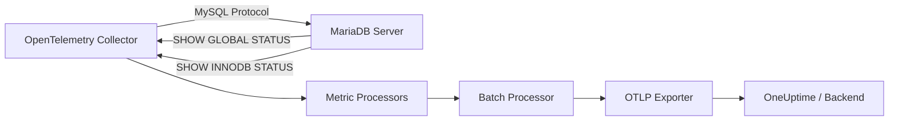

# How to Monitor MariaDB with the OpenTelemetry Collector

Author: [nawazdhandala](https://www.github.com/nawazdhandala)

Tags: OpenTelemetry, MariaDB, MySQL, Collector, Database Monitoring, Metrics, Observability

Description: Configure the OpenTelemetry Collector to monitor MariaDB server metrics including query performance, connection pools, replication status, and InnoDB internals.

---

MariaDB is a popular open-source relational database that originated as a fork of MySQL. It powers production workloads at organizations of all sizes, from small startups to enterprises running millions of transactions per second. Monitoring MariaDB effectively requires tracking connection usage, query throughput, buffer pool efficiency, replication health, and storage engine internals. The OpenTelemetry Collector provides a MySQL receiver that works natively with MariaDB, collecting dozens of metrics without requiring any changes to your application code.

This guide covers setting up the OpenTelemetry Collector to monitor MariaDB, configuring the right metrics, and building dashboards that help you catch problems early.

## How the MySQL Receiver Works with MariaDB

MariaDB maintains wire-level compatibility with MySQL, which means the OpenTelemetry Collector's MySQL receiver connects to MariaDB using the standard MySQL protocol. The receiver executes `SHOW GLOBAL STATUS` and `SHOW INNODB STATUS` commands to collect metrics, then converts them into OpenTelemetry metric format.



The receiver polls MariaDB at a configurable interval, typically every 10 to 60 seconds. Each poll creates a snapshot of the server's current state, and the collector converts counters and gauges into the appropriate OpenTelemetry metric types.

## Prerequisites

Before configuring the collector, create a dedicated monitoring user in MariaDB with minimal privileges. This user only needs permission to read server status variables.

```sql
-- Create a monitoring user with read-only access to server status
-- This user cannot read any application data
CREATE USER 'otel_monitor'@'%' IDENTIFIED BY 'strong-password-here';

-- Grant the minimum permissions needed for metric collection
GRANT PROCESS ON *.* TO 'otel_monitor'@'%';
GRANT SELECT ON performance_schema.* TO 'otel_monitor'@'%';

-- Apply the grants
FLUSH PRIVILEGES;

-- Verify the user can connect and read status
-- Run this from a terminal to test connectivity
-- mysql -u otel_monitor -p -h mariadb-host -e "SHOW GLOBAL STATUS LIMIT 5;"
```

The `PROCESS` privilege allows the monitoring user to run `SHOW GLOBAL STATUS` and `SHOW ENGINE INNODB STATUS`. The `performance_schema` access enables more detailed query-level metrics if you need them.

## Basic Collector Configuration

Here is a minimal collector configuration that monitors a single MariaDB instance. The MySQL receiver handles the connection and metric collection automatically.

```yaml
# otel-collector-config.yaml - Basic MariaDB monitoring setup
receivers:
  # MySQL receiver connects to MariaDB using the MySQL wire protocol
  mysql:
    # Connection endpoint - hostname:port of your MariaDB server
    endpoint: mariadb-primary.internal:3306

    # Credentials for the monitoring user created above
    username: otel_monitor
    password: "${MARIADB_MONITOR_PASSWORD}"

    # How often to collect metrics (10s is good for most environments)
    collection_interval: 10s

    # Collect InnoDB metrics for storage engine monitoring
    metrics:
      mysql.innodb.buffer_pool.pages:
        enabled: true
      mysql.innodb.buffer_pool.operations:
        enabled: true
      mysql.innodb.row_operations:
        enabled: true
      mysql.innodb.data:
        enabled: true

processors:
  # Batch metrics before exporting to reduce API calls
  batch:
    timeout: 10s
    send_batch_size: 200

  # Tag all metrics with the MariaDB instance identifier
  resource:
    attributes:
      - key: db.system
        value: mariadb
        action: upsert
      - key: db.instance
        value: mariadb-primary
        action: upsert

exporters:
  # Send metrics to OneUptime via OTLP
  otlp:
    endpoint: "https://otlp.oneuptime.com:4317"
    headers:
      "x-oneuptime-token": "${ONEUPTIME_TOKEN}"

service:
  pipelines:
    metrics:
      receivers: [mysql]
      processors: [batch, resource]
      exporters: [otlp]
```

## Monitoring Multiple MariaDB Instances

Most production setups run MariaDB in a primary-replica configuration. You can monitor all instances from a single collector by defining multiple receiver instances.

```yaml
# otel-collector-config.yaml - Monitor a MariaDB primary and two replicas
receivers:
  # Primary instance - handles writes and reads
  mysql/primary:
    endpoint: mariadb-primary.internal:3306
    username: otel_monitor
    password: "${MARIADB_MONITOR_PASSWORD}"
    collection_interval: 10s

  # Replica 1 - handles read traffic
  mysql/replica1:
    endpoint: mariadb-replica1.internal:3306
    username: otel_monitor
    password: "${MARIADB_MONITOR_PASSWORD}"
    collection_interval: 10s

  # Replica 2 - handles read traffic
  mysql/replica2:
    endpoint: mariadb-replica2.internal:3306
    username: otel_monitor
    password: "${MARIADB_MONITOR_PASSWORD}"
    collection_interval: 10s

processors:
  batch:
    timeout: 10s
    send_batch_size: 500

  # Add instance role labels so you can filter primary vs replica in dashboards
  resource/primary:
    attributes:
      - key: db.instance
        value: "mariadb-primary"
        action: upsert
      - key: db.role
        value: "primary"
        action: upsert

  resource/replica1:
    attributes:
      - key: db.instance
        value: "mariadb-replica1"
        action: upsert
      - key: db.role
        value: "replica"
        action: upsert

  resource/replica2:
    attributes:
      - key: db.instance
        value: "mariadb-replica2"
        action: upsert
      - key: db.role
        value: "replica"
        action: upsert

exporters:
  otlp:
    endpoint: "https://otlp.oneuptime.com:4317"
    headers:
      "x-oneuptime-token": "${ONEUPTIME_TOKEN}"

service:
  pipelines:
    # Separate pipeline for each instance to apply correct resource labels
    metrics/primary:
      receivers: [mysql/primary]
      processors: [resource/primary, batch]
      exporters: [otlp]

    metrics/replica1:
      receivers: [mysql/replica1]
      processors: [resource/replica1, batch]
      exporters: [otlp]

    metrics/replica2:
      receivers: [mysql/replica2]
      processors: [resource/replica2, batch]
      exporters: [otlp]
```

## Key Metrics to Watch

The MySQL receiver collects a broad set of metrics. Here are the most important ones for MariaDB operations, grouped by category.

### Connection Metrics

Connections are often the first thing to saturate on a busy MariaDB server.

| Metric | Type | What It Tells You |
|--------|------|-------------------|
| `mysql.connection.count` | Gauge | Current active connections |
| `mysql.connection.errors` | Counter | Failed connection attempts |
| `mysql.threads.running` | Gauge | Threads actively processing queries |
| `mysql.threads.connected` | Gauge | Total connected threads |

If `mysql.connection.count` approaches `max_connections`, your application is at risk of connection errors. Set an alert at 80% of your maximum.

### Query Throughput Metrics

These metrics track how much work the database is doing.

| Metric | Type | What It Tells You |
|--------|------|-------------------|
| `mysql.queries` | Counter | Total queries executed |
| `mysql.commands` | Counter | Commands by type (SELECT, INSERT, UPDATE, DELETE) |
| `mysql.slow_queries` | Counter | Queries exceeding long_query_time |
| `mysql.sorts` | Counter | Sort operations by type |

A rising `mysql.slow_queries` counter is a clear signal that performance is degrading. Track the rate of change rather than the absolute count.

### InnoDB Buffer Pool Metrics

The InnoDB buffer pool is the most important performance knob for MariaDB. These metrics tell you whether the buffer pool is sized correctly.

| Metric | Type | What It Tells You |
|--------|------|-------------------|
| `mysql.innodb.buffer_pool.pages` | Gauge | Pages by state (data, free, dirty) |
| `mysql.innodb.buffer_pool.operations` | Counter | Read requests, reads from disk |
| `mysql.innodb.buffer_pool.data` | Gauge | Data in the buffer pool in bytes |

The buffer pool hit ratio is the key derived metric. Calculate it as: `(read_requests - reads_from_disk) / read_requests * 100`. A hit ratio below 99% usually means your buffer pool is too small.

### Replication Metrics

If you run MariaDB with replication, monitor these metrics on every replica.

| Metric | Type | What It Tells You |
|--------|------|-------------------|
| `mysql.replica.seconds_behind_source` | Gauge | Replication lag in seconds |
| `mysql.replica.sql_running` | Gauge | Whether the SQL thread is running |
| `mysql.replica.io_running` | Gauge | Whether the IO thread is running |

Any value above zero for `seconds_behind_source` means the replica is falling behind. Alert on this metric immediately.

## Adding Process and Host Metrics

For a complete picture of your MariaDB server, combine database metrics with system-level metrics from the host.

```yaml
# Extended configuration with host metrics alongside MariaDB metrics
receivers:
  mysql:
    endpoint: mariadb-primary.internal:3306
    username: otel_monitor
    password: "${MARIADB_MONITOR_PASSWORD}"
    collection_interval: 10s

  # Host metrics for the machine running MariaDB
  hostmetrics:
    collection_interval: 15s
    scrapers:
      # CPU usage - high CPU can indicate query optimization issues
      cpu:
        metrics:
          system.cpu.utilization:
            enabled: true

      # Memory usage - MariaDB performance depends heavily on available RAM
      memory:
        metrics:
          system.memory.utilization:
            enabled: true

      # Disk I/O - critical for database write performance
      disk:
        include:
          devices: ["sda", "nvme0n1"]
          match_type: strict

      # Network - monitor replication traffic between primary and replicas
      network:

processors:
  batch:
    timeout: 10s

  resource:
    attributes:
      - key: service.name
        value: "mariadb-primary"
        action: upsert
      - key: db.system
        value: "mariadb"
        action: upsert

exporters:
  otlp:
    endpoint: "https://otlp.oneuptime.com:4317"
    headers:
      "x-oneuptime-token": "${ONEUPTIME_TOKEN}"

service:
  pipelines:
    metrics:
      receivers: [mysql, hostmetrics]
      processors: [resource, batch]
      exporters: [otlp]
```

## Deploying the Collector as a Sidecar

When running MariaDB in Kubernetes, deploy the collector as a sidecar container in the same pod. This simplifies networking since the collector can connect to MariaDB on localhost.

```yaml
# kubernetes-mariadb-pod.yaml - MariaDB with OTel Collector sidecar
apiVersion: v1
kind: Pod
metadata:
  name: mariadb-primary
  labels:
    app: mariadb
    role: primary
spec:
  containers:
    # MariaDB container
    - name: mariadb
      image: mariadb:11.4
      ports:
        - containerPort: 3306
      env:
        - name: MARIADB_ROOT_PASSWORD
          valueFrom:
            secretKeyRef:
              name: mariadb-secrets
              key: root-password
      volumeMounts:
        - name: data
          mountPath: /var/lib/mysql

    # OpenTelemetry Collector sidecar for monitoring
    - name: otel-collector
      image: otel/opentelemetry-collector-contrib:0.104.0
      args: ["--config=/etc/otel/config.yaml"]
      volumeMounts:
        - name: otel-config
          mountPath: /etc/otel
      env:
        - name: MARIADB_MONITOR_PASSWORD
          valueFrom:
            secretKeyRef:
              name: mariadb-secrets
              key: monitor-password
        - name: ONEUPTIME_TOKEN
          valueFrom:
            secretKeyRef:
              name: observability-secrets
              key: oneuptime-token

  volumes:
    - name: data
      persistentVolumeClaim:
        claimName: mariadb-data
    - name: otel-config
      configMap:
        name: otel-collector-mariadb-config
```

## Alerting Recommendations

Based on the metrics collected, set up these alerts for production MariaDB instances:

1. **Connection saturation**: Alert when `mysql.connection.count` exceeds 80% of `max_connections` for more than 2 minutes.
2. **Slow query spike**: Alert when the rate of `mysql.slow_queries` exceeds your baseline by 3x.
3. **Buffer pool pressure**: Alert when InnoDB buffer pool hit ratio drops below 98%.
4. **Replication lag**: Alert when `mysql.replica.seconds_behind_source` exceeds 10 seconds.
5. **Thread pile-up**: Alert when `mysql.threads.running` exceeds 50 for more than 1 minute. This usually means queries are blocked on locks or I/O.
6. **Disk I/O saturation**: Alert when disk utilization on the MariaDB data volume exceeds 90% sustained.

The OpenTelemetry Collector makes MariaDB monitoring straightforward. With the MySQL receiver, a few minutes of configuration gives you comprehensive visibility into your database's health and performance. Combined with host metrics and proper alerting, you can detect and resolve issues before they impact your users.
