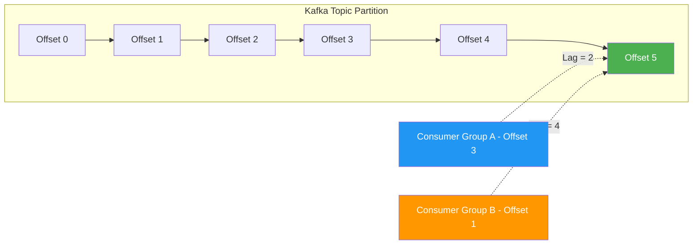

# How to Monitor Message Queue Backlog and Consumer Lag with OpenTelemetry

Author: [nawazdhandala](https://www.github.com/nawazdhandala)

Tags: OpenTelemetry, Message Queue, Consumer Lag, Backlog, Monitoring, Kafka, RabbitMQ

Description: Learn how to monitor message queue backlog and consumer lag with OpenTelemetry across Kafka, RabbitMQ, and SQS for proactive capacity management.

---

Consumer lag and message backlog are the vital signs of any message-driven architecture. When consumers fall behind producers, messages pile up. If you do not catch this early, the backlog grows until queues hit storage limits, processing latency becomes unacceptable, or your system starts dropping messages entirely. OpenTelemetry gives you the tools to measure, report, and alert on these metrics across different message brokers using a consistent approach.

This guide covers practical patterns for monitoring queue backlog and consumer lag in Kafka, RabbitMQ, and SQS using OpenTelemetry metrics and traces.

## Understanding Backlog vs Consumer Lag

These two terms are related but distinct. Backlog is the total number of unprocessed messages sitting in a queue or topic partition. Consumer lag is the difference between the latest produced offset and the latest consumed offset for a specific consumer group. In systems like RabbitMQ where there are no offsets, backlog and lag are effectively the same thing (the number of ready messages). In Kafka, you can have different lag values for different consumer groups reading from the same topic.



Understanding this distinction matters for your monitoring strategy. A topic might have zero backlog from one consumer group's perspective but massive lag from another's.

## Monitoring Kafka Consumer Lag

Kafka consumer lag is the most commonly monitored messaging metric, and for good reason. It directly tells you whether your consumers are keeping pace with your producers. Here is how to collect it with OpenTelemetry.

```python
from opentelemetry import metrics
from confluent_kafka.admin import AdminClient, ConsumerGroupTopicPartitions
from confluent_kafka import TopicPartition

meter = metrics.get_meter("kafka.lag.monitor")

# Create a gauge that reports consumer lag per partition
lag_gauge = meter.create_observable_gauge(
    name="kafka.consumer_group.lag",
    description="Consumer group lag in number of messages",
    unit="messages",
    callbacks=[lambda options: collect_kafka_lag(options)],
)

def collect_kafka_lag(options):
    """Collect consumer lag for all monitored consumer groups."""
    admin = AdminClient({"bootstrap.servers": "localhost:9092"})

    # Define which consumer groups and topics to monitor
    groups_to_monitor = ["order-processor", "analytics-pipeline", "notification-sender"]

    for group_id in groups_to_monitor:
        try:
            # Get the committed offsets for this consumer group
            committed = get_committed_offsets(admin, group_id)

            # Get the latest offsets (high watermarks) for each partition
            for tp, committed_offset in committed.items():
                # Fetch the high watermark for this partition
                high_watermark = get_high_watermark(tp.topic, tp.partition)

                if committed_offset >= 0 and high_watermark >= 0:
                    lag = high_watermark - committed_offset

                    yield metrics.Observation(
                        value=lag,
                        attributes={
                            "messaging.system": "kafka",
                            "messaging.kafka.consumer_group": group_id,
                            "messaging.destination.name": tp.topic,
                            "messaging.kafka.partition": tp.partition,
                        }
                    )
        except Exception:
            # Log but do not crash the metric collection
            pass

def get_committed_offsets(admin, group_id):
    """Fetch committed offsets for a consumer group."""
    from confluent_kafka import Consumer

    consumer = Consumer({
        "bootstrap.servers": "localhost:9092",
        "group.id": group_id,
    })

    # List all topics this group is subscribed to
    committed_offsets = {}
    topics = consumer.list_topics()

    for topic_name, topic_metadata in topics.topics.items():
        if topic_name.startswith("_"):
            continue  # Skip internal topics

        partitions = [
            TopicPartition(topic_name, p)
            for p in topic_metadata.partitions.keys()
        ]

        committed = consumer.committed(partitions, timeout=10)
        for tp in committed:
            if tp.offset >= 0:
                committed_offsets[tp] = tp.offset

    consumer.close()
    return committed_offsets

def get_high_watermark(topic, partition):
    """Get the latest offset for a topic partition."""
    from confluent_kafka import Consumer

    consumer = Consumer({
        "bootstrap.servers": "localhost:9092",
        "group.id": "_lag_monitor_internal",
    })

    tp = TopicPartition(topic, partition)
    low, high = consumer.get_watermark_offsets(tp, timeout=10)
    consumer.close()
    return high
```

This approach creates a short-lived consumer for each collection cycle to fetch committed offsets and watermarks. In production, you would want to reuse the consumer connection and add error handling around broker connectivity. The key metric attributes are the consumer group, topic, and partition, which let you drill down from aggregate lag to the specific partition that is falling behind.

## Monitoring RabbitMQ Queue Backlog

RabbitMQ monitoring is more straightforward because queues have a simple depth metric. The management API exposes everything you need.

```python
import requests
from opentelemetry import metrics

meter = metrics.get_meter("rabbitmq.backlog.monitor")

# Queue depth gauge
queue_depth = meter.create_observable_gauge(
    name="rabbitmq.queue.messages",
    description="Total messages in queue (ready + unacked)",
    unit="messages",
    callbacks=[lambda options: collect_rabbitmq_depth(options)],
)

# Ready messages gauge (messages waiting to be delivered)
queue_ready = meter.create_observable_gauge(
    name="rabbitmq.queue.messages_ready",
    description="Messages ready for delivery",
    unit="messages",
    callbacks=[lambda options: collect_rabbitmq_ready(options)],
)

# Unacked messages gauge (delivered but not acknowledged)
queue_unacked = meter.create_observable_gauge(
    name="rabbitmq.queue.messages_unacked",
    description="Messages delivered but not yet acknowledged",
    unit="messages",
    callbacks=[lambda options: collect_rabbitmq_unacked(options)],
)

def collect_rabbitmq_depth(options):
    """Collect total message count for all queues."""
    queues = _fetch_queues()
    for q in queues:
        yield metrics.Observation(
            value=q.get("messages", 0),
            attributes={
                "messaging.system": "rabbitmq",
                "messaging.destination.name": q["name"],
                "rabbitmq.vhost": q.get("vhost", "/"),
            }
        )

def collect_rabbitmq_ready(options):
    """Collect ready message count for all queues."""
    queues = _fetch_queues()
    for q in queues:
        yield metrics.Observation(
            value=q.get("messages_ready", 0),
            attributes={
                "messaging.system": "rabbitmq",
                "messaging.destination.name": q["name"],
                "rabbitmq.vhost": q.get("vhost", "/"),
            }
        )

def collect_rabbitmq_unacked(options):
    """Collect unacknowledged message count for all queues."""
    queues = _fetch_queues()
    for q in queues:
        yield metrics.Observation(
            value=q.get("messages_unacknowledged", 0),
            attributes={
                "messaging.system": "rabbitmq",
                "messaging.destination.name": q["name"],
                "rabbitmq.vhost": q.get("vhost", "/"),
            }
        )

def _fetch_queues():
    """Fetch queue details from the RabbitMQ management API."""
    response = requests.get(
        "http://localhost:15672/api/queues",
        auth=("guest", "guest"),
        timeout=10
    )
    response.raise_for_status()
    return response.json()
```

Breaking the metrics into three separate gauges (total, ready, and unacknowledged) is important because they tell different stories. A high ready count means consumers are not picking up messages fast enough. A high unacknowledged count means consumers are picking up messages but processing them slowly. The two problems have very different solutions.

## Monitoring SQS Queue Backlog

For AWS SQS, you can query queue attributes directly using the AWS SDK.

```python
import boto3
from opentelemetry import metrics

meter = metrics.get_meter("sqs.backlog.monitor")
sqs = boto3.client("sqs", region_name="us-east-1")

# Track approximate message counts
sqs_backlog = meter.create_observable_gauge(
    name="sqs.queue.approximate_message_count",
    description="Approximate number of visible messages in SQS queue",
    unit="messages",
    callbacks=[lambda options: collect_sqs_backlog(options)],
)

sqs_in_flight = meter.create_observable_gauge(
    name="sqs.queue.approximate_in_flight",
    description="Approximate number of in-flight (received but not deleted) messages",
    unit="messages",
    callbacks=[lambda options: collect_sqs_in_flight(options)],
)

# Queues to monitor
SQS_QUEUES = {
    "orders": "https://sqs.us-east-1.amazonaws.com/123456789/orders-queue",
    "notifications": "https://sqs.us-east-1.amazonaws.com/123456789/notifications-queue",
    "analytics": "https://sqs.us-east-1.amazonaws.com/123456789/analytics-queue",
}

def collect_sqs_backlog(options):
    """Collect approximate message count for monitored SQS queues."""
    for name, url in SQS_QUEUES.items():
        try:
            attrs = sqs.get_queue_attributes(
                QueueUrl=url,
                AttributeNames=["ApproximateNumberOfMessages"]
            )
            count = int(attrs["Attributes"]["ApproximateNumberOfMessages"])

            yield metrics.Observation(
                value=count,
                attributes={
                    "messaging.system": "aws_sqs",
                    "messaging.destination.name": name,
                    "cloud.region": "us-east-1",
                }
            )
        except Exception:
            pass

def collect_sqs_in_flight(options):
    """Collect approximate in-flight message count for monitored SQS queues."""
    for name, url in SQS_QUEUES.items():
        try:
            attrs = sqs.get_queue_attributes(
                QueueUrl=url,
                AttributeNames=["ApproximateNumberOfMessagesNotVisible"]
            )
            count = int(attrs["Attributes"]["ApproximateNumberOfMessagesNotVisible"])

            yield metrics.Observation(
                value=count,
                attributes={
                    "messaging.system": "aws_sqs",
                    "messaging.destination.name": name,
                    "cloud.region": "us-east-1",
                }
            )
        except Exception:
            pass
```

SQS only provides approximate counts, which is a quirk of its distributed design. The values can lag behind the actual queue state by up to a minute. Keep this in mind when setting alert thresholds since you want to account for the inherent imprecision.

## Adding Processing Latency Traces

Backlog metrics tell you how much work is queued up. Processing latency traces tell you how long each unit of work takes. Together, they let you calculate whether your consumers can ever catch up.

```python
import time
from opentelemetry import trace

tracer = trace.get_tracer("consumer.processing")

def process_with_latency_tracking(message, queue_name):
    """Process a message and record detailed timing attributes."""

    # Calculate queue wait time if the message has a timestamp
    enqueue_time = message.get("_enqueued_at")
    dequeue_time = time.time()

    with tracer.start_as_current_span(
        f"{queue_name} process",
        kind=trace.SpanKind.CONSUMER,
        attributes={
            "messaging.system": "generic",
            "messaging.source.name": queue_name,
            "messaging.operation": "process",
        }
    ) as span:
        # Record how long the message waited in the queue
        if enqueue_time:
            wait_time_ms = (dequeue_time - enqueue_time) * 1000
            span.set_attribute("messaging.queue.wait_time_ms", wait_time_ms)

        process_start = time.time()

        try:
            result = handle_message(message)

            # Record pure processing time (excluding queue wait)
            process_time_ms = (time.time() - process_start) * 1000
            span.set_attribute("messaging.processing.duration_ms", process_time_ms)
            span.set_attribute("messaging.processing.outcome", "success")

            return result
        except Exception as e:
            process_time_ms = (time.time() - process_start) * 1000
            span.set_attribute("messaging.processing.duration_ms", process_time_ms)
            span.set_attribute("messaging.processing.outcome", "error")
            span.set_status(trace.StatusCode.ERROR, str(e))
            span.record_exception(e)
            raise
```

The distinction between `wait_time_ms` (time in queue) and `processing.duration_ms` (time to handle) is critical for diagnosing backlog causes. If wait time is high but processing time is low, you need more consumer instances. If processing time is high, you need to optimize your processing logic or break it into smaller units.

## Collector Configuration for Multi-Broker Monitoring

When you are monitoring multiple message brokers, your collector configuration should handle all the different metric sources.

```yaml
# Unified collector config for multi-broker backlog monitoring
receivers:
  otlp:
    protocols:
      grpc:
        endpoint: 0.0.0.0:4317
      http:
        endpoint: 0.0.0.0:4318

  # Optional: scrape Kafka JMX metrics directly
  prometheus:
    config:
      scrape_configs:
        - job_name: kafka-brokers
          scrape_interval: 15s
          static_configs:
            - targets: ["kafka-1:7071", "kafka-2:7071", "kafka-3:7071"]

processors:
  batch:
    timeout: 10s
    send_batch_size: 512

  # Normalize messaging system attributes across brokers
  attributes:
    actions:
      - key: messaging.backlog.monitor
        value: "true"
        action: upsert

exporters:
  otlp:
    endpoint: https://your-oneuptime-instance.com:4317

service:
  pipelines:
    metrics:
      receivers: [otlp, prometheus]
      processors: [attributes, batch]
      exporters: [otlp]
    traces:
      receivers: [otlp]
      processors: [batch]
      exporters: [otlp]
```

The attributes processor adds a common label to all messaging metrics, making it easy to build a unified dashboard that shows backlog across Kafka, RabbitMQ, and SQS in a single view.

## Setting Up Alerts

Metrics are only useful if you act on them. Here are the alert conditions that matter most for backlog monitoring.

For Kafka:
- Consumer group lag exceeding N messages for more than 5 minutes (threshold depends on your throughput and SLAs)
- Consumer group lag growth rate positive over a 15-minute window (lag is increasing, meaning consumers are falling behind)
- Any partition with zero committed offset change in 10 minutes (consumer might be stuck)

For RabbitMQ:
- Queue depth exceeding N messages for more than 5 minutes
- Unacknowledged message count exceeding consumer prefetch count times number of consumers (consumers are at capacity)
- Queue depth growing faster than the consumption rate over a 10-minute window

For SQS:
- Approximate message count exceeding N for more than 5 minutes
- Age of oldest message exceeding your processing SLA threshold

The growth rate alerts are more useful than static threshold alerts because they catch problems early. A queue at 1,000 messages might be fine if it is draining at 500 per second, but a queue at 100 messages that is growing by 50 per second will be a problem in a few minutes.

## Wrapping Up

Monitoring message queue backlog and consumer lag with OpenTelemetry gives you a unified view across different brokers. The same metric naming conventions and attribute schemas work whether you are monitoring Kafka partitions, RabbitMQ queues, or SQS queues. Combine the backlog metrics with per-message processing latency traces, and you have everything you need to understand whether your consumers are healthy, predict when they might fall behind, and diagnose the root cause when they do.

Start with the backlog/lag gauges for your most critical queues. Once those are flowing to your monitoring backend, add the processing latency traces to complete the picture. The growth rate alerts are what will actually save you from incidents, so invest time in tuning those thresholds to match your specific throughput patterns.
