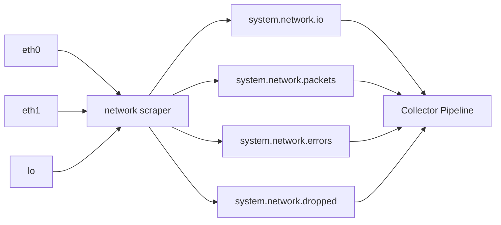

# How to Monitor Network Interface Metrics with OpenTelemetry

Author: [nawazdhandala](https://www.github.com/nawazdhandala)

Tags: OpenTelemetry, Collector, Network Monitoring, Infrastructure, Metrics, Observability, Network Interface

Description: Learn how to monitor network interface metrics like bandwidth usage, packet rates, and errors using the OpenTelemetry Collector's network scraper.

---

Network issues are some of the hardest problems to debug in production. A saturated interface, rising error counts, or unexpected packet drops can degrade application performance in ways that look like application bugs. Monitoring network interface metrics gives you early visibility into these problems before they cascade into outages.

The OpenTelemetry Collector includes a `network` scraper within the hostmetrics receiver that collects per-interface statistics on Linux, macOS, and Windows. This guide covers how to configure it, what metrics it produces, how to filter interfaces, and how to build meaningful alerts from the data.

## What Network Interface Metrics Tell You

Every network interface on a host maintains a set of counters that track traffic volume, packet counts, and error conditions. These counters are maintained by the kernel and are available through `/proc/net/dev` on Linux and similar system APIs on other platforms.

The key metrics to monitor include:

- **Bytes sent/received**: Total traffic volume per interface, useful for bandwidth utilization calculations
- **Packets sent/received**: Packet counts, independent of packet size
- **Errors (in/out)**: Count of malformed, corrupted, or otherwise problematic packets
- **Drops (in/out)**: Packets dropped due to buffer overflows or resource constraints
- **Connections**: Active TCP/UDP connections (via the optional connections scraper)

A healthy network interface shows steady byte and packet counters with zero or near-zero errors and drops. Any sustained increase in errors or drops warrants investigation.



## Basic Configuration

Enable the network scraper in the hostmetrics receiver:

```yaml
# otel-collector-config.yaml
receivers:
  hostmetrics:
    collection_interval: 30s
    scrapers:
      # Network interface metrics scraper
      network:
        # All metrics are enabled by default
        metrics:
          system.network.io:
            enabled: true
          system.network.packets:
            enabled: true
          system.network.errors:
            enabled: true
          system.network.dropped:
            enabled: true
          system.network.connections:
            enabled: true

processors:
  batch:
    timeout: 10s

exporters:
  otlp:
    endpoint: "otel-backend.example.com:4317"

service:
  pipelines:
    metrics:
      receivers: [hostmetrics]
      processors: [batch]
      exporters: [otlp]
```

With this configuration, the collector gathers network metrics for every interface on the host, including physical NICs, virtual interfaces, bridges, and the loopback interface. Each metric includes a `device` attribute identifying the interface name (e.g., `eth0`, `ens5`, `lo`).

## Understanding the Metrics

Here is a breakdown of each metric and what it represents:

| Metric | Type | Attributes | Description |
|--------|------|------------|-------------|
| system.network.io | Sum (cumulative) | device, direction (receive/transmit) | Total bytes transferred per interface |
| system.network.packets | Sum (cumulative) | device, direction | Total packets per interface |
| system.network.errors | Sum (cumulative) | device, direction | Packets with errors per interface |
| system.network.dropped | Sum (cumulative) | device, direction | Packets dropped per interface |
| system.network.connections | Sum | protocol, state | Count of network connections by protocol and state |

All counters except connections are cumulative, meaning they increase monotonically from system boot. To get rates (bytes per second, packets per second), your backend needs to compute the difference between consecutive samples and divide by the scrape interval.

The `system.network.connections` metric is a snapshot gauge that counts current TCP and UDP connections grouped by state (ESTABLISHED, TIME_WAIT, CLOSE_WAIT, etc.).

## Filtering Network Interfaces

Most hosts have interfaces you do not need to monitor. The loopback interface, Docker bridge networks, and virtual Ethernet pairs for containers generate metrics that add noise without providing useful insight.

```yaml
receivers:
  hostmetrics:
    collection_interval: 30s
    scrapers:
      network:
        # Only collect metrics for physical interfaces
        include:
          interfaces: ["eth0", "eth1", "ens5", "eno1"]
          match_type: strict
```

If your interface naming is unpredictable (common in cloud environments), use regex matching:

```yaml
receivers:
  hostmetrics:
    collection_interval: 30s
    scrapers:
      network:
        # Exclude virtual and container interfaces
        exclude:
          interfaces: ["lo", "docker.*", "veth.*", "br-.*", "virbr.*"]
          match_type: regexp
```

The exclude approach is often more practical than include, because it lets you ignore known noise sources while automatically picking up new physical interfaces that get added to the host.

## Combining Network with Other Host Metrics

Network metrics are most useful when combined with CPU, memory, and disk data from the same host. You can enable multiple scrapers in a single hostmetrics receiver:

```yaml
receivers:
  hostmetrics:
    collection_interval: 30s
    scrapers:
      # System-level scrapers
      cpu:
      memory:
      disk:
      # Network scraper with filtering
      network:
        exclude:
          interfaces: ["lo", "docker.*", "veth.*"]
          match_type: regexp
      # Filesystem scraper for disk space
      filesystem:

processors:
  # Attach host identity to all metrics
  resourcedetection:
    detectors: [system]
    system:
      hostname_sources: ["os"]
      resource_attributes:
        host.name:
          enabled: true
        os.type:
          enabled: true

  batch:
    timeout: 10s

service:
  pipelines:
    metrics:
      receivers: [hostmetrics]
      processors: [resourcedetection, batch]
      exporters: [otlp]
```

This single collector configuration gives you a complete picture of host health. When you see a CPU spike, you can correlate it with network traffic to determine whether the load is driven by incoming requests, outbound data transfers, or something unrelated to the network.

## Monitoring Network Connections

The connections metric deserves special attention. TCP connection states reveal a lot about application behavior and network health.

A high count of `TIME_WAIT` connections suggests that your application is opening and closing many short-lived connections. This is common with HTTP/1.0 clients or misconfigured connection pools.

A growing number of `CLOSE_WAIT` connections indicates that your application is not properly closing connections after the remote side disconnects. This is often a bug in connection handling code.

Many `ESTABLISHED` connections is normal for a busy server, but a sudden spike beyond your baseline may indicate a connection leak or a traffic surge.

```yaml
receivers:
  hostmetrics:
    collection_interval: 30s
    scrapers:
      network:
        metrics:
          # Enable connection state tracking
          system.network.connections:
            enabled: true
          # Keep standard interface metrics too
          system.network.io:
            enabled: true
          system.network.errors:
            enabled: true
          system.network.dropped:
            enabled: true
```

## Running in Containers

When the collector runs inside a container, it sees only the network interfaces in its own network namespace by default. To monitor the host's network interfaces, configure the container to use the host network namespace:

```yaml
# Docker Compose configuration for network monitoring
services:
  otel-collector:
    image: otel/opentelemetry-collector-contrib:0.96.0
    # Use host network namespace for accurate interface metrics
    network_mode: host
    volumes:
      - /proc:/hostfs/proc:ro
      - /sys:/hostfs/sys:ro
      - ./otel-collector-config.yaml:/etc/otelcol-contrib/config.yaml
    environment:
      - HOST_PROC=/hostfs/proc
      - HOST_SYS=/hostfs/sys
```

The `network_mode: host` setting is essential for network monitoring. Without it, the collector only sees the container's virtual interface and misses the host's physical NICs entirely.

In Kubernetes, you can achieve the same result with `hostNetwork: true` in the pod spec:

```yaml
# Kubernetes DaemonSet snippet for network monitoring
apiVersion: apps/v1
kind: DaemonSet
metadata:
  name: otel-collector
spec:
  template:
    spec:
      # Required for host network interface visibility
      hostNetwork: true
      hostPID: true
      containers:
        - name: collector
          image: otel/opentelemetry-collector-contrib:0.96.0
          volumeMounts:
            - name: proc
              mountPath: /hostfs/proc
              readOnly: true
            - name: sys
              mountPath: /hostfs/sys
              readOnly: true
      volumes:
        - name: proc
          hostPath:
            path: /proc
        - name: sys
          hostPath:
            path: /sys
```

## Alerting Strategies

Here are practical alerting patterns for network interface metrics:

**Interface errors**: Alert when `system.network.errors` increases by more than 10 in a 5-minute window. Any sustained error count indicates a hardware problem, cable issue, or driver bug.

**Packet drops**: Alert on any non-zero rate of `system.network.dropped`. Drops mean the kernel is discarding packets because buffers are full, which directly impacts application performance.

**Bandwidth saturation**: Compute the rate of `system.network.io` and compare it against the known interface speed. Alert when utilization exceeds 80% sustained over 5 minutes. A 1 Gbps interface transferring at 800 Mbps is near saturation and likely causing latency.

**Connection state anomalies**: Alert when `TIME_WAIT` connections exceed 10,000 or `CLOSE_WAIT` connections exceed 100. These thresholds depend on your workload, so adjust them based on your baseline observations.

## Calculating Bandwidth Utilization

The raw `system.network.io` metric gives you cumulative bytes, not utilization percentage. To calculate utilization, you need to know the interface speed and compute the rate.

On Linux, the interface speed is available from `/sys/class/net/<interface>/speed` (in Mbps). You can use the `transform` processor in the collector or compute utilization in your backend:

```
utilization = (rate_of_bytes_per_second * 8) / (interface_speed_mbps * 1_000_000) * 100
```

For example, if `eth0` transfers 50 MB per second on a 1 Gbps link:

```
utilization = (50_000_000 * 8) / (1000 * 1_000_000) * 100 = 40%
```

This calculation is typically done in your dashboard or alerting queries rather than in the collector pipeline.

## Wrap Up

Network interface monitoring with the OpenTelemetry Collector provides the visibility needed to catch network issues before they become application outages. The network scraper in the hostmetrics receiver collects the fundamental metrics that matter: traffic volume, packet rates, errors, drops, and connection states. By filtering out virtual interfaces, combining network data with other host metrics, and building targeted alerts, you get a comprehensive view of network health that integrates naturally with the rest of your OpenTelemetry observability pipeline.
