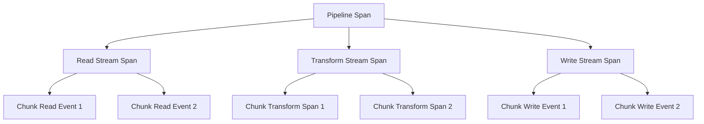

# How to Monitor Node.js Streams with OpenTelemetry Spans

Author: [nawazdhandala](https://www.github.com/nawazdhandala)

Tags: OpenTelemetry, Node.js, Streams, Monitoring, Performance, Spans

Description: Learn how to instrument Node.js streams with OpenTelemetry spans to track data flow, measure throughput, and identify bottlenecks in your streaming pipelines.

Node.js streams are fundamental to building scalable applications that process data efficiently without loading entire datasets into memory. However, debugging stream performance issues can be challenging without proper observability. OpenTelemetry provides the tools to instrument streams and gain deep insights into your data pipelines.

## Understanding Node.js Streams and Observability Challenges

Node.js streams handle data in chunks, making them ideal for processing large files, network requests, or real-time data. The four types of streams (Readable, Writable, Duplex, and Transform) each present unique monitoring challenges. Without instrumentation, you cannot see where data gets stuck, how long transformations take, or which stream in a pipeline is the bottleneck.

Traditional logging falls short because streams are asynchronous and event-driven. You need distributed tracing to follow data through complex pipelines that span multiple streams, processes, or services.

## Setting Up OpenTelemetry for Stream Monitoring

First, install the necessary dependencies for instrumenting your Node.js application:

```bash
npm install @opentelemetry/api @opentelemetry/sdk-node @opentelemetry/auto-instrumentations-node @opentelemetry/instrumentation
```

Configure the OpenTelemetry SDK at your application entry point:

```javascript
// tracing.js - Initialize OpenTelemetry before any other code
const { NodeSDK } = require('@opentelemetry/sdk-node');
const { getNodeAutoInstrumentations } = require('@opentelemetry/auto-instrumentations-node');
const { OTLPTraceExporter } = require('@opentelemetry/exporter-trace-otlp-http');

const sdk = new NodeSDK({
  traceExporter: new OTLPTraceExporter({
    url: 'http://localhost:4318/v1/traces',
  }),
  instrumentations: [getNodeAutoInstrumentations()],
  serviceName: 'stream-processing-service',
});

sdk.start();

process.on('SIGTERM', () => {
  sdk.shutdown()
    .then(() => console.log('Tracing terminated'))
    .catch((error) => console.log('Error terminating tracing', error))
    .finally(() => process.exit(0));
});
```

## Instrumenting Readable Streams

Readable streams emit data that other streams consume. Track when data starts flowing and when the stream completes:

```javascript
const { trace, context } = require('@opentelemetry/api');
const fs = require('fs');
const tracer = trace.getTracer('stream-instrumentation', '1.0.0');

function createInstrumentedReadStream(filePath) {
  // Create a span for the entire read operation
  const span = tracer.startSpan('stream.read', {
    attributes: {
      'stream.type': 'readable',
      'stream.source': filePath,
      'stream.operation': 'read',
    },
  });

  const readStream = fs.createReadStream(filePath, { highWaterMark: 64 * 1024 });
  let bytesRead = 0;
  let chunksRead = 0;

  readStream.on('data', (chunk) => {
    bytesRead += chunk.length;
    chunksRead++;

    // Record incremental metrics as events
    span.addEvent('chunk.read', {
      'chunk.size': chunk.length,
      'total.bytes': bytesRead,
      'chunk.count': chunksRead,
    });
  });

  readStream.on('end', () => {
    span.setAttributes({
      'stream.bytes.total': bytesRead,
      'stream.chunks.total': chunksRead,
      'stream.status': 'completed',
    });
    span.end();
  });

  readStream.on('error', (error) => {
    span.recordException(error);
    span.setStatus({ code: 2, message: error.message });
    span.end();
  });

  return readStream;
}
```

## Instrumenting Transform Streams

Transform streams modify data as it passes through. Measure transformation time and track data volume changes:

```javascript
const { Transform } = require('stream');

class InstrumentedTransform extends Transform {
  constructor(transformFn, operationName, options = {}) {
    super(options);
    this.transformFn = transformFn;
    this.operationName = operationName;
    this.tracer = trace.getTracer('stream-instrumentation', '1.0.0');
    this.bytesIn = 0;
    this.bytesOut = 0;
    this.chunksProcessed = 0;

    // Create a span for the entire transform operation
    this.transformSpan = this.tracer.startSpan(`stream.transform.${operationName}`, {
      attributes: {
        'stream.type': 'transform',
        'stream.operation': operationName,
      },
    });
  }

  _transform(chunk, encoding, callback) {
    this.bytesIn += chunk.length;
    this.chunksProcessed++;

    // Create a child span for each chunk transformation
    const chunkSpan = this.tracer.startSpan(`stream.transform.chunk`, {
      attributes: {
        'chunk.index': this.chunksProcessed,
        'chunk.size.in': chunk.length,
      },
    }, trace.setSpan(context.active(), this.transformSpan));

    try {
      const result = this.transformFn(chunk, encoding);
      const outputSize = Buffer.byteLength(result);
      this.bytesOut += outputSize;

      chunkSpan.setAttributes({
        'chunk.size.out': outputSize,
        'chunk.size.ratio': (outputSize / chunk.length).toFixed(2),
      });
      chunkSpan.end();

      callback(null, result);
    } catch (error) {
      chunkSpan.recordException(error);
      chunkSpan.setStatus({ code: 2, message: error.message });
      chunkSpan.end();
      callback(error);
    }
  }

  _flush(callback) {
    this.transformSpan.setAttributes({
      'stream.bytes.in': this.bytesIn,
      'stream.bytes.out': this.bytesOut,
      'stream.chunks.processed': this.chunksProcessed,
      'stream.compression.ratio': (this.bytesOut / this.bytesIn).toFixed(2),
    });
    this.transformSpan.end();
    callback();
  }
}

// Example usage: compression transform
const zlib = require('zlib');

function createCompressionStream() {
  return new InstrumentedTransform(
    (chunk) => zlib.gzipSync(chunk),
    'gzip-compression'
  );
}
```

## Instrumenting Writable Streams

Writable streams consume data and write it to a destination. Track write performance and error rates:

```javascript
function createInstrumentedWriteStream(outputPath) {
  const span = tracer.startSpan('stream.write', {
    attributes: {
      'stream.type': 'writable',
      'stream.destination': outputPath,
      'stream.operation': 'write',
    },
  });

  const writeStream = fs.createWriteStream(outputPath);
  let bytesWritten = 0;
  let chunksWritten = 0;
  const writeLatencies = [];

  const originalWrite = writeStream.write.bind(writeStream);
  writeStream.write = function(chunk, encoding, callback) {
    const writeStart = Date.now();
    chunksWritten++;
    bytesWritten += chunk.length;

    return originalWrite(chunk, encoding, function(error) {
      const writeLatency = Date.now() - writeStart;
      writeLatencies.push(writeLatency);

      span.addEvent('chunk.written', {
        'chunk.size': chunk.length,
        'write.latency.ms': writeLatency,
        'total.bytes': bytesWritten,
      });

      if (callback) callback(error);
    });
  };

  writeStream.on('finish', () => {
    const avgLatency = writeLatencies.reduce((a, b) => a + b, 0) / writeLatencies.length;
    const maxLatency = Math.max(...writeLatencies);

    span.setAttributes({
      'stream.bytes.total': bytesWritten,
      'stream.chunks.total': chunksWritten,
      'stream.write.latency.avg': avgLatency.toFixed(2),
      'stream.write.latency.max': maxLatency,
      'stream.status': 'completed',
    });
    span.end();
  });

  writeStream.on('error', (error) => {
    span.recordException(error);
    span.setStatus({ code: 2, message: error.message });
    span.end();
  });

  return writeStream;
}
```

## Building Complete Pipeline Instrumentation

Complex pipelines combine multiple streams. Create a parent span that encompasses the entire pipeline:

```javascript
const { pipeline } = require('stream/promises');

async function processFileWithPipeline(inputPath, outputPath) {
  // Create a parent span for the entire pipeline
  const pipelineSpan = tracer.startSpan('stream.pipeline.process-file', {
    attributes: {
      'pipeline.input': inputPath,
      'pipeline.output': outputPath,
      'pipeline.stages': 3,
    },
  });

  const pipelineContext = trace.setSpan(context.active(), pipelineSpan);

  try {
    await context.with(pipelineContext, async () => {
      const readStream = createInstrumentedReadStream(inputPath);
      const transformStream = createCompressionStream();
      const writeStream = createInstrumentedWriteStream(outputPath);

      await pipeline(readStream, transformStream, writeStream);
    });

    pipelineSpan.setStatus({ code: 1 });
    pipelineSpan.end();
  } catch (error) {
    pipelineSpan.recordException(error);
    pipelineSpan.setStatus({ code: 2, message: error.message });
    pipelineSpan.end();
    throw error;
  }
}
```

## Visualizing Stream Performance

The instrumentation creates a hierarchical trace showing the pipeline structure:



## Advanced Patterns for Stream Monitoring

For production systems, implement middleware that automatically instruments any stream:

```javascript
function instrumentStream(stream, operationType, metadata = {}) {
  const span = tracer.startSpan(`stream.${operationType}`, {
    attributes: {
      'stream.type': stream.constructor.name,
      ...metadata,
    },
  });

  const originalEmit = stream.emit.bind(stream);
  stream.emit = function(event, ...args) {
    if (event === 'data') {
      span.addEvent('data.event', {
        'data.size': args[0]?.length || 0,
      });
    } else if (event === 'error') {
      span.recordException(args[0]);
      span.setStatus({ code: 2, message: args[0]?.message });
    } else if (event === 'end' || event === 'finish') {
      span.end();
    }
    return originalEmit(event, ...args);
  };

  return stream;
}
```

## Handling Backpressure with Observability

Track backpressure to identify when downstream consumers cannot keep up:

```javascript
class BackpressureAwareTransform extends Transform {
  constructor(options = {}) {
    super(options);
    this.tracer = trace.getTracer('stream-instrumentation', '1.0.0');
    this.backpressureEvents = 0;
  }

  _transform(chunk, encoding, callback) {
    const canContinue = this.push(chunk);

    if (!canContinue) {
      this.backpressureEvents++;
      this.tracer.startSpan('stream.backpressure', {
        attributes: {
          'backpressure.event.count': this.backpressureEvents,
          'stream.type': this.constructor.name,
        },
      }).end();
    }

    callback();
  }
}
```

## Correlating Stream Traces with External Operations

When streams interact with databases or APIs, propagate trace context:

```javascript
const axios = require('axios');

class ApiEnrichedTransform extends Transform {
  constructor(apiUrl, options = {}) {
    super(options);
    this.apiUrl = apiUrl;
    this.tracer = trace.getTracer('stream-instrumentation', '1.0.0');
  }

  async _transform(chunk, encoding, callback) {
    const span = this.tracer.startSpan('stream.transform.api-enrich');

    try {
      const data = JSON.parse(chunk.toString());

      // Make API call with trace context propagation
      const response = await context.with(
        trace.setSpan(context.active(), span),
        async () => {
          return await axios.get(`${this.apiUrl}/${data.id}`);
        }
      );

      const enriched = { ...data, ...response.data };
      span.setAttributes({
        'api.status': response.status,
        'enrichment.success': true,
      });
      span.end();

      callback(null, JSON.stringify(enriched) + '\n');
    } catch (error) {
      span.recordException(error);
      span.setStatus({ code: 2, message: error.message });
      span.end();
      callback(error);
    }
  }
}
```

## Monitoring Stream Memory Usage

Track memory consumption to prevent leaks in long-running streams:

```javascript
function createMemoryAwareStream(operationName) {
  const span = tracer.startSpan(`stream.${operationName}.memory`);
  const startMemory = process.memoryUsage();
  let peakMemory = 0;

  const memoryInterval = setInterval(() => {
    const currentMemory = process.memoryUsage();
    const heapUsed = currentMemory.heapUsed;

    if (heapUsed > peakMemory) {
      peakMemory = heapUsed;
    }

    span.addEvent('memory.sample', {
      'memory.heap.used': heapUsed,
      'memory.heap.total': currentMemory.heapTotal,
      'memory.external': currentMemory.external,
    });
  }, 1000);

  return {
    stopMonitoring: () => {
      clearInterval(memoryInterval);
      const finalMemory = process.memoryUsage();

      span.setAttributes({
        'memory.start.heap': startMemory.heapUsed,
        'memory.peak.heap': peakMemory,
        'memory.final.heap': finalMemory.heapUsed,
        'memory.delta.heap': finalMemory.heapUsed - startMemory.heapUsed,
      });
      span.end();
    },
  };
}
```

## Best Practices for Stream Instrumentation

Keep instrumentation lightweight to avoid impacting stream performance. Use sampling for high-throughput streams, recording detailed spans for only a percentage of chunks. Set appropriate span attributes that help with debugging: chunk sizes, processing times, and error rates.

Always propagate context through async operations so that traces remain connected. Use span events for frequent occurrences like individual chunks, and reserve child spans for significant operations like API calls or complex transformations.

Monitor stream health metrics: throughput (bytes per second), latency (time per chunk), backpressure events, and error rates. Set up alerts based on these metrics to catch issues before they impact users.

Stream instrumentation with OpenTelemetry transforms opaque data pipelines into observable, debuggable systems. You gain visibility into performance characteristics, can identify bottlenecks quickly, and understand exactly how data flows through your application. This observability becomes critical as stream-based architectures grow in complexity and scale.
