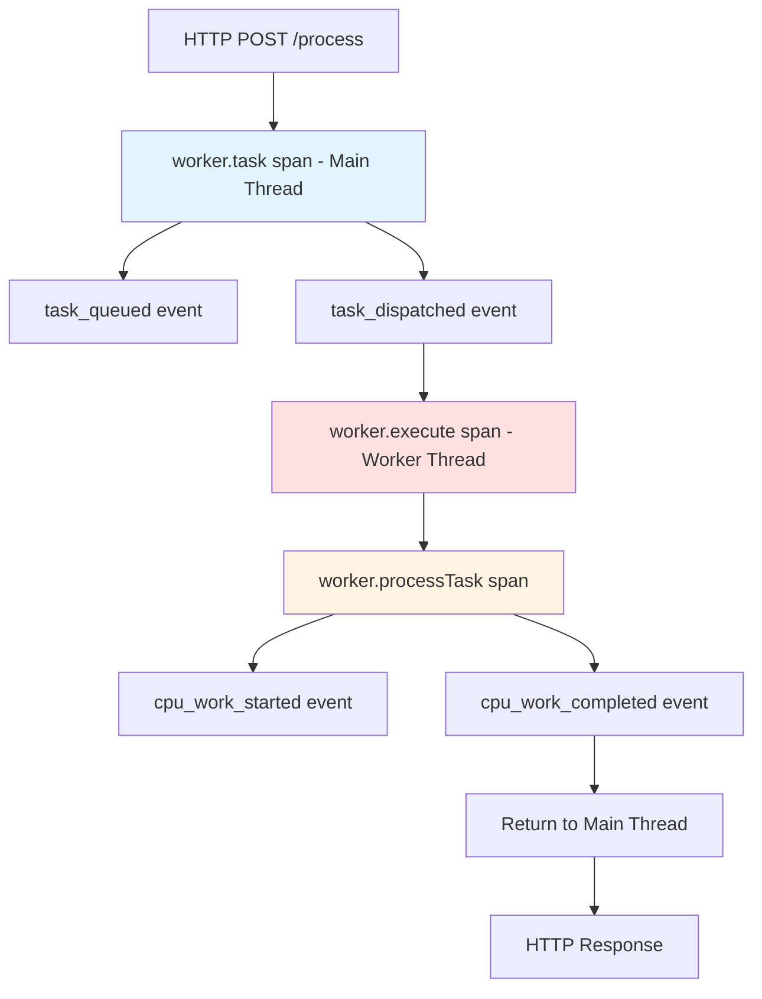

# How to Monitor Node.js Worker Threads with OpenTelemetry

Author: [nawazdhandala](https://www.github.com/nawazdhandala)

Tags: OpenTelemetry, Node.js, Worker Threads, Concurrency, Monitoring

Description: Complete guide to monitoring Node.js worker threads with OpenTelemetry, including trace propagation across threads, performance metrics, and debugging concurrent operations.

Node.js worker threads enable true parallelism in JavaScript applications, allowing CPU-intensive tasks to run without blocking the event loop. However, debugging and monitoring multi-threaded Node.js applications introduces new challenges. OpenTelemetry provides the distributed tracing infrastructure needed to understand how work flows between the main thread and workers, track performance across thread boundaries, and diagnose concurrency issues.

## The Challenge of Multi-Threaded Observability

Traditional single-threaded Node.js applications have straightforward execution paths. Worker threads change this fundamentally. Work dispatched to a worker thread executes in a separate V8 isolate with its own event loop and memory space. Without proper instrumentation, you lose visibility when work crosses thread boundaries.

Key challenges include:

- Maintaining trace context across thread boundaries
- Understanding which worker processed which task
- Measuring total time including queue wait time
- Detecting worker thread bottlenecks or failures
- Correlating errors in workers with main thread operations

## Understanding Worker Thread Architecture

Node.js worker threads communicate through message passing. The main thread posts messages to workers, and workers send results back. Each worker operates independently with its own:

- V8 isolate and JavaScript heap
- Event loop and call stack
- OpenTelemetry SDK instance (if instrumented)

This isolation means trace context doesn't automatically propagate. You must explicitly serialize and transmit context when crossing thread boundaries.

## Setting Up OpenTelemetry

Install the required OpenTelemetry packages:

```bash
npm install @opentelemetry/sdk-node \
            @opentelemetry/api \
            @opentelemetry/instrumentation \
            @opentelemetry/resources \
            @opentelemetry/semantic-conventions \
            @opentelemetry/exporter-trace-otlp-http \
            @opentelemetry/sdk-metrics
```

Create a shared initialization module that both main and worker threads will use:

```javascript
// tracing.js
const { NodeSDK } = require('@opentelemetry/sdk-node');
const { getNodeAutoInstrumentations } = require('@opentelemetry/auto-instrumentations-node');
const { Resource } = require('@opentelemetry/resources');
const { SemanticResourceAttributes } = require('@opentelemetry/semantic-conventions');
const { OTLPTraceExporter } = require('@opentelemetry/exporter-trace-otlp-http');
const { OTLPMetricExporter } = require('@opentelemetry/exporter-metrics-otlp-http');

// Configure exporters
const traceExporter = new OTLPTraceExporter({
  url: process.env.OTEL_EXPORTER_OTLP_ENDPOINT || 'http://localhost:4318/v1/traces',
});

const metricExporter = new OTLPMetricExporter({
  url: process.env.OTEL_METRICS_ENDPOINT || 'http://localhost:4318/v1/metrics',
});

/**
 * Initializes OpenTelemetry for both main and worker threads
 * Each thread gets its own SDK instance but shares the same service name
 */
function initializeTracing(threadId = 'main') {
  const sdk = new NodeSDK({
    resource: new Resource({
      [SemanticResourceAttributes.SERVICE_NAME]: 'worker-app',
      [SemanticResourceAttributes.SERVICE_VERSION]: '1.0.0',
      'thread.id': threadId,
      'thread.type': threadId === 'main' ? 'main' : 'worker',
    }),
    traceExporter,
    metricExporter,
    instrumentations: [getNodeAutoInstrumentations()],
  });

  sdk.start();

  // Cleanup on shutdown
  const shutdown = () => {
    sdk.shutdown()
      .then(() => console.log(`Tracing terminated for ${threadId}`))
      .catch((error) => console.log('Error terminating tracing', error));
  };

  process.on('SIGTERM', shutdown);
  process.on('exit', shutdown);

  return sdk;
}

module.exports = { initializeTracing };
```

## Propagating Context Across Thread Boundaries

The key to distributed tracing with worker threads is context propagation. OpenTelemetry context must be serialized in the main thread and deserialized in the worker:

```javascript
// context-utils.js
const { trace, context, propagation } = require('@opentelemetry/api');

/**
 * Serializes the current trace context for transmission to worker
 * Extracts trace information into a plain object
 */
function serializeContext() {
  const carrier = {};
  propagation.inject(context.active(), carrier);
  return carrier;
}

/**
 * Deserializes trace context received from main thread
 * Restores the trace context in the worker thread
 */
function deserializeContext(carrier) {
  return propagation.extract(context.active(), carrier);
}

/**
 * Wraps worker task execution with proper context
 */
function withContext(carrier, fn) {
  const ctx = deserializeContext(carrier);
  return context.with(ctx, fn);
}

module.exports = {
  serializeContext,
  deserializeContext,
  withContext,
};
```

## Creating an Instrumented Worker Pool

Build a worker pool that automatically handles tracing:

```javascript
// worker-pool.js
const { Worker } = require('worker_threads');
const { trace, SpanStatusCode } = require('@opentelemetry/api');
const { serializeContext } = require('./context-utils');
const os = require('os');

const tracer = trace.getTracer('worker-pool', '1.0.0');

/**
 * Manages a pool of worker threads with OpenTelemetry instrumentation
 */
class InstrumentedWorkerPool {
  constructor(workerScript, options = {}) {
    this.workerScript = workerScript;
    this.poolSize = options.poolSize || os.cpus().length;
    this.workers = [];
    this.taskQueue = [];
    this.activeWorkers = new Map();

    this.initializeWorkers();
  }

  /**
   * Creates worker threads and sets up message handlers
   */
  initializeWorkers() {
    for (let i = 0; i < this.poolSize; i++) {
      const worker = new Worker(this.workerScript);

      worker.on('message', (message) => {
        this.handleWorkerMessage(worker, message);
      });

      worker.on('error', (error) => {
        this.handleWorkerError(worker, error);
      });

      worker.on('exit', (code) => {
        this.handleWorkerExit(worker, code);
      });

      this.workers.push({
        worker,
        id: i,
        busy: false,
      });
    }
  }

  /**
   * Executes a task on an available worker with full tracing
   */
  async executeTask(taskData, spanName = 'worker.task') {
    return tracer.startActiveSpan(spanName, async (span) => {
      try {
        span.setAttribute('task.type', taskData.type || 'unknown');
        span.setAttribute('worker.pool.size', this.poolSize);
        span.setAttribute('worker.queue.length', this.taskQueue.length);

        // Serialize trace context for the worker
        const traceContext = serializeContext();

        // Find available worker or queue the task
        const workerInfo = this.getAvailableWorker();

        if (!workerInfo) {
          span.addEvent('task_queued');
          // Wait for a worker to become available
          await this.waitForWorker();
          return this.executeTask(taskData, spanName);
        }

        span.setAttribute('worker.id', workerInfo.id);
        span.addEvent('task_dispatched', { worker_id: workerInfo.id });

        // Mark worker as busy
        workerInfo.busy = true;

        // Send task to worker with trace context
        const result = await this.sendTaskToWorker(workerInfo.worker, {
          task: taskData,
          traceContext,
        });

        // Mark worker as available
        workerInfo.busy = false;

        span.setAttribute('task.completed', true);
        span.setStatus({ code: SpanStatusCode.OK });

        return result;
      } catch (error) {
        span.recordException(error);
        span.setStatus({
          code: SpanStatusCode.ERROR,
          message: error.message,
        });
        throw error;
      } finally {
        span.end();
      }
    });
  }

  /**
   * Finds an available worker from the pool
   */
  getAvailableWorker() {
    return this.workers.find(w => !w.busy);
  }

  /**
   * Waits for a worker to become available
   */
  waitForWorker() {
    return new Promise((resolve) => {
      const checkInterval = setInterval(() => {
        const available = this.getAvailableWorker();
        if (available) {
          clearInterval(checkInterval);
          resolve(available);
        }
      }, 10);
    });
  }

  /**
   * Sends task to worker and waits for result
   */
  sendTaskToWorker(worker, message) {
    return new Promise((resolve, reject) => {
      const messageId = Math.random().toString(36).substring(7);

      const timeout = setTimeout(() => {
        reject(new Error('Worker task timeout'));
      }, 30000);

      const handler = (response) => {
        if (response.messageId === messageId) {
          clearTimeout(timeout);
          worker.off('message', handler);

          if (response.error) {
            reject(new Error(response.error));
          } else {
            resolve(response.result);
          }
        }
      };

      worker.on('message', handler);
      worker.postMessage({ ...message, messageId });
    });
  }

  /**
   * Handles messages from workers
   */
  handleWorkerMessage(worker, message) {
    // Message handling is done in sendTaskToWorker promise
  }

  /**
   * Handles worker errors
   */
  handleWorkerError(worker, error) {
    console.error('Worker error:', error);
    // Could implement worker restart logic here
  }

  /**
   * Handles worker exits
   */
  handleWorkerExit(worker, code) {
    if (code !== 0) {
      console.error(`Worker stopped with exit code ${code}`);
    }
  }

  /**
   * Terminates all workers
   */
  async terminate() {
    await Promise.all(this.workers.map(w => w.worker.terminate()));
  }
}

module.exports = { InstrumentedWorkerPool };
```

## Implementing the Worker Script

Create a worker that receives tasks and maintains trace context:

```javascript
// worker.js
const { parentPort } = require('worker_threads');
const { initializeTracing } = require('./tracing');
const { withContext } = require('./context-utils');
const { trace, SpanStatusCode } = require('@opentelemetry/api');

// Initialize tracing for this worker
const sdk = initializeTracing(`worker-${process.pid}`);
const tracer = trace.getTracer('worker-task-executor', '1.0.0');

/**
 * Processes tasks received from the main thread
 * Maintains trace context across the thread boundary
 */
parentPort.on('message', async (message) => {
  const { task, traceContext, messageId } = message;

  try {
    // Restore trace context from main thread
    await withContext(traceContext, async () => {
      // Create a span for the worker execution
      await tracer.startActiveSpan('worker.execute', async (span) => {
        try {
          span.setAttribute('worker.task.type', task.type);
          span.setAttribute('worker.pid', process.pid);
          span.addEvent('worker_processing_started');

          // Execute the actual task
          const result = await processTask(task);

          span.addEvent('worker_processing_completed');
          span.setStatus({ code: SpanStatusCode.OK });

          // Send result back to main thread
          parentPort.postMessage({
            messageId,
            result,
          });
        } catch (error) {
          span.recordException(error);
          span.setStatus({
            code: SpanStatusCode.ERROR,
            message: error.message,
          });

          // Send error back to main thread
          parentPort.postMessage({
            messageId,
            error: error.message,
          });
        } finally {
          span.end();
        }
      });
    });
  } catch (error) {
    // Handle context deserialization errors
    parentPort.postMessage({
      messageId,
      error: error.message,
    });
  }
});

/**
 * Processes the actual task based on type
 */
async function processTask(task) {
  return tracer.startActiveSpan('worker.processTask', async (span) => {
    span.setAttribute('task.type', task.type);

    try {
      switch (task.type) {
        case 'cpu_intensive':
          return await performCPUIntensiveWork(task.data);

        case 'data_processing':
          return await processData(task.data);

        case 'computation':
          return await performComputation(task.data);

        default:
          throw new Error(`Unknown task type: ${task.type}`);
      }
    } finally {
      span.end();
    }
  });
}

/**
 * Example CPU-intensive work
 */
async function performCPUIntensiveWork(data) {
  const span = trace.getActiveSpan();
  span?.addEvent('cpu_work_started');

  // Simulate CPU-intensive work
  let result = 0;
  for (let i = 0; i < data.iterations || 1000000; i++) {
    result += Math.sqrt(i);
  }

  span?.addEvent('cpu_work_completed');
  return result;
}

/**
 * Example data processing task
 */
async function processData(data) {
  return tracer.startActiveSpan('worker.dataProcessing', async (span) => {
    span.setAttribute('data.size', data.length);

    // Process each item
    const results = data.map(item => {
      return item * 2; // Simple transformation
    });

    span.setAttribute('results.count', results.length);
    span.end();

    return results;
  });
}

/**
 * Example computation task
 */
async function performComputation(data) {
  // Perform some computation
  return data.values.reduce((sum, val) => sum + val, 0);
}
```

## Using the Worker Pool

Integrate the instrumented worker pool into your application:

```javascript
// app.js
require('./tracing').initializeTracing();

const express = require('express');
const { InstrumentedWorkerPool } = require('./worker-pool');
const path = require('path');

const app = express();
app.use(express.json());

// Create worker pool
const workerPool = new InstrumentedWorkerPool(
  path.join(__dirname, 'worker.js'),
  { poolSize: 4 }
);

/**
 * Endpoint that offloads work to worker threads
 */
app.post('/process', async (req, res) => {
  try {
    const result = await workerPool.executeTask({
      type: 'cpu_intensive',
      data: req.body,
    }, 'process_request');

    res.json({ success: true, result });
  } catch (error) {
    res.status(500).json({ error: error.message });
  }
});

/**
 * Endpoint for data processing
 */
app.post('/transform', async (req, res) => {
  try {
    const result = await workerPool.executeTask({
      type: 'data_processing',
      data: req.body.items || [],
    }, 'transform_data');

    res.json({ success: true, result });
  } catch (error) {
    res.status(500).json({ error: error.message });
  }
});

const PORT = process.env.PORT || 3000;
app.listen(PORT, () => {
  console.log(`Server running on port ${PORT}`);
});

// Cleanup on shutdown
process.on('SIGTERM', async () => {
  await workerPool.terminate();
  process.exit(0);
});
```

## Adding Worker Metrics

Track worker pool performance with metrics:

```javascript
// metrics/worker-metrics.js
const { metrics } = require('@opentelemetry/api');

const meter = metrics.getMeter('worker-pool-metrics', '1.0.0');

// Create metrics for worker monitoring
const workerActiveGauge = meter.createObservableGauge('worker.pool.active', {
  description: 'Number of active workers',
  unit: 'workers',
});

const workerQueueGauge = meter.createObservableGauge('worker.pool.queue_length', {
  description: 'Number of tasks in queue',
  unit: 'tasks',
});

const taskDurationHistogram = meter.createHistogram('worker.task.duration', {
  description: 'Duration of worker tasks',
  unit: 'ms',
});

const taskCounter = meter.createCounter('worker.task.count', {
  description: 'Total number of worker tasks',
  unit: 'tasks',
});

/**
 * Setup metrics callbacks for worker pool monitoring
 */
function setupWorkerMetrics(workerPool) {
  workerActiveGauge.addCallback((result) => {
    const active = workerPool.workers.filter(w => w.busy).length;
    result.observe(active);
  });

  workerQueueGauge.addCallback((result) => {
    result.observe(workerPool.taskQueue.length);
  });
}

module.exports = {
  taskDurationHistogram,
  taskCounter,
  setupWorkerMetrics,
};
```

## Visualizing Worker Thread Traces

The trace hierarchy shows work flowing across threads:



## Debugging Worker Issues

**Issue**: Lost trace context in workers

Ensure context is properly serialized and deserialized:

```javascript
// Verify context propagation
const carrier = serializeContext();
console.log('Serialized context:', carrier);

// In worker
await withContext(carrier, () => {
  const span = trace.getActiveSpan();
  console.log('Active span in worker:', span?.spanContext());
});
```

**Issue**: Worker threads not appearing in traces

Check that each worker initializes its own SDK:

```javascript
// worker.js - MUST initialize tracing
const { initializeTracing } = require('./tracing');
initializeTracing(`worker-${process.pid}`);
```

## Production Considerations

For production deployments, implement worker health checks and restart logic:

```javascript
// Add to InstrumentedWorkerPool
monitorWorkerHealth() {
  setInterval(() => {
    this.workers.forEach((workerInfo) => {
      // Check if worker is stuck
      if (workerInfo.busy && Date.now() - workerInfo.startTime > 60000) {
        console.warn(`Worker ${workerInfo.id} appears stuck`);
        // Implement restart logic
      }
    });
  }, 10000);
}
```

## Conclusion

Monitoring Node.js worker threads with OpenTelemetry requires explicit context propagation but provides invaluable visibility into multi-threaded operations. The combination of distributed tracing across thread boundaries, performance metrics, and structured events gives you complete observability of concurrent workloads.

The instrumented worker pool pattern encapsulates the complexity of context propagation, making it easy to add workers to your application while maintaining full traceability. Workers inherit the trace context from the main thread, creating a seamless distributed trace that shows the complete request flow.

Use this approach to confidently scale CPU-intensive operations across multiple threads while maintaining the observability needed for production debugging and performance optimization.
