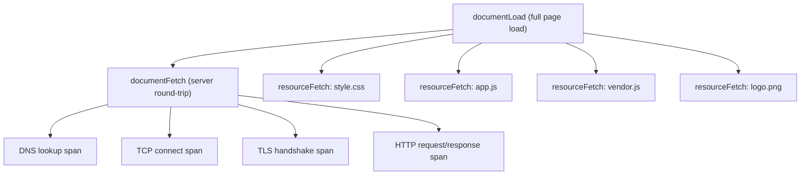

# How to Monitor Page Load Performance and AJAX Calls with OpenTelemetry

Author: [nawazdhandala](https://www.github.com/nawazdhandala)

Tags: OpenTelemetry, Page Load, AJAX, Performance, Fetch, XMLHttpRequest, Browser Monitoring

Description: Learn how to monitor page load performance timing and AJAX call latency using OpenTelemetry browser instrumentation with practical code examples.

---

Every web application has two fundamental performance stories: how fast the page loads initially, and how fast it communicates with the server afterward. Page load performance determines whether users wait or leave. AJAX call performance determines whether the application feels responsive during use. OpenTelemetry's browser SDK lets you capture both stories as structured traces with rich timing data, giving you the detail you need to find and fix bottlenecks.

## Page Load Performance Anatomy

A page load is not a single event. It is a sequence of steps, each with its own timing, and problems at any step can make the experience feel slow. The browser's Navigation Timing API breaks this down into phases.

```mermaid
graph LR
    A[DNS Lookup] --> B[TCP Connect]
    B --> C[TLS Handshake]
    C --> D[Request Sent]
    D --> E[TTFB / Waiting]
    E --> F[Content Download]
    F --> G[DOM Parsing]
    G --> H[Resource Loading]
    H --> I[DOM Interactive]
    I --> J[DOM Complete]
    J --> K[Load Event]
```



OpenTelemetry's Document Load Instrumentation reads the Navigation Timing API and creates spans that represent each of these phases. This means you get sub-millisecond timing breakdowns without writing any custom performance measurement code.

## Setting Up Document Load Instrumentation

Install and configure the document load instrumentation to capture page load timing automatically.

```javascript
// src/tracing.js
import { WebTracerProvider } from '@opentelemetry/sdk-trace-web';
import { BatchSpanProcessor } from '@opentelemetry/sdk-trace-base';
import { OTLPTraceExporter } from '@opentelemetry/exporter-trace-otlp-http';
import { Resource } from '@opentelemetry/resources';
import { registerInstrumentations } from '@opentelemetry/instrumentation';
import { DocumentLoadInstrumentation } from '@opentelemetry/instrumentation-document-load';
import { FetchInstrumentation } from '@opentelemetry/instrumentation-fetch';
import { XMLHttpRequestInstrumentation } from '@opentelemetry/instrumentation-xml-http-request';

const provider = new WebTracerProvider({
  resource: new Resource({
    'service.name': 'my-web-app',
    'service.version': '1.0.0',
  }),
});

// Configure the exporter to send to your OTel Collector
const exporter = new OTLPTraceExporter({
  url: 'https://otel-collector.example.com/v1/traces',
});

// Batch spans for efficient export
provider.addSpanProcessor(
  new BatchSpanProcessor(exporter, {
    maxQueueSize: 100,
    maxExportBatchSize: 50,
    scheduledDelayMillis: 5000,
  })
);

provider.register();

// Register all browser instrumentations
registerInstrumentations({
  instrumentations: [
    // Captures full page load timing from the Navigation Timing API
    new DocumentLoadInstrumentation(),

    // Instruments fetch() calls for AJAX monitoring
    new FetchInstrumentation({
      // Propagate trace context to your API endpoints
      propagateTraceHeaderCorsUrls: [
        /https:\/\/api\.example\.com\/.*/,
      ],
      // Clear timing entries to prevent memory leaks
      clearTimingResources: true,
    }),

    // Instruments XMLHttpRequest for legacy AJAX monitoring
    new XMLHttpRequestInstrumentation({
      propagateTraceHeaderCorsUrls: [
        /https:\/\/api\.example\.com\/.*/,
      ],
    }),
  ],
});

export default provider;
```

Once this runs, the `DocumentLoadInstrumentation` creates a trace with spans for the document fetch, DNS resolution, TCP connection, and resource loading. The `FetchInstrumentation` and `XMLHttpRequestInstrumentation` capture every subsequent network request your application makes.

## Understanding the Document Load Trace

The document load instrumentation creates a structured trace that looks like this:



The parent `documentLoad` span covers the entire page load from navigation start to the load event. Child spans break down the document fetch into network phases, and separate child spans appear for each resource loaded by the page (CSS files, JavaScript bundles, images, fonts).

Each span includes timing attributes derived from the Performance Timing API:

```javascript
// These attributes are automatically set by the document load instrumentation
// You don't need to write this code, but understanding the attributes
// helps when querying your traces:
{
  // Navigation timing phases (in milliseconds)
  'http.url': 'https://example.com/dashboard',
  'http.method': 'GET',
  'http.status_code': 200,

  // Performance timing entries
  'performance.timing.fetchStart': 1234567890,
  'performance.timing.domainLookupStart': 1234567891,
  'performance.timing.domainLookupEnd': 1234567895,
  'performance.timing.connectStart': 1234567895,
  'performance.timing.connectEnd': 1234567900,
  'performance.timing.requestStart': 1234567901,
  'performance.timing.responseStart': 1234567950,
  'performance.timing.responseEnd': 1234567980,
  'performance.timing.domInteractive': 1234568100,
  'performance.timing.domContentLoadedEventEnd': 1234568150,
  'performance.timing.loadEventEnd': 1234568300,
}
```

## Adding Custom Page Load Metrics

The automatic instrumentation captures network-level timing, but you might want to measure application-specific milestones like "time to first meaningful content" or "time to interactive state."

```javascript
// src/page-load-metrics.js
import { trace, SpanStatusCode } from '@opentelemetry/api';

const tracer = trace.getTracer('page-load-custom', '1.0.0');

// Measure the time from navigation start to your app being ready
export function measureAppReadiness() {
  const navigationStart = performance.timing.navigationStart;

  // Create a span that represents app initialization
  const span = tracer.startSpan('app.initialization', {
    startTime: navigationStart,
    attributes: {
      'page.url': window.location.href,
      'page.referrer': document.referrer || 'direct',
    },
  });

  // Return a function to call when the app is ready
  return function markReady(metadata = {}) {
    const readyTime = Date.now();
    const duration = readyTime - navigationStart;

    span.setAttribute('app.ready_time_ms', duration);
    span.setAttribute('app.framework_ready', true);

    // Add any custom metadata about the initial state
    Object.entries(metadata).forEach(([key, value]) => {
      span.setAttribute(`app.${key}`, value);
    });

    span.setStatus({ code: SpanStatusCode.OK });
    span.end();
  };
}

// Usage in your app entry point:
// const markReady = measureAppReadiness();
// ... app initialization ...
// markReady({ component_count: 42, route: '/dashboard' });
```

## Monitoring AJAX Calls in Detail

The fetch and XHR instrumentations capture every network request automatically, but you often want additional context about why a request was made and how its response was used.

```javascript
// src/utils/api-client.js
import { trace, context, SpanStatusCode } from '@opentelemetry/api';

const tracer = trace.getTracer('api-client', '1.0.0');

// Wrapper around fetch that adds application-level context to spans
export async function apiCall(endpoint, options = {}) {
  // Create a parent span that represents the logical API operation
  return tracer.startActiveSpan(
    `api.${options.operation || endpoint}`,
    {
      attributes: {
        'api.endpoint': endpoint,
        'api.operation': options.operation || 'unknown',
        'api.method': options.method || 'GET',
      },
    },
    async (span) => {
      try {
        const startTime = performance.now();

        // The fetch instrumentation will create a child span for the
        // actual HTTP request, linked to this parent span automatically
        const response = await fetch(
          `https://api.example.com${endpoint}`,
          {
            method: options.method || 'GET',
            headers: {
              'Content-Type': 'application/json',
              ...options.headers,
            },
            body: options.body
              ? JSON.stringify(options.body)
              : undefined,
          }
        );

        const endTime = performance.now();

        // Add response metadata to the parent span
        span.setAttribute('api.status', response.status);
        span.setAttribute('api.duration_ms', endTime - startTime);

        // Parse the response
        const data = await response.json();

        // Record the response size for monitoring payload growth
        span.setAttribute(
          'api.response_size',
          JSON.stringify(data).length
        );

        if (!response.ok) {
          span.setStatus({
            code: SpanStatusCode.ERROR,
            message: `API returned ${response.status}`,
          });

          // Add error details from the response body
          if (data.error) {
            span.setAttribute('api.error_message', data.error);
          }
        } else {
          span.setStatus({ code: SpanStatusCode.OK });
        }

        return { response, data };
      } catch (error) {
        // Network error, timeout, or other failure
        span.recordException(error);
        span.setStatus({
          code: SpanStatusCode.ERROR,
          message: error.message,
        });
        throw error;
      } finally {
        span.end();
      }
    }
  );
}
```

The resulting trace for an API call has two levels: the application-level span with business context (which operation, response size, error details) and the HTTP-level span from the fetch instrumentation (with network timing, headers, status code). This layering gives you both the "what" and the "how" of each request.

## Tracking Parallel and Sequential AJAX Patterns

Modern web applications often load data from multiple endpoints simultaneously. Understanding whether requests run in parallel or sequentially, and how that affects perceived performance, is valuable.

```javascript
// src/pages/DashboardLoader.js
import { trace, context, SpanStatusCode } from '@opentelemetry/api';
import { apiCall } from '../utils/api-client';

const tracer = trace.getTracer('dashboard', '1.0.0');

// Load dashboard data with traced parallel requests
export async function loadDashboard() {
  return tracer.startActiveSpan('dashboard.load', async (parentSpan) => {
    const startTime = performance.now();

    try {
      // Fire all requests in parallel
      // Each apiCall creates a child span under dashboard.load
      const [userResult, statsResult, notificationsResult] =
        await Promise.all([
          apiCall('/users/me', { operation: 'get_user' }),
          apiCall('/stats/summary', { operation: 'get_stats' }),
          apiCall('/notifications', { operation: 'get_notifications' }),
        ]);

      const totalTime = performance.now() - startTime;

      // Record how the parallel loading went
      parentSpan.setAttribute('dashboard.total_load_ms', totalTime);
      parentSpan.setAttribute('dashboard.request_count', 3);
      parentSpan.setAttribute('dashboard.all_succeeded', true);
      parentSpan.setStatus({ code: SpanStatusCode.OK });

      return {
        user: userResult.data,
        stats: statsResult.data,
        notifications: notificationsResult.data,
      };
    } catch (error) {
      parentSpan.recordException(error);
      parentSpan.setStatus({
        code: SpanStatusCode.ERROR,
        message: error.message,
      });
      throw error;
    } finally {
      parentSpan.end();
    }
  });
}
```

In the trace view, this creates a waterfall that clearly shows the parallel execution pattern:

```mermaid
gantt
    title Dashboard Load Trace
    dateFormat X
    axisFormat %L ms

    section Parent
    dashboard.load           :0, 450

    section API Calls
    api.get_user             :0, 300
    api.get_stats            :0, 450
    api.get_notifications    :0, 200
```



If any of these requests start appearing sequentially instead of in parallel, the trace view makes it immediately obvious, often pointing to bugs like awaiting requests in a loop instead of using `Promise.all`.

## Monitoring Request Retries and Timeouts

Production applications need retry logic and timeouts. Instrumenting these makes it clear when transient failures are happening and how retry behavior affects user experience.

```javascript
// src/utils/resilient-fetch.js
import { trace, SpanStatusCode } from '@opentelemetry/api';

const tracer = trace.getTracer('resilient-fetch', '1.0.0');

// Fetch with timeout and retry, fully instrumented
export async function resilientFetch(url, options = {}) {
  const maxRetries = options.retries || 3;
  const timeoutMs = options.timeout || 10000;

  return tracer.startActiveSpan(
    'resilient_fetch',
    {
      attributes: {
        'http.url': url,
        'http.method': options.method || 'GET',
        'fetch.max_retries': maxRetries,
        'fetch.timeout_ms': timeoutMs,
      },
    },
    async (parentSpan) => {
      let lastError = null;

      for (let attempt = 1; attempt <= maxRetries; attempt++) {
        // Create a child span for each attempt
        const attemptSpan = tracer.startSpan('fetch_attempt', {
          attributes: {
            'fetch.attempt': attempt,
            'fetch.is_retry': attempt > 1,
          },
        });

        try {
          // Create an AbortController for timeout
          const controller = new AbortController();
          const timeoutId = setTimeout(
            () => controller.abort(),
            timeoutMs
          );

          const response = await fetch(url, {
            ...options,
            signal: controller.signal,
          });

          clearTimeout(timeoutId);

          attemptSpan.setAttribute('http.status_code', response.status);
          attemptSpan.setStatus({ code: SpanStatusCode.OK });
          attemptSpan.end();

          // Record total attempts on the parent span
          parentSpan.setAttribute('fetch.total_attempts', attempt);
          parentSpan.setStatus({ code: SpanStatusCode.OK });
          parentSpan.end();

          return response;
        } catch (error) {
          lastError = error;

          // Determine if the error was a timeout
          const isTimeout = error.name === 'AbortError';

          attemptSpan.recordException(error);
          attemptSpan.setAttribute('fetch.timeout', isTimeout);
          attemptSpan.setStatus({
            code: SpanStatusCode.ERROR,
            message: isTimeout ? 'Request timed out' : error.message,
          });
          attemptSpan.end();

          // Add an event on the parent span for the retry
          parentSpan.addEvent('retry', {
            attempt: attempt,
            reason: isTimeout ? 'timeout' : error.message,
          });

          // Wait before retrying with exponential backoff
          if (attempt < maxRetries) {
            const delay = Math.min(1000 * Math.pow(2, attempt - 1), 10000);
            await new Promise((resolve) => setTimeout(resolve, delay));
          }
        }
      }

      // All retries exhausted
      parentSpan.setAttribute('fetch.total_attempts', maxRetries);
      parentSpan.setAttribute('fetch.exhausted_retries', true);
      parentSpan.recordException(lastError);
      parentSpan.setStatus({
        code: SpanStatusCode.ERROR,
        message: `Failed after ${maxRetries} attempts`,
      });
      parentSpan.end();

      throw lastError;
    }
  );
}
```

This creates a trace where the parent span shows the overall operation, and child spans show each attempt. When you see a request that took 3 attempts to succeed, you can drill into the individual attempts to see what went wrong with the first two.

## Correlating Page Load with AJAX Performance

The most powerful insight comes from connecting page load performance with subsequent AJAX performance. If a page loads slowly and then its AJAX calls are also slow, the problem is likely on the backend. If the page loads fast but AJAX calls are slow, you might have a frontend architecture issue like making too many sequential requests.

```javascript
// src/performance-correlator.js
import { trace } from '@opentelemetry/api';

// Collect and report a performance summary after page load
export function reportPerformanceSummary() {
  window.addEventListener('load', () => {
    // Wait for all initial AJAX calls to complete
    setTimeout(() => {
      const tracer = trace.getTracer('performance-summary', '1.0.0');

      // Gather navigation timing
      const navEntry = performance.getEntriesByType('navigation')[0];

      // Gather resource timing for AJAX calls
      const resourceEntries = performance.getEntriesByType('resource');
      const ajaxEntries = resourceEntries.filter(
        (entry) =>
          entry.initiatorType === 'fetch' ||
          entry.initiatorType === 'xmlhttprequest'
      );

      // Create a summary span
      const span = tracer.startSpan('performance.summary', {
        attributes: {
          // Page load metrics
          'page.ttfb_ms': navEntry?.responseStart || 0,
          'page.dom_interactive_ms': navEntry?.domInteractive || 0,
          'page.dom_complete_ms': navEntry?.domComplete || 0,
          'page.load_event_ms': navEntry?.loadEventEnd || 0,

          // AJAX summary metrics
          'ajax.total_count': ajaxEntries.length,
          'ajax.total_transfer_size': ajaxEntries.reduce(
            (sum, e) => sum + (e.transferSize || 0),
            0
          ),
          'ajax.avg_duration_ms':
            ajaxEntries.length > 0
              ? ajaxEntries.reduce((sum, e) => sum + e.duration, 0) /
                ajaxEntries.length
              : 0,
          'ajax.max_duration_ms':
            ajaxEntries.length > 0
              ? Math.max(...ajaxEntries.map((e) => e.duration))
              : 0,

          // Resource summary
          'resources.total_count': resourceEntries.length,
          'resources.total_transfer_size': resourceEntries.reduce(
            (sum, e) => sum + (e.transferSize || 0),
            0
          ),
        },
      });

      span.end();
    }, 5000); // Wait 5 seconds after load for initial AJAX to complete
  });
}
```

This summary span acts as a single record that captures the holistic performance picture for each page view. It is easy to query and alert on because all the key numbers are in one place.

## Summary

Monitoring page load performance and AJAX calls with OpenTelemetry starts with the Document Load, Fetch, and XMLHttpRequest instrumentations that capture timing data automatically. Layering application-level spans on top adds business context about what each request means. Instrumenting retry behavior reveals transient failures. And correlating page load metrics with AJAX performance in a summary span gives you the complete picture of every user session. Together, these techniques turn your OpenTelemetry backend into a comprehensive real user monitoring platform that tracks performance from the first DNS lookup to the last API response.
