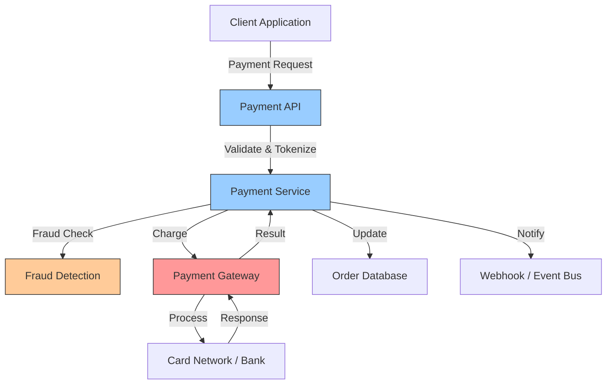

# How to Monitor Payment Processing Latency and Errors with OpenTelemetry

Author: [nawazdhandala](https://www.github.com/nawazdhandala)

Tags: OpenTelemetry, Payments, Latency, Error Monitoring, Distributed Tracing, Metrics, Observability

Description: A practical guide to monitoring payment processing latency and errors with OpenTelemetry, covering instrumentation, metrics, alerting, and debugging payment failures.

---

Payment processing is where latency and errors directly translate to lost revenue. A payment call that takes 10 seconds instead of 2 causes cart abandonment. A silent failure in payment confirmation leaves customers confused and support teams scrambling. Unlike most backend operations where a small delay is tolerable, payment flows demand tight latency budgets and clear error visibility.

OpenTelemetry provides the right primitives for this problem: distributed traces that follow a payment from initiation to settlement, metrics that capture latency distributions across payment methods and gateways, and structured attributes that make failed payments searchable. This guide covers how to build that observability layer for a real payment processing pipeline.

## Payment Processing Architecture

Most payment systems involve several layers between the customer and the actual charge. Here is a typical setup:



Each hop adds latency and introduces a failure point. The goal is to measure every segment independently so you can tell whether slowness is in your fraud check, the gateway, or the card network.

## Setting Up Payment-Specific Metrics

Before diving into traces, set up the metrics that will power your dashboards and alerts. Payment metrics need careful dimension design to avoid cardinality explosions while still being useful:

```python
# payment_metrics.py
from opentelemetry import metrics

# Create a meter scoped to the payment domain
meter = metrics.get_meter("payment-service", "1.0.0")

# Histogram for payment processing duration
# Use explicit bucket boundaries tuned for payment latency patterns
payment_duration = meter.create_histogram(
    name="payment.duration",
    description="Time taken to process a payment end-to-end",
    unit="ms",
)

# Counter for payment outcomes
payment_result = meter.create_counter(
    name="payment.result",
    description="Count of payment processing outcomes",
)

# Histogram for gateway-specific latency
gateway_latency = meter.create_histogram(
    name="payment.gateway.latency",
    description="Latency of the external gateway API call",
    unit="ms",
)

# Counter for gateway errors by type
gateway_errors = meter.create_counter(
    name="payment.gateway.errors",
    description="Count of payment gateway errors by category",
)

# Gauge for in-flight payment requests
inflight_payments = meter.create_up_down_counter(
    name="payment.inflight",
    description="Number of payment requests currently being processed",
)
```

The separation between `payment.duration` (your total processing time) and `payment.gateway.latency` (the external call time) is intentional. When total duration spikes, you can immediately check whether the gateway is the bottleneck or if something on your side changed.

## Instrumenting the Payment Service

The payment service is the core component. Here is how to instrument it with both traces and metrics, capturing the detail you need without logging sensitive cardholder data:

```python
# payment_service.py
import time
from opentelemetry import trace, metrics
from opentelemetry.trace import SpanKind, StatusCode

tracer = trace.get_tracer("payment-service", "1.0.0")
meter = metrics.get_meter("payment-service", "1.0.0")

# Initialize metrics (from the setup above)
payment_duration = meter.create_histogram("payment.duration", unit="ms")
payment_result = meter.create_counter("payment.result")
gateway_latency = meter.create_histogram("payment.gateway.latency", unit="ms")
inflight_payments = meter.create_up_down_counter("payment.inflight")

async def process_payment(payment_request):
    """Process a payment through validation, fraud check, and gateway charge."""
    start_time = time.monotonic()
    inflight_payments.add(1)

    # Start the root span for payment processing
    with tracer.start_as_current_span(
        "payment.process",
        kind=SpanKind.SERVER,
        attributes={
            "payment.method": payment_request.method_type,
            "payment.currency": payment_request.currency,
            "payment.amount_bucket": _bucket_amount(payment_request.amount),
            "merchant.id": payment_request.merchant_id,
        },
    ) as span:
        try:
            # Step 1: Input validation
            with tracer.start_as_current_span("payment.validate_input") as val_span:
                validation_result = validate_payment_input(payment_request)
                val_span.set_attribute("validation.passed", validation_result.is_valid)
                if not validation_result.is_valid:
                    val_span.set_status(StatusCode.ERROR, validation_result.reason)
                    raise PaymentValidationError(validation_result.reason)

            # Step 2: Fraud detection
            fraud_start = time.monotonic()
            with tracer.start_as_current_span(
                "payment.fraud_check",
                kind=SpanKind.CLIENT,
                attributes={"peer.service": "fraud-detection"},
            ) as fraud_span:
                fraud_result = await fraud_service.check(payment_request)
                fraud_span.set_attribute("fraud.score", fraud_result.risk_score)
                fraud_span.set_attribute("fraud.decision", fraud_result.decision)
                fraud_span.set_attribute(
                    "fraud.latency_ms",
                    (time.monotonic() - fraud_start) * 1000,
                )
                if fraud_result.decision == "reject":
                    fraud_span.add_event("payment_rejected_fraud", {
                        "fraud.risk_score": fraud_result.risk_score,
                    })
                    raise PaymentFraudRejectError("Payment rejected by fraud check")

            # Step 3: Gateway charge
            gateway_result = await _charge_gateway(payment_request, span)

            # Step 4: Record the successful outcome
            span.set_attribute("payment.transaction_id", gateway_result.transaction_id)
            span.set_attribute("payment.status", "success")
            span.set_status(StatusCode.OK)

            # Record metrics for the successful payment
            duration_ms = (time.monotonic() - start_time) * 1000
            attrs = {
                "payment.method": payment_request.method_type,
                "payment.currency": payment_request.currency,
                "payment.status": "success",
            }
            payment_duration.record(duration_ms, attrs)
            payment_result.add(1, attrs)

            return gateway_result

        except PaymentValidationError as e:
            _record_failure(span, start_time, payment_request, "validation_error", str(e))
            raise
        except PaymentFraudRejectError as e:
            _record_failure(span, start_time, payment_request, "fraud_rejected", str(e))
            raise
        except GatewayTimeoutError as e:
            _record_failure(span, start_time, payment_request, "gateway_timeout", str(e))
            raise
        except GatewayDeclineError as e:
            _record_failure(span, start_time, payment_request, "gateway_declined", str(e))
            raise
        except Exception as e:
            _record_failure(span, start_time, payment_request, "internal_error", str(e))
            raise
        finally:
            inflight_payments.add(-1)


def _record_failure(span, start_time, request, failure_type, message):
    """Record failure details on the span and in metrics."""
    span.set_attribute("payment.status", "failed")
    span.set_attribute("payment.failure_type", failure_type)
    span.set_status(StatusCode.ERROR, message)
    span.record_exception(Exception(message))

    duration_ms = (time.monotonic() - start_time) * 1000
    attrs = {
        "payment.method": request.method_type,
        "payment.currency": request.currency,
        "payment.status": "failed",
        "payment.failure_type": failure_type,
    }
    payment_duration.record(duration_ms, attrs)
    payment_result.add(1, attrs)


def _bucket_amount(amount):
    """Bucket payment amounts to avoid high cardinality in attributes."""
    if amount < 10:
        return "under_10"
    elif amount < 50:
        return "10_to_50"
    elif amount < 200:
        return "50_to_200"
    elif amount < 1000:
        return "200_to_1000"
    else:
        return "over_1000"
```

A few important details in this code. The `_bucket_amount` function prevents high cardinality by grouping payment amounts into ranges rather than recording exact values. The `payment.failure_type` attribute categorizes errors so you can alert on specific failure modes. And the `inflight_payments` gauge lets you detect concurrency issues where too many payments are being processed simultaneously.

## Instrumenting the Gateway Call

The gateway call deserves its own dedicated instrumentation because it is the most variable and least controllable part of the flow:

```python
# gateway_client.py
import time
import aiohttp
from opentelemetry import trace, metrics, context
from opentelemetry.trace import SpanKind, StatusCode
from opentelemetry.propagators import inject

tracer = trace.get_tracer("payment-service", "1.0.0")
gateway_latency = metrics.get_meter("payment-service").create_histogram(
    "payment.gateway.latency", unit="ms"
)
gateway_errors = metrics.get_meter("payment-service").create_counter(
    "payment.gateway.errors"
)

async def _charge_gateway(payment_request, parent_span):
    """Call the payment gateway with detailed latency tracking."""
    with tracer.start_as_current_span(
        "payment.gateway.charge",
        kind=SpanKind.CLIENT,
        attributes={
            "peer.service": "payment-gateway",
            "http.method": "POST",
            "http.url": "https://api.gateway.example.com/v1/charges",
            "payment.gateway.provider": "stripe",
        },
    ) as gw_span:
        start = time.monotonic()
        headers = {}
        # Inject trace context into outgoing headers
        inject(headers)

        try:
            async with aiohttp.ClientSession() as session:
                async with session.post(
                    "https://api.gateway.example.com/v1/charges",
                    json=_build_charge_request(payment_request),
                    headers=headers,
                    timeout=aiohttp.ClientTimeout(total=30),
                ) as response:
                    latency_ms = (time.monotonic() - start) * 1000
                    gw_span.set_attribute("http.status_code", response.status)
                    gw_span.set_attribute("payment.gateway.latency_ms", latency_ms)

                    # Record gateway latency metric
                    gateway_latency.record(latency_ms, {
                        "gateway.provider": "stripe",
                        "http.status_code": str(response.status),
                    })

                    body = await response.json()

                    if response.status == 200:
                        gw_span.set_attribute("payment.gateway.transaction_id", body["id"])
                        gw_span.set_status(StatusCode.OK)
                        return GatewayResult(
                            transaction_id=body["id"],
                            status=body["status"],
                        )
                    elif response.status == 402:
                        # Payment was declined by the issuing bank
                        gw_span.set_attribute("payment.decline_code", body.get("decline_code", "unknown"))
                        gw_span.set_attribute("payment.decline_reason", body.get("message", ""))
                        gateway_errors.add(1, {
                            "gateway.provider": "stripe",
                            "error.type": "declined",
                            "decline_code": body.get("decline_code", "unknown"),
                        })
                        raise GatewayDeclineError(body.get("message", "Payment declined"))
                    else:
                        # Unexpected error from gateway
                        gateway_errors.add(1, {
                            "gateway.provider": "stripe",
                            "error.type": "gateway_error",
                            "http.status_code": str(response.status),
                        })
                        raise GatewayError(f"Gateway returned {response.status}")

        except aiohttp.ServerTimeoutError:
            latency_ms = (time.monotonic() - start) * 1000
            gw_span.set_attribute("payment.gateway.latency_ms", latency_ms)
            gw_span.set_status(StatusCode.ERROR, "Gateway timeout")
            gateway_errors.add(1, {
                "gateway.provider": "stripe",
                "error.type": "timeout",
            })
            gateway_latency.record(latency_ms, {
                "gateway.provider": "stripe",
                "http.status_code": "timeout",
            })
            raise GatewayTimeoutError(f"Gateway timed out after {latency_ms:.0f}ms")
```

Recording the gateway latency as both a span attribute and a metric gives you two views. The span attribute lets you find specific slow transactions. The metric lets you see latency trends over time across all transactions.

## Tracking Retry Behavior

Payment retries add complexity. You need to know how many times a payment was retried and whether retries contributed to the final outcome:

```python
# retry_handler.py
from opentelemetry import trace

tracer = trace.get_tracer("payment-service", "1.0.0")

async def charge_with_retry(payment_request, max_retries=3):
    """Attempt payment with retries for transient failures."""
    with tracer.start_as_current_span(
        "payment.charge_with_retry",
        attributes={"payment.max_retries": max_retries},
    ) as span:
        last_error = None

        for attempt in range(1, max_retries + 1):
            with tracer.start_as_current_span(
                "payment.attempt",
                attributes={"payment.attempt_number": attempt},
            ) as attempt_span:
                try:
                    result = await _charge_gateway(payment_request, attempt_span)
                    # Record which attempt succeeded
                    span.set_attribute("payment.successful_attempt", attempt)
                    span.set_attribute("payment.total_attempts", attempt)
                    return result

                except GatewayTimeoutError as e:
                    last_error = e
                    attempt_span.add_event("retry_scheduled", {
                        "attempt": attempt,
                        "reason": "gateway_timeout",
                        "next_attempt_in_ms": 1000 * attempt,
                    })
                    # Exponential backoff
                    await asyncio.sleep(1.0 * attempt)

                except GatewayDeclineError:
                    # Do not retry declined payments
                    span.set_attribute("payment.total_attempts", attempt)
                    raise

                except GatewayError as e:
                    last_error = e
                    attempt_span.add_event("retry_scheduled", {
                        "attempt": attempt,
                        "reason": "gateway_error",
                    })
                    await asyncio.sleep(1.0 * attempt)

        # All retries exhausted
        span.set_attribute("payment.total_attempts", max_retries)
        span.set_attribute("payment.exhausted_retries", True)
        raise last_error
```

The `payment.total_attempts` attribute is useful for two things: alerting when retries increase (indicating gateway instability) and understanding the latency impact of retries on overall payment duration.

## Collector Configuration for Payment Telemetry

Configure the OpenTelemetry Collector to handle payment telemetry with appropriate sampling and processing:

```yaml
# otel-collector-config.yaml
receivers:
  otlp:
    protocols:
      grpc:
        endpoint: 0.0.0.0:4317

processors:
  memory_limiter:
    check_interval: 1s
    limit_mib: 1024

  batch:
    timeout: 5s
    send_batch_size: 256

  # Tail-based sampling to keep all error traces and sample successful ones
  tail_sampling:
    decision_wait: 10s
    policies:
      # Always keep payment errors
      - name: payment-errors
        type: status_code
        status_code:
          status_codes: [ERROR]
      # Always keep slow payments (over 5 seconds)
      - name: slow-payments
        type: latency
        latency:
          threshold_ms: 5000
      # Sample 20% of successful fast payments
      - name: normal-payments
        type: probabilistic
        probabilistic:
          sampling_percentage: 20

exporters:
  otlp:
    endpoint: your-backend:4317
    tls:
      insecure: false

service:
  pipelines:
    traces:
      receivers: [otlp]
      processors: [memory_limiter, tail_sampling, batch]
      exporters: [otlp]
    metrics:
      receivers: [otlp]
      processors: [memory_limiter, batch]
      exporters: [otlp]
```

The tail-based sampling configuration is important for payment monitoring. You want to keep every error trace and every slow trace, but you can afford to sample a fraction of successful, fast payments. This gives you full visibility into problems while controlling storage costs.

## Building Alerts from Payment Metrics

With metrics flowing, set up alerts for the conditions that matter most:

```yaml
# alert-rules.yaml (Prometheus-style)
groups:
  - name: payment_alerts
    rules:
      # Alert when payment error rate exceeds 5%
      - alert: HighPaymentErrorRate
        expr: |
          sum(rate(payment_result_total{payment_status="failed"}[5m]))
          /
          sum(rate(payment_result_total[5m]))
          > 0.05
        for: 3m
        labels:
          severity: critical
        annotations:
          summary: "Payment error rate above 5%"

      # Alert when gateway latency p95 exceeds 3 seconds
      - alert: HighGatewayLatency
        expr: |
          histogram_quantile(0.95,
            rate(payment_gateway_latency_bucket[5m])
          ) > 3000
        for: 5m
        labels:
          severity: warning
        annotations:
          summary: "Payment gateway p95 latency above 3s"

      # Alert when gateway timeout rate spikes
      - alert: GatewayTimeouts
        expr: |
          sum(rate(payment_gateway_errors_total{error_type="timeout"}[5m])) > 1
        for: 2m
        labels:
          severity: critical
        annotations:
          summary: "Payment gateway timeouts detected"
```

These alerts cover the three most common payment problems: elevated error rates, high latency, and gateway timeouts. The `for` clauses prevent alerting on brief blips.

## Investigating a Payment Incident

When an alert fires, your investigation workflow looks like this. Suppose the `HighPaymentErrorRate` alert triggers. First, check the error breakdown by type using your metrics dashboard. You see that `gateway_declined` errors jumped from 2% to 12% in the last 10 minutes, and they are concentrated on payments with `payment.method: debit_card`.

Next, pull up traces filtered by `payment.failure_type = gateway_declined` and `payment.method = debit_card` from the same time window. The traces show that the gateway is returning decline code `insufficient_funds` much more frequently than normal. The `payment.gateway.latency_ms` attribute shows normal response times, so the gateway itself is healthy.

This pattern, normal latency but elevated declines on a specific card type, points to an upstream issue at the card network level rather than anything in your infrastructure. You can then check the card network's status page and adjust your retry logic or user-facing messaging accordingly.

## Sensitive Data Considerations

Payment instrumentation requires careful attention to data sensitivity. Never log or trace the following:

- Full card numbers (PAN)
- CVV or security codes
- Full account numbers
- Authentication credentials

Instead, record only safe identifiers and bucketed values:

```python
# Safe attributes to record on payment spans
span.set_attribute("payment.method_type", "visa_credit")      # Card type, not number
span.set_attribute("payment.amount_bucket", "50_to_200")       # Bucketed, not exact
span.set_attribute("payment.last_four", "4242")                # Only last 4 digits
span.set_attribute("payment.transaction_id", "txn_abc123")     # Gateway reference ID
span.set_attribute("merchant.id", "merch_456")                 # Merchant identifier

# Never record these
# span.set_attribute("card.number", "4242424242424242")        # NEVER
# span.set_attribute("card.cvv", "123")                        # NEVER
```

Configure the Collector to strip any sensitive data that might slip through:

```yaml
processors:
  # Remove any accidentally-included sensitive attributes
  attributes:
    actions:
      - key: card.number
        action: delete
      - key: card.cvv
        action: delete
      - key: card.expiry
        action: delete
      - key: account.number
        action: delete
```

This acts as a safety net even if application code inadvertently records sensitive values.

## Conclusion

Monitoring payment processing with OpenTelemetry comes down to three things: measure every segment of the payment flow independently so you can isolate where slowness or failures originate, categorize errors with enough detail to drive actionable alerts, and never log sensitive cardholder data. The combination of distributed traces for individual transaction debugging and metrics for aggregate trend analysis gives you the coverage needed to keep payment flows healthy. Start with the gateway call instrumentation since that is where the most variability lives, then expand to cover fraud checks, retries, and settlement confirmation.
