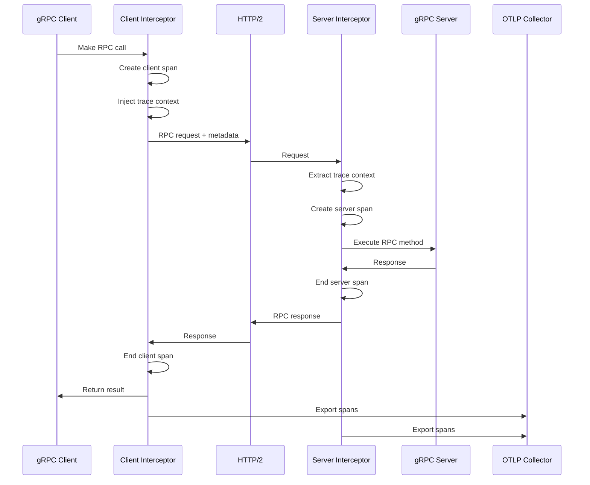

# How to Monitor Python gRPC Services with OpenTelemetry

Author: [nawazdhandala](https://www.github.com/nawazdhandala)

Tags: OpenTelemetry, Python, gRPC, Services, Tracing, Monitoring

Description: Comprehensive guide to instrumenting Python gRPC services with OpenTelemetry for distributed tracing, monitoring, and observability in microservices.

gRPC is a high-performance RPC framework developed by Google that uses Protocol Buffers for serialization and HTTP/2 for transport. It has become the standard for inter-service communication in microservices architectures due to its efficiency, strong typing, and support for streaming.

When running gRPC services in production, observability is critical for understanding service interactions, debugging issues, and optimizing performance. OpenTelemetry provides comprehensive instrumentation for gRPC that automatically traces all RPC calls, both unary and streaming, on both client and server sides.

## Understanding gRPC Instrumentation Architecture

OpenTelemetry instruments gRPC by intercepting calls at the client and server interceptor layers, creating spans for each RPC invocation with detailed metadata about the call.



## Installation and Setup

Install gRPC, Protocol Buffers, and OpenTelemetry instrumentation packages.

```bash
pip install grpcio \
            grpcio-tools \
            opentelemetry-api \
            opentelemetry-sdk \
            opentelemetry-instrumentation-grpc \
            opentelemetry-exporter-otlp
```

## Defining the gRPC Service

First, define a simple service using Protocol Buffers.

```protobuf
// user_service.proto
syntax = "proto3";

package user;

// User service definition
service UserService {
    // Unary RPC - get single user
    rpc GetUser (GetUserRequest) returns (User) {}

    // Unary RPC - create user
    rpc CreateUser (CreateUserRequest) returns (User) {}

    // Server streaming RPC - list all users
    rpc ListUsers (ListUsersRequest) returns (stream User) {}

    // Client streaming RPC - batch create users
    rpc BatchCreateUsers (stream CreateUserRequest) returns (BatchCreateUsersResponse) {}

    // Bidirectional streaming RPC - real-time updates
    rpc StreamUserUpdates (stream UserUpdateRequest) returns (stream UserUpdateResponse) {}
}

message GetUserRequest {
    int32 user_id = 1;
}

message CreateUserRequest {
    string name = 1;
    string email = 2;
}

message User {
    int32 user_id = 1;
    string name = 2;
    string email = 3;
    string created_at = 4;
}

message ListUsersRequest {
    int32 page_size = 1;
    int32 page_number = 2;
}

message BatchCreateUsersResponse {
    int32 created_count = 1;
    repeated int32 user_ids = 2;
}

message UserUpdateRequest {
    int32 user_id = 1;
    string field = 2;
    string value = 3;
}

message UserUpdateResponse {
    int32 user_id = 1;
    bool success = 2;
    string message = 3;
}
```

Generate Python code from the proto file:

```bash
python -m grpc_tools.protoc -I. --python_out=. --grpc_python_out=. user_service.proto
```

## Instrumented gRPC Server

Here's a complete gRPC server with OpenTelemetry instrumentation.

```python
import grpc
from concurrent import futures
import time
from datetime import datetime

# Import generated code
import user_service_pb2
import user_service_pb2_grpc

from opentelemetry import trace
from opentelemetry.sdk.trace import TracerProvider
from opentelemetry.sdk.trace.export import BatchSpanProcessor
from opentelemetry.exporter.otlp.proto.grpc.trace_exporter import OTLPSpanExporter
from opentelemetry.sdk.resources import Resource
from opentelemetry.instrumentation.grpc import GrpcInstrumentorServer

# Configure OpenTelemetry for the server
resource = Resource.create({
    "service.name": "user-grpc-server",
    "service.version": "1.0.0",
    "deployment.environment": "production"
})

provider = TracerProvider(resource=resource)
otlp_exporter = OTLPSpanExporter(
    endpoint="http://localhost:4317",
    insecure=True
)
processor = BatchSpanProcessor(otlp_exporter)
provider.add_span_processor(processor)
trace.set_tracer_provider(provider)

# Get tracer for custom spans
tracer = trace.get_tracer(__name__)

class UserServiceServicer(user_service_pb2_grpc.UserServiceServicer):
    """
    Implementation of the UserService gRPC service.
    All methods are automatically traced by OpenTelemetry.
    """

    def __init__(self):
        # Simulate database with in-memory storage
        self.users = {}
        self.next_id = 1

    def GetUser(self, request, context):
        """
        Unary RPC: Get single user by ID.
        Automatically traced with request/response metadata.
        """
        # Access current span to add custom attributes
        current_span = trace.get_current_span()
        current_span.set_attribute("rpc.method", "GetUser")
        current_span.set_attribute("user.id", request.user_id)

        # Add custom span for database operation
        with tracer.start_as_current_span("db-query-user") as span:
            span.set_attribute("db.operation", "SELECT")
            span.set_attribute("db.user_id", request.user_id)

            # Simulate database query
            time.sleep(0.01)

            if request.user_id not in self.users:
                span.set_attribute("db.found", False)
                context.set_code(grpc.StatusCode.NOT_FOUND)
                context.set_details(f'User {request.user_id} not found')
                current_span.set_attribute("error", True)
                return user_service_pb2.User()

            user = self.users[request.user_id]
            span.set_attribute("db.found", True)

        current_span.set_attribute("response.has_data", True)
        return user

    def CreateUser(self, request, context):
        """
        Unary RPC: Create new user.
        Demonstrates validation and error handling with tracing.
        """
        current_span = trace.get_current_span()
        current_span.set_attribute("rpc.method", "CreateUser")
        current_span.set_attribute("user.name", request.name)
        current_span.set_attribute("user.email", request.email)

        # Validate input
        with tracer.start_as_current_span("validate-input") as span:
            span.set_attribute("validation.fields", 2)

            if not request.name or not request.email:
                span.set_attribute("validation.success", False)
                context.set_code(grpc.StatusCode.INVALID_ARGUMENT)
                context.set_details('Name and email are required')
                current_span.set_attribute("error", True)
                return user_service_pb2.User()

            span.set_attribute("validation.success", True)

        # Create user in database
        with tracer.start_as_current_span("db-insert-user") as span:
            span.set_attribute("db.operation", "INSERT")

            # Simulate database insert
            time.sleep(0.02)

            user_id = self.next_id
            self.next_id += 1

            user = user_service_pb2.User(
                user_id=user_id,
                name=request.name,
                email=request.email,
                created_at=datetime.now().isoformat()
            )

            self.users[user_id] = user
            span.set_attribute("db.user_id", user_id)

        current_span.set_attribute("user.created_id", user_id)
        return user

    def ListUsers(self, request, context):
        """
        Server streaming RPC: Stream all users with pagination.
        Each yielded response is tracked in the same span.
        """
        current_span = trace.get_current_span()
        current_span.set_attribute("rpc.method", "ListUsers")
        current_span.set_attribute("pagination.page_size", request.page_size)
        current_span.set_attribute("pagination.page_number", request.page_number)

        with tracer.start_as_current_span("db-query-users") as span:
            span.set_attribute("db.operation", "SELECT")

            # Calculate pagination
            start_idx = request.page_number * request.page_size
            end_idx = start_idx + request.page_size

            user_list = list(self.users.values())
            page_users = user_list[start_idx:end_idx]

            span.set_attribute("db.total_users", len(user_list))
            span.set_attribute("db.page_users", len(page_users))

        # Stream users
        with tracer.start_as_current_span("stream-users") as span:
            span.set_attribute("stream.count", len(page_users))

            for idx, user in enumerate(page_users):
                yield user
                span.add_event(f"Streamed user {idx + 1}/{len(page_users)}")

        current_span.set_attribute("stream.completed", True)

    def BatchCreateUsers(self, request_iterator, context):
        """
        Client streaming RPC: Receive stream of users to create.
        Process multiple requests in a single RPC call.
        """
        current_span = trace.get_current_span()
        current_span.set_attribute("rpc.method", "BatchCreateUsers")

        created_users = []

        with tracer.start_as_current_span("process-batch") as span:
            for idx, request in enumerate(request_iterator):
                with tracer.start_as_current_span(f"create-user-{idx}") as user_span:
                    user_span.set_attribute("user.name", request.name)
                    user_span.set_attribute("user.email", request.email)

                    # Create user
                    user_id = self.next_id
                    self.next_id += 1

                    user = user_service_pb2.User(
                        user_id=user_id,
                        name=request.name,
                        email=request.email,
                        created_at=datetime.now().isoformat()
                    )

                    self.users[user_id] = user
                    created_users.append(user_id)

                    user_span.set_attribute("user.created_id", user_id)

            span.set_attribute("batch.total_created", len(created_users))

        current_span.set_attribute("batch.count", len(created_users))

        return user_service_pb2.BatchCreateUsersResponse(
            created_count=len(created_users),
            user_ids=created_users
        )

    def StreamUserUpdates(self, request_iterator, context):
        """
        Bidirectional streaming RPC: Real-time user updates.
        Demonstrates streaming in both directions with tracing.
        """
        current_span = trace.get_current_span()
        current_span.set_attribute("rpc.method", "StreamUserUpdates")

        update_count = 0

        for request in request_iterator:
            with tracer.start_as_current_span("process-update") as span:
                span.set_attribute("update.user_id", request.user_id)
                span.set_attribute("update.field", request.field)
                span.set_attribute("update.value", request.value)

                # Process update
                if request.user_id in self.users:
                    span.set_attribute("update.success", True)
                    update_count += 1

                    yield user_service_pb2.UserUpdateResponse(
                        user_id=request.user_id,
                        success=True,
                        message=f"Updated {request.field} successfully"
                    )
                else:
                    span.set_attribute("update.success", False)

                    yield user_service_pb2.UserUpdateResponse(
                        user_id=request.user_id,
                        success=False,
                        message=f"User {request.user_id} not found"
                    )

        current_span.set_attribute("stream.updates_processed", update_count)

def serve():
    """Start the gRPC server with OpenTelemetry instrumentation"""

    # Create server with thread pool
    server = grpc.server(futures.ThreadPoolExecutor(max_workers=10))

    # Add service to server
    user_service_pb2_grpc.add_UserServiceServicer_to_server(
        UserServiceServicer(), server
    )

    # Instrument the server before starting
    # This must be called before server.start()
    GrpcInstrumentorServer().instrument_server(server)

    # Start server
    port = '50051'
    server.add_insecure_port(f'[::]:{port}')
    server.start()

    print(f'gRPC Server started on port {port}')
    print('OpenTelemetry instrumentation enabled')

    try:
        server.wait_for_termination()
    except KeyboardInterrupt:
        server.stop(0)
        print('\nServer stopped')

if __name__ == '__main__':
    serve()
```

## Instrumented gRPC Client

Here's a gRPC client with automatic instrumentation.

```python
import grpc
import time

# Import generated code
import user_service_pb2
import user_service_pb2_grpc

from opentelemetry import trace
from opentelemetry.sdk.trace import TracerProvider
from opentelemetry.sdk.trace.export import BatchSpanProcessor
from opentelemetry.exporter.otlp.proto.grpc.trace_exporter import OTLPSpanExporter
from opentelemetry.sdk.resources import Resource
from opentelemetry.instrumentation.grpc import GrpcInstrumentorClient

# Configure OpenTelemetry for the client
resource = Resource.create({
    "service.name": "user-grpc-client",
    "service.version": "1.0.0",
    "deployment.environment": "production"
})

provider = TracerProvider(resource=resource)
otlp_exporter = OTLPSpanExporter(
    endpoint="http://localhost:4317",
    insecure=True
)
processor = BatchSpanProcessor(otlp_exporter)
provider.add_span_processor(processor)
trace.set_tracer_provider(provider)

# Instrument gRPC client before making calls
GrpcInstrumentorClient().instrument()

# Get tracer for custom spans
tracer = trace.get_tracer(__name__)

def run_client():
    """
    Demonstrate various gRPC patterns with automatic tracing.
    All RPC calls are automatically instrumented.
    """

    # Create channel and stub
    channel = grpc.insecure_channel('localhost:50051')
    stub = user_service_pb2_grpc.UserServiceStub(channel)

    # Unary call: Create user
    with tracer.start_as_current_span("create-user-workflow") as span:
        span.set_attribute("workflow.type", "user_creation")

        request = user_service_pb2.CreateUserRequest(
            name="Alice Smith",
            email="alice@example.com"
        )

        try:
            # RPC call is automatically traced
            response = stub.CreateUser(request)

            span.set_attribute("user.created_id", response.user_id)
            print(f"Created user: {response.user_id} - {response.name}")

        except grpc.RpcError as e:
            span.record_exception(e)
            span.set_attribute("error.code", e.code().name)
            span.set_status(trace.Status(trace.StatusCode.ERROR, str(e)))
            print(f"RPC failed: {e.code()} - {e.details()}")

    # Unary call: Get user
    with tracer.start_as_current_span("get-user-workflow") as span:
        span.set_attribute("workflow.type", "user_fetch")

        request = user_service_pb2.GetUserRequest(user_id=1)

        try:
            response = stub.GetUser(request)

            span.set_attribute("user.found", True)
            print(f"Retrieved user: {response.name} ({response.email})")

        except grpc.RpcError as e:
            span.record_exception(e)
            span.set_attribute("user.found", False)
            print(f"User not found: {e.details()}")

    # Server streaming: List users
    with tracer.start_as_current_span("list-users-workflow") as span:
        span.set_attribute("workflow.type", "user_list")

        request = user_service_pb2.ListUsersRequest(
            page_size=10,
            page_number=0
        )

        try:
            user_count = 0

            # Receive stream of users
            for user in stub.ListUsers(request):
                user_count += 1
                print(f"User {user_count}: {user.name}")

            span.set_attribute("users.received", user_count)

        except grpc.RpcError as e:
            span.record_exception(e)
            print(f"Stream failed: {e.details()}")

    # Client streaming: Batch create users
    with tracer.start_as_current_span("batch-create-workflow") as span:
        span.set_attribute("workflow.type", "batch_creation")

        def generate_users():
            """Generator for streaming user creation requests"""
            users = [
                ("Bob Jones", "bob@example.com"),
                ("Carol White", "carol@example.com"),
                ("David Brown", "david@example.com")
            ]

            for name, email in users:
                yield user_service_pb2.CreateUserRequest(
                    name=name,
                    email=email
                )
                time.sleep(0.1)  # Simulate delay

        try:
            # Send stream of user creation requests
            response = stub.BatchCreateUsers(generate_users())

            span.set_attribute("batch.created_count", response.created_count)
            print(f"Batch created {response.created_count} users")
            print(f"User IDs: {response.user_ids}")

        except grpc.RpcError as e:
            span.record_exception(e)
            print(f"Batch creation failed: {e.details()}")

    # Bidirectional streaming: Real-time updates
    with tracer.start_as_current_span("stream-updates-workflow") as span:
        span.set_attribute("workflow.type", "bidirectional_stream")

        def generate_updates():
            """Generator for streaming update requests"""
            updates = [
                (1, "name", "Alice Johnson"),
                (1, "email", "alice.j@example.com"),
                (2, "name", "Bob Smith")
            ]

            for user_id, field, value in updates:
                yield user_service_pb2.UserUpdateRequest(
                    user_id=user_id,
                    field=field,
                    value=value
                )
                time.sleep(0.1)

        try:
            update_count = 0

            # Send and receive streams simultaneously
            responses = stub.StreamUserUpdates(generate_updates())

            for response in responses:
                update_count += 1
                print(f"Update {response.user_id}: "
                      f"{'Success' if response.success else 'Failed'} - "
                      f"{response.message}")

            span.set_attribute("updates.processed", update_count)

        except grpc.RpcError as e:
            span.record_exception(e)
            print(f"Stream updates failed: {e.details()}")

    # Close channel
    channel.close()

if __name__ == '__main__':
    run_client()
```

## Custom Interceptors with Tracing

Add custom logic alongside automatic instrumentation using interceptors.

```python
import grpc
from opentelemetry import trace

tracer = trace.get_tracer(__name__)

class CustomClientInterceptor(grpc.UnaryUnaryClientInterceptor,
                              grpc.UnaryStreamClientInterceptor,
                              grpc.StreamUnaryClientInterceptor,
                              grpc.StreamStreamClientInterceptor):
    """
    Custom client interceptor for adding business logic.
    Works alongside OpenTelemetry instrumentation.
    """

    def intercept_unary_unary(self, continuation, client_call_details, request):
        """Intercept unary-unary calls"""
        current_span = trace.get_current_span()

        # Add custom metadata to the call
        metadata = []
        if client_call_details.metadata:
            metadata = list(client_call_details.metadata)

        # Add custom header
        metadata.append(("x-custom-header", "custom-value"))

        # Add span attribute
        current_span.set_attribute("custom.metadata.added", True)

        # Modify call details
        client_call_details = grpc._interceptor._ClientCallDetails(
            method=client_call_details.method,
            timeout=client_call_details.timeout,
            metadata=metadata,
            credentials=client_call_details.credentials
        )

        return continuation(client_call_details, request)

    def intercept_unary_stream(self, continuation, client_call_details, request):
        """Intercept unary-stream calls"""
        current_span = trace.get_current_span()
        current_span.set_attribute("rpc.type", "unary_stream")

        return continuation(client_call_details, request)

    def intercept_stream_unary(self, continuation, client_call_details, request_iterator):
        """Intercept stream-unary calls"""
        current_span = trace.get_current_span()
        current_span.set_attribute("rpc.type", "stream_unary")

        return continuation(client_call_details, request_iterator)

    def intercept_stream_stream(self, continuation, client_call_details, request_iterator):
        """Intercept stream-stream calls"""
        current_span = trace.get_current_span()
        current_span.set_attribute("rpc.type", "stream_stream")

        return continuation(client_call_details, request_iterator)

# Use custom interceptor with channel
def create_instrumented_channel(target):
    """Create channel with custom interceptor and automatic tracing"""
    channel = grpc.insecure_channel(target)

    # Add custom interceptor
    intercepted_channel = grpc.intercept_channel(
        channel,
        CustomClientInterceptor()
    )

    return intercepted_channel
```

## Error Handling and Status Codes

Properly handle gRPC errors and status codes with tracing.

```python
import grpc
from opentelemetry import trace

tracer = trace.get_tracer(__name__)

def handle_grpc_errors(stub):
    """
    Demonstrate comprehensive error handling with tracing.
    Each error type is properly recorded in spans.
    """

    with tracer.start_as_current_span("error-handling-demo") as span:

        # Test case 1: Not found error
        with tracer.start_as_current_span("test-not-found") as test_span:
            try:
                request = user_service_pb2.GetUserRequest(user_id=99999)
                response = stub.GetUser(request)

            except grpc.RpcError as e:
                test_span.record_exception(e)
                test_span.set_attribute("error.code", e.code().name)
                test_span.set_attribute("error.details", e.details())

                if e.code() == grpc.StatusCode.NOT_FOUND:
                    test_span.set_attribute("error.type", "not_found")
                    print("User not found (expected)")

        # Test case 2: Invalid argument error
        with tracer.start_as_current_span("test-invalid-argument") as test_span:
            try:
                request = user_service_pb2.CreateUserRequest(name="", email="")
                response = stub.CreateUser(request)

            except grpc.RpcError as e:
                test_span.record_exception(e)
                test_span.set_attribute("error.code", e.code().name)

                if e.code() == grpc.StatusCode.INVALID_ARGUMENT:
                    test_span.set_attribute("error.type", "invalid_argument")
                    print("Invalid argument (expected)")

        # Test case 3: Deadline exceeded
        with tracer.start_as_current_span("test-deadline") as test_span:
            try:
                request = user_service_pb2.GetUserRequest(user_id=1)
                # Set very short deadline
                response = stub.GetUser(request, timeout=0.001)

            except grpc.RpcError as e:
                test_span.record_exception(e)
                test_span.set_attribute("error.code", e.code().name)

                if e.code() == grpc.StatusCode.DEADLINE_EXCEEDED:
                    test_span.set_attribute("error.type", "deadline_exceeded")
                    print("Deadline exceeded (expected)")
```

## Performance Monitoring

Track performance metrics alongside traces.

```python
import time
from opentelemetry import trace

tracer = trace.get_tracer(__name__)

def monitor_rpc_performance(stub):
    """Monitor RPC call performance with detailed timing"""

    with tracer.start_as_current_span("performance-monitoring") as span:

        # Measure single call latency
        start_time = time.time()

        request = user_service_pb2.GetUserRequest(user_id=1)
        response = stub.GetUser(request)

        latency_ms = (time.time() - start_time) * 1000
        span.set_attribute("rpc.latency_ms", latency_ms)

        print(f"Single call latency: {latency_ms:.2f}ms")

        # Measure batch performance
        with tracer.start_as_current_span("batch-performance") as batch_span:
            batch_start = time.time()
            call_count = 100

            for i in range(call_count):
                request = user_service_pb2.GetUserRequest(user_id=1)
                stub.GetUser(request)

            batch_duration = time.time() - batch_start
            avg_latency = (batch_duration / call_count) * 1000

            batch_span.set_attribute("batch.call_count", call_count)
            batch_span.set_attribute("batch.total_duration_ms", batch_duration * 1000)
            batch_span.set_attribute("batch.avg_latency_ms", avg_latency)

            print(f"Batch of {call_count} calls: {avg_latency:.2f}ms average")
```

## Best Practices

When instrumenting Python gRPC services with OpenTelemetry:

1. **Instrument before starting** - Call instrumentors before creating servers or making client calls
2. **Use custom spans** for business logic within RPC methods to add context
3. **Add meaningful attributes** including RPC method names, user IDs, and operation types
4. **Handle all error types** - Record exceptions with proper status codes in spans
5. **Monitor streaming RPCs** - Add events to track streaming progress
6. **Set appropriate deadlines** - Configure timeouts to prevent hanging calls
7. **Use interceptors carefully** - Custom interceptors should complement, not interfere with, instrumentation
8. **Track performance metrics** - Add latency and throughput attributes to spans
9. **Propagate context** - Ensure trace context flows through all service calls
10. **Filter sensitive data** - Avoid logging passwords or tokens in span attributes

OpenTelemetry's gRPC instrumentation provides comprehensive visibility into your microservices communication layer. Combined with custom spans and attributes, you can build a complete observability solution that helps debug issues, optimize performance, and understand service dependencies in complex distributed systems.
