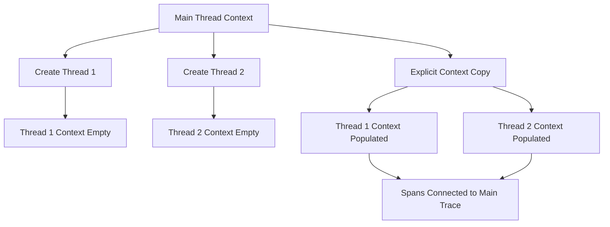

# How to Monitor Python Threading and Multiprocessing with OpenTelemetry

Author: [nawazdhandala](https://www.github.com/nawazdhandala)

Tags: OpenTelemetry, Python, Threading, Multiprocessing, Concurrency, Context

Description: Master the challenges of instrumenting concurrent Python applications using threading and multiprocessing with OpenTelemetry for complete observability.

Python's concurrency models present unique challenges for distributed tracing. The Global Interpreter Lock (GIL) encourages developers to use both threading for I/O-bound operations and multiprocessing for CPU-bound tasks. Each approach has distinct implications for how OpenTelemetry contexts propagate and how traces are collected.

## The Concurrency Tracing Challenge

When your Python application spawns threads or processes, trace context doesn't automatically flow to those execution contexts. Unlike async/await patterns where OpenTelemetry's context variables propagate naturally, threads and processes require explicit context management. Failing to handle this correctly results in disconnected traces where parallel operations appear as separate, unrelated transactions rather than parts of a cohesive whole.

The problem becomes more complex when you consider that threads share memory while processes don't. This fundamental difference affects how you design your instrumentation strategy. Thread-based concurrency can share tracer instances and context objects, but multiprocessing requires serialization and explicit context passing between processes.

## Context Propagation in Threading

Python's threading module creates new threads that share the same memory space as the parent thread. However, OpenTelemetry's context is stored in context variables that don't automatically propagate to new threads. Each thread starts with a clean context unless you explicitly copy it from the parent.



## Basic Threading with Context Propagation

The first challenge is ensuring that worker threads inherit the context from the thread that spawned them. Here's how to explicitly pass context to threads.

```python
import threading
from opentelemetry import trace, context
from opentelemetry.sdk.trace import TracerProvider
from opentelemetry.sdk.trace.export import ConsoleSpanExporter, BatchSpanProcessor
import time

# Set up tracing
provider = TracerProvider()
provider.add_span_processor(BatchSpanProcessor(ConsoleSpanExporter()))
trace.set_tracer_provider(provider)
tracer = trace.get_tracer(__name__)

def worker_function(ctx, worker_id: int, task_data: dict):
    """
    Worker function that runs in a separate thread.
    Must explicitly attach the context passed from the parent thread.
    """
    # Attach the context from the parent thread
    token = context.attach(ctx)

    try:
        # Now spans created here will be part of the parent trace
        with tracer.start_as_current_span(f"worker_{worker_id}") as span:
            span.set_attribute("worker.id", worker_id)
            span.set_attribute("task.type", task_data.get("type"))

            # Simulate work
            time.sleep(0.1)

            result = process_task(task_data)
            span.set_attribute("result.status", "completed")

            return result

    finally:
        # Always detach to clean up context
        context.detach(token)

def process_task(task_data: dict):
    """Nested operation that's part of the distributed trace."""
    with tracer.start_as_current_span("process_task") as span:
        span.set_attribute("processing", True)
        time.sleep(0.05)
        return {"processed": True}

def main_with_threads():
    """
    Main function that spawns threads with proper context propagation.
    Each thread receives the current context explicitly.
    """
    with tracer.start_as_current_span("main_operation") as span:
        span.set_attribute("concurrency.type", "threading")

        # Capture current context to pass to threads
        current_ctx = context.get_current()

        # Create multiple worker threads
        threads = []
        tasks = [
            {"type": "email", "id": 1},
            {"type": "notification", "id": 2},
            {"type": "analytics", "id": 3}
        ]

        for i, task in enumerate(tasks):
            # Pass the context to each thread explicitly
            thread = threading.Thread(
                target=worker_function,
                args=(current_ctx, i, task)
            )
            threads.append(thread)
            thread.start()

        # Wait for all threads to complete
        for thread in threads:
            thread.join()

        span.set_attribute("threads.completed", len(threads))

main_with_threads()
```

## ThreadPoolExecutor with Context Propagation

The ThreadPoolExecutor provides a higher-level interface for thread management. Context propagation requires wrapping the executor to capture and restore context automatically.

```python
from concurrent.futures import ThreadPoolExecutor
from functools import wraps

def with_context(func):
    """
    Decorator that captures the current context and restores it in the worker thread.
    This makes context propagation transparent for ThreadPoolExecutor tasks.
    """
    @wraps(func)
    def wrapper(*args, **kwargs):
        # Capture context at the time the task is submitted
        ctx = context.get_current()

        def context_aware_func():
            # Restore context in the worker thread
            token = context.attach(ctx)
            try:
                return func(*args, **kwargs)
            finally:
                context.detach(token)

        return context_aware_func()

    return wrapper

class TracedThreadPoolExecutor(ThreadPoolExecutor):
    """
    ThreadPoolExecutor that automatically propagates OpenTelemetry context.
    Each submitted task inherits the context from the submitter.
    """
    def submit(self, fn, *args, **kwargs):
        # Capture the current context when the task is submitted
        ctx = context.get_current()

        def context_wrapper():
            # Restore context in the worker thread
            token = context.attach(ctx)
            try:
                return fn(*args, **kwargs)
            finally:
                context.detach(token)

        # Submit the wrapped function
        return super().submit(context_wrapper)

def io_bound_task(task_id: int, duration: float):
    """
    Simulates an I/O-bound task like a database query or HTTP request.
    Context is automatically available thanks to TracedThreadPoolExecutor.
    """
    with tracer.start_as_current_span(f"io_task_{task_id}") as span:
        span.set_attribute("task.id", task_id)
        span.set_attribute("task.duration", duration)

        # Simulate I/O operation
        time.sleep(duration)

        span.set_attribute("task.completed", True)
        return f"Task {task_id} completed"

def parallel_io_operations():
    """
    Executes multiple I/O operations in parallel using a thread pool.
    All operations are traced as part of a single distributed trace.
    """
    with tracer.start_as_current_span("parallel_io") as span:
        span.set_attribute("executor.type", "thread_pool")

        # Use the traced executor
        with TracedThreadPoolExecutor(max_workers=3) as executor:
            # Submit multiple tasks
            futures = []
            for i in range(5):
                future = executor.submit(io_bound_task, i, 0.1)
                futures.append(future)

            # Wait for all tasks to complete
            results = [future.result() for future in futures]

            span.set_attribute("tasks.completed", len(results))
            return results

results = parallel_io_operations()
print(f"Completed tasks: {results}")
```

## Multiprocessing Context Serialization

Multiprocessing is more challenging because processes don't share memory. You must serialize the span context and pass it to child processes explicitly.

```python
from multiprocessing import Process, Queue
from opentelemetry.trace import SpanContext, TraceFlags, set_span_in_context

def serialize_current_span_context():
    """
    Serializes the current span context for passing to another process.
    Returns a dictionary that can be pickled and sent across process boundaries.
    """
    current_span = trace.get_current_span()
    span_ctx = current_span.get_span_context()

    if not span_ctx.is_valid():
        return None

    return {
        "trace_id": span_ctx.trace_id,
        "span_id": span_ctx.span_id,
        "trace_flags": int(span_ctx.trace_flags),
        "trace_state": str(span_ctx.trace_state) if span_ctx.trace_state else None
    }

def deserialize_span_context(context_dict):
    """
    Deserializes a span context received from another process.
    Returns a SpanContext object or None if deserialization fails.
    """
    if not context_dict:
        return None

    try:
        return SpanContext(
            trace_id=context_dict["trace_id"],
            span_id=context_dict["span_id"],
            is_remote=True,
            trace_flags=TraceFlags(context_dict["trace_flags"]),
            trace_state=None  # Simplified for this example
        )
    except (KeyError, ValueError):
        return None

def cpu_intensive_worker(context_dict: dict, worker_id: int, data: list, result_queue: Queue):
    """
    Worker function that runs in a separate process.
    Must recreate the tracer provider and reconstruct context.
    """
    # Each process needs its own tracer provider
    # Note: In production, configure this to export to the same backend
    worker_provider = TracerProvider()
    worker_provider.add_span_processor(BatchSpanProcessor(ConsoleSpanExporter()))
    trace.set_tracer_provider(worker_provider)
    worker_tracer = trace.get_tracer(__name__)

    # Reconstruct the parent span context
    parent_context = deserialize_span_context(context_dict)

    if parent_context:
        # Create a non-recording span with the parent context
        parent_span = trace.NonRecordingSpan(parent_context)
        ctx = set_span_in_context(parent_span)
        token = context.attach(ctx)

        try:
            # Create spans that are children of the parent
            with worker_tracer.start_as_current_span(f"cpu_worker_{worker_id}") as span:
                span.set_attribute("worker.id", worker_id)
                span.set_attribute("data.size", len(data))
                span.set_attribute("process.id", threading.get_ident())

                # Simulate CPU-intensive work
                result = sum(x * x for x in data)

                span.set_attribute("result", result)
                result_queue.put((worker_id, result))

        finally:
            context.detach(token)
            # Ensure spans are exported before process exits
            worker_provider.shutdown()
    else:
        # Fallback: create new trace if context is invalid
        with worker_tracer.start_as_current_span(f"cpu_worker_{worker_id}_no_context") as span:
            span.set_attribute("trace.new", True)
            result = sum(x * x for x in data)
            result_queue.put((worker_id, result))
        worker_provider.shutdown()

def parallel_cpu_operations():
    """
    Distributes CPU-intensive work across multiple processes.
    Context is serialized and passed to each process.
    """
    with tracer.start_as_current_span("parallel_cpu") as span:
        span.set_attribute("concurrency.type", "multiprocessing")

        # Serialize current context
        context_dict = serialize_current_span_context()

        # Prepare data for workers
        data_chunks = [
            list(range(1000000)),
            list(range(1000000, 2000000)),
            list(range(2000000, 3000000))
        ]

        # Create result queue
        result_queue = Queue()

        # Spawn worker processes
        processes = []
        for i, chunk in enumerate(data_chunks):
            process = Process(
                target=cpu_intensive_worker,
                args=(context_dict, i, chunk, result_queue)
            )
            processes.append(process)
            process.start()

        # Wait for all processes to complete
        for process in processes:
            process.join()

        # Collect results
        results = []
        while not result_queue.empty():
            results.append(result_queue.get())

        span.set_attribute("processes.completed", len(processes))
        span.set_attribute("total.results", len(results))

        return results

results = parallel_cpu_operations()
print(f"CPU operation results: {results}")
```

## ProcessPoolExecutor with Context

Similar to ThreadPoolExecutor, ProcessPoolExecutor can be wrapped to handle context serialization automatically.

```python
from concurrent.futures import ProcessPoolExecutor
from functools import partial

def process_worker_with_context(context_dict: dict, task_id: int, data: dict):
    """
    Worker function that recreates the trace context in a child process.
    This function is called by ProcessPoolExecutor.
    """
    # Set up tracing in this process
    worker_provider = TracerProvider()
    worker_provider.add_span_processor(BatchSpanProcessor(ConsoleSpanExporter()))
    trace.set_tracer_provider(worker_provider)
    worker_tracer = trace.get_tracer(__name__)

    # Reconstruct parent context
    parent_context = deserialize_span_context(context_dict)

    if parent_context:
        parent_span = trace.NonRecordingSpan(parent_context)
        ctx = set_span_in_context(parent_span)
        token = context.attach(ctx)

        try:
            with worker_tracer.start_as_current_span(f"process_task_{task_id}") as span:
                span.set_attribute("task.id", task_id)
                span.set_attribute("data.keys", list(data.keys()))

                # Perform computation
                result = {
                    "task_id": task_id,
                    "sum": sum(data.get("values", [])),
                    "count": len(data.get("values", []))
                }

                span.set_attribute("result.sum", result["sum"])
                return result

        finally:
            context.detach(token)
            worker_provider.shutdown()

def parallel_process_pool():
    """
    Uses ProcessPoolExecutor with automatic context propagation.
    Context is serialized once and passed to all workers.
    """
    with tracer.start_as_current_span("process_pool_execution") as span:
        span.set_attribute("executor.type", "process_pool")

        # Serialize current context
        context_dict = serialize_current_span_context()

        # Prepare tasks
        tasks = [
            {"values": list(range(100))},
            {"values": list(range(100, 200))},
            {"values": list(range(200, 300))},
            {"values": list(range(300, 400))}
        ]

        # Create worker function with context pre-bound
        worker_func = partial(process_worker_with_context, context_dict)

        # Execute tasks in parallel
        with ProcessPoolExecutor(max_workers=2) as executor:
            futures = [
                executor.submit(worker_func, i, task)
                for i, task in enumerate(tasks)
            ]

            # Collect results
            results = [future.result() for future in futures]

            span.set_attribute("tasks.completed", len(results))
            return results

results = parallel_process_pool()
print(f"Process pool results: {results}")
```

## Hybrid Threading and Multiprocessing

Real applications often mix threading and multiprocessing. Here's how to trace complex concurrent workflows.

```python
def hybrid_worker(context_dict: dict, data_batch: list):
    """
    Process worker that spawns threads for I/O operations.
    Combines multiprocessing for CPU work with threading for I/O.
    """
    # Set up tracing in this process
    worker_provider = TracerProvider()
    worker_provider.add_span_processor(BatchSpanProcessor(ConsoleSpanExporter()))
    trace.set_tracer_provider(worker_provider)
    worker_tracer = trace.get_tracer(__name__)

    parent_context = deserialize_span_context(context_dict)

    if parent_context:
        parent_span = trace.NonRecordingSpan(parent_context)
        ctx = set_span_in_context(parent_span)
        token = context.attach(ctx)

        try:
            with worker_tracer.start_as_current_span("hybrid_worker") as span:
                span.set_attribute("batch.size", len(data_batch))

                # CPU-intensive preprocessing
                preprocessed = [x * 2 for x in data_batch]
                span.add_event("preprocessing_completed")

                # Use threads for I/O operations
                current_ctx = context.get_current()

                def io_operation(value):
                    token = context.attach(current_ctx)
                    try:
                        with worker_tracer.start_as_current_span("io_operation") as io_span:
                            io_span.set_attribute("value", value)
                            time.sleep(0.01)  # Simulate I/O
                            return value + 1
                    finally:
                        context.detach(token)

                # Execute I/O operations in threads
                with TracedThreadPoolExecutor(max_workers=3) as executor:
                    futures = [executor.submit(io_operation, x) for x in preprocessed]
                    results = [f.result() for f in futures]

                span.set_attribute("results.count", len(results))
                return sum(results)

        finally:
            context.detach(token)
            worker_provider.shutdown()

def complex_parallel_workflow():
    """
    Orchestrates a complex workflow with both processes and threads.
    Demonstrates proper context propagation through multiple concurrency layers.
    """
    with tracer.start_as_current_span("complex_workflow") as span:
        span.set_attribute("workflow.type", "hybrid")

        context_dict = serialize_current_span_context()

        # Distribute work to processes
        batches = [
            list(range(0, 25)),
            list(range(25, 50)),
            list(range(50, 75)),
            list(range(75, 100))
        ]

        with ProcessPoolExecutor(max_workers=2) as executor:
            worker_func = partial(hybrid_worker, context_dict)
            futures = [executor.submit(worker_func, batch) for batch in batches]
            results = [f.result() for f in futures]

        span.set_attribute("total.result", sum(results))
        return results

results = complex_parallel_workflow()
print(f"Complex workflow results: {results}")
```

## Monitoring Context Loss

Detecting when context fails to propagate helps debug tracing issues in concurrent code.

```python
def validate_context_propagation(expected_trace_id: int = None):
    """
    Validates that context has propagated correctly to a worker.
    Returns True if context is valid and matches expectations.
    """
    current_span = trace.get_current_span()
    span_ctx = current_span.get_span_context()

    if not span_ctx.is_valid():
        print("WARNING: No valid span context in worker")
        return False

    if expected_trace_id and span_ctx.trace_id != expected_trace_id:
        print(f"WARNING: Trace ID mismatch. Expected {expected_trace_id:032x}, got {span_ctx.trace_id:032x}")
        return False

    return True

def monitored_thread_worker(ctx, worker_id: int, expected_trace_id: int):
    """
    Thread worker that validates context propagation.
    Logs warnings if context is missing or incorrect.
    """
    token = context.attach(ctx)

    try:
        with tracer.start_as_current_span(f"monitored_worker_{worker_id}") as span:
            # Validate context
            if validate_context_propagation(expected_trace_id):
                span.set_attribute("context.valid", True)
            else:
                span.set_attribute("context.valid", False)
                span.set_attribute("context.error", "propagation_failed")

            time.sleep(0.1)
            return f"Worker {worker_id} completed"

    finally:
        context.detach(token)

def monitored_concurrent_execution():
    """
    Executes concurrent work with context validation.
    Helps identify context propagation issues during development.
    """
    with tracer.start_as_current_span("monitored_execution") as span:
        current_ctx = context.get_current()
        trace_id = span.get_span_context().trace_id

        threads = []
        for i in range(3):
            thread = threading.Thread(
                target=monitored_thread_worker,
                args=(current_ctx, i, trace_id)
            )
            threads.append(thread)
            thread.start()

        for thread in threads:
            thread.join()

        span.set_attribute("monitoring.enabled", True)

monitored_concurrent_execution()
```

Threading and multiprocessing add complexity to distributed tracing, but with explicit context management, you can maintain trace continuity across any concurrency pattern. The key is understanding that context doesn't propagate automatically in these scenarios and implementing the appropriate serialization and restoration mechanisms for your use case. Whether you're building I/O-heavy web services with threads or CPU-intensive data pipelines with processes, these patterns ensure complete observability of your concurrent operations.
