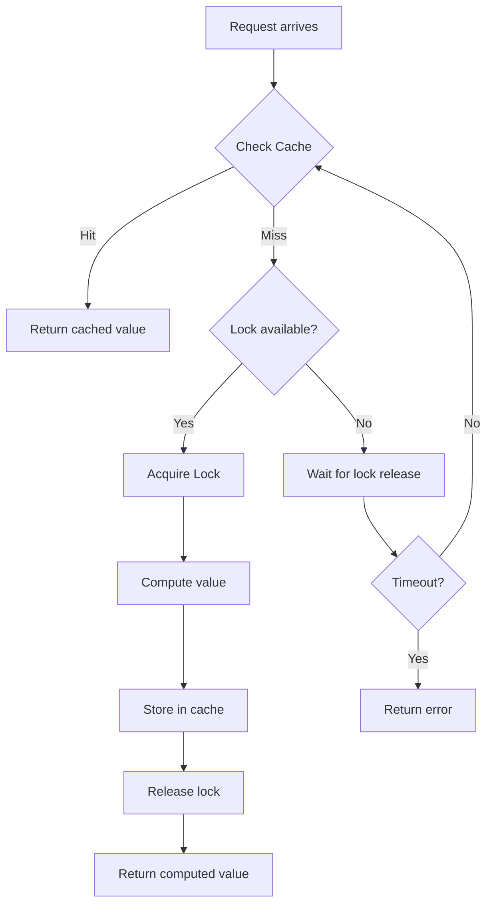

# How to Monitor Ruby on Rails Cache Operations with OpenTelemetry

Author: [nawazdhandala](https://www.github.com/nawazdhandala)

Tags: OpenTelemetry, Ruby, Rails, Cache, Redis, Memcached, Monitoring

Description: Complete guide to instrumenting Rails caching layer with OpenTelemetry for visibility into cache hits, misses, and performance across Redis and Memcached.

Caching is critical for Rails application performance, but it often operates as a black box. When cache hit rates drop or cache operations slow down, your application suffers without obvious symptoms. OpenTelemetry provides comprehensive instrumentation for Rails caching, giving you visibility into every cache read, write, and eviction.

## Understanding Rails Cache and Performance Impact

Rails provides a unified caching interface supporting multiple backends including memory, Redis, Memcached, and file-based storage. Cache performance directly affects user experience:

- High cache hit rates mean fast response times
- Cache misses trigger expensive database queries
- Slow cache operations create bottlenecks
- Cache stampedes can overwhelm your database
- Improper expiration leads to stale data

Without instrumentation, you cannot answer basic questions: Which cache keys are most accessed? What is the hit rate for each fragment? How long do cache operations take?

## Setting Up OpenTelemetry for Rails Cache

Add the necessary gems:

```ruby
# Gemfile
gem 'opentelemetry-sdk'
gem 'opentelemetry-exporter-otlp'
gem 'opentelemetry-instrumentation-rails'
gem 'opentelemetry-instrumentation-active_support'
gem 'opentelemetry-instrumentation-redis'
```

Install dependencies:

```bash
bundle install
```

Configure OpenTelemetry to instrument caching:

```ruby
# config/initializers/opentelemetry.rb
require 'opentelemetry/sdk'
require 'opentelemetry/exporter/otlp'
require 'opentelemetry/instrumentation/all'

OpenTelemetry::SDK.configure do |c|
  c.service_name = 'rails-cache-app'
  c.service_version = '1.0.0'

  c.use_all({
    'OpenTelemetry::Instrumentation::Rails' => {},
    'OpenTelemetry::Instrumentation::ActiveSupport' => {
      # Enable cache instrumentation
      enable_cache_instrumentation: true
    },
    'OpenTelemetry::Instrumentation::Redis' => {}
  })
end
```

This automatically instruments all Rails cache operations including fragment caching, low-level caching, and SQL query caching.

## Tracing Basic Cache Operations

Rails cache operations are automatically traced. Here is a typical service using cache:

```ruby
# app/services/product_service.rb
class ProductService
  def initialize
    @cache = Rails.cache
    @tracer = OpenTelemetry.tracer_provider.tracer('product-service')
  end

  def fetch_product(product_id)
    @tracer.in_span('fetch_product',
                    attributes: { 'product.id' => product_id }) do |span|

      cache_key = "product/#{product_id}"

      product = @cache.fetch(cache_key, expires_in: 1.hour) do
        # This block executes on cache miss
        span.add_event('cache_miss', attributes: { 'cache.key' => cache_key })

        Product.find(product_id)
      end

      span.set_attribute('product.name', product.name)
      product
    end
  end
end
```

OpenTelemetry creates spans for the cache operations with attributes:

- `cache.operation`: fetch, read, write, delete, etc.
- `cache.key`: The cache key being accessed
- `cache.hit`: true or false
- `cache.backend`: redis, memcached, memory, etc.

## Monitoring Fragment Cache Performance

Fragment caching in views becomes visible with instrumentation:

```ruby
# app/views/products/show.html.erb
<%# The cache block is automatically instrumented %>
<% cache @product do %>
  <div class="product-details">
    <h1><%= @product.name %></h1>
    <p><%= @product.description %></p>

    <%# Nested cache fragments are also tracked %>
    <% cache [@product, 'pricing'] do %>
      <div class="pricing">
        <span class="price"><%= @product.price %></span>
        <span class="discount"><%= @product.discount %></span>
      </div>
    <% end %>

    <%# Another nested fragment %>
    <% cache [@product, 'reviews'] do %>
      <%= render @product.reviews %>
    <% end %>
  </div>
<% end %>
```

To add custom tracking for fragment rendering:

```ruby
# app/controllers/products_controller.rb
class ProductsController < ApplicationController
  def show
    @product = Product.find(params[:id])

    tracer = OpenTelemetry.tracer_provider.tracer('product-controller')

    tracer.in_span('render_product_page',
                   attributes: { 'product.id' => @product.id }) do |span|

      # Track cache dependencies
      span.set_attribute('cache.fragment_count', 3)
      span.set_attribute('cache.strategy', 'fragment')

      render :show
    end
  end
end
```

## Advanced Cache Patterns with Tracing

Implement cache-aside pattern with detailed instrumentation:

```ruby
# app/services/user_stats_service.rb
class UserStatsService
  CACHE_TTL = 5.minutes

  def initialize
    @cache = Rails.cache
    @tracer = OpenTelemetry.tracer_provider.tracer('user-stats')
  end

  def get_stats(user_id)
    @tracer.in_span('get_user_stats',
                    attributes: { 'user.id' => user_id }) do |span|

      cache_key = "user_stats:#{user_id}"
      span.set_attribute('cache.key', cache_key)

      # Try to read from cache first
      cached_stats = @cache.read(cache_key)

      if cached_stats
        span.set_attribute('cache.hit', true)
        span.add_event('returning_cached_stats')
        return cached_stats
      end

      # Cache miss - compute stats
      span.set_attribute('cache.hit', false)
      span.add_event('cache_miss_computing_stats')

      stats = @tracer.in_span('compute_user_stats') do |compute_span|
        stats_data = {
          total_orders: Order.where(user_id: user_id).count,
          total_spent: Order.where(user_id: user_id).sum(:amount),
          favorite_category: compute_favorite_category(user_id),
          last_order_date: Order.where(user_id: user_id).maximum(:created_at)
        }

        compute_span.set_attribute('stats.orders_count', stats_data[:total_orders])
        compute_span.set_attribute('stats.total_spent', stats_data[:total_spent])

        stats_data
      end

      # Write to cache
      @tracer.in_span('write_cache') do |write_span|
        @cache.write(cache_key, stats, expires_in: CACHE_TTL)
        write_span.set_attribute('cache.ttl_seconds', CACHE_TTL.to_i)
      end

      stats
    end
  end

  private

  def compute_favorite_category(user_id)
    Order.joins(:items)
         .where(user_id: user_id)
         .group('items.category')
         .count
         .max_by { |_, count| count }
         &.first
  end
end
```

## Tracking Cache Hit Rates and Metrics

Create a wrapper to track cache metrics:

```ruby
# lib/instrumented_cache.rb
class InstrumentedCache
  def initialize(cache_store)
    @cache = cache_store
    @tracer = OpenTelemetry.tracer_provider.tracer('cache')
    @meter = OpenTelemetry.meter_provider.meter('cache-metrics')

    # Define metrics
    @hit_counter = @meter.create_counter(
      'cache.hits',
      unit: '1',
      description: 'Cache hits'
    )

    @miss_counter = @meter.create_counter(
      'cache.misses',
      unit: '1',
      description: 'Cache misses'
    )

    @operation_duration = @meter.create_histogram(
      'cache.operation.duration',
      unit: 'ms',
      description: 'Cache operation duration'
    )
  end

  def fetch(key, options = {}, &block)
    @tracer.in_span('cache_fetch',
                    attributes: { 'cache.key' => key }) do |span|

      start_time = Time.now
      hit = @cache.exist?(key)

      result = @cache.fetch(key, options, &block)

      duration_ms = ((Time.now - start_time) * 1000).round(2)

      # Record metrics
      if hit
        @hit_counter.add(1, attributes: { 'cache.key_prefix' => extract_prefix(key) })
        span.set_attribute('cache.hit', true)
      else
        @miss_counter.add(1, attributes: { 'cache.key_prefix' => extract_prefix(key) })
        span.set_attribute('cache.hit', false)
      end

      @operation_duration.record(duration_ms, attributes: {
        'cache.operation' => 'fetch',
        'cache.hit' => hit
      })

      span.set_attribute('cache.duration_ms', duration_ms)

      result
    end
  end

  def read(key)
    @tracer.in_span('cache_read',
                    attributes: { 'cache.key' => key }) do |span|

      start_time = Time.now
      result = @cache.read(key)
      duration_ms = ((Time.now - start_time) * 1000).round(2)

      span.set_attribute('cache.hit', result.present?)
      span.set_attribute('cache.duration_ms', duration_ms)

      @operation_duration.record(duration_ms, attributes: {
        'cache.operation' => 'read',
        'cache.hit' => result.present?
      })

      result
    end
  end

  def write(key, value, options = {})
    @tracer.in_span('cache_write',
                    attributes: { 'cache.key' => key }) do |span|

      start_time = Time.now
      result = @cache.write(key, value, options)
      duration_ms = ((Time.now - start_time) * 1000).round(2)

      span.set_attribute('cache.duration_ms', duration_ms)
      span.set_attribute('cache.ttl', options[:expires_in])

      @operation_duration.record(duration_ms, attributes: {
        'cache.operation' => 'write'
      })

      result
    end
  end

  def delete(key)
    @tracer.in_span('cache_delete',
                    attributes: { 'cache.key' => key }) do |span|
      @cache.delete(key)
    end
  end

  private

  def extract_prefix(key)
    key.to_s.split(':').first || 'unknown'
  end
end

# Use in application
# Rails.cache = InstrumentedCache.new(Rails.cache)
```

## Monitoring Redis Cache Backend

When using Redis as cache backend, trace Redis-specific operations:

```ruby
# config/initializers/redis_cache.rb
require 'redis'
require 'connection_pool'

redis_pool = ConnectionPool.new(size: 5, timeout: 5) do
  Redis.new(
    host: ENV.fetch('REDIS_HOST', 'localhost'),
    port: ENV.fetch('REDIS_PORT', 6379),
    db: ENV.fetch('REDIS_CACHE_DB', 0)
  )
end

Rails.application.config.cache_store = :redis_cache_store, {
  redis: redis_pool,
  namespace: 'app_cache',
  expires_in: 1.hour
}

# Add custom monitoring for Redis cache
class RedisCacheMonitor
  def initialize
    @tracer = OpenTelemetry.tracer_provider.tracer('redis-cache')
  end

  def monitor_cache_size
    @tracer.in_span('check_cache_size') do |span|
      redis = Redis.new(
        host: ENV.fetch('REDIS_HOST', 'localhost'),
        port: ENV.fetch('REDIS_PORT', 6379),
        db: ENV.fetch('REDIS_CACHE_DB', 0)
      )

      key_count = redis.dbsize
      memory_used = redis.info('memory')['used_memory']

      span.set_attribute('cache.keys_count', key_count)
      span.set_attribute('cache.memory_bytes', memory_used.to_i)
      span.set_attribute('cache.memory_mb', (memory_used.to_i / 1024.0 / 1024.0).round(2))

      { key_count: key_count, memory_mb: (memory_used.to_i / 1024.0 / 1024.0).round(2) }
    end
  end
end
```

## Handling Cache Stampedes

Implement stampede protection with tracing:

```ruby
# app/services/protected_cache_service.rb
class ProtectedCacheService
  def initialize
    @cache = Rails.cache
    @tracer = OpenTelemetry.tracer_provider.tracer('protected-cache')
    @locks = {}
  end

  def fetch_with_lock(key, expires_in: 1.hour, lock_timeout: 10.seconds)
    @tracer.in_span('fetch_with_stampede_protection',
                    attributes: { 'cache.key' => key }) do |span|

      # Try to get from cache first
      value = @cache.read(key)
      if value
        span.set_attribute('cache.hit', true)
        return value
      end

      span.set_attribute('cache.hit', false)

      # Acquire lock to prevent stampede
      lock_key = "lock:#{key}"
      acquired_lock = false

      @tracer.in_span('acquire_lock') do |lock_span|
        acquired_lock = @cache.write(lock_key, true, expires_in: lock_timeout, unless_exist: true)
        lock_span.set_attribute('lock.acquired', acquired_lock)

        if acquired_lock
          lock_span.add_event('lock_acquired')
        else
          lock_span.add_event('lock_already_held')
        end
      end

      if acquired_lock
        begin
          span.add_event('computing_value')

          # Compute the value
          value = @tracer.in_span('compute_cached_value') do
            yield
          end

          # Store in cache
          @cache.write(key, value, expires_in: expires_in)
          span.add_event('value_cached')

          value

        ensure
          # Release lock
          @cache.delete(lock_key)
          span.add_event('lock_released')
        end
      else
        # Another process is computing the value, wait and retry
        span.add_event('waiting_for_lock_release')

        retries = 0
        max_retries = 20

        while retries < max_retries
          sleep 0.1
          value = @cache.read(key)

          if value
            span.add_event('value_available_after_wait',
                          attributes: { 'wait.retries' => retries })
            return value
          end

          retries += 1
        end

        # Timeout waiting for other process
        span.status = OpenTelemetry::Trace::Status.error('Timeout waiting for cache value')
        raise CacheStampedeTimeout, "Timeout waiting for cache key: #{key}"
      end
    end
  end
end
```

## Visualizing Cache Operation Flow

Here is how cache operations flow through the system:



## Monitoring Cache Eviction and Expiration

Track when cache entries are evicted:

```ruby
# app/services/cache_lifecycle_monitor.rb
class CacheLifecycleMonitor
  def initialize
    @cache = Rails.cache
    @tracer = OpenTelemetry.tracer_provider.tracer('cache-lifecycle')
  end

  def write_with_monitoring(key, value, expires_in:)
    @tracer.in_span('cache_write_monitored',
                    attributes: {
                      'cache.key' => key,
                      'cache.ttl_seconds' => expires_in.to_i
                    }) do |span|

      # Check if key already exists (overwrite scenario)
      existing = @cache.exist?(key)
      span.set_attribute('cache.overwriting', existing)

      if existing
        span.add_event('overwriting_existing_key')
      end

      # Write with TTL
      @cache.write(key, value, expires_in: expires_in)

      # Schedule expiration tracking
      expiration_time = Time.now + expires_in
      span.set_attribute('cache.expires_at', expiration_time.iso8601)

      span.add_event('cache_entry_created', attributes: {
        'expires_in_seconds' => expires_in.to_i,
        'value_size_bytes' => value.to_s.bytesize
      })
    end
  end

  def delete_with_monitoring(key, reason: 'manual')
    @tracer.in_span('cache_delete_monitored',
                    attributes: {
                      'cache.key' => key,
                      'cache.eviction_reason' => reason
                    }) do |span|

      existed = @cache.exist?(key)
      span.set_attribute('cache.existed', existed)

      if existed
        @cache.delete(key)
        span.add_event('cache_entry_deleted', attributes: {
          'reason' => reason
        })
      else
        span.add_event('cache_key_not_found')
      end

      existed
    end
  end
end
```

## Best Practices for Cache Observability

Always namespace cache keys for better tracking:

```ruby
# app/services/namespaced_cache.rb
class NamespacedCache
  def initialize(namespace)
    @namespace = namespace
    @cache = Rails.cache
    @tracer = OpenTelemetry.tracer_provider.tracer('namespaced-cache')
  end

  def fetch(key, **options, &block)
    full_key = namespaced_key(key)

    @tracer.in_span('namespaced_cache_fetch',
                    attributes: {
                      'cache.namespace' => @namespace,
                      'cache.key' => key,
                      'cache.full_key' => full_key
                    }) do
      @cache.fetch(full_key, **options, &block)
    end
  end

  private

  def namespaced_key(key)
    "#{@namespace}:#{key}"
  end
end

# Usage
user_cache = NamespacedCache.new('users')
product_cache = NamespacedCache.new('products')

user_cache.fetch('123') { User.find(123) }
product_cache.fetch('456') { Product.find(456) }
```

With comprehensive OpenTelemetry instrumentation, your Rails caching layer transforms from a black box into a transparent, measurable component. You can track hit rates, identify slow cache operations, prevent stampedes, and understand exactly how caching impacts your application performance. This visibility is essential for optimizing cache strategies and maintaining fast response times.
