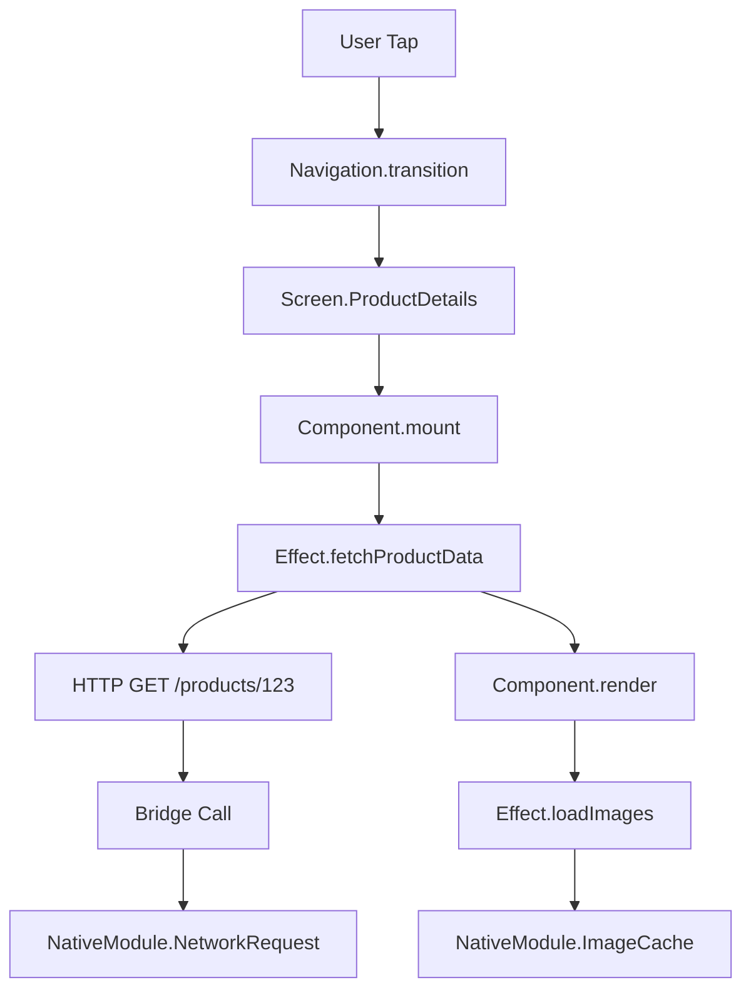

# How to Monitor React Native App Performance with OpenTelemetry Spans

Author: [nawazdhandala](https://www.github.com/nawazdhandala)

Tags: OpenTelemetry, React Native, JavaScript, Mobile, Performance

Description: Master performance monitoring in React Native applications using OpenTelemetry spans to track JavaScript execution, bridge communication, native module calls, and UI rendering across iOS and Android.

React Native enables building mobile apps with JavaScript while delivering native performance. However, the architecture introduces unique performance considerations. JavaScript runs in one thread, native UI operations in another, and communication between them happens over a bridge. Understanding where time is spent requires instrumenting all three layers with OpenTelemetry.

## Understanding React Native Performance Characteristics

React Native apps have distinct performance characteristics that differ from both web and native applications. JavaScript execution happens in a separate runtime (JavaScriptCore on iOS, Hermes or V8 on Android), while UI rendering occurs in native threads. The bridge serializes data between these environments, creating potential bottlenecks.

Common performance issues include excessive bridge traffic, slow JavaScript execution, inefficient React component renders, and blocking native operations. OpenTelemetry spans help identify which layer causes problems by tracking execution time across the entire stack.

## Installing OpenTelemetry in React Native

React Native requires special consideration for OpenTelemetry dependencies since you're targeting mobile platforms rather than Node.js. Use packages compatible with React Native's JavaScript environment.

```bash
# Install core OpenTelemetry packages
npm install @opentelemetry/api @opentelemetry/sdk-trace-base @opentelemetry/core

# Install React Native specific packages
npm install @opentelemetry/exporter-trace-otlp-http
npm install @opentelemetry/instrumentation-fetch-node
npm install @opentelemetry/react-native

# Install peer dependencies
npm install @react-native-async-storage/async-storage
```

For iOS, install CocoaPods dependencies:

```bash
cd ios && pod install && cd ..
```

## Configuring OpenTelemetry Provider

Create a telemetry configuration file that initializes OpenTelemetry when your app starts. This should set up the tracer provider, configure exporters, and register global instances.

```javascript
// telemetry/config.js
import { OTLPTraceExporter } from '@opentelemetry/exporter-trace-otlp-http';
import { Resource } from '@opentelemetry/resources';
import { SemanticResourceAttributes } from '@opentelemetry/semantic-conventions';
import {
  BatchSpanProcessor,
  ConsoleSpanExporter,
} from '@opentelemetry/sdk-trace-base';
import { WebTracerProvider } from '@opentelemetry/sdk-trace-web';
import { registerGlobals } from '@opentelemetry/react-native';
import { Platform } from 'react-native';
import DeviceInfo from 'react-native-device-info';

let provider;
let tracer;

export function initializeTelemetry() {
  // Create resource with app and device information
  const resource = new Resource({
    [SemanticResourceAttributes.SERVICE_NAME]: 'MyReactNativeApp',
    [SemanticResourceAttributes.SERVICE_VERSION]: DeviceInfo.getVersion(),
    [SemanticResourceAttributes.DEPLOYMENT_ENVIRONMENT]: __DEV__ ? 'development' : 'production',
    'device.platform': Platform.OS,
    'device.os.version': Platform.Version,
    'device.model': DeviceInfo.getModel(),
    'device.brand': DeviceInfo.getBrand(),
    'app.build.number': DeviceInfo.getBuildNumber(),
  });

  // Configure span exporter
  const exporter = __DEV__
    ? new ConsoleSpanExporter() // Use console in development
    : new OTLPTraceExporter({
        url: 'https://your-backend.com/v1/traces',
        headers: {
          'Authorization': 'Bearer YOUR_API_KEY',
        },
      });

  // Create batch span processor to reduce network overhead
  const spanProcessor = new BatchSpanProcessor(exporter, {
    scheduledDelayMillis: 5000,
    exportTimeoutMillis: 30000,
    maxQueueSize: 2048,
    maxExportBatchSize: 512,
  });

  // Create and configure tracer provider
  provider = new WebTracerProvider({
    resource,
  });

  provider.addSpanProcessor(spanProcessor);

  // Register as global provider
  registerGlobals(provider);

  // Get tracer instance
  tracer = provider.getTracer('react-native-app', '1.0.0');

  console.log('OpenTelemetry initialized successfully');

  return tracer;
}

export function getTracer() {
  if (!tracer) {
    throw new Error('Telemetry not initialized. Call initializeTelemetry() first.');
  }
  return tracer;
}

export function shutdown() {
  return provider?.shutdown();
}
```

Initialize telemetry in your app's entry point:

```javascript
// index.js
import { AppRegistry } from 'react-native';
import App from './App';
import { name as appName } from './app.json';
import { initializeTelemetry } from './telemetry/config';

// Initialize telemetry before registering the app
initializeTelemetry();

AppRegistry.registerComponent(appName, () => App);
```

## Instrumenting Component Lifecycle

React components are the building blocks of React Native apps. Instrument component lifecycle to understand rendering performance and identify expensive components.

```javascript
// components/InstrumentedComponent.js
import React, { Component } from 'react';
import { trace, context } from '@opentelemetry/api';
import { getTracer } from '../telemetry/config';

// Higher-order component that adds instrumentation
export function withInstrumentation(WrappedComponent, componentName) {
  return class InstrumentedComponent extends Component {
    constructor(props) {
      super(props);
      this.tracer = getTracer();
      this.componentName = componentName || WrappedComponent.name || 'Unknown';
      this.lifecycleSpan = null;
    }

    componentDidMount() {
      // Start span for component lifecycle
      this.lifecycleSpan = this.tracer.startSpan(`Component.${this.componentName}`, {
        kind: trace.SpanKind.INTERNAL,
        attributes: {
          'component.type': 'React',
          'component.name': this.componentName,
        },
      });

      // Create span for mount phase
      const mountSpan = this.tracer.startSpan(
        `Component.${this.componentName}.mount`,
        { parent: this.lifecycleSpan },
      );

      try {
        if (super.componentDidMount) {
          super.componentDidMount();
        }
        mountSpan.setStatus({ code: trace.SpanStatusCode.OK });
      } catch (error) {
        mountSpan.recordException(error);
        mountSpan.setStatus({
          code: trace.SpanStatusCode.ERROR,
          message: error.message,
        });
        throw error;
      } finally {
        mountSpan.end();
      }
    }

    componentDidUpdate(prevProps, prevState) {
      // Track component updates to identify unnecessary re-renders
      const updateSpan = this.tracer.startSpan(
        `Component.${this.componentName}.update`,
        {
          parent: this.lifecycleSpan,
          attributes: {
            'update.props_changed': JSON.stringify(prevProps) !== JSON.stringify(this.props),
            'update.state_changed': JSON.stringify(prevState) !== JSON.stringify(this.state),
          },
        },
      );

      try {
        if (super.componentDidUpdate) {
          super.componentDidUpdate(prevProps, prevState);
        }
        updateSpan.setStatus({ code: trace.SpanStatusCode.OK });
      } catch (error) {
        updateSpan.recordException(error);
        updateSpan.setStatus({
          code: trace.SpanStatusCode.ERROR,
          message: error.message,
        });
        throw error;
      } finally {
        updateSpan.end();
      }
    }

    componentWillUnmount() {
      const unmountSpan = this.tracer.startSpan(
        `Component.${this.componentName}.unmount`,
        { parent: this.lifecycleSpan },
      );

      try {
        if (super.componentWillUnmount) {
          super.componentWillUnmount();
        }
        unmountSpan.setStatus({ code: trace.SpanStatusCode.OK });
      } catch (error) {
        unmountSpan.recordException(error);
        unmountSpan.setStatus({
          code: trace.SpanStatusCode.ERROR,
          message: error.message,
        });
        throw error;
      } finally {
        unmountSpan.end();

        if (this.lifecycleSpan) {
          this.lifecycleSpan.setStatus({ code: trace.SpanStatusCode.OK });
          this.lifecycleSpan.end();
        }
      }
    }

    render() {
      // Track render duration
      const renderSpan = this.tracer.startSpan(
        `Component.${this.componentName}.render`,
        { parent: this.lifecycleSpan },
      );

      try {
        const result = <WrappedComponent {...this.props} />;
        renderSpan.setStatus({ code: trace.SpanStatusCode.OK });
        return result;
      } catch (error) {
        renderSpan.recordException(error);
        renderSpan.setStatus({
          code: trace.SpanStatusCode.ERROR,
          message: error.message,
        });
        throw error;
      } finally {
        // End render span after frame is committed
        setImmediate(() => renderSpan.end());
      }
    }
  };
}

// Usage
class UserProfile extends Component {
  render() {
    return (
      <View>
        <Text>{this.props.user.name}</Text>
      </View>
    );
  }
}

export default withInstrumentation(UserProfile, 'UserProfile');
```

## Creating a React Hooks-Based Instrumentation API

For functional components with hooks, create custom hooks that provide tracing capabilities:

```javascript
// hooks/useTracing.js
import { useEffect, useRef, useCallback } from 'react';
import { trace } from '@opentelemetry/api';
import { getTracer } from '../telemetry/config';

export function useComponentTracing(componentName) {
  const tracer = getTracer();
  const spanRef = useRef(null);

  useEffect(() => {
    // Start component lifecycle span
    spanRef.current = tracer.startSpan(`Component.${componentName}`, {
      kind: trace.SpanKind.INTERNAL,
      attributes: {
        'component.type': 'React.Functional',
        'component.name': componentName,
      },
    });

    // Add mount event
    spanRef.current.addEvent('component_mounted');

    // Cleanup on unmount
    return () => {
      if (spanRef.current) {
        spanRef.current.addEvent('component_unmounting');
        spanRef.current.setStatus({ code: trace.SpanStatusCode.OK });
        spanRef.current.end();
      }
    };
  }, [componentName, tracer]);

  return spanRef.current;
}

export function useTracedCallback(name, callback, deps) {
  const tracer = getTracer();

  return useCallback((...args) => {
    const span = tracer.startSpan(`Callback.${name}`, {
      kind: trace.SpanKind.INTERNAL,
    });

    try {
      const result = callback(...args);

      // Handle async results
      if (result instanceof Promise) {
        return result
          .then(value => {
            span.setStatus({ code: trace.SpanStatusCode.OK });
            return value;
          })
          .catch(error => {
            span.recordException(error);
            span.setStatus({
              code: trace.SpanStatusCode.ERROR,
              message: error.message,
            });
            throw error;
          })
          .finally(() => span.end());
      }

      span.setStatus({ code: trace.SpanStatusCode.OK });
      span.end();
      return result;
    } catch (error) {
      span.recordException(error);
      span.setStatus({
        code: trace.SpanStatusCode.ERROR,
        message: error.message,
      });
      span.end();
      throw error;
    }
  }, deps);
}

export function useTracedEffect(name, effect, deps) {
  const tracer = getTracer();

  useEffect(() => {
    const span = tracer.startSpan(`Effect.${name}`, {
      kind: trace.SpanKind.INTERNAL,
    });

    try {
      const cleanup = effect();
      span.setStatus({ code: trace.SpanStatusCode.OK });

      return () => {
        if (cleanup) {
          const cleanupSpan = tracer.startSpan(`Effect.${name}.cleanup`, {
            kind: trace.SpanKind.INTERNAL,
          });

          try {
            cleanup();
            cleanupSpan.setStatus({ code: trace.SpanStatusCode.OK });
          } catch (error) {
            cleanupSpan.recordException(error);
            cleanupSpan.setStatus({
              code: trace.SpanStatusCode.ERROR,
              message: error.message,
            });
          } finally {
            cleanupSpan.end();
          }
        }
        span.end();
      };
    } catch (error) {
      span.recordException(error);
      span.setStatus({
        code: trace.SpanStatusCode.ERROR,
        message: error.message,
      });
      span.end();
      throw error;
    }
  }, deps);
}

// Usage example
function UserProfileScreen({ userId }) {
  // Trace component lifecycle
  useComponentTracing('UserProfileScreen');

  const [user, setUser] = useState(null);
  const [loading, setLoading] = useState(true);

  // Traced effect for data fetching
  useTracedEffect(
    'fetchUserData',
    () => {
      fetchUser(userId)
        .then(setUser)
        .finally(() => setLoading(false));
    },
    [userId],
  );

  // Traced callback for button press
  const handleRefresh = useTracedCallback(
    'refreshUser',
    async () => {
      setLoading(true);
      const userData = await fetchUser(userId);
      setUser(userData);
      setLoading(false);
    },
    [userId],
  );

  if (loading) return <LoadingSpinner />;
  return <UserProfile user={user} onRefresh={handleRefresh} />;
}
```

## Instrumenting Navigation

React Native apps typically use React Navigation. Instrument navigation to track screen transitions and user flows.

```javascript
// navigation/InstrumentedNavigator.js
import { useEffect, useRef } from 'react';
import { useNavigation, useRoute } from '@react-navigation/native';
import { trace } from '@opentelemetry/api';
import { getTracer } from '../telemetry/config';

export function useNavigationTracing() {
  const navigation = useNavigation();
  const route = useRoute();
  const tracer = getTracer();
  const screenSpanRef = useRef(null);

  useEffect(() => {
    // Start span when screen comes into focus
    const startScreenSpan = () => {
      screenSpanRef.current = tracer.startSpan(`Screen.${route.name}`, {
        kind: trace.SpanKind.INTERNAL,
        attributes: {
          'screen.name': route.name,
          'screen.params': JSON.stringify(route.params),
        },
      });

      screenSpanRef.current.addEvent('screen_focused');
    };

    // End span when screen loses focus
    const endScreenSpan = () => {
      if (screenSpanRef.current) {
        screenSpanRef.current.addEvent('screen_blurred');
        screenSpanRef.current.setStatus({ code: trace.SpanStatusCode.OK });
        screenSpanRef.current.end();
        screenSpanRef.current = null;
      }
    };

    // Subscribe to navigation events
    const unsubscribeFocus = navigation.addListener('focus', startScreenSpan);
    const unsubscribeBlur = navigation.addListener('blur', endScreenSpan);

    // If screen is already focused, start span immediately
    if (navigation.isFocused()) {
      startScreenSpan();
    }

    return () => {
      unsubscribeFocus();
      unsubscribeBlur();
      endScreenSpan();
    };
  }, [navigation, route, tracer]);
}

// Create a custom navigation container with instrumentation
export function createInstrumentedNavigator() {
  const navigationRef = React.createRef();
  const routeNameRef = React.useRef();
  const tracer = getTracer();

  return {
    ref: navigationRef,
    onReady: () => {
      routeNameRef.current = navigationRef.current?.getCurrentRoute()?.name;
    },
    onStateChange: () => {
      const previousRouteName = routeNameRef.current;
      const currentRouteName = navigationRef.current?.getCurrentRoute()?.name;

      if (previousRouteName !== currentRouteName) {
        // Track navigation transition
        const span = tracer.startSpan('Navigation.transition', {
          kind: trace.SpanKind.INTERNAL,
          attributes: {
            'navigation.from': previousRouteName,
            'navigation.to': currentRouteName,
          },
        });

        span.addEvent('navigation_completed');
        span.setStatus({ code: trace.SpanStatusCode.OK });
        span.end();
      }

      routeNameRef.current = currentRouteName;
    },
  };
}
```

## Instrumenting API Calls

Network requests are critical to track. Create an instrumented fetch wrapper that captures request timing and errors.

```javascript
// api/tracedFetch.js
import { trace } from '@opentelemetry/api';
import { getTracer } from '../telemetry/config';

export async function tracedFetch(url, options = {}) {
  const tracer = getTracer();

  // Parse URL to extract useful attributes
  const urlObj = new URL(url);

  const span = tracer.startSpan(`HTTP ${options.method || 'GET'} ${urlObj.pathname}`, {
    kind: trace.SpanKind.CLIENT,
    attributes: {
      'http.method': options.method || 'GET',
      'http.url': url,
      'http.scheme': urlObj.protocol.replace(':', ''),
      'http.host': urlObj.host,
      'http.target': urlObj.pathname + urlObj.search,
    },
  });

  // Inject trace context into request headers
  const headers = {
    ...options.headers,
  };

  // Add W3C trace context headers for propagation
  const spanContext = span.spanContext();
  headers['traceparent'] = `00-${spanContext.traceId}-${spanContext.spanId}-01`;

  try {
    const startTime = Date.now();
    const response = await fetch(url, { ...options, headers });
    const duration = Date.now() - startTime;

    // Add response attributes
    span.setAttribute('http.status_code', response.status);
    span.setAttribute('http.duration_ms', duration);

    // Check if response indicates an error
    if (response.status >= 400) {
      span.setStatus({
        code: trace.SpanStatusCode.ERROR,
        message: `HTTP ${response.status}`,
      });
    } else {
      span.setStatus({ code: trace.SpanStatusCode.OK });
    }

    span.end();
    return response;
  } catch (error) {
    // Record network errors
    span.recordException(error);
    span.setStatus({
      code: trace.SpanStatusCode.ERROR,
      message: error.message,
    });
    span.end();
    throw error;
  }
}

// Usage in API client
export class ApiClient {
  constructor(baseURL) {
    this.baseURL = baseURL;
  }

  async get(endpoint, options = {}) {
    return tracedFetch(`${this.baseURL}${endpoint}`, {
      ...options,
      method: 'GET',
    });
  }

  async post(endpoint, body, options = {}) {
    return tracedFetch(`${this.baseURL}${endpoint}`, {
      ...options,
      method: 'POST',
      headers: {
        'Content-Type': 'application/json',
        ...options.headers,
      },
      body: JSON.stringify(body),
    });
  }
}
```

## Instrumenting Native Module Calls

React Native's bridge to native code can be a performance bottleneck. Instrument native module calls to understand their overhead.

```javascript
// telemetry/nativeModuleTracer.js
import { NativeModules } from 'react-native';
import { trace } from '@opentelemetry/api';
import { getTracer } from './config';

export function instrumentNativeModule(moduleName) {
  const module = NativeModules[moduleName];
  if (!module) {
    console.warn(`Native module ${moduleName} not found`);
    return module;
  }

  const tracer = getTracer();
  const instrumentedModule = {};

  // Wrap each method in the native module
  Object.keys(module).forEach(methodName => {
    const originalMethod = module[methodName];

    if (typeof originalMethod !== 'function') {
      instrumentedModule[methodName] = originalMethod;
      return;
    }

    instrumentedModule[methodName] = function(...args) {
      const span = tracer.startSpan(`NativeModule.${moduleName}.${methodName}`, {
        kind: trace.SpanKind.CLIENT,
        attributes: {
          'native_module.name': moduleName,
          'native_module.method': methodName,
          'native_module.args_count': args.length,
        },
      });

      try {
        const result = originalMethod.apply(this, args);

        // Handle promise results
        if (result instanceof Promise) {
          return result
            .then(value => {
              span.setStatus({ code: trace.SpanStatusCode.OK });
              span.end();
              return value;
            })
            .catch(error => {
              span.recordException(error);
              span.setStatus({
                code: trace.SpanStatusCode.ERROR,
                message: error.message,
              });
              span.end();
              throw error;
            });
        }

        span.setStatus({ code: trace.SpanStatusCode.OK });
        span.end();
        return result;
      } catch (error) {
        span.recordException(error);
        span.setStatus({
          code: trace.SpanStatusCode.ERROR,
          message: error.message,
        });
        span.end();
        throw error;
      }
    };
  });

  return instrumentedModule;
}

// Usage
const InstrumentedAsyncStorage = instrumentNativeModule('AsyncStorage');

// Now use InstrumentedAsyncStorage instead of direct AsyncStorage
async function saveUserData(userId, data) {
  await InstrumentedAsyncStorage.setItem(
    `user:${userId}`,
    JSON.stringify(data),
  );
}
```

## Performance Trace Flow

Here's how performance traces flow through a React Native application:



## Best Practices for React Native Performance Monitoring

When monitoring React Native performance with OpenTelemetry, follow these practices:

**Focus on bridge crossings**. The JavaScript-to-native bridge is often a bottleneck. Track how frequently your app crosses the bridge and the data volume being serialized.

**Monitor render performance**. Use spans to identify components that re-render excessively or take too long to render. This helps optimize React component design.

**Track animation performance**. React Native animations should run at 60fps. Instrument animation-related code to ensure smooth user experiences.

**Measure bundle load time**. Track how long it takes to load JavaScript bundles, especially on cold starts. Large bundles significantly impact startup performance.

**Use sampling for production**. Mobile devices have limited resources. Implement sampling to reduce telemetry overhead while maintaining visibility into performance issues.

**Correlate with native metrics**. Combine OpenTelemetry traces with native performance metrics like memory usage, CPU load, and frame drops for complete visibility.

Monitoring React Native applications with OpenTelemetry provides unprecedented visibility into your app's performance across the JavaScript runtime, bridge communication, and native modules. This comprehensive instrumentation helps you deliver fast, responsive experiences to your users.
