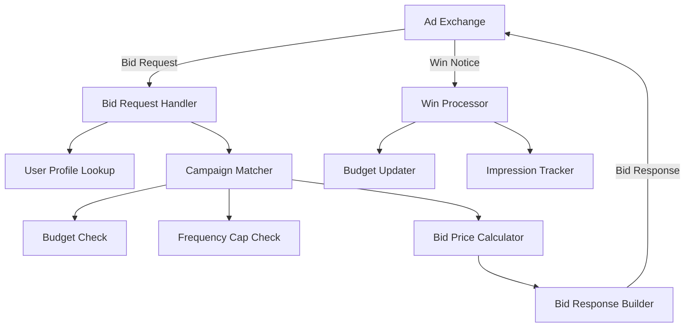

# How to Monitor Real-Time Bidding Systems with OpenTelemetry

Author: [nawazdhandala](https://www.github.com/nawazdhandala)

Tags: OpenTelemetry, Real-Time Bidding, AdTech, Low Latency, Monitoring, Performance

Description: Learn how to monitor real-time bidding (RTB) systems with OpenTelemetry, covering latency tracking, bid metrics, timeout monitoring, and auction performance analysis.

---

Real-time bidding systems operate under constraints that most applications never face. When an ad exchange sends a bid request, your demand-side platform (DSP) has roughly 100 milliseconds to receive the request, evaluate the opportunity, run your bidding algorithm, and return a response. Miss that window and the exchange discards your bid entirely. At volumes of hundreds of thousands of requests per second, even small performance regressions can cost significant revenue.

Monitoring these systems requires instrumentation that is both thorough and lightweight. You cannot afford to add 10 milliseconds of overhead to a process that has a 100-millisecond budget. OpenTelemetry, when configured carefully, gives you the visibility you need without blowing your latency budget.

## RTB System Architecture

A typical DSP processes bid requests through several stages, each of which needs monitoring:



Every component in this pipeline must execute within the overall latency budget. If the user profile lookup takes 40 milliseconds, you only have 60 milliseconds left for everything else.

## Lightweight Tracing Configuration

The first priority in RTB monitoring is minimizing instrumentation overhead. We configure the OpenTelemetry SDK with aggressive settings that keep overhead under 1 millisecond.

```go
// otel_setup.go - Low-overhead OpenTelemetry configuration for RTB
package otel

import (
    "context"

    "go.opentelemetry.io/otel"
    "go.opentelemetry.io/otel/exporters/otlp/otlptrace/otlptracegrpc"
    "go.opentelemetry.io/otel/sdk/resource"
    sdktrace "go.opentelemetry.io/otel/sdk/trace"
    semconv "go.opentelemetry.io/otel/semconv/v1.21.0"
)

func InitTracer(ctx context.Context) (*sdktrace.TracerProvider, error) {
    // Use gRPC exporter for lower overhead than HTTP
    exporter, err := otlptracegrpc.New(ctx,
        otlptracegrpc.WithEndpoint("otel-collector:4317"),
        otlptracegrpc.WithInsecure(),
    )
    if err != nil {
        return nil, err
    }

    res, err := resource.New(ctx,
        resource.WithAttributes(
            semconv.ServiceName("rtb-bidder"),
            semconv.ServiceVersion("3.2.1"),
            semconv.DeploymentEnvironment("production"),
        ),
    )
    if err != nil {
        return nil, err
    }

    tp := sdktrace.NewTracerProvider(
        sdktrace.WithBatcher(exporter,
            // Aggressive batching to minimize export overhead
            sdktrace.WithMaxQueueSize(10000),
            sdktrace.WithMaxExportBatchSize(1000),
            sdktrace.WithBatchTimeout(5_000), // 5 second batch window
        ),
        sdktrace.WithResource(res),
        // Sample only 1% of normal bid requests
        // This is critical for RTB volumes
        sdktrace.WithSampler(sdktrace.ParentBased(
            sdktrace.TraceIDRatioBased(0.01),
        )),
    )

    otel.SetTracerProvider(tp)
    return tp, nil
}
```

The 1% sampling rate might seem low, but at 100,000 requests per second, that still gives you 1,000 traced requests per second. That is more than enough to spot latency patterns, error rates, and performance anomalies. The batch exporter settings ensure that span export happens asynchronously and does not block the bid processing path.

## Instrumenting the Bid Request Handler

The bid handler is the hot path. Every microsecond counts here, so we use minimal span attributes and avoid any blocking operations in the instrumentation.

```go
// bid_handler.go - Instrumented bid request processing
package bidder

import (
    "context"
    "time"

    "go.opentelemetry.io/otel"
    "go.opentelemetry.io/otel/attribute"
    "go.opentelemetry.io/otel/metric"
    "go.opentelemetry.io/otel/trace"
)

var (
    tracer = otel.Tracer("rtb-bidder")
    meter  = otel.Meter("rtb-bidder")

    // Pre-create metric instruments to avoid allocation during request processing
    bidLatency    metric.Float64Histogram
    bidCounter    metric.Int64Counter
    bidPrice      metric.Float64Histogram
    timeoutCount  metric.Int64Counter
)

func init() {
    var err error
    // Histogram for end-to-end bid latency in milliseconds
    bidLatency, err = meter.Float64Histogram("rtb.bid.latency_ms",
        metric.WithDescription("End-to-end bid processing latency"),
        metric.WithUnit("ms"),
        // Custom bucket boundaries aligned to RTB latency ranges
        metric.WithExplicitBucketBoundaries(1, 5, 10, 20, 30, 50, 75, 100, 150),
    )
    if err != nil {
        panic(err)
    }

    bidCounter, _ = meter.Int64Counter("rtb.bid.total",
        metric.WithDescription("Total bid requests by outcome"),
    )

    bidPrice, _ = meter.Float64Histogram("rtb.bid.price_cpm",
        metric.WithDescription("Bid price in CPM"),
        metric.WithUnit("USD"),
    )

    timeoutCount, _ = meter.Int64Counter("rtb.bid.timeouts",
        metric.WithDescription("Bid requests that exceeded the timeout"),
    )
}

func HandleBidRequest(ctx context.Context, req *BidRequest) (*BidResponse, error) {
    start := time.Now()

    // Create a deadline context matching the exchange timeout
    // Leave 10ms buffer for network transit
    bidCtx, cancel := context.WithTimeout(ctx, 90*time.Millisecond)
    defer cancel()

    ctx, span := tracer.Start(bidCtx, "handle_bid_request",
        trace.WithAttributes(
            attribute.String("exchange", req.Exchange),
            attribute.String("ad_format", req.AdFormat),
            attribute.String("device_type", req.DeviceType),
        ),
    )
    defer span.End()

    // Step 1: Look up user profile for targeting
    profile, err := lookupUserProfile(ctx, req.UserID)
    if err != nil {
        // Record a no-bid due to profile lookup failure
        bidCounter.Add(ctx, 1, metric.WithAttributes(
            attribute.String("outcome", "no_bid"),
            attribute.String("reason", "profile_error"),
        ))
        return newNoBidResponse(), nil
    }

    // Step 2: Find matching campaigns
    campaigns, err := matchCampaigns(ctx, req, profile)
    if err != nil || len(campaigns) == 0 {
        bidCounter.Add(ctx, 1, metric.WithAttributes(
            attribute.String("outcome", "no_bid"),
            attribute.String("reason", "no_campaigns"),
        ))
        return newNoBidResponse(), nil
    }

    // Step 3: Check budget and frequency caps
    eligible := filterEligible(ctx, campaigns, profile)
    if len(eligible) == 0 {
        bidCounter.Add(ctx, 1, metric.WithAttributes(
            attribute.String("outcome", "no_bid"),
            attribute.String("reason", "filtered"),
        ))
        return newNoBidResponse(), nil
    }

    // Step 4: Calculate bid price
    bestBid := calculateBidPrice(ctx, eligible, req)

    // Check if we have exceeded our time budget
    elapsed := time.Since(start)
    if elapsed > 90*time.Millisecond {
        timeoutCount.Add(ctx, 1, metric.WithAttributes(
            attribute.String("exchange", req.Exchange),
        ))
        span.SetAttributes(attribute.Bool("bid.timed_out", true))
        bidCounter.Add(ctx, 1, metric.WithAttributes(
            attribute.String("outcome", "timeout"),
        ))
        return newNoBidResponse(), nil
    }

    // Record successful bid metrics
    latencyMs := float64(elapsed.Microseconds()) / 1000.0
    bidLatency.Record(ctx, latencyMs, metric.WithAttributes(
        attribute.String("exchange", req.Exchange),
        attribute.String("outcome", "bid"),
    ))
    bidPrice.Record(ctx, bestBid.PriceCPM)
    bidCounter.Add(ctx, 1, metric.WithAttributes(
        attribute.String("outcome", "bid"),
    ))

    span.SetAttributes(
        attribute.Float64("bid.price_cpm", bestBid.PriceCPM),
        attribute.String("bid.campaign_id", bestBid.CampaignID),
        attribute.Float64("bid.latency_ms", latencyMs),
    )

    return buildBidResponse(bestBid, req), nil
}
```

A few things to note about this instrumentation. The metric instruments are created once in `init()` and reused for every request. Creating them per-request would add unnecessary allocations. The histogram bucket boundaries are tailored to RTB latency ranges, so you get meaningful percentile data in the 1-150 millisecond range where RTB systems operate. The timeout check happens before building the response, so you do not waste time constructing a response that will arrive too late.

## Monitoring Budget Pacing

Budget pacing is a critical business concern in RTB. Campaigns have daily budgets that need to be spent evenly throughout the day, not burned through in the first hour.

```go
// budget_monitor.go - Budget pacing metrics
package bidder

import (
    "context"
    "time"

    "go.opentelemetry.io/otel"
    "go.opentelemetry.io/otel/attribute"
    "go.opentelemetry.io/otel/metric"
)

var budgetMeter = otel.Meter("rtb-budget")

var (
    // Track budget utilization as a percentage of daily budget
    budgetUtilization metric.Float64Histogram
    // Track spend rate per minute
    spendRate metric.Float64Histogram
    // Track pacing adjustments
    pacingAdjustments metric.Int64Counter
)

func init() {
    budgetUtilization, _ = budgetMeter.Float64Histogram(
        "rtb.budget.utilization_pct",
        metric.WithDescription("Campaign budget utilization as percentage of daily budget"),
    )

    spendRate, _ = budgetMeter.Float64Histogram(
        "rtb.budget.spend_rate_per_min",
        metric.WithDescription("Spend rate in dollars per minute"),
        metric.WithUnit("USD/min"),
    )

    pacingAdjustments, _ = budgetMeter.Int64Counter(
        "rtb.budget.pacing_adjustments",
        metric.WithDescription("Number of pacing multiplier adjustments"),
    )
}

// RecordBudgetMetrics is called periodically to track budget health
func RecordBudgetMetrics(ctx context.Context, campaigns []Campaign) {
    now := time.Now()
    // Calculate how far through the day we are
    dayProgress := float64(now.Hour()*60+now.Minute()) / (24.0 * 60.0)

    for _, c := range campaigns {
        utilization := (c.SpentToday / c.DailyBudget) * 100.0
        attrs := metric.WithAttributes(
            attribute.String("campaign_id", c.ID),
            attribute.String("advertiser", c.Advertiser),
        )

        budgetUtilization.Record(ctx, utilization, attrs)
        spendRate.Record(ctx, c.LastMinuteSpend, attrs)

        // Flag campaigns that are significantly ahead or behind pace
        expectedUtilization := dayProgress * 100.0
        if utilization > expectedUtilization*1.3 {
            // Spending too fast, pacing should slow down
            pacingAdjustments.Add(ctx, 1, metric.WithAttributes(
                attribute.String("campaign_id", c.ID),
                attribute.String("direction", "slow_down"),
            ))
        } else if utilization < expectedUtilization*0.7 {
            // Spending too slow, pacing should speed up
            pacingAdjustments.Add(ctx, 1, metric.WithAttributes(
                attribute.String("campaign_id", c.ID),
                attribute.String("direction", "speed_up"),
            ))
        }
    }
}
```

These metrics let you build dashboards that show budget pacing across all campaigns in real time. When a campaign is burning through its budget too fast, you will see the utilization percentage climb ahead of the day-progress line.

## Collector Configuration for High-Volume RTB Data

RTB systems produce enormous volumes of telemetry. The collector configuration needs to handle this without becoming a bottleneck.

```yaml
# otel-collector-rtb.yaml
receivers:
  otlp:
    protocols:
      grpc:
        endpoint: 0.0.0.0:4317
        # Increase max message size for large batches
        max_recv_msg_size_mib: 16

processors:
  batch:
    timeout: 10s
    send_batch_size: 2000
    send_batch_max_size: 4000

  # Drop low-value attributes to reduce storage costs
  attributes:
    actions:
      - key: user_agent
        action: delete
      - key: http.request.header.cookie
        action: delete

  # Memory limiter prevents OOM under spike conditions
  memory_limiter:
    check_interval: 1s
    limit_mib: 2048
    spike_limit_mib: 512

exporters:
  otlp:
    endpoint: oneuptime-collector:4317
    sending_queue:
      enabled: true
      num_consumers: 10
      queue_size: 5000

service:
  pipelines:
    traces:
      receivers: [otlp]
      processors: [memory_limiter, attributes, batch]
      exporters: [otlp]
    metrics:
      receivers: [otlp]
      processors: [memory_limiter, batch]
      exporters: [otlp]
```

The memory limiter is essential for RTB workloads. During traffic spikes (which happen frequently in ad tech, often tied to major events or time-of-day patterns), the collector might receive data faster than it can export. The memory limiter prevents the collector from consuming all available memory and crashing.

## Key Alerts for RTB Systems

With the instrumentation in place, set up alerts on these critical signals:

- **P99 bid latency exceeding 80ms** means you are at risk of timing out on exchanges with strict deadlines
- **Timeout rate above 1%** indicates a systemic performance issue that is costing you auction participation
- **Bid rate dropping suddenly** could mean a code deployment broke campaign matching or a data feed is stale
- **Budget utilization deviating more than 30% from expected pace** requires immediate attention to avoid overspending or missing delivery targets
- **Win rate dropping below historical baseline** suggests competitors are outbidding you or your bidding model needs retraining

## Conclusion

Monitoring real-time bidding systems with OpenTelemetry requires a careful balance between observability and performance. The key principles are: sample aggressively to keep overhead low, pre-allocate metric instruments to avoid per-request costs, use custom histogram buckets that match your latency profile, and configure the collector to handle high-volume data without becoming a bottleneck. With this instrumentation in place, you get the visibility needed to optimize bid performance, track budget pacing, and quickly identify issues that are costing you revenue.
