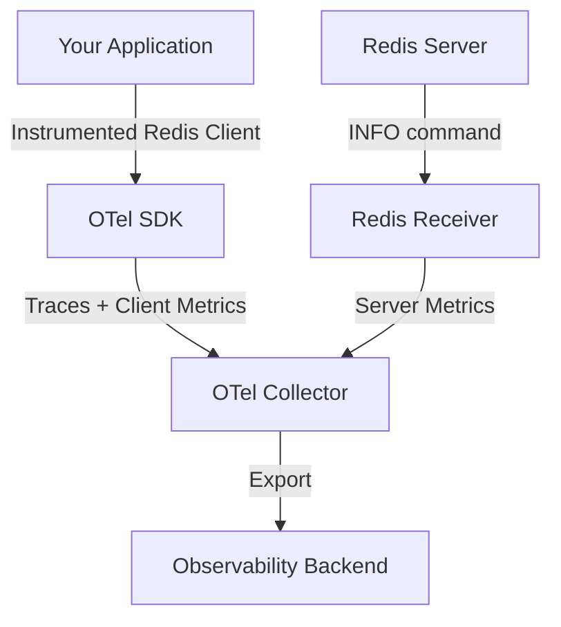
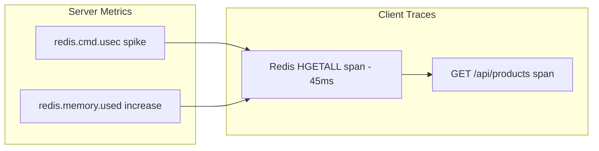

# How to Monitor Redis Performance and Cache Hit Rates with OpenTelemetry

Author: [nawazdhandala](https://www.github.com/nawazdhandala)

Tags: OpenTelemetry, Redis, Caching, Performance Monitoring, Observability, Metrics

Description: A practical guide to monitoring Redis performance, tracking cache hit rates, and setting up alerts using OpenTelemetry instrumentation and the collector.

---

Redis is one of those tools that quietly does its job until it doesn't. When your cache starts underperforming, response times across the entire application degrade. Users don't know that Redis is the problem. They just know your app is slow.

Monitoring Redis effectively means tracking two things: the health of the Redis server itself and how well your application is using it. Cache hit rates, connection counts, memory usage, and command latency all matter. OpenTelemetry lets you capture all of this through a combination of client-side instrumentation and the Redis receiver in the collector.

## Architecture Overview

There are two complementary approaches to monitoring Redis with OpenTelemetry. You can instrument your application's Redis client to get per-operation traces and metrics. And you can use the OpenTelemetry Collector's Redis receiver to scrape server-level metrics directly from Redis. For complete visibility, you want both.



## Part 1: Instrumenting the Redis Client

Client-side instrumentation gives you visibility into every Redis command your application sends. You get span-level data showing which commands are slow, which keys are hot, and how your cache access patterns look.

Here is an example using Node.js with the `ioredis` library.

```bash
# Install the OpenTelemetry packages for Redis instrumentation
npm install @opentelemetry/api \
    @opentelemetry/sdk-node \
    @opentelemetry/auto-instrumentations-node \
    @opentelemetry/instrumentation-ioredis \
    @opentelemetry/exporter-trace-otlp-grpc \
    @opentelemetry/exporter-metrics-otlp-grpc
```

Set up the instrumentation in your application's entry point.

```javascript
// tracing.js - Load this before any other imports
const { NodeSDK } = require('@opentelemetry/sdk-node');
const { IORedisInstrumentation } = require('@opentelemetry/instrumentation-ioredis');
const { OTLPTraceExporter } = require('@opentelemetry/exporter-trace-otlp-grpc');
const { OTLPMetricExporter } = require('@opentelemetry/exporter-metrics-otlp-grpc');
const { PeriodicExportingMetricReader } = require('@opentelemetry/sdk-metrics');

const sdk = new NodeSDK({
  // Send traces to the collector
  traceExporter: new OTLPTraceExporter({
    url: 'http://otel-collector:4317',
  }),
  // Send metrics to the collector every 30 seconds
  metricReader: new PeriodicExportingMetricReader({
    exporter: new OTLPMetricExporter({
      url: 'http://otel-collector:4317',
    }),
    exportIntervalMillis: 30000,
  }),
  instrumentations: [
    new IORedisInstrumentation({
      // Enhance spans with the Redis command arguments
      dbStatementSerializer: (cmdName, cmdArgs) => {
        // Include the command name and key, but truncate large values
        // to avoid sending sensitive data or bloating span size
        return `${cmdName} ${cmdArgs[0] || ''}`;
      },
    }),
  ],
});

sdk.start();
```

## Part 2: Tracking Cache Hit Rates with Custom Metrics

Auto-instrumentation gives you command latency and throughput, but cache hit rate requires a bit of application-level logic. You need to track when a cache lookup returns a result (hit) versus when it returns null (miss).

Here is a pattern for wrapping your Redis calls with hit/miss tracking.

```javascript
// cache-metrics.js
const { metrics } = require('@opentelemetry/api');

// Create a meter for cache-specific metrics
const meter = metrics.getMeter('app.cache');

// Counter for total cache hits
const cacheHits = meter.createCounter('cache.hits', {
  description: 'Number of cache hits',
  unit: '1',
});

// Counter for total cache misses
const cacheMisses = meter.createCounter('cache.misses', {
  description: 'Number of cache misses',
  unit: '1',
});

// Histogram for cache operation latency
const cacheLatency = meter.createHistogram('cache.latency', {
  description: 'Cache operation latency in milliseconds',
  unit: 'ms',
});

// Wrapper function that tracks hits and misses automatically
async function cacheGet(redisClient, key, fetchFn) {
  const startTime = Date.now();
  const attributes = { 'cache.key_prefix': key.split(':')[0] };

  const cached = await redisClient.get(key);
  const duration = Date.now() - startTime;

  // Record the latency regardless of hit or miss
  cacheLatency.record(duration, attributes);

  if (cached !== null) {
    // Cache hit - return the cached value
    cacheHits.add(1, attributes);
    return JSON.parse(cached);
  }

  // Cache miss - fetch from the source and populate cache
  cacheMisses.add(1, attributes);
  const value = await fetchFn();

  // Store in cache with a TTL of 5 minutes
  await redisClient.setex(key, 300, JSON.stringify(value));

  return value;
}

module.exports = { cacheGet };
```

Using this wrapper throughout your application gives you accurate hit rate metrics. You can compute the hit rate as `cache.hits / (cache.hits + cache.misses)`.

## Part 3: Redis Server Metrics with the Collector

The OpenTelemetry Collector's Redis receiver connects to your Redis instance and pulls server-level metrics by running the `INFO` command periodically. This gives you metrics about memory, connections, replication, and keyspace.

```yaml
# otel-collector-config.yaml
receivers:
  # Scrape Redis server metrics every 60 seconds
  redis:
    endpoint: "redis-server:6379"
    collection_interval: 60s
    # If your Redis requires authentication
    password: "${REDIS_PASSWORD}"
    # Collect metrics from all databases
    metrics:
      redis.maxmemory:
        enabled: true
      redis.cmd.calls:
        enabled: true
      redis.cmd.usec:
        enabled: true

  # Also receive application traces and metrics
  otlp:
    protocols:
      grpc:
        endpoint: 0.0.0.0:4317

processors:
  # Add resource attributes to identify which Redis instance these metrics come from
  resource:
    attributes:
      - key: redis.instance
        value: "production-cache-01"
        action: upsert
      - key: environment
        value: "production"
        action: upsert
  batch:
    timeout: 10s

exporters:
  otlp:
    endpoint: "http://your-backend:4317"
    tls:
      insecure: true

service:
  pipelines:
    metrics:
      receivers: [redis, otlp]
      processors: [resource, batch]
      exporters: [otlp]
    traces:
      receivers: [otlp]
      processors: [batch]
      exporters: [otlp]
```

## Key Metrics to Watch

The Redis receiver collects dozens of metrics. Here are the ones that matter most for day-to-day operations.

**Memory metrics** tell you if Redis is approaching its limits:
- `redis.memory.used` - Current memory consumption
- `redis.memory.peak` - Highest memory usage since startup
- `redis.memory.rss` - Resident set size (actual OS memory)
- `redis.maxmemory` - The configured memory limit

**Connection metrics** reveal client connection problems:
- `redis.clients.connected` - Current active connections
- `redis.clients.blocked` - Clients waiting on blocking commands
- `redis.connections.received` - Total connections accepted

**Performance metrics** expose latency issues:
- `redis.cmd.calls` - Command call count by command type
- `redis.cmd.usec` - Total microseconds spent on each command type
- `redis.keyspace.hits` - Server-side keyspace hit count
- `redis.keyspace.misses` - Server-side keyspace miss count

## Setting Up Alerts

With both client and server metrics flowing into your backend, you can create meaningful alerts.

```yaml
# alert-rules.yaml
groups:
  - name: redis_alerts
    rules:
      # Alert when cache hit rate drops below 80%
      - alert: LowCacheHitRate
        expr: |
          sum(rate(cache_hits_total[5m])) by (cache_key_prefix)
          /
          (sum(rate(cache_hits_total[5m])) by (cache_key_prefix)
           + sum(rate(cache_misses_total[5m])) by (cache_key_prefix))
          < 0.80
        for: 10m
        labels:
          severity: warning
        annotations:
          summary: "Cache hit rate below 80% for {{ $labels.cache_key_prefix }}"
          description: >
            The cache hit rate for keys prefixed with {{ $labels.cache_key_prefix }}
            has been below 80% for 10 minutes. Current rate: {{ $value | humanizePercentage }}.

      # Alert when Redis memory usage exceeds 85% of maxmemory
      - alert: RedisMemoryHigh
        expr: |
          redis_memory_used / redis_maxmemory > 0.85
        for: 5m
        labels:
          severity: critical
        annotations:
          summary: "Redis memory usage above 85% on {{ $labels.redis_instance }}"

      # Alert when connected clients spike unexpectedly
      - alert: RedisConnectionSpike
        expr: |
          redis_clients_connected > 500
        for: 2m
        labels:
          severity: warning
        annotations:
          summary: "High connection count on {{ $labels.redis_instance }}"
```

## Correlating Client Traces with Server Metrics

The real power comes from correlating client-side traces with server-side metrics. When you see a spike in `redis.cmd.usec` for `HGETALL` commands on the server, you can jump to your traces and find exactly which application endpoints are issuing those expensive commands.



This correlation is what separates basic monitoring from actual observability. You can see the problem at the server level and trace it back to the specific line of code causing it.

## Production Tips

A few things worth noting when running this in production.

Keep your `db.statement` attribute sanitized. If you are storing sensitive data in Redis keys, make sure your serializer strips out personal identifiers before they end up in your trace backend.

Set reasonable collection intervals. Polling Redis every 10 seconds is usually overkill and adds unnecessary load. Every 30 to 60 seconds is fine for most use cases.

Watch for connection limits. The Redis receiver opens its own connection to Redis. If you are running multiple collector instances, each one will maintain a connection. Factor this into your `maxclients` configuration.

Monitor the `redis.keyspace.hits` and `redis.keyspace.misses` metrics from the server alongside your application-level cache metrics. Discrepancies between the two can reveal that another service or a background job is also hitting the same Redis instance with different access patterns.

With this setup, you get a complete picture of Redis health, from the server internals all the way up to how your application code interacts with the cache. When something goes wrong, you have the metrics to detect it and the traces to diagnose it.
