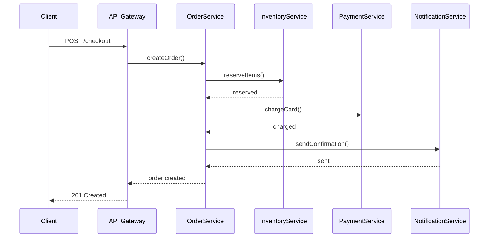
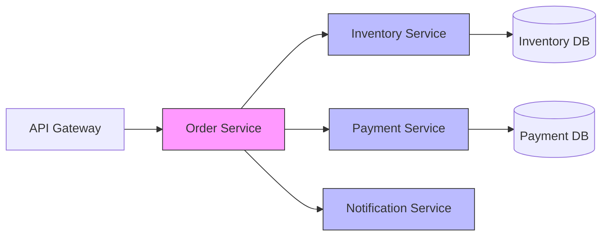

# How to Monitor Service-to-Service Latency in Microservices with OpenTelemetry

Author: [nawazdhandala](https://www.github.com/nawazdhandala)

Tags: OpenTelemetry, Microservices, Latency, Distributed Tracing, Metrics, Observability

Description: A practical guide to measuring and monitoring service-to-service latency in microservices architectures using OpenTelemetry traces and metrics.

---

In a monolith, a function call takes microseconds and you rarely think about it. In microservices, that same logical operation becomes a network call with serialization overhead, DNS resolution, TLS handshakes, load balancer hops, and potential retries. Suddenly the latency between services is a first-class concern. And if you can't measure it, you can't fix it.

OpenTelemetry gives you two complementary tools for this: distributed traces that show you the path a request takes across services, and metrics that quantify latency distributions over time. Used together, they tell you both "this specific request was slow" and "service A's calls to service B have a p99 of 450ms, up from 120ms last week."

This post walks through setting up both approaches in a practical microservices environment.

## The Latency Problem in Microservices

When a user hits your API, the request might fan out through 5 or 10 services before a response comes back. Each hop adds latency, and the total response time is at least the sum of the critical path. But it's often worse than that because of queuing, connection pooling, and retry logic.

Here's a typical request flow where latency can hide:



The client sees one latency number. But the interesting question is: where in that chain is the time actually spent?

## Setting Up Distributed Tracing Between Services

The foundation is context propagation. When Service A calls Service B, the trace context (trace ID, span ID, trace flags) must travel with the request. OpenTelemetry handles this automatically for HTTP and gRPC when you use the right instrumentation libraries.

Here's a Python service setup using FastAPI that traces both incoming requests and outgoing HTTP calls:

```python
# tracing_setup.py - Initialize OpenTelemetry for a Python microservice
from opentelemetry import trace
from opentelemetry.sdk.trace import TracerProvider
from opentelemetry.sdk.trace.export import BatchSpanProcessor
from opentelemetry.exporter.otlp.proto.grpc.trace_exporter import OTLPSpanExporter
from opentelemetry.sdk.resources import Resource
from opentelemetry.instrumentation.fastapi import FastAPIInstrumentor
from opentelemetry.instrumentation.httpx import HTTPXClientInstrumentor
from opentelemetry.propagate import set_global_textmap
from opentelemetry.propagators.b3 import B3MultiFormat

def setup_tracing(service_name: str):
    # Define the service identity for all spans
    resource = Resource.create({"service.name": service_name})

    # Configure the trace provider with OTLP export
    provider = TracerProvider(resource=resource)
    exporter = OTLPSpanExporter(endpoint="http://otel-collector:4317")
    provider.add_span_processor(BatchSpanProcessor(exporter))
    trace.set_tracer_provider(provider)

    # Use W3C TraceContext propagation (the default) for cross-service context
    # If you need B3 for Zipkin compatibility, uncomment:
    # set_global_textmap(B3MultiFormat())

def instrument_app(app):
    # Auto-instrument FastAPI to create spans for incoming requests
    FastAPIInstrumentor.instrument_app(app)
    # Auto-instrument outgoing HTTP calls to propagate trace context
    HTTPXClientInstrumentor().instrument()
```

On the calling side, the instrumented HTTP client automatically injects trace headers. On the receiving side, the instrumented web framework extracts them. The result is a connected trace across services.

## Measuring Latency with Span Attributes

Traces give you per-request latency, but you want to enrich spans with attributes that help you slice the data later. Adding attributes like the target service name, the RPC method, and whether the call was a retry makes your traces much more useful.

This middleware adds service-to-service metadata to every outgoing span:

```python
# latency_middleware.py
import time
from opentelemetry import trace, context
from opentelemetry.trace import StatusCode

tracer = trace.get_tracer("service-latency")

async def call_service(client, url: str, target_service: str, method: str = "GET", **kwargs):
    """Wrapper around HTTP calls that adds latency tracking attributes."""
    with tracer.start_as_current_span(f"call.{target_service}") as span:
        # Tag the span with routing metadata for filtering
        span.set_attribute("peer.service", target_service)
        span.set_attribute("http.method", method)
        span.set_attribute("http.url", url)

        start = time.monotonic()
        try:
            response = await client.request(method, url, **kwargs)
            elapsed_ms = (time.monotonic() - start) * 1000

            # Record the latency as a span attribute for easy querying
            span.set_attribute("service.call.latency_ms", elapsed_ms)
            span.set_attribute("http.status_code", response.status_code)

            if response.status_code >= 500:
                span.set_status(StatusCode.ERROR, f"HTTP {response.status_code}")

            return response
        except Exception as e:
            elapsed_ms = (time.monotonic() - start) * 1000
            span.set_attribute("service.call.latency_ms", elapsed_ms)
            span.record_exception(e)
            span.set_status(StatusCode.ERROR, str(e))
            raise
```

## Creating Latency Metrics

Traces are great for investigating individual requests, but for dashboards and alerting you need aggregated metrics. OpenTelemetry's metrics API lets you create histograms that capture latency distributions across all calls.

This module creates a histogram metric that tracks service-to-service call duration:

```python
# latency_metrics.py
from opentelemetry import metrics
from opentelemetry.sdk.metrics import MeterProvider
from opentelemetry.sdk.metrics.export import PeriodicExportingMetricReader
from opentelemetry.exporter.otlp.proto.grpc.metric_exporter import OTLPMetricExporter
from opentelemetry.sdk.resources import Resource

def setup_metrics(service_name: str):
    resource = Resource.create({"service.name": service_name})

    # Configure metric export to the collector every 30 seconds
    reader = PeriodicExportingMetricReader(
        OTLPMetricExporter(endpoint="http://otel-collector:4317"),
        export_interval_millis=30000,
    )
    provider = MeterProvider(resource=resource, metric_readers=[reader])
    metrics.set_meter_provider(provider)

# Create a meter for this module
meter = metrics.get_meter("service.latency")

# Histogram for service-to-service call duration
# Bucket boundaries chosen for typical microservice latency patterns
service_call_duration = meter.create_histogram(
    name="service.call.duration",
    description="Duration of service-to-service calls in milliseconds",
    unit="ms",
)

# Counter for tracking call volumes and error rates
service_call_count = meter.create_counter(
    name="service.call.count",
    description="Number of service-to-service calls",
)

def record_call(target_service: str, method: str, duration_ms: float, status: str):
    """Record a service call in both the histogram and counter."""
    labels = {
        "target.service": target_service,
        "http.method": method,
        "call.status": status,  # "success", "error", "timeout"
    }
    service_call_duration.record(duration_ms, labels)
    service_call_count.add(1, labels)
```

## Combining Traces and Metrics in Practice

Here's how you'd wire this together in an actual service. The order service calls both inventory and payment services, and we track latency for each:

```python
# order_service.py
from fastapi import FastAPI
import httpx
from tracing_setup import setup_tracing, instrument_app
from latency_metrics import setup_metrics, record_call
from opentelemetry import trace
import time

# Initialize tracing and metrics before anything else
setup_tracing("order-service")
setup_metrics("order-service")

app = FastAPI()
instrument_app(app)
tracer = trace.get_tracer("order-service")

INVENTORY_URL = "http://inventory-service:8080"
PAYMENT_URL = "http://payment-service:8080"

@app.post("/orders")
async def create_order(order: dict):
    async with httpx.AsyncClient() as client:
        # Call inventory service and measure latency
        start = time.monotonic()
        try:
            inv_response = await client.post(
                f"{INVENTORY_URL}/reserve",
                json={"items": order["items"]}
            )
            duration = (time.monotonic() - start) * 1000
            record_call("inventory-service", "POST", duration, "success")
        except Exception as e:
            duration = (time.monotonic() - start) * 1000
            record_call("inventory-service", "POST", duration, "error")
            raise

        # Call payment service and measure latency
        start = time.monotonic()
        try:
            pay_response = await client.post(
                f"{PAYMENT_URL}/charge",
                json={"amount": order["total"], "card": order["card_token"]}
            )
            duration = (time.monotonic() - start) * 1000
            record_call("payment-service", "POST", duration, "success")
        except Exception as e:
            duration = (time.monotonic() - start) * 1000
            record_call("payment-service", "POST", duration, "error")
            raise

        return {"order_id": "generated-id", "status": "created"}
```

## Collector Configuration for Latency Data

Your OpenTelemetry Collector should handle both traces and metrics. The `spanmetrics` connector is particularly useful here because it automatically generates latency metrics from your trace data, so you get metrics even for services where you only set up tracing.

```yaml
# otel-collector-config.yaml
receivers:
  otlp:
    protocols:
      grpc:
        endpoint: "0.0.0.0:4317"
      http:
        endpoint: "0.0.0.0:4318"

connectors:
  # Automatically derive latency metrics from spans
  spanmetrics:
    histogram:
      explicit:
        # Bucket boundaries in milliseconds for latency histograms
        buckets: [5, 10, 25, 50, 100, 250, 500, 1000, 2500, 5000]
    dimensions:
      - name: peer.service    # Break down by target service
      - name: http.method     # Break down by HTTP method
      - name: http.status_code
    dimensions_cache_size: 1000

processors:
  batch:
    timeout: 5s
    send_batch_size: 512

exporters:
  otlp/traces:
    endpoint: "https://your-oneuptime-instance.com:4317"
    tls:
      insecure: false
  otlp/metrics:
    endpoint: "https://your-oneuptime-instance.com:4317"
    tls:
      insecure: false

service:
  pipelines:
    traces:
      receivers: [otlp]
      processors: [batch]
      exporters: [otlp/traces, spanmetrics]  # Feed traces into spanmetrics connector
    metrics:
      receivers: [otlp, spanmetrics]  # Receive both direct metrics and derived span metrics
      processors: [batch]
      exporters: [otlp/metrics]
```

## Visualizing the Service Map

The trace data you collect naturally builds a service dependency map. Each span with a `peer.service` attribute represents an edge in the graph. Most observability platforms will render this automatically, but you can also query it yourself.

The service topology for our example looks like this:



## Setting Up Latency Alerts

With latency metrics flowing, you can set alerts on p50, p95, and p99 latency. A good starting point:

- **p50 baseline alert**: If median latency doubles from the 7-day average, something has changed.
- **p99 spike alert**: If p99 exceeds your SLO threshold (say 500ms), you're at risk of breaching your SLA.
- **Error rate correlation**: Alert when both latency and error rate increase together, which usually indicates a downstream service is degraded.

## Key Takeaways

Monitoring service-to-service latency is not optional in microservices. It's how you catch problems before they cascade into outages. OpenTelemetry makes this practical by giving you both the distributed traces for debugging individual slow requests and the aggregated metrics for dashboarding and alerting. The `spanmetrics` connector in the Collector is especially powerful because it means any service with tracing automatically gets latency metrics for free. Start by instrumenting your most critical service-to-service calls, add the spanmetrics connector, and build dashboards around p50/p95/p99 latency per service pair. You'll be surprised how quickly you find bottlenecks you didn't know existed.
