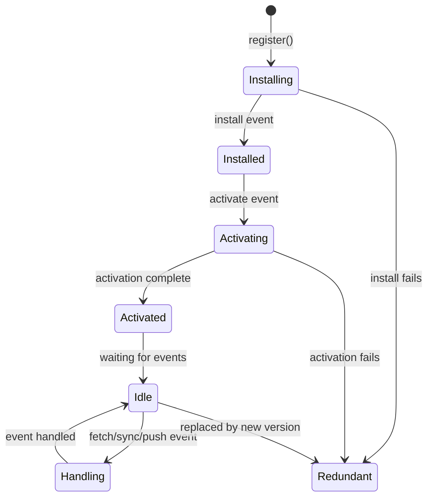

# How to Monitor Service Worker and PWA Performance with OpenTelemetry

Author: [nawazdhandala](https://www.github.com/nawazdhandala)

Tags: OpenTelemetry, Service Worker, PWA, Performance, Caching, Offline, Browser

Description: Learn how to instrument service workers and progressive web apps with OpenTelemetry to track cache hit rates, offline behavior, sync events, and installation lifecycle metrics.

---

Service workers run in the background, separate from your main web page. They intercept network requests, manage caches, handle push notifications, and enable offline functionality. Because they operate in their own thread with their own lifecycle, they are some of the hardest parts of a web application to observe.

Most frontend monitoring tools completely ignore service workers. They focus on the main thread where DOM interactions happen. But for progressive web apps, the service worker is responsible for critical functionality. A broken cache strategy can make your app feel slow. A failed background sync can lose user data. You need visibility into what the service worker is doing.

OpenTelemetry can run inside a service worker just like it runs in the main page context. The key difference is that you need a separate tracer provider instance because service workers have their own global scope.

## Service Worker Lifecycle

Before jumping into instrumentation, here is how the service worker lifecycle works:



Each of these transitions is something you want to track. A slow installation means your cache priming is taking too long. Failed activations could mean your cache cleanup logic has a bug. Understanding this lifecycle through telemetry helps you ship reliable PWAs.

## Setting Up OpenTelemetry Inside the Service Worker

Service workers cannot share the tracer provider from the main page. They need their own setup:

```javascript
// sw.js (service worker file)
importScripts(
  'https://cdn.jsdelivr.net/npm/@opentelemetry/api@1.7.0/build/bundles/api.min.js',
  'https://cdn.jsdelivr.net/npm/@opentelemetry/sdk-trace-web@1.22.0/build/bundles/sdk-trace-web.min.js',
  'https://cdn.jsdelivr.net/npm/@opentelemetry/exporter-trace-otlp-http@0.48.0/build/bundles/exporter-trace-otlp-http.min.js'
);

// Initialize the tracer provider for the service worker context
const { WebTracerProvider } = opentelemetry.sdk.trace.web;
const { OTLPTraceExporter } = opentelemetry.exporter.trace.otlp.http;
const { BatchSpanProcessor } = opentelemetry.sdk.trace.web;
const { trace, SpanStatusCode } = opentelemetry.api;

const provider = new WebTracerProvider();
provider.addSpanProcessor(
  new BatchSpanProcessor(
    new OTLPTraceExporter({
      url: 'https://otel-collector.example.com/v1/traces',
    })
  )
);
provider.register();

const tracer = trace.getTracer('service-worker', '1.0.0');
```

Using `importScripts` is the standard way to load libraries in a service worker since ES module imports have limited support in this context. The tracer operates independently from the main page, so spans from the service worker and spans from the main page will show up as separate traces unless you manually propagate context between them.

## Instrumenting the Install and Activate Lifecycle

Track how long cache priming takes during installation and how the activation phase performs:

```javascript
// sw.js - lifecycle instrumentation

// Cache version for managing updates
const CACHE_NAME = 'app-cache-v2';
const PRECACHE_URLS = [
  '/',
  '/index.html',
  '/styles/main.css',
  '/scripts/app.js',
  '/offline.html',
];

self.addEventListener('install', (event) => {
  const span = tracer.startSpan('sw.install', {
    attributes: {
      'sw.cache_name': CACHE_NAME,
      'sw.precache_url_count': PRECACHE_URLS.length,
    },
  });

  event.waitUntil(
    caches
      .open(CACHE_NAME)
      .then((cache) => {
        // Time how long it takes to precache all resources
        const cacheStart = performance.now();
        return cache.addAll(PRECACHE_URLS).then(() => {
          const cacheDuration = performance.now() - cacheStart;
          span.setAttribute('sw.precache_duration_ms', cacheDuration);
          span.setStatus({ code: SpanStatusCode.OK });
          span.end();
        });
      })
      .catch((error) => {
        span.recordException(error);
        span.setStatus({
          code: SpanStatusCode.ERROR,
          message: `Install failed: ${error.message}`,
        });
        span.end();
        throw error;
      })
  );
});

self.addEventListener('activate', (event) => {
  const span = tracer.startSpan('sw.activate', {
    attributes: {
      'sw.cache_name': CACHE_NAME,
    },
  });

  event.waitUntil(
    caches
      .keys()
      .then((cacheNames) => {
        // Clean up old caches from previous versions
        const oldCaches = cacheNames.filter((name) => name !== CACHE_NAME);
        span.setAttribute('sw.old_caches_removed', oldCaches.length);

        return Promise.all(
          oldCaches.map((name) => caches.delete(name))
        );
      })
      .then(() => {
        span.setStatus({ code: SpanStatusCode.OK });
        span.end();
        return self.clients.claim();
      })
      .catch((error) => {
        span.recordException(error);
        span.setStatus({ code: SpanStatusCode.ERROR });
        span.end();
      })
  );
});
```

The install span captures how many URLs are being precached and how long the caching takes. If the total cache size is large, you might see installation times of several seconds on slow connections. The activate span tracks how many old caches were cleaned up, which helps you understand the update process.

## Instrumenting Fetch Interception with Cache Strategy Tracking

The fetch handler is where the real action happens. Every network request from the page passes through here, and your caching strategy determines whether it gets served from the cache, the network, or some combination:

```javascript
// sw.js - fetch handler with cache strategy tracking

self.addEventListener('fetch', (event) => {
  const url = new URL(event.request.url);

  // Only instrument same-origin requests to reduce noise
  if (url.origin !== self.location.origin) return;

  event.respondWith(
    (async () => {
      const span = tracer.startSpan('sw.fetch', {
        attributes: {
          'http.url': event.request.url,
          'http.method': event.request.method,
          'sw.request_mode': event.request.mode,
          'sw.request_destination': event.request.destination,
        },
      });

      const fetchStart = performance.now();

      try {
        // Try cache first (stale-while-revalidate strategy)
        const cachedResponse = await caches.match(event.request);

        if (cachedResponse) {
          // Cache hit - serve immediately
          const cacheLatency = performance.now() - fetchStart;
          span.setAttribute('sw.cache_hit', true);
          span.setAttribute('sw.cache_latency_ms', cacheLatency);
          span.setAttribute('sw.strategy', 'cache-first');
          span.setStatus({ code: SpanStatusCode.OK });
          span.end();

          // Revalidate in the background
          revalidateCache(event.request);

          return cachedResponse;
        }

        // Cache miss - go to network
        span.setAttribute('sw.cache_hit', false);
        const networkResponse = await fetch(event.request);
        const networkLatency = performance.now() - fetchStart;

        span.setAttribute('sw.network_latency_ms', networkLatency);
        span.setAttribute('sw.strategy', 'network-fallback');
        span.setAttribute('http.status_code', networkResponse.status);

        // Cache the response for next time
        if (networkResponse.ok) {
          const cache = await caches.open(CACHE_NAME);
          cache.put(event.request, networkResponse.clone());
          span.setAttribute('sw.cached_new_response', true);
        }

        span.setStatus({ code: SpanStatusCode.OK });
        span.end();
        return networkResponse;

      } catch (error) {
        // Network failed - try to serve offline fallback
        const offlineLatency = performance.now() - fetchStart;
        span.setAttribute('sw.offline_fallback', true);
        span.setAttribute('sw.offline_latency_ms', offlineLatency);
        span.recordException(error);

        const offlineResponse = await caches.match('/offline.html');
        if (offlineResponse) {
          span.setAttribute('sw.strategy', 'offline-fallback');
          span.setStatus({ code: SpanStatusCode.OK });
          span.end();
          return offlineResponse;
        }

        span.setStatus({ code: SpanStatusCode.ERROR });
        span.end();
        throw error;
      }
    })()
  );
});

// Background revalidation for stale-while-revalidate
async function revalidateCache(request) {
  const span = tracer.startSpan('sw.revalidate', {
    attributes: {
      'http.url': request.url,
    },
  });

  try {
    const response = await fetch(request);
    if (response.ok) {
      const cache = await caches.open(CACHE_NAME);
      await cache.put(request, response);
      span.setAttribute('sw.revalidation_success', true);
    }
    span.setStatus({ code: SpanStatusCode.OK });
  } catch (error) {
    span.setAttribute('sw.revalidation_success', false);
    span.recordException(error);
    span.setStatus({ code: SpanStatusCode.ERROR });
  }
  span.end();
}
```

The `sw.cache_hit` attribute is the most important one here. By aggregating this across all requests, you get your cache hit rate. A high cache hit rate means your caching strategy is working well. A sudden drop could mean you deployed a new version that invalidated the cache or that your cache is filling up and evicting entries.

## Tracking Background Sync

Background sync lets your PWA defer actions until the user has a stable internet connection. This is critical for offline-capable apps:

```javascript
// sw.js - background sync instrumentation

self.addEventListener('sync', (event) => {
  if (event.tag === 'sync-pending-data') {
    const span = tracer.startSpan('sw.background_sync', {
      attributes: {
        'sw.sync_tag': event.tag,
        'sw.last_chance': event.lastChance,
      },
    });

    event.waitUntil(
      syncPendingData()
        .then((result) => {
          span.setAttribute('sw.synced_items', result.count);
          span.setAttribute('sw.sync_duration_ms', result.duration);
          span.setStatus({ code: SpanStatusCode.OK });
          span.end();
        })
        .catch((error) => {
          span.recordException(error);
          span.setAttribute('sw.will_retry', !event.lastChance);
          span.setStatus({
            code: SpanStatusCode.ERROR,
            message: error.message,
          });
          span.end();
          throw error;
        })
    );
  }
});

async function syncPendingData() {
  const start = performance.now();
  // Read pending items from IndexedDB and send them to the server
  const db = await openDB();
  const pending = await db.getAll('pending-actions');

  for (const item of pending) {
    await fetch('/api/sync', {
      method: 'POST',
      body: JSON.stringify(item),
      headers: { 'Content-Type': 'application/json' },
    });
    await db.delete('pending-actions', item.id);
  }

  return {
    count: pending.length,
    duration: performance.now() - start,
  };
}
```

The `event.lastChance` property is especially important to track. When it is true, the browser is about to give up retrying. If you see many last-chance sync failures, users are losing data.

## Monitoring from the Main Thread

The main page can also track service worker registration and updates:

```javascript
// src/sw-monitor.js
import { tracer } from './tracing';
import { SpanStatusCode } from '@opentelemetry/api';

export async function registerAndMonitorServiceWorker() {
  if (!('serviceWorker' in navigator)) return;

  const span = tracer.startSpan('sw.registration');

  try {
    const registration = await navigator.serviceWorker.register('/sw.js');

    span.setAttribute('sw.scope', registration.scope);
    span.setAttribute('sw.already_active', !!registration.active);
    span.setStatus({ code: SpanStatusCode.OK });
    span.end();

    // Track when a new version is found
    registration.addEventListener('updatefound', () => {
      const updateSpan = tracer.startSpan('sw.update_found', {
        attributes: {
          'sw.scope': registration.scope,
          'sw.installing_state': registration.installing?.state,
        },
      });
      updateSpan.end();
    });

  } catch (error) {
    span.recordException(error);
    span.setStatus({ code: SpanStatusCode.ERROR });
    span.end();
  }
}
```

This monitors the service worker from the page side. Combined with the instrumentation inside the service worker itself, you get a complete picture of PWA behavior.

## Key Metrics to Dashboard

With all this instrumentation in place, build dashboards around these metrics:

- **Cache hit rate**: Percentage of `sw.fetch` spans where `sw.cache_hit` is true. This is your primary indicator of caching effectiveness.
- **Installation time**: The `sw.precache_duration_ms` attribute from `sw.install` spans. Track this across deployments to make sure you are not precaching too many resources.
- **Background sync success rate**: Compare successful vs failed `sw.background_sync` spans. Watch for spikes in last-chance failures.
- **Offline fallback frequency**: Count `sw.fetch` spans where `sw.offline_fallback` is true. This tells you how often users hit the offline page.
- **Cache revalidation latency**: The duration of `sw.revalidate` spans shows how long background updates take.

## Wrapping Up

Service workers are the engine behind progressive web apps, and they deserve proper observability. By running OpenTelemetry inside the service worker context, you get direct visibility into caching strategies, offline behavior, background sync reliability, and lifecycle events.

The most valuable insight you will get from this instrumentation is the cache hit rate broken down by request type. Knowing that your JavaScript bundles have a 99% hit rate but your API responses only hit 40% tells you exactly where to improve your caching strategy. That kind of targeted optimization is only possible when you have real data from production service workers.
