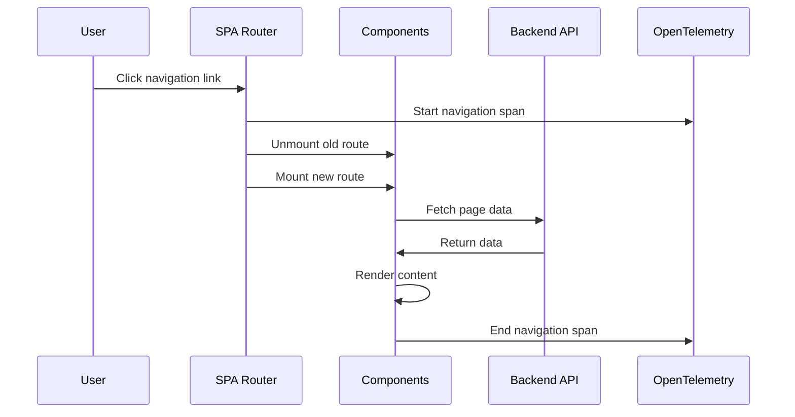
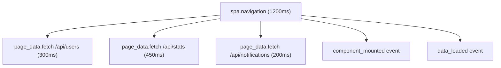

# How to Monitor Single Page Application Navigation with OpenTelemetry

Author: [nawazdhandala](https://www.github.com/nawazdhandala)

Tags: OpenTelemetry, SPA, Single Page Application, Navigation, Router, Frontend Monitoring

Description: Learn how to instrument single page application route changes and navigation events with OpenTelemetry for complete frontend observability.

---

Single page applications break the traditional model of web monitoring. In a server-rendered application, every page transition is a full HTTP request that naturally appears in your server logs and monitoring tools. In an SPA, the initial page load is the only real navigation event the browser reports. Every subsequent route change happens entirely in JavaScript, invisible to standard monitoring unless you explicitly instrument it.

This gap means you can miss slow page transitions, failed data fetches during navigation, and user experience problems that only surface when moving between views. OpenTelemetry gives you the tools to fill this gap by creating spans that represent each navigation event and everything that happens during it.

## The SPA Monitoring Challenge

When a user clicks a link in a traditional multi-page application, the browser fires a navigation event, requests a new HTML document, and the server logs the request. Performance metrics like Time to First Byte and DOM Content Loaded apply naturally.

In an SPA, clicking a link triggers the JavaScript router. The router updates the URL using the History API, unmounts the old component tree, mounts the new one, and possibly fetches data from an API. None of this generates a traditional navigation event. The Performance Timing API sees only the original page load.



## Setting Up the Navigation Tracer

Create a dedicated module for navigation tracing that works independently of your router library. The core idea is to start a span when navigation begins and end it when the new page is fully rendered with its data.

```javascript
// src/navigation-tracer.js
import { trace, SpanStatusCode, context } from '@opentelemetry/api';

// Get a tracer dedicated to navigation events
const tracer = trace.getTracer('spa-navigation', '1.0.0');

// Track the currently active navigation span
let activeNavigationSpan = null;

// Start a new navigation span when a route change begins
export function startNavigation(fromPath, toPath) {
  // If there is already an active navigation, end it first
  // This handles rapid navigation where the user clicks quickly
  if (activeNavigationSpan) {
    activeNavigationSpan.setAttribute('navigation.interrupted', true);
    activeNavigationSpan.end();
  }

  // Create the navigation span
  activeNavigationSpan = tracer.startSpan('spa.navigation', {
    attributes: {
      'navigation.from': fromPath,
      'navigation.to': toPath,
      'navigation.start_time': Date.now(),
      'navigation.type': classifyNavigation(fromPath, toPath),
    },
  });

  // Add an event marking the start of route resolution
  activeNavigationSpan.addEvent('route_change_started');

  return activeNavigationSpan;
}

// Mark that the route component has been mounted
export function markRouteComponentMounted() {
  if (activeNavigationSpan) {
    activeNavigationSpan.addEvent('component_mounted');
  }
}

// Mark that all data for the page has been loaded
export function markDataLoaded() {
  if (activeNavigationSpan) {
    activeNavigationSpan.addEvent('data_loaded');
  }
}

// End the navigation span when the page is fully ready
export function endNavigation(success = true) {
  if (!activeNavigationSpan) return;

  if (success) {
    activeNavigationSpan.setStatus({ code: SpanStatusCode.OK });
  } else {
    activeNavigationSpan.setStatus({
      code: SpanStatusCode.ERROR,
      message: 'Navigation failed',
    });
  }

  activeNavigationSpan.end();
  activeNavigationSpan = null;
}

// Get the active navigation span for adding child spans
export function getNavigationSpan() {
  return activeNavigationSpan;
}

// Classify the type of navigation
function classifyNavigation(from, to) {
  if (!from || from === '/') return 'initial';
  if (from === to) return 'refresh';

  // Check if it's a parameter change on the same route pattern
  const fromBase = from.split('/').slice(0, -1).join('/');
  const toBase = to.split('/').slice(0, -1).join('/');
  if (fromBase === toBase) return 'param_change';

  return 'route_change';
}
```

The key insight here is that SPA navigation is not a single event but a process with distinct phases: route resolution, component mounting, data fetching, and rendering. By adding events at each phase, you can see exactly where time is being spent in each navigation.

## Integrating with React Router

If you use React Router, you can hook into its navigation lifecycle to start and end spans automatically.

```javascript
// src/router/instrumented-router.js
import { useEffect, useRef } from 'react';
import { useLocation, useNavigation } from 'react-router-dom';
import {
  startNavigation,
  endNavigation,
  markRouteComponentMounted,
} from '../navigation-tracer';

// Custom hook that instruments route changes
export function useNavigationTracing() {
  const location = useLocation();
  const navigation = useNavigation();
  const previousPath = useRef(null);

  useEffect(() => {
    const currentPath = location.pathname + location.search;
    const fromPath = previousPath.current;

    if (fromPath !== null && fromPath !== currentPath) {
      // A route change occurred, start tracking it
      startNavigation(fromPath, currentPath);
    }

    // Update the previous path reference
    previousPath.current = currentPath;

    // Mark the component as mounted after this render cycle
    // Using requestAnimationFrame ensures the DOM has actually updated
    requestAnimationFrame(() => {
      markRouteComponentMounted();
    });
  }, [location]);

  // Watch the navigation state for loading completion
  useEffect(() => {
    if (navigation.state === 'idle') {
      // Navigation is complete, data loaders have finished
      endNavigation(true);
    }
  }, [navigation.state]);
}
```

Use this hook in your root layout component so it tracks every navigation:

```javascript
// src/layouts/RootLayout.jsx
import { Outlet } from 'react-router-dom';
import { useNavigationTracing } from '../router/instrumented-router';

export default function RootLayout() {
  // Activate navigation tracing for all routes
  useNavigationTracing();

  return (
    <div className="app-layout">
      <header>{/* ... */}</header>
      <main>
        <Outlet />
      </main>
      <footer>{/* ... */}</footer>
    </div>
  );
}
```

## Integrating with Vue Router

For Vue applications using Vue Router, the navigation guards provide clean hooks for instrumentation.

```javascript
// src/router/index.js
import { createRouter, createWebHistory } from 'vue-router';
import {
  startNavigation,
  endNavigation,
  markRouteComponentMounted,
} from '../navigation-tracer';

const router = createRouter({
  history: createWebHistory(),
  routes: [
    // ... your routes
  ],
});

// Global before guard: fires when navigation starts
router.beforeEach((to, from) => {
  // Start a navigation span
  startNavigation(from.fullPath, to.fullPath);
});

// Global after hook: fires when navigation is resolved
router.afterEach((to, from, failure) => {
  if (failure) {
    // Navigation was aborted or errored
    endNavigation(false);
  } else {
    // Component is resolved but may not be mounted yet
    // Use nextTick to wait for the DOM update
    import('vue').then(({ nextTick }) => {
      nextTick(() => {
        markRouteComponentMounted();
      });
    });
  }
});

// Handle navigation errors
router.onError((error) => {
  const span = getNavigationSpan();
  if (span) {
    span.recordException(error);
  }
  endNavigation(false);
});

export default router;
```

Vue Router's navigation guards fire at well-defined points in the navigation lifecycle, making them ideal for instrumentation. The `beforeEach` guard fires before any route resolution happens, and `afterEach` fires after the navigation is confirmed.

## Tracking Data Fetching During Navigation

One of the most valuable things to monitor is how long data fetching takes during navigation. When a user navigates to a dashboard page that loads three API endpoints, you want to see each of those requests as child spans of the navigation span.

```javascript
// src/utils/traced-fetch.js
import { trace, context, SpanStatusCode } from '@opentelemetry/api';
import { getNavigationSpan } from '../navigation-tracer';

const tracer = trace.getTracer('spa-navigation', '1.0.0');

// Fetch wrapper that creates child spans under the active navigation
export async function tracedPageFetch(url, options = {}) {
  const navigationSpan = getNavigationSpan();
  const parentContext = navigationSpan
    ? trace.setSpan(context.active(), navigationSpan)
    : context.active();

  // Create a child span under the navigation span
  return context.with(parentContext, async () => {
    const span = tracer.startSpan('page_data.fetch', {
      attributes: {
        'http.url': url,
        'http.method': options.method || 'GET',
      },
    });

    try {
      const response = await fetch(url, options);

      // Record response metadata
      span.setAttribute('http.status_code', response.status);
      span.setAttribute(
        'http.response_content_length',
        parseInt(response.headers.get('content-length') || '0', 10)
      );

      if (!response.ok) {
        span.setStatus({
          code: SpanStatusCode.ERROR,
          message: `HTTP ${response.status}`,
        });
      } else {
        span.setStatus({ code: SpanStatusCode.OK });
      }

      return response;
    } catch (error) {
      span.recordException(error);
      span.setStatus({
        code: SpanStatusCode.ERROR,
        message: error.message,
      });
      throw error;
    } finally {
      span.end();
    }
  });
}
```

When you use `tracedPageFetch` inside your page components or data loaders, the resulting trace shows the navigation span as the parent with individual fetch requests as children:



## Measuring Perceived Navigation Time

The time between clicking a link and seeing the new content is what matters to users. You can capture this by combining the navigation span with a visual readiness check.

```javascript
// src/utils/visual-complete.js
import { markDataLoaded, endNavigation } from '../navigation-tracer';

// Call this when your page component considers itself fully rendered
// Typically after data is fetched and the loading skeleton is replaced
export function markPageReady() {
  markDataLoaded();

  // Wait for the browser to paint the updated content
  requestAnimationFrame(() => {
    requestAnimationFrame(() => {
      // Two rAF callbacks ensure the browser has actually painted
      endNavigation(true);
    });
  });
}
```

The double `requestAnimationFrame` pattern is a common technique for waiting until the browser has actually painted new content to the screen. A single rAF fires before the paint, while the second one fires after the next frame, confirming the paint happened.

Use this in your page components:

```javascript
// src/pages/Dashboard.jsx
import { useEffect, useState } from 'react';
import { markPageReady } from '../utils/visual-complete';
import { tracedPageFetch } from '../utils/traced-fetch';

export default function Dashboard() {
  const [data, setData] = useState(null);
  const [loading, setLoading] = useState(true);

  useEffect(() => {
    async function loadDashboard() {
      try {
        const response = await tracedPageFetch('/api/dashboard');
        const result = await response.json();
        setData(result);
        setLoading(false);

        // Signal that the page is visually complete
        markPageReady();
      } catch (error) {
        setLoading(false);
        // endNavigation with failure is called by error boundaries
      }
    }

    loadDashboard();
  }, []);

  if (loading) return <div className="skeleton">Loading...</div>;

  return (
    <div className="dashboard">
      {/* Render dashboard content */}
    </div>
  );
}
```

## Handling Browser History Navigation

Users do not always navigate by clicking links. They use the browser back and forward buttons, which trigger `popstate` events. Your instrumentation should capture these as well.

```javascript
// src/utils/history-instrumentation.js
import { startNavigation } from '../navigation-tracer';

let currentPath = window.location.pathname + window.location.search;

// Listen for browser back/forward navigation
window.addEventListener('popstate', () => {
  const newPath = window.location.pathname + window.location.search;

  // Start a navigation span with a special type
  const span = startNavigation(currentPath, newPath);
  if (span) {
    span.setAttribute('navigation.trigger', 'popstate');
  }

  currentPath = newPath;
});
```

This fills in the gap that router-level instrumentation might miss, since some router libraries handle popstate internally without firing their navigation guards in the same way.

## Analyzing Navigation Performance

Once navigation spans are flowing to your backend, you can answer important questions:

- Which page transitions are slowest on average?
- How much of navigation time is spent fetching data versus rendering?
- Are back/forward navigations faster than direct navigations (as they should be with proper caching)?
- Which API calls during navigation have the highest latency?
- How often are navigations interrupted by users clicking away before loading finishes?

The `navigation.interrupted` attribute makes it easy to filter for abandoned navigations, which often indicate that pages are taking too long to load and users are giving up.

## Summary

Monitoring SPA navigation requires explicit instrumentation because the browser does not generate navigation events for client-side route changes. By starting spans when routes change, adding events at component mount and data load milestones, and nesting API calls as child spans, you build a complete picture of every page transition. This visibility lets you identify slow transitions, optimize data fetching patterns, and ensure that the perceived performance of your SPA matches the experience you intend to deliver.
