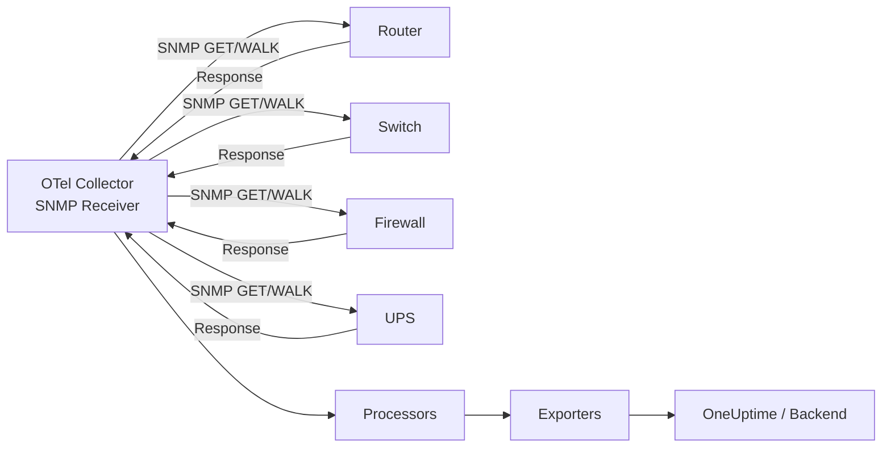

# How to Monitor SNMP Devices with the OpenTelemetry Collector

Author: [nawazdhandala](https://www.github.com/nawazdhandala)

Tags: OpenTelemetry, Collector, SNMP, Network Monitoring, Metrics, Infrastructure, Observability

Description: Learn how to monitor SNMP devices using the OpenTelemetry Collector SNMP receiver to collect network metrics from routers, switches, and other infrastructure.

---

Simple Network Management Protocol (SNMP) has been the backbone of network device monitoring for decades. Routers, switches, firewalls, printers, and even UPS units all speak SNMP. Traditionally you needed dedicated tools like Nagios or Zabbix to poll these devices. But if you are already running the OpenTelemetry Collector for application telemetry, you can bring your network device metrics into the same pipeline with the SNMP receiver. This consolidates your observability stack and lets you correlate network health with application performance in a single backend.

## What is the SNMP Receiver?

The SNMP receiver is a contrib component for the OpenTelemetry Collector that polls SNMP-enabled devices on a schedule. It sends SNMP GET or WALK requests to device agents, reads the responses, maps OID values to OpenTelemetry metrics, and pushes them through your pipeline.

The receiver supports both SNMPv2c and SNMPv3. Version 2c uses community strings for authentication, while version 3 adds username-based security with encryption. For production networks, SNMPv3 is strongly recommended.



The receiver works by maintaining a list of OIDs (Object Identifiers) to poll. Each OID maps to a specific metric on the device, such as interface bytes in, CPU utilization, or memory usage. You define which OIDs to collect and how they translate into named OpenTelemetry metrics.

## Prerequisites

Before configuring the receiver, make sure a few things are in place.

First, your target devices need SNMP enabled. Most network devices ship with SNMP support, but it may be disabled by default. Check your device documentation for how to enable the SNMP agent.

Second, you need the OpenTelemetry Collector Contrib distribution. The SNMP receiver is not included in the core distribution.

```bash
# Download the contrib distribution
# Replace the version with the latest available
wget https://github.com/open-telemetry/opentelemetry-collector-releases/releases/download/v0.98.0/otelcol-contrib_0.98.0_linux_amd64.tar.gz

# Extract and install
tar -xzf otelcol-contrib_0.98.0_linux_amd64.tar.gz
sudo mv otelcol-contrib /usr/local/bin/
```

Third, verify connectivity from the Collector host to your SNMP devices on UDP port 161.

```bash
# Test SNMP connectivity using snmpwalk (install net-snmp if needed)
snmpwalk -v2c -c public 192.168.1.1 sysDescr.0
```

If that returns a description string from the device, you are good to go.

## Basic Configuration with SNMPv2c

Here is a minimal configuration that polls a single device for system uptime and interface statistics.

```yaml
# Receivers section
receivers:
  # SNMP receiver polls network devices for metrics
  snmp:
    # How often to poll devices
    collection_interval: 60s

    # Target device endpoint (IP:port)
    endpoint: udp://192.168.1.1:161

    # SNMP version 2c with community string
    version: v2c
    community: public

    # Define which OIDs to collect as metrics
    metrics:
      # System uptime in hundredths of a second
      system.uptime:
        unit: "centiseconds"
        gauge:
          value_type: int
        scalar_oids:
          - oid: "1.3.6.1.2.1.1.3.0"

      # Interface bytes received (per-interface counter)
      interface.bytes.received:
        unit: "bytes"
        sum:
          value_type: int
          monotonic: true
          aggregation: cumulative
        column_oids:
          - oid: "1.3.6.1.2.1.2.2.1.10"
            attributes:
              - name: interface.name
                oid: "1.3.6.1.2.1.2.2.1.2"

      # Interface bytes sent (per-interface counter)
      interface.bytes.sent:
        unit: "bytes"
        sum:
          value_type: int
          monotonic: true
          aggregation: cumulative
        column_oids:
          - oid: "1.3.6.1.2.1.2.2.1.16"
            attributes:
              - name: interface.name
                oid: "1.3.6.1.2.1.2.2.1.2"

# Processors for batching
processors:
  batch:
    timeout: 10s
    send_batch_size: 200

# Export to OneUptime
exporters:
  otlphttp:
    endpoint: https://oneuptime.com/otlp
    headers:
      x-oneuptime-token: ${ONEUPTIME_TOKEN}

# Wire everything together
service:
  pipelines:
    metrics:
      receivers: [snmp]
      processors: [batch]
      exporters: [otlphttp]
```

There are two kinds of OID references in this configuration. A `scalar_oid` fetches a single value from the device, like system uptime. A `column_oid` walks a table and returns one value per row, which is perfect for per-interface metrics where each row represents a different network interface. The `attributes` block under a column OID maps another column in the same table to a label, so each metric point gets tagged with its interface name.

## Secure Configuration with SNMPv3

For production networks you should use SNMPv3 with authentication and encryption. Community strings in v2c travel in cleartext and offer no real security.

```yaml
receivers:
  snmp:
    collection_interval: 60s
    endpoint: udp://10.0.0.1:161

    # SNMPv3 with authentication and privacy (authPriv)
    version: v3
    security_level: auth_priv
    user: otel_monitor
    auth_type: SHA
    auth_password: ${SNMP_AUTH_PASSWORD}
    privacy_type: AES
    privacy_password: ${SNMP_PRIV_PASSWORD}

    metrics:
      # CPU utilization percentage
      device.cpu.utilization:
        unit: "percent"
        gauge:
          value_type: int
        scalar_oids:
          - oid: "1.3.6.1.4.1.9.9.109.1.1.1.1.8.1"

      # Memory used
      device.memory.used:
        unit: "bytes"
        gauge:
          value_type: int
        scalar_oids:
          - oid: "1.3.6.1.4.1.9.9.48.1.1.1.5.1"

      # Memory free
      device.memory.free:
        unit: "bytes"
        gauge:
          value_type: int
        scalar_oids:
          - oid: "1.3.6.1.4.1.9.9.48.1.1.1.6.1"

      # Interface operational status (1=up, 2=down, 3=testing)
      interface.oper_status:
        unit: ""
        gauge:
          value_type: int
        column_oids:
          - oid: "1.3.6.1.2.1.2.2.1.8"
            attributes:
              - name: interface.name
                oid: "1.3.6.1.2.1.2.2.1.2"

processors:
  # Tag metrics with device identity
  attributes/device:
    actions:
      - key: device.type
        value: "router"
        action: insert
      - key: device.location
        value: "dc-east-rack-12"
        action: insert

  batch:
    timeout: 10s

exporters:
  otlphttp:
    endpoint: https://oneuptime.com/otlp
    headers:
      x-oneuptime-token: ${ONEUPTIME_TOKEN}

service:
  pipelines:
    metrics:
      receivers: [snmp]
      processors: [attributes/device, batch]
      exporters: [otlphttp]
```

The `security_level` field accepts three values: `no_auth_no_priv` for no security, `auth_no_priv` for authentication only, and `auth_priv` for both authentication and encryption. Always use `auth_priv` in production. Store credentials in environment variables and never commit them to version control.

## Monitoring Multiple Devices

Most networks have more than one device to monitor. You can define multiple SNMP receiver instances using named configurations.

```yaml
receivers:
  # Core router
  snmp/core_router:
    collection_interval: 30s
    endpoint: udp://10.0.0.1:161
    version: v3
    security_level: auth_priv
    user: otel_monitor
    auth_type: SHA
    auth_password: ${SNMP_AUTH_PASSWORD}
    privacy_type: AES
    privacy_password: ${SNMP_PRIV_PASSWORD}
    metrics:
      interface.bytes.received:
        unit: "bytes"
        sum:
          value_type: int
          monotonic: true
          aggregation: cumulative
        column_oids:
          - oid: "1.3.6.1.2.1.2.2.1.10"
            attributes:
              - name: interface.name
                oid: "1.3.6.1.2.1.2.2.1.2"
      interface.bytes.sent:
        unit: "bytes"
        sum:
          value_type: int
          monotonic: true
          aggregation: cumulative
        column_oids:
          - oid: "1.3.6.1.2.1.2.2.1.16"
            attributes:
              - name: interface.name
                oid: "1.3.6.1.2.1.2.2.1.2"

  # Access switch
  snmp/access_switch:
    collection_interval: 60s
    endpoint: udp://10.0.0.50:161
    version: v3
    security_level: auth_priv
    user: otel_monitor
    auth_type: SHA
    auth_password: ${SNMP_AUTH_PASSWORD}
    privacy_type: AES
    privacy_password: ${SNMP_PRIV_PASSWORD}
    metrics:
      interface.bytes.received:
        unit: "bytes"
        sum:
          value_type: int
          monotonic: true
          aggregation: cumulative
        column_oids:
          - oid: "1.3.6.1.2.1.2.2.1.10"
            attributes:
              - name: interface.name
                oid: "1.3.6.1.2.1.2.2.1.2"
      interface.oper_status:
        unit: ""
        gauge:
          value_type: int
        column_oids:
          - oid: "1.3.6.1.2.1.2.2.1.8"
            attributes:
              - name: interface.name
                oid: "1.3.6.1.2.1.2.2.1.2"

processors:
  # Label the core router
  attributes/core_router:
    actions:
      - key: device.name
        value: "core-router-01"
        action: insert
      - key: device.role
        value: "core"
        action: insert

  # Label the access switch
  attributes/access_switch:
    actions:
      - key: device.name
        value: "access-switch-01"
        action: insert
      - key: device.role
        value: "access"
        action: insert

  batch:
    timeout: 10s

exporters:
  otlphttp:
    endpoint: https://oneuptime.com/otlp
    headers:
      x-oneuptime-token: ${ONEUPTIME_TOKEN}

service:
  pipelines:
    metrics/core_router:
      receivers: [snmp/core_router]
      processors: [attributes/core_router, batch]
      exporters: [otlphttp]

    metrics/access_switch:
      receivers: [snmp/access_switch]
      processors: [attributes/access_switch, batch]
      exporters: [otlphttp]
```

Each receiver instance gets its own named pipeline so that device-specific attributes are applied correctly. This pattern scales well as you add more devices. For very large networks with hundreds of devices, consider running multiple Collector instances and distributing the device list across them.

## Troubleshooting

If you are not seeing metrics, start with these checks.

**No response from device.** Verify that SNMP is enabled on the device and that UDP port 161 is reachable from the Collector host. Check firewall rules on both sides. Try a manual `snmpwalk` from the same host.

**Authentication errors with v3.** Double-check the username, auth type (MD5 vs SHA), privacy type (DES vs AES), and passwords. The credentials on the Collector must exactly match what is configured on the device.

**Missing metrics.** Some OIDs are vendor-specific and may not exist on all devices. Use `snmpwalk -v2c -c public <device> <oid>` to confirm the OID returns data before adding it to your configuration.

Enable debug logging to see what the receiver is doing.

```yaml
service:
  telemetry:
    logs:
      level: debug
```

## Summary

The SNMP receiver for the OpenTelemetry Collector lets you fold network device monitoring into the same telemetry pipeline you use for applications and infrastructure. Define the OIDs you care about, point the receiver at your devices, and your router and switch metrics flow through the same processors and exporters as everything else. Use SNMPv3 in production, label devices with attributes, and separate device pipelines for clean organization. With SNMP data in your OpenTelemetry backend, you can correlate network events with application issues and get a complete picture of your environment.

Need a backend to visualize and alert on your SNMP metrics? OneUptime provides native OpenTelemetry support with dashboards, alerting, and correlation built for infrastructure observability.
