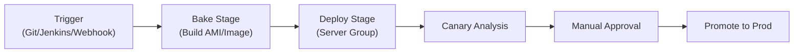

# How to Monitor Spinnaker Deployments with OpenTelemetry

Author: [nawazdhandala](https://www.github.com/nawazdhandala)

Tags: OpenTelemetry, Spinnaker, Deployments, Monitoring, CI/CD, Tracing, Kubernetes

Description: Learn how to monitor Spinnaker deployment pipelines with OpenTelemetry for better visibility into multi-stage rollouts.

---

Spinnaker is a powerful multi-cloud deployment platform, but its internal visibility can be limited. When a deployment pipeline stalls or a canary analysis takes longer than expected, you often end up clicking through the Spinnaker UI trying to piece together what happened. OpenTelemetry provides a way to instrument Spinnaker pipelines so you get structured traces and metrics for every stage of every deployment.

This guide covers how to set up OpenTelemetry monitoring for Spinnaker, from pipeline-level tracing to stage-by-stage metrics.

---

## How Spinnaker Pipelines Work



Each stage in a Spinnaker pipeline is an independently executed unit. Stages can run sequentially or in parallel, and each one has its own lifecycle with status, timing, and potential failure modes. OpenTelemetry lets you capture all of this as a trace.

---

## Setting Up the Webhook-Based Approach

Spinnaker supports webhook stages and pipeline notifications. The most straightforward way to instrument Spinnaker without modifying its source code is to use these hooks to send telemetry data to an external service that emits OpenTelemetry spans.

First, create a small service that receives Spinnaker webhook calls and converts them into spans:

```python
# spinnaker_otel_bridge.py
# This service acts as a bridge between Spinnaker webhook notifications
# and OpenTelemetry. It receives pipeline and stage events from Spinnaker
# and emits corresponding spans to the collector. Each pipeline execution
# becomes a parent span with child spans for each stage.

from flask import Flask, request, jsonify
from opentelemetry import trace
from opentelemetry.sdk.trace import TracerProvider
from opentelemetry.sdk.trace.export import BatchSpanProcessor
from opentelemetry.exporter.otlp.proto.grpc.trace_exporter import OTLPSpanExporter
from opentelemetry.sdk.resources import Resource
import time

app = Flask(__name__)

resource = Resource.create({"service.name": "spinnaker-otel-bridge"})
provider = TracerProvider(resource=resource)
provider.add_span_processor(
    BatchSpanProcessor(OTLPSpanExporter(endpoint="http://otel-collector:4317"))
)
trace.set_tracer_provider(provider)
tracer = trace.get_tracer("spinnaker.pipelines")

# Store active pipeline spans so stage events can be linked to their parent
active_pipelines = {}

@app.route("/pipeline/start", methods=["POST"])
def pipeline_start():
    """Handle pipeline start events from Spinnaker notifications."""
    data = request.json
    pipeline_id = data["execution"]["id"]
    pipeline_name = data["execution"]["name"]
    application = data["execution"]["application"]

    # Start a new root span for this pipeline execution
    span = tracer.start_span(
        f"pipeline:{pipeline_name}",
        attributes={
            "spinnaker.pipeline.id": pipeline_id,
            "spinnaker.pipeline.name": pipeline_name,
            "spinnaker.application": application,
            "spinnaker.trigger.type": data["execution"].get("trigger", {}).get("type", "manual"),
        },
    )
    active_pipelines[pipeline_id] = span
    return jsonify({"status": "tracking"}), 200

@app.route("/pipeline/complete", methods=["POST"])
def pipeline_complete():
    """Handle pipeline completion events."""
    data = request.json
    pipeline_id = data["execution"]["id"]
    status = data["execution"]["status"]

    span = active_pipelines.pop(pipeline_id, None)
    if span:
        span.set_attribute("spinnaker.pipeline.status", status)
        if status != "SUCCEEDED":
            span.set_status(trace.StatusCode.ERROR, f"Pipeline {status}")
        span.end()

    return jsonify({"status": "completed"}), 200

@app.route("/stage/start", methods=["POST"])
def stage_start():
    """Handle stage start events from Spinnaker."""
    data = request.json
    pipeline_id = data["execution"]["id"]
    stage_name = data["stage"]["name"]
    stage_type = data["stage"]["type"]

    parent_span = active_pipelines.get(pipeline_id)
    if parent_span:
        ctx = trace.set_span_in_context(parent_span)
        stage_span = tracer.start_span(
            f"stage:{stage_name}",
            context=ctx,
            attributes={
                "spinnaker.stage.name": stage_name,
                "spinnaker.stage.type": stage_type,
                "spinnaker.pipeline.id": pipeline_id,
            },
        )
        # Store stage spans keyed by pipeline_id + stage_name
        active_pipelines[f"{pipeline_id}:{stage_name}"] = stage_span

    return jsonify({"status": "tracking"}), 200

@app.route("/stage/complete", methods=["POST"])
def stage_complete():
    """Handle stage completion events."""
    data = request.json
    pipeline_id = data["execution"]["id"]
    stage_name = data["stage"]["name"]
    status = data["stage"]["status"]

    key = f"{pipeline_id}:{stage_name}"
    span = active_pipelines.pop(key, None)
    if span:
        span.set_attribute("spinnaker.stage.status", status)
        span.set_attribute("spinnaker.stage.duration_ms",
                          data["stage"].get("endTime", 0) - data["stage"].get("startTime", 0))
        if status != "SUCCEEDED":
            span.set_status(trace.StatusCode.ERROR, f"Stage {status}")
        span.end()

    return jsonify({"status": "completed"}), 200
```

This bridge service maintains a map of active pipeline and stage spans. When Spinnaker sends a start event, a span begins. When it sends a completion event, the span ends with the appropriate status. Stage spans are nested under their parent pipeline span, giving you a proper trace hierarchy.

---

## Configuring Spinnaker Notifications

Spinnaker pipelines support notifications at both the pipeline and stage level. Configure them to call your bridge service:

```json
{
  "notifications": [
    {
      "type": "webhook",
      "address": "http://spinnaker-otel-bridge:5000/pipeline/start",
      "when": ["pipeline.starting"]
    },
    {
      "type": "webhook",
      "address": "http://spinnaker-otel-bridge:5000/pipeline/complete",
      "when": ["pipeline.complete", "pipeline.failed"]
    }
  ],
  "stages": [
    {
      "name": "Bake",
      "type": "bake",
      "notifications": [
        {
          "type": "webhook",
          "address": "http://spinnaker-otel-bridge:5000/stage/start",
          "when": ["stage.starting"]
        },
        {
          "type": "webhook",
          "address": "http://spinnaker-otel-bridge:5000/stage/complete",
          "when": ["stage.complete", "stage.failed"]
        }
      ]
    }
  ]
}
```

You need to add these notification blocks to each stage in your pipeline. It is a bit repetitive, but you can automate it with a pipeline template or a Spinnaker pipeline-as-code tool like Dinghy or sponnet.

---

## Monitoring Canary Deployments

Canary analysis is one of Spinnaker's strongest features, and it benefits greatly from OpenTelemetry monitoring. You can emit metrics from both the canary and baseline instances to compare their behavior:

```python
# canary_metrics.py
# This module emits metrics from your application that are tagged with
# the deployment strategy (canary vs baseline). Spinnaker sets the
# SPINNAKER_SERVER_GROUP environment variable, which you can use to
# determine whether a given instance is canary or baseline.

import os
from opentelemetry import metrics
from opentelemetry.sdk.metrics import MeterProvider
from opentelemetry.sdk.metrics.export import PeriodicExportingMetricReader
from opentelemetry.exporter.otlp.proto.grpc.metric_exporter import OTLPMetricExporter

reader = PeriodicExportingMetricReader(
    OTLPMetricExporter(endpoint="http://otel-collector:4317"),
    export_interval_millis=10000,
)
provider = MeterProvider(metric_readers=[reader])
metrics.set_meter_provider(provider)

meter = metrics.get_meter("canary.metrics")

# Determine if this instance is canary or baseline based on server group name
server_group = os.getenv("SPINNAKER_SERVER_GROUP", "unknown")
is_canary = "canary" in server_group.lower()
deployment_type = "canary" if is_canary else "baseline"

# Create metrics with deployment type labels
request_latency = meter.create_histogram(
    "http.server.duration",
    unit="ms",
    description="HTTP request latency",
)

error_rate = meter.create_counter(
    "http.server.errors",
    description="HTTP server error count",
)

def record_request(endpoint, status_code, duration_ms):
    """Record request metrics with canary/baseline labels."""
    attrs = {
        "deployment.type": deployment_type,
        "server.group": server_group,
        "http.route": endpoint,
        "http.status_code": status_code,
    }
    request_latency.record(duration_ms, attrs)
    if status_code >= 500:
        error_rate.add(1, attrs)
```

With these metrics, you can compare canary and baseline performance side by side. If the canary shows higher latency or error rates, you know the new version has a problem before it reaches all your users.

---

## Tracking Deployment Rollbacks

Rollbacks are critical events that deserve their own tracing. When Spinnaker rolls back a deployment, you want to capture that as a distinct span with clear context about why:

```python
# rollback_tracker.py
# This handler specifically tracks rollback events from Spinnaker.
# Rollbacks are important signals during incident investigation,
# so we capture extra detail about what triggered the rollback.

from opentelemetry import trace

tracer = trace.get_tracer("spinnaker.rollbacks")

def track_rollback(pipeline_data):
    """Create a span for a deployment rollback event."""
    with tracer.start_as_current_span("deployment-rollback") as span:
        span.set_attribute("rollback.application", pipeline_data["application"])
        span.set_attribute("rollback.from_version", pipeline_data.get("from_version", "unknown"))
        span.set_attribute("rollback.to_version", pipeline_data.get("to_version", "unknown"))
        span.set_attribute("rollback.reason", pipeline_data.get("reason", "automated"))
        span.set_attribute("rollback.triggered_by", pipeline_data.get("user", "system"))

        # Record the server groups involved
        for sg in pipeline_data.get("server_groups", []):
            span.add_event("server_group_rollback", {
                "server_group": sg["name"],
                "cloud_provider": sg.get("provider", "unknown"),
                "region": sg.get("region", "unknown"),
            })
```

---

## Collector Configuration for Spinnaker

Configure your OpenTelemetry Collector to handle telemetry from the Spinnaker bridge and your application instances:

```yaml
# otel-collector-config.yaml
# Collector config that receives traces from the Spinnaker bridge service
# and metrics from canary/baseline application instances. It enriches
# the data with Kubernetes attributes and forwards to your backend.

receivers:
  otlp:
    protocols:
      grpc:
        endpoint: 0.0.0.0:4317
      http:
        endpoint: 0.0.0.0:4318

processors:
  batch:
    timeout: 5s
  attributes:
    actions:
      - key: deployment.platform
        value: spinnaker
        action: upsert

exporters:
  otlp:
    endpoint: "https://your-oneuptime-endpoint:4317"
    tls:
      insecure: false

service:
  pipelines:
    traces:
      receivers: [otlp]
      processors: [attributes, batch]
      exporters: [otlp]
    metrics:
      receivers: [otlp]
      processors: [attributes, batch]
      exporters: [otlp]
```

---

## What You Get

Once everything is wired up, you get several useful views of your Spinnaker deployments:

A trace for each pipeline execution that shows every stage as a child span. You can see the bake stage taking 3 minutes, the deploy stage taking 45 seconds, and the canary analysis running for 10 minutes. If a stage fails, the error status and message are right there in the span.

Metrics that compare canary and baseline performance in real time. You can set up alerts that fire if the canary error rate exceeds the baseline by more than a threshold.

Rollback events that appear on your timeline alongside application traces. When investigating an incident, you can see not just that a rollback happened but what version it rolled back from and to.

The combination of these signals turns Spinnaker from a deployment tool into an observable deployment platform.

---

## Summary

Monitoring Spinnaker with OpenTelemetry requires a bridge service that converts Spinnaker webhook notifications into OpenTelemetry spans. This gives you trace-level visibility into pipeline executions, stage-by-stage timing, canary analysis results, and rollback events. The setup is non-invasive since it uses Spinnaker's built-in notification system rather than requiring changes to Spinnaker itself. Combined with application-level metrics tagged with deployment type and version information, you get a complete picture of how deployments affect your production systems.
