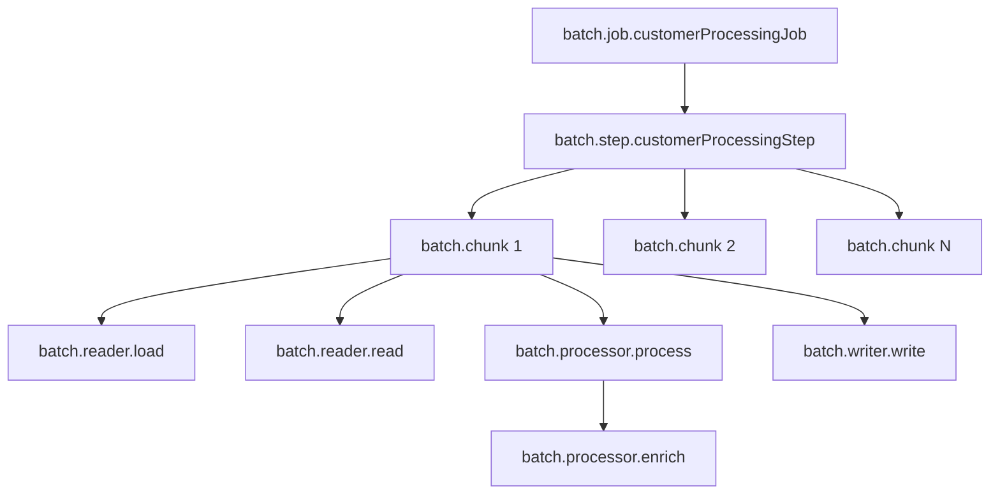

# How to Monitor Spring Batch Job Execution with OpenTelemetry

Author: [nawazdhandala](https://www.github.com/nawazdhandala)

Tags: OpenTelemetry, Spring Batch, Batch Processing, Java, Monitoring

Description: Complete guide to instrumenting Spring Batch jobs with OpenTelemetry for monitoring batch processing performance, tracking chunk-based operations, and debugging batch failures.

Spring Batch processes large volumes of data through jobs composed of steps, chunks, readers, processors, and writers. When batch jobs fail or perform poorly, diagnosing the issue requires visibility into each component. OpenTelemetry provides comprehensive monitoring for batch operations, showing exactly where bottlenecks and failures occur.

## Understanding Spring Batch Architecture

Spring Batch organizes work hierarchically:

- **Job** - The complete batch operation
- **Step** - Individual processing stages within a job
- **Chunk** - Groups of items processed together for efficiency
- **ItemReader** - Reads data from sources
- **ItemProcessor** - Transforms data
- **ItemWriter** - Writes results to destinations

Effective monitoring requires tracing at each level to understand the complete processing pipeline.

## Setting Up Dependencies

Add Spring Batch and OpenTelemetry dependencies:

```xml
<!-- pom.xml -->
<dependencies>
    <!-- Spring Batch -->
    <dependency>
        <groupId>org.springframework.boot</groupId>
        <artifactId>spring-boot-starter-batch</artifactId>
    </dependency>

    <!-- Database for batch metadata -->
    <dependency>
        <groupId>org.springframework.boot</groupId>
        <artifactId>spring-boot-starter-jdbc</artifactId>
    </dependency>

    <!-- H2 for development (use PostgreSQL/MySQL in production) -->
    <dependency>
        <groupId>com.h2database</groupId>
        <artifactId>h2</artifactId>
        <scope>runtime</scope>
    </dependency>

    <!-- OpenTelemetry API -->
    <dependency>
        <groupId>io.opentelemetry</groupId>
        <artifactId>opentelemetry-api</artifactId>
        <version>1.35.0</version>
    </dependency>

    <!-- OpenTelemetry instrumentation annotations -->
    <dependency>
        <groupId>io.opentelemetry.instrumentation</groupId>
        <artifactId>opentelemetry-instrumentation-annotations</artifactId>
        <version>2.1.0</version>
    </dependency>
</dependencies>
```

Configure Spring Batch with basic settings:

```yaml
# application.yml
spring:
  batch:
    job:
      enabled: true
    jdbc:
      initialize-schema: always
  datasource:
    url: jdbc:h2:mem:batchdb
    driver-class-name: org.h2.Driver

# OpenTelemetry configuration
otel:
  service:
    name: batch-processor
  traces:
    exporter: otlp
  exporter:
    otlp:
      endpoint: http://localhost:4317
```

## Tracing Job Execution

Create a custom job execution listener that generates traces for complete job runs.

```java
package com.company.batch.monitoring;

import io.opentelemetry.api.trace.Span;
import io.opentelemetry.api.trace.SpanKind;
import io.opentelemetry.api.trace.StatusCode;
import io.opentelemetry.api.trace.Tracer;
import io.opentelemetry.context.Context;
import io.opentelemetry.context.Scope;
import org.springframework.batch.core.JobExecution;
import org.springframework.batch.core.JobExecutionListener;
import org.springframework.stereotype.Component;

import java.time.Duration;
import java.util.Map;
import java.util.concurrent.ConcurrentHashMap;

/**
 * Job execution listener that creates OpenTelemetry spans for batch jobs.
 * Captures job-level metrics including duration, status, and item counts.
 */
@Component
public class TracedJobExecutionListener implements JobExecutionListener {

    private final Tracer tracer;
    private final Map<Long, Span> activeSpans = new ConcurrentHashMap<>();
    private final Map<Long, Scope> activeScopes = new ConcurrentHashMap<>();

    public TracedJobExecutionListener(Tracer tracer) {
        this.tracer = tracer;
    }

    @Override
    public void beforeJob(JobExecution jobExecution) {
        // Create span for job execution
        Span span = tracer.spanBuilder("batch.job." + jobExecution.getJobInstance().getJobName())
            .setSpanKind(SpanKind.INTERNAL)
            .setAttribute("batch.job.name", jobExecution.getJobInstance().getJobName())
            .setAttribute("batch.job.id", jobExecution.getJobId())
            .setAttribute("batch.job.execution.id", jobExecution.getId())
            .setAttribute("batch.job.parameters", jobExecution.getJobParameters().toString())
            .startSpan();

        // Make span current for nested operations
        Scope scope = span.makeCurrent();

        // Store span and scope for later use
        activeSpans.put(jobExecution.getId(), span);
        activeScopes.put(jobExecution.getId(), scope);

        span.addEvent("batch.job.started");
    }

    @Override
    public void afterJob(JobExecution jobExecution) {
        Span span = activeSpans.remove(jobExecution.getId());
        Scope scope = activeScopes.remove(jobExecution.getId());

        if (span == null) {
            return;
        }

        try {
            // Add execution results to span
            span.setAttribute("batch.job.status", jobExecution.getStatus().toString());
            span.setAttribute("batch.job.exit.code", jobExecution.getExitStatus().getExitCode());

            // Calculate duration
            if (jobExecution.getStartTime() != null && jobExecution.getEndTime() != null) {
                Duration duration = Duration.between(
                    jobExecution.getStartTime().toInstant(),
                    jobExecution.getEndTime().toInstant()
                );
                span.setAttribute("batch.job.duration.ms", duration.toMillis());
            }

            // Add item counts
            int readCount = jobExecution.getStepExecutions().stream()
                .mapToInt(step -> step.getReadCount())
                .sum();
            int writeCount = jobExecution.getStepExecutions().stream()
                .mapToInt(step -> step.getWriteCount())
                .sum();
            int skipCount = jobExecution.getStepExecutions().stream()
                .mapToInt(step -> step.getSkipCount())
                .sum();

            span.setAttribute("batch.job.read.count", readCount);
            span.setAttribute("batch.job.write.count", writeCount);
            span.setAttribute("batch.job.skip.count", skipCount);

            // Set span status based on job result
            if (jobExecution.getStatus().isUnsuccessful()) {
                span.setStatus(StatusCode.ERROR, "Job failed: " + jobExecution.getExitStatus().getExitDescription());

                // Record exceptions if present
                jobExecution.getAllFailureExceptions().forEach(span::recordException);
            } else {
                span.setStatus(StatusCode.OK);
            }

            span.addEvent("batch.job.completed");

        } finally {
            scope.close();
            span.end();
        }
    }
}
```

Register this listener with your batch job configuration.

## Tracing Step Execution

Steps represent individual processing phases. Create spans for each step to identify which steps cause performance issues.

```java
package com.company.batch.monitoring;

import io.opentelemetry.api.trace.Span;
import io.opentelemetry.api.trace.SpanKind;
import io.opentelemetry.api.trace.StatusCode;
import io.opentelemetry.api.trace.Tracer;
import io.opentelemetry.context.Scope;
import org.springframework.batch.core.ExitStatus;
import org.springframework.batch.core.StepExecution;
import org.springframework.batch.core.StepExecutionListener;
import org.springframework.stereotype.Component;

import java.time.Duration;
import java.util.Map;
import java.util.concurrent.ConcurrentHashMap;

/**
 * Step execution listener with OpenTelemetry tracing.
 * Creates spans for each step showing read/write counts and processing time.
 */
@Component
public class TracedStepExecutionListener implements StepExecutionListener {

    private final Tracer tracer;
    private final Map<Long, Span> activeSpans = new ConcurrentHashMap<>();
    private final Map<Long, Scope> activeScopes = new ConcurrentHashMap<>();

    public TracedStepExecutionListener(Tracer tracer) {
        this.tracer = tracer;
    }

    @Override
    public void beforeStep(StepExecution stepExecution) {
        Span span = tracer.spanBuilder("batch.step." + stepExecution.getStepName())
            .setSpanKind(SpanKind.INTERNAL)
            .setAttribute("batch.step.name", stepExecution.getStepName())
            .setAttribute("batch.step.execution.id", stepExecution.getId())
            .setAttribute("batch.job.execution.id", stepExecution.getJobExecutionId())
            .startSpan();

        Scope scope = span.makeCurrent();

        activeSpans.put(stepExecution.getId(), span);
        activeScopes.put(stepExecution.getId(), scope);

        span.addEvent("batch.step.started");
    }

    @Override
    public ExitStatus afterStep(StepExecution stepExecution) {
        Span span = activeSpans.remove(stepExecution.getId());
        Scope scope = activeScopes.remove(stepExecution.getId());

        if (span == null) {
            return stepExecution.getExitStatus();
        }

        try {
            // Add step metrics
            span.setAttribute("batch.step.read.count", stepExecution.getReadCount());
            span.setAttribute("batch.step.write.count", stepExecution.getWriteCount());
            span.setAttribute("batch.step.commit.count", stepExecution.getCommitCount());
            span.setAttribute("batch.step.rollback.count", stepExecution.getRollbackCount());
            span.setAttribute("batch.step.skip.count", stepExecution.getSkipCount());
            span.setAttribute("batch.step.filter.count", stepExecution.getFilterCount());

            // Calculate processing rate
            if (stepExecution.getStartTime() != null && stepExecution.getEndTime() != null) {
                Duration duration = Duration.between(
                    stepExecution.getStartTime().toInstant(),
                    stepExecution.getEndTime().toInstant()
                );
                span.setAttribute("batch.step.duration.ms", duration.toMillis());

                if (duration.toMillis() > 0) {
                    double itemsPerSecond = (stepExecution.getReadCount() * 1000.0) / duration.toMillis();
                    span.setAttribute("batch.step.items.per.second", itemsPerSecond);
                }
            }

            // Set status
            span.setAttribute("batch.step.status", stepExecution.getStatus().toString());
            span.setAttribute("batch.step.exit.code", stepExecution.getExitStatus().getExitCode());

            if (stepExecution.getStatus().isUnsuccessful()) {
                span.setStatus(StatusCode.ERROR, "Step failed");
                stepExecution.getFailureExceptions().forEach(span::recordException);
            } else {
                span.setStatus(StatusCode.OK);
            }

            span.addEvent("batch.step.completed");

        } finally {
            scope.close();
            span.end();
        }

        return stepExecution.getExitStatus();
    }
}
```

## Tracing Chunk Processing

Chunk-oriented processing is Spring Batch's primary pattern. Trace chunk operations to understand read/process/write performance.

```java
package com.company.batch.monitoring;

import io.opentelemetry.api.trace.Span;
import io.opentelemetry.api.trace.Tracer;
import io.opentelemetry.context.Scope;
import org.springframework.batch.core.ChunkListener;
import org.springframework.batch.core.scope.context.ChunkContext;
import org.springframework.stereotype.Component;

import java.util.Map;
import java.util.concurrent.ConcurrentHashMap;
import java.util.concurrent.atomic.AtomicInteger;

/**
 * Chunk listener with OpenTelemetry tracing.
 * Creates spans for each chunk showing processing metrics.
 */
@Component
public class TracedChunkListener implements ChunkListener {

    private final Tracer tracer;
    private final Map<String, Span> activeChunkSpans = new ConcurrentHashMap<>();
    private final Map<String, Scope> activeChunkScopes = new ConcurrentHashMap<>();
    private final Map<String, AtomicInteger> chunkCounters = new ConcurrentHashMap<>();

    public TracedChunkListener(Tracer tracer) {
        this.tracer = tracer;
    }

    @Override
    public void beforeChunk(ChunkContext context) {
        String stepName = context.getStepContext().getStepName();
        String chunkKey = getChunkKey(context);

        // Increment chunk counter for this step
        AtomicInteger counter = chunkCounters.computeIfAbsent(stepName, k -> new AtomicInteger(0));
        int chunkNumber = counter.incrementAndGet();

        Span span = tracer.spanBuilder("batch.chunk")
            .setAttribute("batch.chunk.number", chunkNumber)
            .setAttribute("batch.step.name", stepName)
            .startSpan();

        Scope scope = span.makeCurrent();

        activeChunkSpans.put(chunkKey, span);
        activeChunkScopes.put(chunkKey, scope);

        span.addEvent("batch.chunk.started");
    }

    @Override
    public void afterChunk(ChunkContext context) {
        String chunkKey = getChunkKey(context);
        Span span = activeChunkSpans.remove(chunkKey);
        Scope scope = activeChunkScopes.remove(chunkKey);

        if (span == null) {
            return;
        }

        try {
            span.addEvent("batch.chunk.completed");
            span.end();
        } finally {
            scope.close();
        }
    }

    @Override
    public void afterChunkError(ChunkContext context) {
        String chunkKey = getChunkKey(context);
        Span span = activeChunkSpans.remove(chunkKey);
        Scope scope = activeChunkScopes.remove(chunkKey);

        if (span == null) {
            return;
        }

        try {
            span.addEvent("batch.chunk.error");
            span.end();
        } finally {
            scope.close();
        }
    }

    private String getChunkKey(ChunkContext context) {
        return context.getStepContext().getStepExecution().getId() + "-" +
               System.identityHashCode(context);
    }
}
```

## Tracing Custom ItemReaders

ItemReaders fetch data from sources. Trace reads to identify slow data sources.

```java
package com.company.batch.readers;

import io.opentelemetry.api.trace.Span;
import io.opentelemetry.api.trace.Tracer;
import io.opentelemetry.context.Scope;
import io.opentelemetry.instrumentation.annotations.WithSpan;
import org.springframework.batch.item.ItemReader;
import org.springframework.stereotype.Component;

import java.util.List;
import java.util.concurrent.atomic.AtomicInteger;

/**
 * Custom ItemReader with OpenTelemetry tracing.
 * Traces each read operation showing data source performance.
 */
@Component
public class TracedCustomerItemReader implements ItemReader<Customer> {

    private final CustomerRepository customerRepository;
    private final Tracer tracer;
    private final AtomicInteger readCount = new AtomicInteger(0);
    private List<Customer> customers;
    private int currentIndex = 0;

    public TracedCustomerItemReader(CustomerRepository customerRepository, Tracer tracer) {
        this.customerRepository = customerRepository;
        this.tracer = tracer;
    }

    @Override
    @WithSpan("batch.reader.read")
    public Customer read() throws Exception {
        // Lazy load customers on first read
        if (customers == null) {
            loadCustomersWithTracing();
        }

        // Return null when no more items (signals end of data)
        if (currentIndex >= customers.size()) {
            Span.current().addEvent("batch.reader.completed");
            return null;
        }

        Customer customer = customers.get(currentIndex++);
        int count = readCount.incrementAndGet();

        Span span = Span.current();
        span.setAttribute("batch.reader.current.index", currentIndex);
        span.setAttribute("batch.reader.total.count", count);
        span.setAttribute("batch.reader.item.id", customer.getId());

        return customer;
    }

    /**
     * Loads all customers with a dedicated span.
     * Shows database query performance separately from item reading.
     */
    private void loadCustomersWithTracing() {
        Span span = tracer.spanBuilder("batch.reader.load")
            .setAttribute("batch.reader.source", "database")
            .startSpan();

        try (Scope scope = span.makeCurrent()) {
            long startTime = System.currentTimeMillis();
            customers = customerRepository.findAllActive();
            long duration = System.currentTimeMillis() - startTime;

            span.setAttribute("batch.reader.load.count", customers.size());
            span.setAttribute("batch.reader.load.duration.ms", duration);
            span.addEvent("batch.reader.loaded");

        } catch (Exception e) {
            span.recordException(e);
            throw e;
        } finally {
            span.end();
        }
    }
}
```

## Tracing Custom ItemProcessors

ItemProcessors transform data. Trace processing to find transformation bottlenecks.

```java
package com.company.batch.processors;

import io.opentelemetry.api.trace.Span;
import io.opentelemetry.api.trace.Tracer;
import io.opentelemetry.context.Scope;
import io.opentelemetry.instrumentation.annotations.WithSpan;
import org.springframework.batch.item.ItemProcessor;
import org.springframework.stereotype.Component;

/**
 * Custom ItemProcessor with OpenTelemetry tracing.
 * Traces transformation logic showing processing time per item.
 */
@Component
public class TracedCustomerProcessor implements ItemProcessor<Customer, EnrichedCustomer> {

    private final CustomerEnrichmentService enrichmentService;
    private final Tracer tracer;

    public TracedCustomerProcessor(CustomerEnrichmentService enrichmentService, Tracer tracer) {
        this.enrichmentService = enrichmentService;
        this.tracer = tracer;
    }

    @Override
    @WithSpan("batch.processor.process")
    public EnrichedCustomer process(Customer customer) throws Exception {
        Span span = Span.current();
        span.setAttribute("batch.processor.item.id", customer.getId());
        span.setAttribute("batch.processor.item.type", customer.getType());

        long startTime = System.nanoTime();

        try {
            // Enrich customer data with external service call
            EnrichedCustomer enriched = enrichCustomerWithTracing(customer);

            long duration = System.nanoTime() - startTime;
            span.setAttribute("batch.processor.duration.ns", duration);
            span.setAttribute("batch.processor.enriched", enriched != null);

            if (enriched == null) {
                span.addEvent("batch.processor.filtered");
            }

            return enriched;

        } catch (Exception e) {
            span.recordException(e);
            span.addEvent("batch.processor.failed");
            throw e;
        }
    }

    /**
     * Enriches customer with external data using a nested span.
     * Traces external service calls separately.
     */
    private EnrichedCustomer enrichCustomerWithTracing(Customer customer) {
        Span span = tracer.spanBuilder("batch.processor.enrich")
            .setAttribute("customer.id", customer.getId())
            .startSpan();

        try (Scope scope = span.makeCurrent()) {
            EnrichedCustomer enriched = enrichmentService.enrich(customer);
            span.setAttribute("enrichment.successful", true);
            return enriched;

        } catch (Exception e) {
            span.recordException(e);
            span.setAttribute("enrichment.successful", false);
            // Return null to filter out failed enrichments
            return null;
        } finally {
            span.end();
        }
    }
}
```

## Tracing Custom ItemWriters

ItemWriters persist results. Trace writes to understand output performance.

```java
package com.company.batch.writers;

import io.opentelemetry.api.trace.Span;
import io.opentelemetry.api.trace.Tracer;
import io.opentelemetry.context.Scope;
import io.opentelemetry.instrumentation.annotations.WithSpan;
import org.springframework.batch.item.Chunk;
import org.springframework.batch.item.ItemWriter;
import org.springframework.stereotype.Component;

/**
 * Custom ItemWriter with OpenTelemetry tracing.
 * Traces batch writes showing throughput and destination performance.
 */
@Component
public class TracedCustomerWriter implements ItemWriter<EnrichedCustomer> {

    private final CustomerRepository customerRepository;
    private final Tracer tracer;

    public TracedCustomerWriter(CustomerRepository customerRepository, Tracer tracer) {
        this.customerRepository = customerRepository;
        this.tracer = tracer;
    }

    @Override
    @WithSpan("batch.writer.write")
    public void write(Chunk<? extends EnrichedCustomer> chunk) throws Exception {
        Span span = Span.current();
        span.setAttribute("batch.writer.chunk.size", chunk.size());

        long startTime = System.nanoTime();

        try {
            // Batch write to database
            customerRepository.saveAll(chunk.getItems());

            long duration = System.nanoTime() - startTime;
            span.setAttribute("batch.writer.duration.ns", duration);
            span.setAttribute("batch.writer.items.written", chunk.size());

            if (duration > 0) {
                double itemsPerSecond = (chunk.size() * 1_000_000_000.0) / duration;
                span.setAttribute("batch.writer.items.per.second", itemsPerSecond);
            }

            span.addEvent("batch.writer.completed");

        } catch (Exception e) {
            span.recordException(e);
            span.addEvent("batch.writer.failed");
            throw e;
        }
    }
}
```

## Complete Batch Job Configuration

Wire everything together in a complete job configuration:

```java
package com.company.batch.config;

import com.company.batch.monitoring.*;
import com.company.batch.processors.TracedCustomerProcessor;
import com.company.batch.readers.TracedCustomerItemReader;
import com.company.batch.writers.TracedCustomerWriter;
import org.springframework.batch.core.Job;
import org.springframework.batch.core.Step;
import org.springframework.batch.core.job.builder.JobBuilder;
import org.springframework.batch.core.repository.JobRepository;
import org.springframework.batch.core.step.builder.StepBuilder;
import org.springframework.context.annotation.Bean;
import org.springframework.context.annotation.Configuration;
import org.springframework.transaction.PlatformTransactionManager;

/**
 * Batch job configuration with comprehensive OpenTelemetry tracing.
 * Configures listeners at job, step, and chunk levels.
 */
@Configuration
public class CustomerProcessingJobConfig {

    @Bean
    public Job customerProcessingJob(
            JobRepository jobRepository,
            Step customerProcessingStep,
            TracedJobExecutionListener jobListener) {

        return new JobBuilder("customerProcessingJob", jobRepository)
            .listener(jobListener)
            .start(customerProcessingStep)
            .build();
    }

    @Bean
    public Step customerProcessingStep(
            JobRepository jobRepository,
            PlatformTransactionManager transactionManager,
            TracedCustomerItemReader reader,
            TracedCustomerProcessor processor,
            TracedCustomerWriter writer,
            TracedStepExecutionListener stepListener,
            TracedChunkListener chunkListener) {

        return new StepBuilder("customerProcessingStep", jobRepository)
            .<Customer, EnrichedCustomer>chunk(100, transactionManager)
            .reader(reader)
            .processor(processor)
            .writer(writer)
            .listener(stepListener)
            .listener(chunkListener)
            .build();
    }
}
```

## Batch Processing Trace Visualization

A complete batch job execution creates this span hierarchy:



This hierarchy shows job duration, step performance, chunk processing time, and individual operation latency.

## Tracer Configuration

Register the OpenTelemetry tracer bean:

```java
package com.company.batch.config;

import io.opentelemetry.api.GlobalOpenTelemetry;
import io.opentelemetry.api.trace.Tracer;
import org.springframework.context.annotation.Bean;
import org.springframework.context.annotation.Configuration;

@Configuration
public class TracingConfig {

    @Bean
    public Tracer tracer() {
        return GlobalOpenTelemetry.getTracer("spring-batch", "1.0.0");
    }
}
```

Comprehensive OpenTelemetry instrumentation transforms Spring Batch monitoring from opaque job status to detailed performance insights. By tracing jobs, steps, chunks, readers, processors, and writers, you gain visibility into every aspect of batch processing. This observability makes it straightforward to optimize batch performance and quickly diagnose failures.
