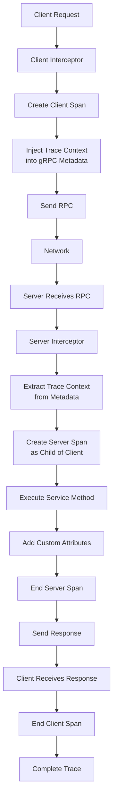

# How to Monitor Spring Boot gRPC Services with OpenTelemetry

Author: [nawazdhandala](https://www.github.com/nawazdhandala)

Tags: OpenTelemetry, Spring Boot, gRPC, Monitoring, Java, Tracing

Description: Master OpenTelemetry instrumentation for Spring Boot gRPC services, including automatic tracing, custom metrics, context propagation, and performance monitoring for high-throughput RPC systems.

gRPC has become the standard for inter-service communication in microservice architectures, offering type-safe contracts, efficient binary serialization, and bidirectional streaming. However, monitoring gRPC services presents unique challenges compared to traditional REST APIs. The binary protocol makes debugging harder, streaming connections complicate trace boundaries, and high throughput demands efficient instrumentation. OpenTelemetry provides comprehensive gRPC support that addresses these challenges while maintaining low overhead.

Traditional monitoring tools built for HTTP often fall short with gRPC. Request and response bodies are encoded in Protobuf, making them opaque to conventional inspection. Streaming RPCs maintain long-lived connections that span multiple logical operations. Metadata travels through different channels than HTTP headers. OpenTelemetry's gRPC instrumentation handles these complexities, automatically creating spans for each RPC, propagating context through gRPC metadata, and capturing streaming semantics.

## Setting Up gRPC with Spring Boot

Start by adding the necessary dependencies for gRPC server, client, and OpenTelemetry instrumentation.

```xml
<dependencies>
    <!-- Spring Boot -->
    <dependency>
        <groupId>org.springframework.boot</groupId>
        <artifactId>spring-boot-starter</artifactId>
        <version>3.2.2</version>
    </dependency>

    <!-- gRPC dependencies -->
    <dependency>
        <groupId>net.devh</groupId>
        <artifactId>grpc-spring-boot-starter</artifactId>
        <version>2.15.0.RELEASE</version>
    </dependency>
    <dependency>
        <groupId>io.grpc</groupId>
        <artifactId>grpc-protobuf</artifactId>
        <version>1.61.0</version>
    </dependency>
    <dependency>
        <groupId>io.grpc</groupId>
        <artifactId>grpc-stub</artifactId>
        <version>1.61.0</version>
    </dependency>

    <!-- OpenTelemetry instrumentation -->
    <dependency>
        <groupId>io.opentelemetry.instrumentation</groupId>
        <artifactId>opentelemetry-grpc-1.6</artifactId>
        <version>2.1.0-alpha</version>
    </dependency>
    <dependency>
        <groupId>io.opentelemetry</groupId>
        <artifactId>opentelemetry-sdk-extension-autoconfigure</artifactId>
        <version>1.35.0</version>
    </dependency>
</dependencies>
```

Define your gRPC service contract using Protocol Buffers.

```protobuf
syntax = "proto3";

package com.oneuptime.order;

option java_multiple_files = true;
option java_package = "com.oneuptime.order";

service OrderService {
  // Unary RPC: single request, single response
  rpc CreateOrder (CreateOrderRequest) returns (OrderResponse);

  // Server streaming: single request, stream of responses
  rpc GetOrderUpdates (OrderId) returns (stream OrderUpdate);

  // Client streaming: stream of requests, single response
  rpc BatchCreateOrders (stream CreateOrderRequest) returns (BatchOrderResponse);

  // Bidirectional streaming
  rpc ProcessOrderStream (stream CreateOrderRequest) returns (stream OrderResponse);
}

message CreateOrderRequest {
  string customer_id = 1;
  repeated OrderItem items = 2;
  double total_amount = 3;
}

message OrderResponse {
  string order_id = 1;
  string status = 2;
  int64 created_at = 3;
}

message OrderId {
  string id = 1;
}

message OrderUpdate {
  string order_id = 1;
  string status = 2;
  int64 timestamp = 3;
}

message OrderItem {
  string product_id = 1;
  int32 quantity = 2;
  double price = 3;
}

message BatchOrderResponse {
  int32 successful_count = 1;
  int32 failed_count = 2;
  repeated string order_ids = 3;
}
```

Configure OpenTelemetry in your application.yml.

```yaml
spring:
  application:
    name: order-grpc-service

grpc:
  server:
    port: 9090
  client:
    inventory-service:
      address: static://localhost:9091
      negotiationType: plaintext

otel:
  service:
    name: order-grpc-service
  traces:
    exporter: otlp
  metrics:
    exporter: otlp
  exporter:
    otlp:
      endpoint: http://localhost:4318
  instrumentation:
    grpc:
      # Capture detailed gRPC attributes
      experimental-span-attributes: true
```

## Instrumenting gRPC Server

Create a configuration class that sets up OpenTelemetry interceptors for the gRPC server.

```java
package com.oneuptime.config;

import io.grpc.ServerInterceptor;
import io.opentelemetry.api.OpenTelemetry;
import io.opentelemetry.instrumentation.grpc.v1_6.GrpcTelemetry;
import net.devh.boot.grpc.server.interceptor.GrpcGlobalServerInterceptor;
import org.springframework.context.annotation.Bean;
import org.springframework.context.annotation.Configuration;

@Configuration
public class GrpcServerConfiguration {

    private final OpenTelemetry openTelemetry;

    public GrpcServerConfiguration(OpenTelemetry openTelemetry) {
        this.openTelemetry = openTelemetry;
    }

    /**
     * Register OpenTelemetry interceptor globally for all gRPC services
     * This automatically creates spans for incoming RPCs and extracts trace context
     */
    @Bean
    @GrpcGlobalServerInterceptor
    public ServerInterceptor grpcServerTracingInterceptor() {
        return GrpcTelemetry.create(openTelemetry)
            .newServerInterceptor();
    }
}
```

Implement a gRPC service with custom tracing and metrics.

```java
package com.oneuptime.service;

import com.oneuptime.order.*;
import io.grpc.Status;
import io.grpc.stub.StreamObserver;
import io.opentelemetry.api.trace.Span;
import io.opentelemetry.api.trace.SpanKind;
import io.opentelemetry.api.trace.StatusCode;
import io.opentelemetry.api.trace.Tracer;
import io.opentelemetry.context.Context;
import io.opentelemetry.context.Scope;
import net.devh.boot.grpc.server.service.GrpcService;
import org.slf4j.Logger;
import org.slf4j.LoggerFactory;

import java.util.UUID;

/**
 * gRPC service implementation with OpenTelemetry instrumentation
 * Spans are automatically created by the interceptor, but we add custom attributes
 */
@GrpcService
public class OrderGrpcService extends OrderServiceGrpc.OrderServiceImplBase {

    private static final Logger logger = LoggerFactory.getLogger(OrderGrpcService.class);

    private final Tracer tracer;
    private final OrderProcessingService processingService;

    public OrderGrpcService(Tracer tracer, OrderProcessingService processingService) {
        this.tracer = tracer;
        this.processingService = processingService;
    }

    /**
     * Unary RPC with automatic tracing and custom span attributes
     */
    @Override
    public void createOrder(
            CreateOrderRequest request,
            StreamObserver<OrderResponse> responseObserver) {

        // Get the current span created by the interceptor
        Span span = Span.current();

        // Add custom business attributes to the span
        span.setAttribute("order.customer_id", request.getCustomerId());
        span.setAttribute("order.items_count", request.getItemsCount());
        span.setAttribute("order.total_amount", request.getTotalAmount());

        try {
            // Create child span for business logic
            Span processingSpan = tracer.spanBuilder("process.order.creation")
                .setSpanKind(SpanKind.INTERNAL)
                .setAttribute("business.operation", "order.creation")
                .startSpan();

            try (Scope scope = processingSpan.makeCurrent()) {
                // Validate request
                validateOrderRequest(request);

                // Generate order ID
                String orderId = UUID.randomUUID().toString();
                processingSpan.setAttribute("order.id", orderId);

                // Process the order
                boolean success = processingService.createOrder(
                    orderId,
                    request.getCustomerId(),
                    request.getItemsList(),
                    request.getTotalAmount()
                );

                // Build response
                OrderResponse response = OrderResponse.newBuilder()
                    .setOrderId(orderId)
                    .setStatus(success ? "CREATED" : "FAILED")
                    .setCreatedAt(System.currentTimeMillis())
                    .build();

                processingSpan.addEvent("order.created");
                processingSpan.setStatus(StatusCode.OK);

                // Send response
                responseObserver.onNext(response);
                responseObserver.onCompleted();

            } finally {
                processingSpan.end();
            }

        } catch (IllegalArgumentException e) {
            span.recordException(e);
            span.setStatus(StatusCode.ERROR, "Invalid order request");
            responseObserver.onError(
                Status.INVALID_ARGUMENT
                    .withDescription(e.getMessage())
                    .asRuntimeException()
            );

        } catch (Exception e) {
            span.recordException(e);
            span.setStatus(StatusCode.ERROR, "Order creation failed");
            logger.error("Failed to create order", e);
            responseObserver.onError(
                Status.INTERNAL
                    .withDescription("Internal error processing order")
                    .asRuntimeException()
            );
        }
    }

    /**
     * Server streaming RPC: single request, stream of responses
     * Each streamed response should be tracked as an event
     */
    @Override
    public void getOrderUpdates(
            OrderId request,
            StreamObserver<OrderUpdate> responseObserver) {

        Span span = Span.current();
        span.setAttribute("order.id", request.getId());
        span.setAttribute("rpc.type", "server_streaming");

        try {
            // Simulate streaming order updates
            for (int i = 0; i < 5; i++) {
                OrderUpdate update = OrderUpdate.newBuilder()
                    .setOrderId(request.getId())
                    .setStatus(getStatusForStep(i))
                    .setTimestamp(System.currentTimeMillis())
                    .build();

                // Track each update as a span event
                span.addEvent("order.update.sent",
                    io.opentelemetry.api.common.Attributes.of(
                        io.opentelemetry.api.common.AttributeKey.stringKey("status"),
                        update.getStatus(),
                        io.opentelemetry.api.common.AttributeKey.longKey("sequence"),
                        (long) i
                    ));

                responseObserver.onNext(update);
                Thread.sleep(500); // Simulate processing time
            }

            span.setAttribute("updates.sent.count", 5);
            responseObserver.onCompleted();

        } catch (Exception e) {
            span.recordException(e);
            span.setStatus(StatusCode.ERROR);
            responseObserver.onError(Status.INTERNAL.asRuntimeException());
        }
    }

    /**
     * Client streaming RPC: stream of requests, single response
     * Track the count of received messages as span attributes
     */
    @Override
    public StreamObserver<CreateOrderRequest> batchCreateOrders(
            StreamObserver<BatchOrderResponse> responseObserver) {

        Span span = Span.current();
        span.setAttribute("rpc.type", "client_streaming");

        return new StreamObserver<CreateOrderRequest>() {
            private int successCount = 0;
            private int failureCount = 0;

            @Override
            public void onNext(CreateOrderRequest request) {
                try {
                    String orderId = UUID.randomUUID().toString();
                    boolean success = processingService.createOrder(
                        orderId,
                        request.getCustomerId(),
                        request.getItemsList(),
                        request.getTotalAmount()
                    );

                    if (success) {
                        successCount++;
                    } else {
                        failureCount++;
                    }

                    // Track progress as events
                    span.addEvent("order.processed",
                        io.opentelemetry.api.common.Attributes.of(
                            io.opentelemetry.api.common.AttributeKey.stringKey("order.id"),
                            orderId,
                            io.opentelemetry.api.common.AttributeKey.booleanKey("success"),
                            success
                        ));

                } catch (Exception e) {
                    failureCount++;
                    span.addEvent("order.processing.failed");
                }
            }

            @Override
            public void onError(Throwable t) {
                span.recordException(t);
                span.setStatus(StatusCode.ERROR);
                responseObserver.onError(Status.INTERNAL.asRuntimeException());
            }

            @Override
            public void onCompleted() {
                span.setAttribute("batch.success.count", successCount);
                span.setAttribute("batch.failure.count", failureCount);
                span.setAttribute("batch.total.count", successCount + failureCount);

                BatchOrderResponse response = BatchOrderResponse.newBuilder()
                    .setSuccessfulCount(successCount)
                    .setFailedCount(failureCount)
                    .build();

                responseObserver.onNext(response);
                responseObserver.onCompleted();
            }
        };
    }

    private void validateOrderRequest(CreateOrderRequest request) {
        if (request.getCustomerId() == null || request.getCustomerId().isEmpty()) {
            throw new IllegalArgumentException("Customer ID is required");
        }
        if (request.getItemsCount() == 0) {
            throw new IllegalArgumentException("At least one item is required");
        }
        if (request.getTotalAmount() <= 0) {
            throw new IllegalArgumentException("Total amount must be positive");
        }
    }

    private String getStatusForStep(int step) {
        String[] statuses = {"CREATED", "PROCESSING", "PACKED", "SHIPPED", "DELIVERED"};
        return statuses[step];
    }
}
```

## Instrumenting gRPC Client

Configure OpenTelemetry interceptors for gRPC clients to propagate trace context to downstream services.

```java
package com.oneuptime.config;

import io.grpc.ClientInterceptor;
import io.opentelemetry.api.OpenTelemetry;
import io.opentelemetry.instrumentation.grpc.v1_6.GrpcTelemetry;
import net.devh.boot.grpc.client.interceptor.GrpcGlobalClientInterceptor;
import org.springframework.context.annotation.Bean;
import org.springframework.context.annotation.Configuration;

@Configuration
public class GrpcClientConfiguration {

    private final OpenTelemetry openTelemetry;

    public GrpcClientConfiguration(OpenTelemetry openTelemetry) {
        this.openTelemetry = openTelemetry;
    }

    /**
     * Register OpenTelemetry interceptor for all gRPC clients
     * This automatically creates spans for outgoing RPCs and injects trace context
     */
    @Bean
    @GrpcGlobalClientInterceptor
    public ClientInterceptor grpcClientTracingInterceptor() {
        return GrpcTelemetry.create(openTelemetry)
            .newClientInterceptor();
    }
}
```

Create a client service that makes instrumented gRPC calls.

```java
package com.oneuptime.client;

import com.oneuptime.inventory.*;
import io.grpc.Status;
import io.grpc.StatusRuntimeException;
import io.opentelemetry.api.trace.Span;
import io.opentelemetry.api.trace.StatusCode;
import io.opentelemetry.api.trace.Tracer;
import io.opentelemetry.context.Scope;
import net.devh.boot.grpc.client.inject.GrpcClient;
import org.slf4j.Logger;
import org.slf4j.LoggerFactory;
import org.springframework.stereotype.Service;

import java.util.concurrent.TimeUnit;

/**
 * gRPC client service with OpenTelemetry instrumentation
 * The interceptor automatically creates client spans and propagates context
 */
@Service
public class InventoryClient {

    private static final Logger logger = LoggerFactory.getLogger(InventoryClient.class);

    @GrpcClient("inventory-service")
    private InventoryServiceGrpc.InventoryServiceBlockingStub inventoryStub;

    private final Tracer tracer;

    public InventoryClient(Tracer tracer) {
        this.tracer = tracer;
    }

    /**
     * Check inventory availability with automatic tracing
     */
    public boolean checkInventory(String productId, int quantity) {
        // Create a span for the business operation
        Span span = tracer.spanBuilder("check.inventory")
            .setAttribute("product.id", productId)
            .setAttribute("product.quantity", quantity)
            .startSpan();

        try (Scope scope = span.makeCurrent()) {
            // Make gRPC call - client span created automatically by interceptor
            CheckInventoryRequest request = CheckInventoryRequest.newBuilder()
                .setProductId(productId)
                .setQuantity(quantity)
                .build();

            CheckInventoryResponse response = inventoryStub
                .withDeadlineAfter(5, TimeUnit.SECONDS)
                .checkInventory(request);

            span.setAttribute("inventory.available", response.getAvailable());
            span.setAttribute("inventory.in_stock", response.getInStock());

            return response.getAvailable();

        } catch (StatusRuntimeException e) {
            span.recordException(e);
            span.setStatus(StatusCode.ERROR, "Inventory check failed");

            if (e.getStatus().getCode() == Status.Code.DEADLINE_EXCEEDED) {
                logger.error("Inventory service timeout for product: {}", productId);
                span.addEvent("grpc.deadline.exceeded");
            } else {
                logger.error("Failed to check inventory for product: {}", productId, e);
            }

            return false;

        } finally {
            span.end();
        }
    }

    /**
     * Reserve inventory with retry logic and tracing
     */
    public boolean reserveInventory(String orderId, String productId, int quantity) {
        Span span = tracer.spanBuilder("reserve.inventory")
            .setAttribute("order.id", orderId)
            .setAttribute("product.id", productId)
            .setAttribute("product.quantity", quantity)
            .startSpan();

        int maxRetries = 3;
        int attempt = 0;

        try (Scope scope = span.makeCurrent()) {
            while (attempt < maxRetries) {
                attempt++;
                span.setAttribute("retry.attempt", attempt);

                try {
                    ReserveInventoryRequest request = ReserveInventoryRequest.newBuilder()
                        .setOrderId(orderId)
                        .setProductId(productId)
                        .setQuantity(quantity)
                        .build();

                    ReserveInventoryResponse response = inventoryStub
                        .withDeadlineAfter(5, TimeUnit.SECONDS)
                        .reserveInventory(request);

                    span.setAttribute("reservation.success", response.getSuccess());
                    span.setStatus(StatusCode.OK);

                    return response.getSuccess();

                } catch (StatusRuntimeException e) {
                    if (e.getStatus().getCode() == Status.Code.UNAVAILABLE && attempt < maxRetries) {
                        span.addEvent("retry.scheduled",
                            io.opentelemetry.api.common.Attributes.of(
                                io.opentelemetry.api.common.AttributeKey.longKey("attempt"),
                                (long) attempt
                            ));
                        Thread.sleep(100 * attempt); // Exponential backoff
                    } else {
                        throw e;
                    }
                }
            }

            return false;

        } catch (Exception e) {
            span.recordException(e);
            span.setStatus(StatusCode.ERROR);
            logger.error("Failed to reserve inventory after {} attempts", attempt, e);
            return false;

        } finally {
            span.end();
        }
    }
}
```

## gRPC Trace Flow

Understanding how traces flow through gRPC calls helps debug distributed systems.



## Custom Metrics for gRPC Services

Beyond tracing, collect custom metrics for gRPC operations using Micrometer with OpenTelemetry.

```java
package com.oneuptime.metrics;

import io.grpc.*;
import io.micrometer.core.instrument.Counter;
import io.micrometer.core.instrument.MeterRegistry;
import io.micrometer.core.instrument.Timer;
import org.springframework.stereotype.Component;

/**
 * Custom gRPC interceptor that collects metrics for method calls
 */
@Component
public class GrpcMetricsInterceptor implements ServerInterceptor {

    private final MeterRegistry meterRegistry;

    public GrpcMetricsInterceptor(MeterRegistry meterRegistry) {
        this.meterRegistry = meterRegistry;
    }

    @Override
    public <ReqT, RespT> ServerCall.Listener<ReqT> interceptCall(
            ServerCall<ReqT, RespT> call,
            Metadata headers,
            ServerCallHandler<ReqT, RespT> next) {

        String methodName = call.getMethodDescriptor().getFullMethodName();
        Timer.Sample sample = Timer.start(meterRegistry);

        ServerCall<ReqT, RespT> monitoringCall = new ForwardingServerCall.SimpleForwardingServerCall<ReqT, RespT>(call) {
            @Override
            public void close(Status status, Metadata trailers) {
                // Record duration
                sample.stop(Timer.builder("grpc.server.call.duration")
                    .tag("method", methodName)
                    .tag("status", status.getCode().name())
                    .register(meterRegistry));

                // Increment counter
                Counter.builder("grpc.server.calls.total")
                    .tag("method", methodName)
                    .tag("status", status.getCode().name())
                    .register(meterRegistry)
                    .increment();

                super.close(status, trailers);
            }
        };

        return next.startCall(monitoringCall, headers);
    }
}
```

Register the metrics interceptor.

```java
package com.oneuptime.config;

import com.oneuptime.metrics.GrpcMetricsInterceptor;
import io.grpc.ServerInterceptor;
import net.devh.boot.grpc.server.interceptor.GrpcGlobalServerInterceptor;
import org.springframework.context.annotation.Bean;
import org.springframework.context.annotation.Configuration;
import org.springframework.core.Ordered;
import org.springframework.core.annotation.Order;

@Configuration
public class GrpcMetricsConfiguration {

    /**
     * Register metrics interceptor with high priority
     * Order ensures it runs before other interceptors
     */
    @Bean
    @GrpcGlobalServerInterceptor
    @Order(Ordered.HIGHEST_PRECEDENCE)
    public ServerInterceptor grpcMetricsInterceptor(GrpcMetricsInterceptor interceptor) {
        return interceptor;
    }
}
```

## Handling Streaming RPC Tracing

Bidirectional streaming requires special attention to span lifecycle management.

```java
package com.oneuptime.service;

import com.oneuptime.order.*;
import io.grpc.stub.StreamObserver;
import io.opentelemetry.api.trace.Span;
import io.opentelemetry.api.trace.Tracer;
import io.opentelemetry.context.Context;
import io.opentelemetry.context.Scope;
import net.devh.boot.grpc.server.service.GrpcService;
import org.slf4j.Logger;
import org.slf4j.LoggerFactory;

import java.util.UUID;

@GrpcService
public class StreamingOrderService extends OrderServiceGrpc.OrderServiceImplBase {

    private static final Logger logger = LoggerFactory.getLogger(StreamingOrderService.class);
    private final Tracer tracer;

    public StreamingOrderService(Tracer tracer) {
        this.tracer = tracer;
    }

    /**
     * Bidirectional streaming with proper span management
     * Each message pair gets its own span linked to the parent stream span
     */
    @Override
    public StreamObserver<CreateOrderRequest> processOrderStream(
            StreamObserver<OrderResponse> responseObserver) {

        // Get the parent span for the entire stream
        Span streamSpan = Span.current();
        streamSpan.setAttribute("rpc.type", "bidirectional_streaming");

        // Capture context for use in callbacks
        Context parentContext = Context.current();

        return new StreamObserver<CreateOrderRequest>() {
            private int messageCount = 0;

            @Override
            public void onNext(CreateOrderRequest request) {
                messageCount++;

                // Create span for each message processing
                // Make it a child of the stream span
                Span messageSpan = tracer.spanBuilder("process.stream.message")
                    .setParent(parentContext)
                    .setAttribute("message.sequence", messageCount)
                    .setAttribute("customer.id", request.getCustomerId())
                    .startSpan();

                try (Scope scope = messageSpan.makeCurrent()) {
                    String orderId = UUID.randomUUID().toString();

                    OrderResponse response = OrderResponse.newBuilder()
                        .setOrderId(orderId)
                        .setStatus("PROCESSING")
                        .setCreatedAt(System.currentTimeMillis())
                        .build();

                    messageSpan.addEvent("order.response.sent");
                    responseObserver.onNext(response);

                } catch (Exception e) {
                    messageSpan.recordException(e);
                    logger.error("Failed to process stream message", e);
                } finally {
                    messageSpan.end();
                }
            }

            @Override
            public void onError(Throwable t) {
                streamSpan.recordException(t);
                streamSpan.setAttribute("messages.processed", messageCount);
                logger.error("Stream error after {} messages", messageCount, t);
            }

            @Override
            public void onCompleted() {
                streamSpan.setAttribute("messages.processed", messageCount);
                streamSpan.addEvent("stream.completed");
                responseObserver.onCompleted();
            }
        };
    }
}
```

Monitoring gRPC services with OpenTelemetry provides deep visibility into RPC performance, error rates, and distributed traces across service boundaries. Automatic instrumentation handles the complexity of context propagation through gRPC metadata. Custom spans and attributes add business context to technical traces. Proper handling of streaming RPCs ensures complete observability even for long-lived connections. The combination of traces and metrics enables effective debugging, performance optimization, and capacity planning for high-throughput gRPC systems.
