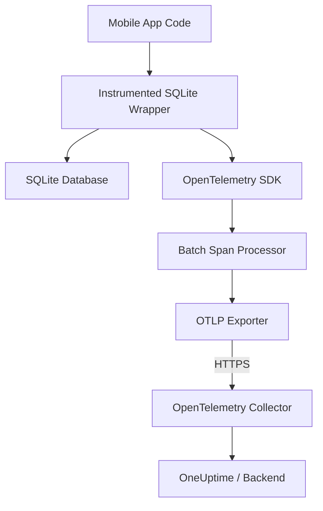

# How to Monitor SQLite Operations in Mobile Apps with OpenTelemetry

Author: [nawazdhandala](https://www.github.com/nawazdhandala)

Tags: OpenTelemetry, SQLite, Mobile, Android, iOS, Database, Observability, Tracing

Description: Learn how to instrument SQLite database operations in mobile apps using OpenTelemetry to trace queries, measure performance, and diagnose slow database calls in production.

---

SQLite is the default local database for virtually every mobile application. Whether you are building on Android or iOS, your app almost certainly relies on SQLite for offline storage, caching, or local state management. But most teams have zero visibility into how SQLite performs once the app ships to users. Queries that ran fine in development can grind to a halt on low-end devices with fragmented storage. OpenTelemetry gives you a way to capture SQLite operation traces from real devices and send them to your observability backend.

This guide walks through instrumenting SQLite in both Android and iOS applications, collecting query spans, and exporting them to an OpenTelemetry-compatible backend like OneUptime.

## Why Monitor SQLite in Mobile Apps?

Mobile databases behave differently than server-side databases. The storage hardware varies wildly between devices, users accumulate data over months or years, and the operating system can throttle I/O when the device is under pressure. Common problems include:

- Queries that slow down as the local database grows
- Write-ahead log (WAL) checkpointing causing periodic latency spikes
- Missing indexes that only become apparent with real-world data volumes
- Database lock contention when multiple threads access SQLite concurrently
- Corruption from unexpected app termination during writes

Without telemetry from actual devices, you are debugging these issues blind.

## Architecture Overview

The instrumentation approach wraps your existing SQLite access layer with OpenTelemetry spans. Each database operation (query, insert, update, delete) becomes a span with attributes describing the operation, table, and duration.



The key design consideration for mobile is batching. You do not want to send a network request for every database call. The batch span processor accumulates spans and flushes them periodically or when a threshold is reached.

## Setting Up OpenTelemetry on Android

First, add the OpenTelemetry dependencies to your Android project. The Android SDK provides mobile-optimized exporters that handle network interruptions gracefully.

```kotlin
// build.gradle.kts - Add OpenTelemetry dependencies
dependencies {
    // OpenTelemetry API and SDK
    implementation("io.opentelemetry:opentelemetry-api:1.40.0")
    implementation("io.opentelemetry:opentelemetry-sdk:1.40.0")

    // OTLP exporter for sending spans to the collector
    implementation("io.opentelemetry:opentelemetry-exporter-otlp:1.40.0")

    // Provides semantic conventions for database spans
    implementation("io.opentelemetry:opentelemetry-semconv:1.40.0-alpha")
}
```

Initialize the OpenTelemetry SDK early in your application lifecycle. The batch processor settings here are tuned for mobile - longer delays and smaller batch sizes to conserve battery and bandwidth.

```kotlin
// OpenTelemetrySetup.kt - Initialize the SDK in your Application class
import io.opentelemetry.api.OpenTelemetry
import io.opentelemetry.api.trace.Tracer
import io.opentelemetry.sdk.OpenTelemetrySdk
import io.opentelemetry.sdk.trace.SdkTracerProvider
import io.opentelemetry.sdk.trace.export.BatchSpanProcessor
import io.opentelemetry.exporter.otlp.trace.OtlpGrpcSpanExporter
import io.opentelemetry.sdk.resources.Resource
import io.opentelemetry.api.common.AttributeKey
import io.opentelemetry.api.common.Attributes
import java.time.Duration

object OpenTelemetrySetup {

    private lateinit var openTelemetry: OpenTelemetrySdk

    fun initialize(appVersion: String) {
        // Configure the OTLP exporter to send spans to the collector
        val exporter = OtlpGrpcSpanExporter.builder()
            .setEndpoint("https://otel-collector.yourcompany.com:4317")
            .setTimeout(Duration.ofSeconds(10))
            .build()

        // Batch processor tuned for mobile - flush every 30 seconds
        // or when 50 spans accumulate, whichever comes first
        val batchProcessor = BatchSpanProcessor.builder(exporter)
            .setScheduleDelay(Duration.ofSeconds(30))
            .setMaxQueueSize(200)
            .setMaxExportBatchSize(50)
            .build()

        // Resource identifies this app instance in your backend
        val resource = Resource.create(
            Attributes.of(
                AttributeKey.stringKey("service.name"), "my-android-app",
                AttributeKey.stringKey("service.version"), appVersion,
                AttributeKey.stringKey("deployment.environment"), "production"
            )
        )

        val tracerProvider = SdkTracerProvider.builder()
            .addSpanProcessor(batchProcessor)
            .setResource(resource)
            .build()

        openTelemetry = OpenTelemetrySdk.builder()
            .setTracerProvider(tracerProvider)
            .build()
    }

    // Provide a tracer specifically for database operations
    fun getDbTracer(): Tracer {
        return openTelemetry.getTracer("sqlite-instrumentation", "1.0.0")
    }
}
```

## Instrumenting SQLite Operations on Android

Now create a wrapper around your SQLite database helper that automatically creates spans for each operation. This approach works with both raw SQLite and Room (which uses SQLite under the hood).

```kotlin
// InstrumentedDatabase.kt - Wraps SQLiteDatabase with OpenTelemetry spans
import android.database.Cursor
import android.database.sqlite.SQLiteDatabase
import io.opentelemetry.api.trace.SpanKind
import io.opentelemetry.api.trace.StatusCode
import io.opentelemetry.api.common.AttributeKey

class InstrumentedDatabase(private val db: SQLiteDatabase) {

    private val tracer = OpenTelemetrySetup.getDbTracer()

    // Wrap query operations with a span that captures the SQL and table name
    fun query(
        table: String,
        columns: Array<String>?,
        selection: String?,
        selectionArgs: Array<String>?,
        orderBy: String? = null,
        limit: String? = null
    ): Cursor {
        // Start a new span for this database query
        val span = tracer.spanBuilder("SELECT $table")
            .setSpanKind(SpanKind.CLIENT)
            .setAttribute(AttributeKey.stringKey("db.system"), "sqlite")
            .setAttribute(AttributeKey.stringKey("db.name"), db.path)
            .setAttribute(AttributeKey.stringKey("db.operation"), "SELECT")
            .setAttribute(AttributeKey.stringKey("db.sql.table"), table)
            .startSpan()

        return try {
            val cursor = db.query(table, columns, selection, selectionArgs,
                null, null, orderBy, limit)
            // Record how many rows were returned
            span.setAttribute(AttributeKey.longKey("db.row_count"),
                cursor.count.toLong())
            cursor
        } catch (e: Exception) {
            // Mark the span as failed and record the error
            span.setStatus(StatusCode.ERROR, e.message ?: "Query failed")
            span.recordException(e)
            throw e
        } finally {
            span.end()
        }
    }

    // Wrap insert operations
    fun insert(table: String, values: android.content.ContentValues): Long {
        val span = tracer.spanBuilder("INSERT $table")
            .setSpanKind(SpanKind.CLIENT)
            .setAttribute(AttributeKey.stringKey("db.system"), "sqlite")
            .setAttribute(AttributeKey.stringKey("db.operation"), "INSERT")
            .setAttribute(AttributeKey.stringKey("db.sql.table"), table)
            .startSpan()

        return try {
            val rowId = db.insertOrThrow(table, null, values)
            span.setAttribute(AttributeKey.longKey("db.insert.row_id"), rowId)
            rowId
        } catch (e: Exception) {
            span.setStatus(StatusCode.ERROR, e.message ?: "Insert failed")
            span.recordException(e)
            throw e
        } finally {
            span.end()
        }
    }

    // Wrap raw SQL execution for complex queries
    fun execSQL(sql: String) {
        // Extract the operation type from the SQL statement
        val operation = sql.trim().split(" ").firstOrNull()?.uppercase() ?: "UNKNOWN"

        val span = tracer.spanBuilder("$operation sqlite")
            .setSpanKind(SpanKind.CLIENT)
            .setAttribute(AttributeKey.stringKey("db.system"), "sqlite")
            .setAttribute(AttributeKey.stringKey("db.operation"), operation)
            .setAttribute(AttributeKey.stringKey("db.statement"), sql)
            .startSpan()

        try {
            db.execSQL(sql)
        } catch (e: Exception) {
            span.setStatus(StatusCode.ERROR, e.message ?: "Execution failed")
            span.recordException(e)
            throw e
        } finally {
            span.end()
        }
    }
}
```

## Instrumenting SQLite on iOS with Swift

For iOS, the approach is similar. You wrap Core Data or direct SQLite calls with OpenTelemetry spans using the Swift OpenTelemetry SDK.

```swift
// Package.swift or SPM dependency
// .package(url: "https://github.com/open-telemetry/opentelemetry-swift",
//          from: "1.9.0")

import OpenTelemetryApi
import OpenTelemetrySdk
import GRPC

// SQLiteTracer.swift - Wrapper for traced SQLite operations on iOS
class SQLiteTracer {

    private let tracer: Tracer

    init() {
        // Get a tracer from the registered OpenTelemetry provider
        self.tracer = OpenTelemetry.instance.tracerProvider
            .get(instrumentationName: "sqlite-instrumentation",
                 instrumentationVersion: "1.0.0")
    }

    // Execute a traced query and return the results
    func executeQuery(db: OpaquePointer, sql: String,
                      table: String) -> [[String: Any]] {
        // Build a span with database semantic conventions
        let span = tracer.spanBuilder(spanName: "SELECT \(table)")
            .setSpanKind(spanKind: .client)
            .setAttribute(key: "db.system", value: "sqlite")
            .setAttribute(key: "db.operation", value: "SELECT")
            .setAttribute(key: "db.sql.table", value: table)
            .setAttribute(key: "db.statement", value: sql)
            .startSpan()

        defer { span.end() }

        var results: [[String: Any]] = []
        var statement: OpaquePointer?

        // Prepare and execute the SQLite statement
        guard sqlite3_prepare_v2(db, sql, -1, &statement, nil) == SQLITE_OK else {
            let error = String(cString: sqlite3_errmsg(db))
            span.status = .error(description: error)
            return results
        }

        // Step through results
        while sqlite3_step(statement) == SQLITE_ROW {
            var row: [String: Any] = [:]
            let columnCount = sqlite3_column_count(statement)
            for i in 0..<columnCount {
                let name = String(cString: sqlite3_column_name(statement, i))
                // Read column values based on type
                switch sqlite3_column_type(statement, i) {
                case SQLITE_TEXT:
                    row[name] = String(cString: sqlite3_column_text(statement, i))
                case SQLITE_INTEGER:
                    row[name] = sqlite3_column_int64(statement, i)
                case SQLITE_FLOAT:
                    row[name] = sqlite3_column_double(statement, i)
                default:
                    row[name] = nil
                }
            }
            results.append(row)
        }

        // Record row count as a span attribute
        span.setAttribute(key: "db.row_count", value: results.count)
        sqlite3_finalize(statement)

        return results
    }
}
```

## Collecting Useful Attributes

The semantic conventions for database spans are well-defined in OpenTelemetry. Stick to them so your backend can display database operations consistently. Here are the key attributes you should capture on every SQLite span:

| Attribute | Example | Purpose |
|-----------|---------|---------|
| `db.system` | `sqlite` | Identifies the database engine |
| `db.name` | `/data/app/mydb.sqlite` | Path to the database file |
| `db.operation` | `SELECT`, `INSERT`, `UPDATE` | The SQL operation type |
| `db.sql.table` | `users` | Primary table being accessed |
| `db.statement` | `SELECT * FROM users WHERE active=1` | The full SQL statement (be careful with PII) |
| `db.row_count` | `42` | Number of rows returned or affected |

Be cautious about recording full SQL statements in production. If your queries contain user data in WHERE clauses, you may be sending PII to your observability backend. Consider parameterizing or sanitizing queries before setting the `db.statement` attribute.

## Configuring the Collector

On the backend side, set up an OpenTelemetry Collector to receive spans from your mobile apps and forward them to your observability platform.

```yaml
# otel-collector-config.yaml - Collector config for mobile SQLite traces
receivers:
  # OTLP receiver accepts spans from mobile apps over gRPC and HTTP
  otlp:
    protocols:
      grpc:
        endpoint: 0.0.0.0:4317
      http:
        endpoint: 0.0.0.0:4318

processors:
  # Batch spans before exporting to reduce network overhead
  batch:
    timeout: 10s
    send_batch_size: 256

  # Filter out spans with extremely short durations (noise)
  filter:
    spans:
      # Only keep SQLite spans that took longer than 1ms
      # Fast queries are rarely interesting for debugging
      include:
        match_type: regexp
        attributes:
          - key: db.system
            value: "sqlite"

  # Add device metadata if not already present
  resource:
    attributes:
      - key: service.namespace
        value: "mobile-apps"
        action: upsert

exporters:
  # Send processed spans to OneUptime
  otlp/oneuptime:
    endpoint: "https://otlp.oneuptime.com:4317"
    headers:
      "x-oneuptime-token": "${ONEUPTIME_TOKEN}"

service:
  pipelines:
    traces:
      receivers: [otlp]
      processors: [batch, resource]
      exporters: [otlp/oneuptime]
```

## Monitoring Database Size and Health

Beyond query tracing, you should also emit metrics for SQLite database health. Database file size, WAL size, and page counts help you spot growth problems before they affect performance.

```kotlin
// DatabaseHealthReporter.kt - Periodically report SQLite health metrics
import io.opentelemetry.api.metrics.Meter
import io.opentelemetry.api.common.Attributes
import java.io.File

class DatabaseHealthReporter(private val dbPath: String) {

    private val meter: Meter = OpenTelemetrySetup.getMeter()

    fun registerMetrics() {
        // Gauge that reports the current database file size in bytes
        meter.gaugeBuilder("sqlite.db.size_bytes")
            .setDescription("Size of the SQLite database file in bytes")
            .setUnit("By")
            .buildWithCallback { measurement ->
                val file = File(dbPath)
                if (file.exists()) {
                    measurement.record(
                        file.length().toDouble(),
                        Attributes.of(
                            AttributeKey.stringKey("db.name"), dbPath
                        )
                    )
                }
            }

        // Gauge for WAL file size - large WAL files indicate
        // checkpointing problems
        meter.gaugeBuilder("sqlite.wal.size_bytes")
            .setDescription("Size of the SQLite WAL file in bytes")
            .setUnit("By")
            .buildWithCallback { measurement ->
                val walFile = File("$dbPath-wal")
                if (walFile.exists()) {
                    measurement.record(
                        walFile.length().toDouble(),
                        Attributes.of(
                            AttributeKey.stringKey("db.name"), dbPath
                        )
                    )
                }
            }
    }
}
```

## Performance Considerations for Mobile

Instrumenting database operations on mobile requires care. Each span object consumes memory, and the export process uses battery and bandwidth. Follow these guidelines:

1. **Sample aggressively.** Use a probability sampler set to 10-20% for production builds. You do not need every single query from every device.
2. **Batch exports.** Never send spans one at a time. The batch processor should flush every 30-60 seconds.
3. **Respect network state.** Pause exports when the device is on a metered connection or has low battery. The SDK supports custom export conditions.
4. **Limit span attributes.** Do not attach large blobs or full result sets to spans. Stick to the semantic conventions.
5. **Use debug builds for full tracing.** In debug mode, set the sampler to always-on and reduce the batch delay for faster feedback during development.

## Analyzing SQLite Traces in Your Backend

Once spans flow into your backend, look for these patterns:

- **Slow queries by table**: Group spans by `db.sql.table` and sort by duration. This reveals which tables need index optimization.
- **High row counts**: Queries returning thousands of rows on mobile are a red flag. The app is probably loading more data than needed.
- **Error rates**: Track the ratio of failed spans to successful ones. Increasing errors often indicate database corruption or schema migration issues.
- **Duration trends**: Plot P50 and P99 query durations over time. A gradual increase suggests the database is growing beyond what the device can handle efficiently.

SQLite monitoring on mobile is an area most teams overlook. Adding OpenTelemetry instrumentation takes a few hours of work but gives you permanent visibility into one of the most critical components of your mobile application.
