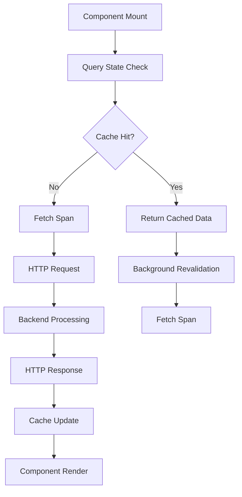

# How to Monitor SWR and React Query Data Fetching with OpenTelemetry

Author: [nawazdhandala](https://www.github.com/nawazdhandala)

Tags: OpenTelemetry, SWR, React Query, Data Fetching, Frontend, React

Description: Learn how to implement comprehensive OpenTelemetry instrumentation for SWR and React Query to gain visibility into data fetching patterns, cache behavior, and frontend performance.

Modern React applications rely heavily on data fetching libraries like SWR and React Query to manage server state. These libraries handle caching, revalidation, and background updates automatically, but their abstraction can make it difficult to understand what actually happens when your application fetches data. OpenTelemetry provides the observability layer needed to trace data fetching operations and understand cache behavior.

## Why Data Fetching Libraries Need Instrumentation

SWR and React Query make data fetching simple by handling caching, deduplication, and background revalidation. However, this convenience comes at a cost: reduced visibility into what your application is actually doing. Without instrumentation, you cannot answer critical questions like which queries run most frequently, how effective your cache is, or why certain components re-render.

Traditional browser monitoring tools show network requests but miss the context provided by these libraries. You need to understand cache hits versus misses, how long stale data persists, and whether background revalidation succeeds. OpenTelemetry captures this context and connects frontend operations to backend traces.

## Setting Up OpenTelemetry for Browser Applications

Install the OpenTelemetry packages for web applications:

```bash
npm install @opentelemetry/api @opentelemetry/sdk-trace-web
npm install @opentelemetry/instrumentation @opentelemetry/instrumentation-fetch
npm install @opentelemetry/exporter-trace-otlp-http
npm install @opentelemetry/context-zone
```

Initialize OpenTelemetry in your application entry point:

```typescript
// src/instrumentation.ts - Browser OpenTelemetry setup
import { WebTracerProvider } from '@opentelemetry/sdk-trace-web';
import { OTLPTraceExporter } from '@opentelemetry/exporter-trace-otlp-http';
import { BatchSpanProcessor } from '@opentelemetry/sdk-trace-base';
import { ZoneContextManager } from '@opentelemetry/context-zone';
import { registerInstrumentations } from '@opentelemetry/instrumentation';
import { FetchInstrumentation } from '@opentelemetry/instrumentation-fetch';
import { Resource } from '@opentelemetry/resources';
import { SemanticResourceAttributes } from '@opentelemetry/semantic-conventions';

const provider = new WebTracerProvider({
  resource: new Resource({
    [SemanticResourceAttributes.SERVICE_NAME]: 'react-frontend',
    [SemanticResourceAttributes.SERVICE_VERSION]: '1.0.0',
  }),
});

const exporter = new OTLPTraceExporter({
  url: 'http://localhost:4318/v1/traces',
});

provider.addSpanProcessor(new BatchSpanProcessor(exporter, {
  maxQueueSize: 100,
  scheduledDelayMillis: 2000,
}));

provider.register({
  contextManager: new ZoneContextManager(),
});

registerInstrumentations({
  instrumentations: [
    new FetchInstrumentation({
      propagateTraceHeaderCorsUrls: [
        /^https?:\/\/localhost:.*$/,
        /^https?:\/\/api\.yourapp\.com\/.*$/,
      ],
      clearTimingResources: true,
    }),
  ],
});

console.log('OpenTelemetry initialized for browser');
```

## Instrumenting SWR Hooks

Create wrapper utilities that add tracing to SWR operations:

```typescript
// src/lib/tracedSwr.ts - SWR with OpenTelemetry
import useSWR, { SWRConfiguration, SWRResponse } from 'swr';
import { trace, context as otelContext, SpanStatusCode } from '@opentelemetry/api';

const tracer = trace.getTracer('swr-instrumentation', '1.0.0');

interface TracedSWROptions<T> extends SWRConfiguration<T> {
  traceName?: string;
  traceAttributes?: Record<string, string | number | boolean>;
}

export function useTracedSWR<T>(
  key: string | null,
  fetcher: (() => Promise<T>) | null,
  options: TracedSWROptions<T> = {}
): SWRResponse<T> {
  const {
    traceName = 'swr.query',
    traceAttributes = {},
    onSuccess,
    onError,
    ...swrOptions
  } = options;

  const result = useSWR<T>(
    key,
    async (url: string) => {
      const span = tracer.startSpan(`${traceName}.fetch`, {
        attributes: {
          'swr.key': url,
          'swr.operation': 'fetch',
          ...traceAttributes,
        },
      });

      const fetchStart = performance.now();

      try {
        if (!fetcher) throw new Error('No fetcher provided');

        const data = await otelContext.with(
          trace.setSpan(otelContext.active(), span),
          () => fetcher()
        );

        const fetchDuration = performance.now() - fetchStart;

        span.setAttributes({
          'swr.fetch.duration_ms': fetchDuration,
          'swr.fetch.success': true,
          'swr.data.received': true,
        });

        span.setStatus({ code: SpanStatusCode.OK });
        span.end();

        return data;
      } catch (error) {
        const fetchDuration = performance.now() - fetchStart;

        span.setAttributes({
          'swr.fetch.duration_ms': fetchDuration,
          'swr.fetch.success': false,
        });

        span.recordException(error as Error);
        span.setStatus({
          code: SpanStatusCode.ERROR,
          message: (error as Error).message,
        });
        span.end();

        throw error;
      }
    },
    {
      ...swrOptions,
      onSuccess: (data, key, config) => {
        const span = tracer.startSpan(`${traceName}.success`, {
          attributes: {
            'swr.key': key,
            'swr.operation': 'on_success',
          },
        });

        span.addEvent('data.received', {
          'data.size': JSON.stringify(data).length,
        });
        span.end();

        if (onSuccess) onSuccess(data, key, config);
      },
      onError: (error, key, config) => {
        const span = tracer.startSpan(`${traceName}.error`, {
          attributes: {
            'swr.key': key,
            'swr.operation': 'on_error',
          },
        });

        span.recordException(error);
        span.setStatus({ code: SpanStatusCode.ERROR });
        span.end();

        if (onError) onError(error, key, config);
      },
    }
  );

  // Track cache state changes
  React.useEffect(() => {
    const span = tracer.startSpan(`${traceName}.state`, {
      attributes: {
        'swr.key': key || 'null',
        'swr.is_validating': result.isValidating,
        'swr.is_loading': result.isLoading,
        'swr.has_error': !!result.error,
        'swr.has_data': !!result.data,
      },
    });

    if (result.data && !result.isValidating) {
      span.addEvent('cache.hit', {
        'cache.fresh': !result.isValidating,
      });
    }

    if (result.isValidating && result.data) {
      span.addEvent('cache.revalidating', {
        'cache.has_stale_data': true,
      });
    }

    span.end();
  }, [key, result.isValidating, result.isLoading, result.data, result.error]);

  return result;
}
```

## Instrumenting React Query

Create wrapper hooks for React Query operations:

```typescript
// src/lib/tracedReactQuery.ts - React Query with OpenTelemetry
import {
  useQuery,
  UseQueryOptions,
  UseQueryResult,
  QueryKey,
} from '@tanstack/react-query';
import { trace, context as otelContext, SpanStatusCode } from '@opentelemetry/api';

const tracer = trace.getTracer('react-query-instrumentation', '1.0.0');

interface TracedQueryOptions<T> extends Omit<UseQueryOptions<T>, 'queryKey' | 'queryFn'> {
  traceName?: string;
  traceAttributes?: Record<string, string | number | boolean>;
}

export function useTracedQuery<T>(
  queryKey: QueryKey,
  queryFn: () => Promise<T>,
  options: TracedQueryOptions<T> = {}
): UseQueryResult<T> {
  const {
    traceName = 'react-query.query',
    traceAttributes = {},
    onSuccess,
    onError,
    onSettled,
    ...queryOptions
  } = options;

  const keyString = JSON.stringify(queryKey);

  const result = useQuery<T>({
    queryKey,
    queryFn: async () => {
      const span = tracer.startSpan(`${traceName}.fetch`, {
        attributes: {
          'query.key': keyString,
          'query.operation': 'fetch',
          'query.type': 'query',
          ...traceAttributes,
        },
      });

      const fetchStart = performance.now();

      try {
        const data = await otelContext.with(
          trace.setSpan(otelContext.active(), span),
          () => queryFn()
        );

        const fetchDuration = performance.now() - fetchStart;

        span.setAttributes({
          'query.fetch.duration_ms': fetchDuration,
          'query.fetch.success': true,
          'query.data.size': JSON.stringify(data).length,
        });

        span.setStatus({ code: SpanStatusCode.OK });
        span.end();

        return data;
      } catch (error) {
        const fetchDuration = performance.now() - fetchStart;

        span.setAttributes({
          'query.fetch.duration_ms': fetchDuration,
          'query.fetch.success': false,
        });

        span.recordException(error as Error);
        span.setStatus({
          code: SpanStatusCode.ERROR,
          message: (error as Error).message,
        });
        span.end();

        throw error;
      }
    },
    ...queryOptions,
  });

  // Track query state and cache behavior
  React.useEffect(() => {
    const span = tracer.startSpan(`${traceName}.state`, {
      attributes: {
        'query.key': keyString,
        'query.status': result.status,
        'query.is_fetching': result.isFetching,
        'query.is_loading': result.isLoading,
        'query.is_error': result.isError,
        'query.is_success': result.isSuccess,
        'query.data_updated_at': result.dataUpdatedAt,
        'query.error_updated_at': result.errorUpdatedAt,
      },
    });

    // Determine cache behavior
    if (result.data && !result.isFetching) {
      const cacheAge = Date.now() - result.dataUpdatedAt;
      span.addEvent('cache.hit', {
        'cache.age_ms': cacheAge,
        'cache.fresh': cacheAge < 5000, // Consider fresh if < 5s old
      });
    }

    if (result.isFetching && result.data) {
      span.addEvent('cache.background_fetch', {
        'cache.has_stale_data': true,
      });
    }

    if (result.isError) {
      span.addEvent('query.error', {
        'error.message': (result.error as Error)?.message,
      });
    }

    span.end();
  }, [
    keyString,
    result.status,
    result.isFetching,
    result.data,
    result.error,
    result.dataUpdatedAt,
  ]);

  return result;
}
```

## Tracing Mutations

Instrument data mutations to track write operations:

```typescript
// src/lib/tracedMutation.ts - Mutation tracing
import {
  useMutation,
  UseMutationOptions,
  UseMutationResult,
} from '@tanstack/react-query';
import { trace, SpanStatusCode } from '@opentelemetry/api';

const tracer = trace.getTracer('react-query-mutation', '1.0.0');

interface TracedMutationOptions<T, V> extends UseMutationOptions<T, Error, V> {
  traceName?: string;
  traceAttributes?: Record<string, string | number | boolean>;
}

export function useTracedMutation<T, V>(
  mutationFn: (variables: V) => Promise<T>,
  options: TracedMutationOptions<T, V> = {}
): UseMutationResult<T, Error, V> {
  const {
    traceName = 'react-query.mutation',
    traceAttributes = {},
    onMutate,
    onSuccess,
    onError,
    onSettled,
    ...mutationOptions
  } = options;

  return useMutation<T, Error, V>({
    mutationFn: async (variables: V) => {
      const span = tracer.startSpan(`${traceName}.execute`, {
        attributes: {
          'mutation.operation': traceName,
          'mutation.type': 'mutation',
          ...traceAttributes,
        },
      });

      const mutationStart = performance.now();

      try {
        const result = await mutationFn(variables);
        const mutationDuration = performance.now() - mutationStart;

        span.setAttributes({
          'mutation.duration_ms': mutationDuration,
          'mutation.success': true,
        });

        span.setStatus({ code: SpanStatusCode.OK });
        span.end();

        return result;
      } catch (error) {
        const mutationDuration = performance.now() - mutationStart;

        span.setAttributes({
          'mutation.duration_ms': mutationDuration,
          'mutation.success': false,
        });

        span.recordException(error as Error);
        span.setStatus({
          code: SpanStatusCode.ERROR,
          message: (error as Error).message,
        });
        span.end();

        throw error;
      }
    },
    onMutate: async (variables) => {
      const span = tracer.startSpan(`${traceName}.on_mutate`);
      span.addEvent('mutation.started');
      span.end();

      if (onMutate) return onMutate(variables);
    },
    onSuccess: (data, variables, context) => {
      const span = tracer.startSpan(`${traceName}.on_success`);
      span.addEvent('mutation.success', {
        'result.size': JSON.stringify(data).length,
      });
      span.end();

      if (onSuccess) onSuccess(data, variables, context);
    },
    onError: (error, variables, context) => {
      const span = tracer.startSpan(`${traceName}.on_error`);
      span.recordException(error);
      span.setStatus({ code: SpanStatusCode.ERROR });
      span.end();

      if (onError) onError(error, variables, context);
    },
    ...mutationOptions,
  });
}
```

## Monitoring Cache Performance

Track cache hits, misses, and invalidations:

```typescript
// src/lib/cacheMonitoring.ts - Cache performance tracking
import { QueryClient } from '@tanstack/react-query';
import { trace } from '@opentelemetry/api';

const tracer = trace.getTracer('cache-monitoring', '1.0.0');

export function createInstrumentedQueryClient(): QueryClient {
  const queryClient = new QueryClient({
    defaultOptions: {
      queries: {
        staleTime: 5000,
        cacheTime: 300000,
      },
    },
  });

  // Monitor cache operations
  const cache = queryClient.getQueryCache();

  cache.subscribe((event) => {
    const span = tracer.startSpan('cache.event', {
      attributes: {
        'cache.event.type': event.type,
        'cache.query.hash': event.query.queryHash,
      },
    });

    switch (event.type) {
      case 'added':
        span.addEvent('cache.query.added', {
          'query.key': JSON.stringify(event.query.queryKey),
        });
        break;

      case 'removed':
        span.addEvent('cache.query.removed', {
          'query.key': JSON.stringify(event.query.queryKey),
        });
        break;

      case 'updated':
        span.addEvent('cache.query.updated', {
          'query.key': JSON.stringify(event.query.queryKey),
          'query.state': event.query.state.status,
        });
        break;

      case 'observerAdded':
        span.addEvent('cache.observer.added');
        break;

      case 'observerRemoved':
        span.addEvent('cache.observer.removed');
        break;
    }

    span.end();
  });

  return queryClient;
}

export function reportCacheStatistics(queryClient: QueryClient) {
  const span = tracer.startSpan('cache.statistics');

  const cache = queryClient.getQueryCache();
  const allQueries = cache.getAll();

  const stats = {
    totalQueries: allQueries.length,
    activeQueries: allQueries.filter(q => q.getObserversCount() > 0).length,
    staleQueries: allQueries.filter(q => q.isStale()).length,
    fetchingQueries: allQueries.filter(q => q.state.fetchStatus === 'fetching').length,
    errorQueries: allQueries.filter(q => q.state.status === 'error').length,
  };

  span.setAttributes({
    'cache.total_queries': stats.totalQueries,
    'cache.active_queries': stats.activeQueries,
    'cache.stale_queries': stats.staleQueries,
    'cache.fetching_queries': stats.fetchingQueries,
    'cache.error_queries': stats.errorQueries,
    'cache.hit_rate':
      stats.totalQueries > 0
        ? ((stats.totalQueries - stats.fetchingQueries) / stats.totalQueries)
        : 0,
  });

  span.end();

  return stats;
}
```

## Real-World Usage Examples

Implement the traced hooks in your components:

```typescript
// src/components/UserProfile.tsx - Component using traced data fetching
import { useTracedQuery } from '../lib/tracedReactQuery';
import { useTracedMutation } from '../lib/tracedMutation';

interface User {
  id: string;
  name: string;
  email: string;
}

export function UserProfile({ userId }: { userId: string }) {
  // Traced query for fetching user data
  const userQuery = useTracedQuery<User>(
    ['user', userId],
    async () => {
      const response = await fetch(`/api/users/${userId}`);
      if (!response.ok) throw new Error('Failed to fetch user');
      return response.json();
    },
    {
      traceName: 'user.fetch',
      traceAttributes: {
        'user.id': userId,
        'component': 'UserProfile',
      },
      staleTime: 60000,
    }
  );

  // Traced mutation for updating user
  const updateUser = useTracedMutation<User, Partial<User>>(
    async (updates) => {
      const response = await fetch(`/api/users/${userId}`, {
        method: 'PATCH',
        headers: { 'Content-Type': 'application/json' },
        body: JSON.stringify(updates),
      });
      if (!response.ok) throw new Error('Failed to update user');
      return response.json();
    },
    {
      traceName: 'user.update',
      traceAttributes: {
        'user.id': userId,
        'component': 'UserProfile',
      },
    }
  );

  if (userQuery.isLoading) return <div>Loading...</div>;
  if (userQuery.isError) return <div>Error loading user</div>;

  return (
    <div>
      <h1>{userQuery.data.name}</h1>
      <p>{userQuery.data.email}</p>
      <button
        onClick={() => updateUser.mutate({ name: 'Updated Name' })}
        disabled={updateUser.isLoading}
      >
        Update Name
      </button>
    </div>
  );
}
```

## Visualizing Data Fetching Traces

The instrumentation creates traces showing the complete data flow:



## Best Practices for Data Fetching Observability

Sample traces in production to reduce overhead while maintaining visibility. Not every query needs detailed tracing; focus on critical paths and operations that commonly fail or exhibit high latency.

Be cautious about including sensitive data in trace attributes. Avoid logging user passwords, API keys, or personal information. Use query keys and operation names that describe what is being fetched without exposing sensitive details.

Correlate frontend traces with backend traces by propagating trace context through HTTP headers. The fetch instrumentation handles this automatically when configured correctly, creating end-to-end traces that span from user interaction to database query.

Monitor cache effectiveness by tracking hit rates, staleness duration, and invalidation patterns. High cache miss rates indicate either too-short cache times or rapidly changing data. Frequent invalidations might signal inefficient cache key design.

Set up alerts for abnormal patterns: sudden increases in error rates, queries consistently exceeding latency thresholds, or cache hit rates dropping below acceptable levels. These signals often indicate backend issues or client-side bugs before users report problems.

OpenTelemetry transforms opaque data fetching libraries into observable systems. You gain complete visibility into how your application fetches, caches, and manages server state. This observability enables performance optimization, faster debugging, and better understanding of your application's behavior in production.
