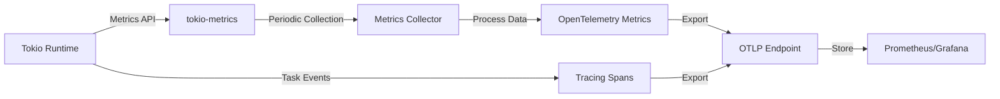

# How to Monitor Tokio Runtime Metrics with OpenTelemetry in Rust

Author: [nawazdhandala](https://www.github.com/nawazdhandala)

Tags: OpenTelemetry, Rust, Tokio, Runtime, Metrics, Async

Description: Learn how to monitor Tokio runtime performance metrics using OpenTelemetry to track task scheduling, worker threads, and async executor health.

Tokio powers most asynchronous Rust applications, but understanding its runtime behavior remains challenging without proper instrumentation. Runtime metrics reveal critical insights about task scheduling, thread pool utilization, and async executor performance that directly impact application responsiveness and throughput.

This guide demonstrates how to collect and export Tokio runtime metrics using OpenTelemetry, enabling you to monitor executor health, detect task starvation, and optimize async application performance.

## Why Monitor Tokio Runtime

The Tokio runtime orchestrates all async operations in your application. Monitoring it reveals:

- Task spawning rates and completion times
- Worker thread utilization and blocking behavior
- Queue depths indicating backpressure or overload
- Idle thread counts showing resource efficiency
- Polling times exposing hot loops or inefficient futures
- Budget exhaustion indicating compute-heavy tasks

Without these metrics, diagnosing performance issues in async Rust applications becomes guesswork.

## Runtime Metrics Architecture

Here's how Tokio metrics integrate with OpenTelemetry:



## Dependencies Setup

Add required crates to your `Cargo.toml`:

```toml
[dependencies]
# Tokio with metrics and tracing support
tokio = { version = "1.35", features = ["full", "tracing"] }
tokio-metrics = "0.3"

# OpenTelemetry core
opentelemetry = "0.22"
opentelemetry_sdk = { version = "0.22", features = ["rt-tokio", "metrics"] }
opentelemetry-otlp = { version = "0.15", features = ["metrics"] }

# Prometheus exporter (alternative to OTLP)
opentelemetry-prometheus = "0.15"
prometheus = "0.13"

# Tracing integration
tracing = "0.1"
tracing-subscriber = { version = "0.3", features = ["env-filter"] }
tracing-opentelemetry = "0.23"

# Utilities
serde = { version = "1.0", features = ["derive"] }
```

## Initialize Metrics Pipeline

Set up OpenTelemetry metrics exporter for Tokio data:

```rust
use opentelemetry::{global, KeyValue};
use opentelemetry_sdk::{
    metrics::{MeterProvider, PeriodicReader, SdkMeterProvider},
    runtime,
    Resource,
};
use opentelemetry_otlp::WithExportConfig;
use std::time::Duration;

fn init_metrics() -> Result<SdkMeterProvider, Box<dyn std::error::Error>> {
    // Configure OTLP metrics exporter
    let exporter = opentelemetry_otlp::new_exporter()
        .tonic()
        .with_endpoint("http://localhost:4317")
        .build_metrics_exporter(
            Box::new(opentelemetry_sdk::metrics::aggregation::DefaultAggregationSelector::new()),
            Box::new(opentelemetry_sdk::metrics::data::Temporality::default()),
        )?;

    // Create periodic reader that exports metrics every 10 seconds
    let reader = PeriodicReader::builder(exporter, runtime::Tokio)
        .with_interval(Duration::from_secs(10))
        .build();

    // Build meter provider with service identification
    let provider = SdkMeterProvider::builder()
        .with_reader(reader)
        .with_resource(Resource::new(vec![
            KeyValue::new("service.name", "tokio-metrics-service"),
            KeyValue::new("service.version", "1.0.0"),
            KeyValue::new("runtime", "tokio"),
        ]))
        .build();

    global::set_meter_provider(provider.clone());

    Ok(provider)
}
```

## Collect Runtime Monitor Metrics

Create a monitor that tracks Tokio runtime statistics:

```rust
use tokio_metrics::{RuntimeMonitor, RuntimeMetrics};
use opentelemetry::metrics::{Meter, Counter, Histogram, ObservableGauge};
use std::sync::Arc;
use tokio::runtime::Handle;

pub struct TokioMetricsCollector {
    monitor: RuntimeMonitor,

    // Counter metrics
    tasks_spawned: Counter<u64>,
    tasks_completed: Counter<u64>,

    // Histogram metrics
    task_poll_duration: Histogram<f64>,
    task_scheduled_duration: Histogram<f64>,

    // Gauge metrics for current state
    active_tasks: Arc<std::sync::Mutex<u64>>,
    idle_workers: Arc<std::sync::Mutex<u64>>,
}

impl TokioMetricsCollector {
    pub fn new(runtime_handle: &Handle, meter: &Meter) -> Self {
        // Create runtime monitor
        let monitor = RuntimeMonitor::new(runtime_handle);

        // Initialize counter metrics
        let tasks_spawned = meter
            .u64_counter("tokio.tasks.spawned")
            .with_description("Total number of tasks spawned")
            .init();

        let tasks_completed = meter
            .u64_counter("tokio.tasks.completed")
            .with_description("Total number of tasks completed")
            .init();

        // Initialize histogram metrics
        let task_poll_duration = meter
            .f64_histogram("tokio.task.poll.duration")
            .with_description("Duration of task polls in seconds")
            .with_unit("s")
            .init();

        let task_scheduled_duration = meter
            .f64_histogram("tokio.task.scheduled.duration")
            .with_description("Time tasks spend waiting to be polled")
            .with_unit("s")
            .init();

        // Initialize gauge metrics
        let active_tasks = Arc::new(std::sync::Mutex::new(0));
        let idle_workers = Arc::new(std::sync::Mutex::new(0));

        // Register observable gauges
        let active_tasks_clone = active_tasks.clone();
        meter
            .u64_observable_gauge("tokio.tasks.active")
            .with_description("Number of currently active tasks")
            .with_callback(move |observer| {
                let value = *active_tasks_clone.lock().unwrap();
                observer.observe(value, &[]);
            })
            .init();

        let idle_workers_clone = idle_workers.clone();
        meter
            .u64_observable_gauge("tokio.workers.idle")
            .with_description("Number of idle worker threads")
            .with_callback(move |observer| {
                let value = *idle_workers_clone.lock().unwrap();
                observer.observe(value, &[]);
            })
            .init();

        Self {
            monitor,
            tasks_spawned,
            tasks_completed,
            task_poll_duration,
            task_scheduled_duration,
            active_tasks,
            idle_workers,
        }
    }

    // Collect and record metrics from the runtime
    pub async fn collect_metrics(&self) {
        // Get current metrics snapshot
        for metrics in self.monitor.intervals() {
            self.record_metrics(&metrics);

            // Sleep briefly to avoid busy-waiting
            tokio::time::sleep(Duration::from_millis(100)).await;
        }
    }

    fn record_metrics(&self, metrics: &RuntimeMetrics) {
        // Record counter metrics
        self.tasks_spawned.add(metrics.total_spawned_tasks_count, &[]);

        // Calculate completed tasks
        let completed = metrics.total_spawned_tasks_count
            .saturating_sub(*self.active_tasks.lock().unwrap());
        self.tasks_completed.add(completed, &[]);

        // Record timing histograms
        let poll_duration_secs = metrics.mean_poll_duration.as_secs_f64();
        self.task_poll_duration.record(poll_duration_secs, &[]);

        let scheduled_duration_secs = metrics.mean_scheduled_duration.as_secs_f64();
        self.task_scheduled_duration.record(scheduled_duration_secs, &[]);

        // Update gauge values
        *self.active_tasks.lock().unwrap() = metrics.active_tasks_count;
        *self.idle_workers.lock().unwrap() = metrics.num_idle_blocking_threads;
    }
}
```

## Track Individual Task Metrics

Monitor specific task performance with custom instrumentation:

```rust
use tracing::{info, instrument};
use std::time::Instant;

#[instrument(skip(work_fn))]
async fn tracked_task<F, T>(task_name: &str, work_fn: F) -> T
where
    F: std::future::Future<Output = T>,
{
    let start = Instant::now();

    info!(task_name = task_name, "Task started");

    // Execute the actual work
    let result = work_fn.await;

    let duration = start.elapsed();

    info!(
        task_name = task_name,
        duration_ms = duration.as_millis(),
        "Task completed"
    );

    result
}

// Example usage with different task types
async fn example_tasks() {
    // IO-bound task
    tracked_task("fetch_data", async {
        tokio::time::sleep(Duration::from_millis(100)).await;
        "data fetched"
    })
    .await;

    // CPU-bound task
    tracked_task("compute_heavy", async {
        let mut sum = 0u64;
        for i in 0..1_000_000 {
            sum = sum.wrapping_add(i);
        }
        sum
    })
    .await;

    // Concurrent task spawning
    tracked_task("spawn_subtasks", async {
        let handles: Vec<_> = (0..10)
            .map(|i| {
                tokio::spawn(async move {
                    tokio::time::sleep(Duration::from_millis(50)).await;
                    i * 2
                })
            })
            .collect();

        for handle in handles {
            let _ = handle.await;
        }
    })
    .await;
}
```

## Monitor Worker Thread Utilization

Track worker thread activity and blocking operations:

```rust
use tokio_metrics::RuntimeMetrics;
use opentelemetry::metrics::Meter;

pub struct WorkerMetricsCollector {
    worker_park_count: Counter<u64>,
    worker_unpark_count: Counter<u64>,
    blocking_queue_depth: Histogram<u64>,
}

impl WorkerMetricsCollector {
    pub fn new(meter: &Meter) -> Self {
        Self {
            worker_park_count: meter
                .u64_counter("tokio.worker.park.count")
                .with_description("Number of times workers parked")
                .init(),

            worker_unpark_count: meter
                .u64_counter("tokio.worker.unpark.count")
                .with_description("Number of times workers unparked")
                .init(),

            blocking_queue_depth: meter
                .u64_histogram("tokio.blocking.queue.depth")
                .with_description("Depth of blocking task queue")
                .init(),
        }
    }

    pub fn record(&self, metrics: &RuntimeMetrics) {
        // Record worker park/unpark events
        self.worker_park_count.add(metrics.total_park_count, &[]);
        self.worker_unpark_count.add(metrics.total_noop_count, &[]);

        // Record blocking queue depth
        self.blocking_queue_depth.record(
            metrics.num_blocking_threads,
            &[],
        );
    }
}
```

## Detect Task Starvation

Implement monitoring to detect when tasks are starved of execution time:

```rust
use std::time::Duration;
use tracing::warn;

pub struct StarvationDetector {
    max_scheduled_duration: Duration,
    max_poll_duration: Duration,
}

impl StarvationDetector {
    pub fn new() -> Self {
        Self {
            max_scheduled_duration: Duration::from_millis(100),
            max_poll_duration: Duration::from_millis(50),
        }
    }

    pub fn check_starvation(&self, metrics: &RuntimeMetrics) {
        // Check if tasks are waiting too long to be scheduled
        if metrics.mean_scheduled_duration > self.max_scheduled_duration {
            warn!(
                scheduled_duration_ms = metrics.mean_scheduled_duration.as_millis(),
                threshold_ms = self.max_scheduled_duration.as_millis(),
                "Task starvation detected: high scheduling delay"
            );
        }

        // Check if polls are taking too long (blocking the executor)
        if metrics.mean_poll_duration > self.max_poll_duration {
            warn!(
                poll_duration_ms = metrics.mean_poll_duration.as_millis(),
                threshold_ms = self.max_poll_duration.as_millis(),
                "Executor blocking detected: long poll duration"
            );
        }

        // Check for queue buildup
        if metrics.active_tasks_count > 1000 {
            warn!(
                active_tasks = metrics.active_tasks_count,
                "High task count detected: possible overload"
            );
        }
    }
}
```

## Task Budget Monitoring

Track task budget consumption to identify compute-intensive operations:

```rust
use opentelemetry::metrics::{Meter, Histogram};

pub struct BudgetMetricsCollector {
    budget_exhaustion_count: Counter<u64>,
    polls_per_task: Histogram<u64>,
}

impl BudgetMetricsCollector {
    pub fn new(meter: &Meter) -> Self {
        Self {
            budget_exhaustion_count: meter
                .u64_counter("tokio.budget.exhausted")
                .with_description("Number of times task budget was exhausted")
                .init(),

            polls_per_task: meter
                .u64_histogram("tokio.task.polls")
                .with_description("Number of polls per task")
                .init(),
        }
    }

    pub fn record(&self, metrics: &RuntimeMetrics) {
        // Calculate budget exhaustion from polling patterns
        if metrics.mean_polls_count > 100 {
            self.budget_exhaustion_count.add(1, &[]);
        }

        self.polls_per_task.record(metrics.mean_polls_count, &[]);
    }
}
```

## Complete Monitoring Application

Assemble all components into a working monitoring system:

```rust
use tokio::runtime::Handle;
use tracing::{info, error};

#[tokio::main]
async fn main() -> Result<(), Box<dyn std::error::Error>> {
    // Initialize OpenTelemetry metrics
    let meter_provider = init_metrics()?;
    let meter = global::meter("tokio-runtime");

    // Initialize tracing for structured logging
    init_tracing()?;

    info!("Starting Tokio runtime monitoring");

    // Get handle to current runtime
    let runtime_handle = Handle::current();

    // Create metrics collectors
    let metrics_collector = TokioMetricsCollector::new(&runtime_handle, &meter);
    let worker_collector = WorkerMetricsCollector::new(&meter);
    let budget_collector = BudgetMetricsCollector::new(&meter);
    let starvation_detector = StarvationDetector::new();

    // Spawn metrics collection task
    let metrics_handle = tokio::spawn(async move {
        loop {
            metrics_collector.collect_metrics().await;
            tokio::time::sleep(Duration::from_secs(1)).await;
        }
    });

    // Spawn example workload tasks
    spawn_example_workload().await;

    // Run for a period to collect metrics
    tokio::time::sleep(Duration::from_secs(60)).await;

    // Graceful shutdown
    metrics_handle.abort();
    info!("Shutting down metrics collection");

    meter_provider.shutdown()?;

    Ok(())
}

async fn spawn_example_workload() {
    // Spawn various types of tasks to generate metrics

    // Continuous background tasks
    for i in 0..5 {
        tokio::spawn(async move {
            loop {
                tokio::time::sleep(Duration::from_secs(1)).await;
                info!(worker_id = i, "Background task tick");
            }
        });
    }

    // Burst of short-lived tasks
    for _ in 0..100 {
        tokio::spawn(async {
            tokio::time::sleep(Duration::from_millis(10)).await;
        });
    }

    // CPU-intensive task
    tokio::spawn(async {
        loop {
            let _ = tokio::task::spawn_blocking(|| {
                let mut sum = 0u64;
                for i in 0..10_000_000 {
                    sum = sum.wrapping_add(i);
                }
                sum
            })
            .await;

            tokio::time::sleep(Duration::from_secs(5)).await;
        }
    });

    // IO-bound tasks
    for _ in 0..10 {
        tokio::spawn(async {
            loop {
                tokio::time::sleep(Duration::from_millis(100)).await;
            }
        });
    }
}
```

## Prometheus Integration

Alternative approach using Prometheus exporter:

```rust
use opentelemetry_prometheus::PrometheusExporter;
use prometheus::{Encoder, TextEncoder};

fn init_prometheus_metrics() -> Result<PrometheusExporter, Box<dyn std::error::Error>> {
    let exporter = opentelemetry_prometheus::exporter()
        .with_resource(Resource::new(vec![
            KeyValue::new("service.name", "tokio-prometheus-service"),
        ]))
        .build()?;

    global::set_meter_provider(exporter.meter_provider());

    Ok(exporter)
}

// HTTP endpoint to expose Prometheus metrics
async fn metrics_handler(exporter: Arc<PrometheusExporter>) -> Result<String, String> {
    let encoder = TextEncoder::new();
    let metric_families = exporter.registry().gather();

    let mut buffer = vec![];
    encoder
        .encode(&metric_families, &mut buffer)
        .map_err(|e| format!("Failed to encode metrics: {}", e))?;

    String::from_utf8(buffer)
        .map_err(|e| format!("Failed to convert metrics to string: {}", e))
}

// Serve metrics on HTTP endpoint
async fn serve_metrics(exporter: Arc<PrometheusExporter>) {
    use warp::Filter;

    let metrics_route = warp::path!("metrics")
        .and(warp::any().map(move || exporter.clone()))
        .and_then(|exp: Arc<PrometheusExporter>| async move {
            metrics_handler(exp).await.map_err(|e| warp::reject::reject())
        });

    info!("Serving Prometheus metrics on http://0.0.0.0:9090/metrics");
    warp::serve(metrics_route).run(([0, 0, 0, 0], 9090)).await;
}
```

## Dashboard Configuration

Create a Grafana dashboard to visualize Tokio metrics:

**Panel 1: Task Throughput**
- Metric: `rate(tokio_tasks_spawned[1m])`
- Visualization: Time series graph
- Shows tasks spawned per second

**Panel 2: Active Tasks**
- Metric: `tokio_tasks_active`
- Visualization: Gauge
- Shows current active task count

**Panel 3: Task Duration**
- Metric: `tokio_task_poll_duration`
- Visualization: Heatmap
- Shows distribution of task poll times

**Panel 4: Worker Utilization**
- Metric: `tokio_workers_idle`
- Visualization: Time series
- Shows idle worker thread count

**Panel 5: Scheduling Delay**
- Metric: `tokio_task_scheduled_duration`
- Visualization: Histogram
- Shows time tasks wait before execution

## Production Best Practices

When monitoring Tokio in production:

**Metrics Overhead**: Collection adds minimal overhead, but export frequency matters. Use 10-30 second intervals for most applications.

**Cardinality Control**: Avoid high-cardinality labels like task IDs. Use task types or modules instead.

**Alerting Thresholds**: Set alerts for scheduling delays over 100ms, active task counts exceeding capacity, and worker thread exhaustion.

**Runtime Configuration**: Enable Tokio tracing features only when needed. They add small overhead but provide valuable insights.

**Historical Analysis**: Store metrics long-term to identify trends in runtime behavior and capacity planning needs.

**Multi-Runtime Apps**: If your application uses multiple Tokio runtimes, tag metrics with runtime identifiers to distinguish them.

Monitoring Tokio runtime metrics with OpenTelemetry transforms async Rust development from reactive debugging to proactive optimization. These metrics reveal exactly how your application uses the async runtime, enabling you to tune task scheduling, prevent executor blocking, and ensure responsive application behavior under load.
