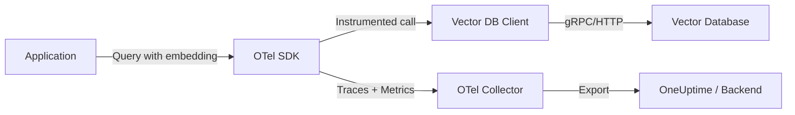

# How to Monitor Vector Database Performance (Pinecone, Qdrant, Weaviate) with OpenTelemetry

Author: [nawazdhandala](https://www.github.com/nawazdhandala)

Tags: OpenTelemetry, Vector Databases, Pinecone, Qdrant, Weaviate, Observability, AI Infrastructure, Performance Monitoring

Description: Learn how to monitor vector database performance for Pinecone, Qdrant, and Weaviate using OpenTelemetry tracing, metrics, and custom instrumentation.

---

Vector databases are at the heart of modern AI applications. Whether you're building semantic search, recommendation engines, or retrieval-augmented generation (RAG) pipelines, your vector database is doing the heavy lifting of storing and querying high-dimensional embeddings. When things slow down, you need visibility into what's happening inside those queries.

This guide shows you how to instrument Pinecone, Qdrant, and Weaviate with OpenTelemetry so you can track query latencies, monitor index health, and catch performance regressions before your users notice them.

---

## Why Monitor Vector Databases?

Vector databases behave differently from traditional relational databases. Instead of exact lookups, they perform approximate nearest neighbor (ANN) searches across high-dimensional spaces. This means performance depends on factors like:

- **Index size and dimensionality** of your vectors
- **Query complexity** and the number of results requested
- **Filter conditions** applied alongside vector search
- **Memory pressure** and disk I/O on the database server
- **Network latency** between your application and the database

Without proper observability, you're flying blind when query times spike from 20ms to 500ms during peak traffic.

---

## Architecture Overview

Here's how OpenTelemetry fits into a typical vector database architecture:



The OpenTelemetry SDK wraps your vector database client calls, capturing timing data, query parameters, and results metadata. This telemetry flows through the OTel Collector to your observability backend.

---

## Setting Up the Foundation

First, install the core OpenTelemetry packages for Python. These are required regardless of which vector database you use.

```python
# Install core OpenTelemetry packages
# pip install opentelemetry-api opentelemetry-sdk opentelemetry-exporter-otlp

from opentelemetry import trace, metrics
from opentelemetry.sdk.trace import TracerProvider
from opentelemetry.sdk.trace.export import BatchSpanProcessor
from opentelemetry.sdk.metrics import MeterProvider
from opentelemetry.sdk.metrics.export import PeriodicExportingMetricReader
from opentelemetry.exporter.otlp.proto.grpc.trace_exporter import OTLPSpanExporter
from opentelemetry.exporter.otlp.proto.grpc.metric_exporter import OTLPMetricExporter

# Configure the tracer provider with OTLP export
tracer_provider = TracerProvider()
span_exporter = OTLPSpanExporter(
    endpoint="https://oneuptime.com/otlp"  # Your OTel backend endpoint
)
tracer_provider.add_span_processor(BatchSpanProcessor(span_exporter))
trace.set_tracer_provider(tracer_provider)

# Configure metrics with a 30-second export interval
metric_reader = PeriodicExportingMetricReader(
    OTLPMetricExporter(endpoint="https://oneuptime.com/otlp"),
    export_interval_millis=30000
)
meter_provider = MeterProvider(metric_readers=[metric_reader])
metrics.set_meter_provider(meter_provider)

# Create tracer and meter for vector database operations
tracer = trace.get_tracer("vectordb.client", "1.0.0")
meter = metrics.get_meter("vectordb.client", "1.0.0")
```

---

## Instrumenting Pinecone

Pinecone is a managed vector database, so you're mostly dealing with HTTP/gRPC calls to their cloud service. The key metrics to capture are query latency, upsert throughput, and the number of vectors matched.

Here's a wrapper that instruments Pinecone operations with OpenTelemetry spans and metrics.

```python
# pip install pinecone-client
from pinecone import Pinecone
from opentelemetry import trace, metrics

tracer = trace.get_tracer("pinecone.client")
meter = metrics.get_meter("pinecone.client")

# Create histogram to track query duration distribution
query_duration = meter.create_histogram(
    name="pinecone.query.duration",
    description="Time taken for Pinecone queries",
    unit="ms"
)

# Counter for total operations by type
operation_counter = meter.create_counter(
    name="pinecone.operations.total",
    description="Total Pinecone operations"
)

class InstrumentedPinecone:
    def __init__(self, api_key, index_name):
        # Initialize the Pinecone client and connect to the index
        pc = Pinecone(api_key=api_key)
        self.index = pc.Index(index_name)
        self.index_name = index_name

    def query(self, vector, top_k=10, namespace="", filters=None):
        # Start a span that captures the full query lifecycle
        with tracer.start_as_current_span("pinecone.query") as span:
            # Record query parameters as span attributes
            span.set_attribute("db.system", "pinecone")
            span.set_attribute("db.pinecone.index", self.index_name)
            span.set_attribute("db.pinecone.top_k", top_k)
            span.set_attribute("db.pinecone.namespace", namespace)
            span.set_attribute("db.pinecone.vector_dimension", len(vector))
            span.set_attribute("db.pinecone.has_filter", filters is not None)

            import time
            start = time.perf_counter()

            try:
                # Execute the actual Pinecone query
                result = self.index.query(
                    vector=vector,
                    top_k=top_k,
                    namespace=namespace,
                    filter=filters,
                    include_metadata=True
                )

                elapsed_ms = (time.perf_counter() - start) * 1000

                # Record how many matches came back and their score range
                matches = result.get("matches", [])
                span.set_attribute("db.pinecone.matches_count", len(matches))
                if matches:
                    span.set_attribute("db.pinecone.top_score", matches[0]["score"])

                # Record the duration in our histogram metric
                query_duration.record(elapsed_ms, {"index": self.index_name})
                operation_counter.add(1, {"operation": "query", "status": "success"})

                return result

            except Exception as e:
                # Mark the span as errored and record the failure
                span.set_status(trace.StatusCode.ERROR, str(e))
                span.record_exception(e)
                operation_counter.add(1, {"operation": "query", "status": "error"})
                raise

    def upsert(self, vectors, namespace=""):
        # Trace upsert operations to monitor write performance
        with tracer.start_as_current_span("pinecone.upsert") as span:
            span.set_attribute("db.system", "pinecone")
            span.set_attribute("db.pinecone.index", self.index_name)
            span.set_attribute("db.pinecone.vectors_count", len(vectors))
            span.set_attribute("db.pinecone.namespace", namespace)

            result = self.index.upsert(vectors=vectors, namespace=namespace)
            operation_counter.add(1, {"operation": "upsert", "status": "success"})
            return result
```

---

## Instrumenting Qdrant

Qdrant runs as a self-hosted or cloud service and communicates over gRPC or HTTP. Since it's often deployed alongside your application, you'll want to capture both client-side and network-level metrics.

```python
# pip install qdrant-client
from qdrant_client import QdrantClient
from qdrant_client.models import Distance, VectorParams, PointStruct, Filter
from opentelemetry import trace

tracer = trace.get_tracer("qdrant.client")

class InstrumentedQdrant:
    def __init__(self, host="localhost", port=6333, collection_name="default"):
        # Connect to Qdrant - works for both local and cloud deployments
        self.client = QdrantClient(host=host, port=port)
        self.collection_name = collection_name

    def search(self, query_vector, limit=10, query_filter=None):
        # Create a span for the search operation with relevant attributes
        with tracer.start_as_current_span("qdrant.search") as span:
            span.set_attribute("db.system", "qdrant")
            span.set_attribute("db.qdrant.collection", self.collection_name)
            span.set_attribute("db.qdrant.limit", limit)
            span.set_attribute("db.qdrant.vector_dimension", len(query_vector))
            span.set_attribute("db.qdrant.has_filter", query_filter is not None)

            try:
                # Perform the nearest neighbor search
                results = self.client.search(
                    collection_name=self.collection_name,
                    query_vector=query_vector,
                    limit=limit,
                    query_filter=query_filter
                )

                # Capture result metadata for debugging
                span.set_attribute("db.qdrant.results_count", len(results))
                if results:
                    span.set_attribute("db.qdrant.top_score", results[0].score)

                return results

            except Exception as e:
                span.set_status(trace.StatusCode.ERROR, str(e))
                span.record_exception(e)
                raise

    def get_collection_info(self):
        # Monitor collection health and size over time
        with tracer.start_as_current_span("qdrant.collection_info") as span:
            span.set_attribute("db.system", "qdrant")
            span.set_attribute("db.qdrant.collection", self.collection_name)

            info = self.client.get_collection(self.collection_name)

            # These attributes help you track index growth
            span.set_attribute("db.qdrant.points_count", info.points_count)
            span.set_attribute("db.qdrant.indexed_vectors_count",
                             info.indexed_vectors_count)
            span.set_attribute("db.qdrant.status", info.status.value)

            return info
```

---

## Instrumenting Weaviate

Weaviate uses a GraphQL-based API, which means queries can be more complex. You'll want to capture the query structure alongside timing data.

```python
# pip install weaviate-client
import weaviate
from opentelemetry import trace

tracer = trace.get_tracer("weaviate.client")

class InstrumentedWeaviate:
    def __init__(self, url="http://localhost:8080", api_key=None):
        # Set up the Weaviate client with optional authentication
        auth_config = None
        if api_key:
            auth_config = weaviate.auth.AuthApiKey(api_key=api_key)
        self.client = weaviate.Client(url=url, auth_client_secret=auth_config)

    def near_vector_search(self, class_name, vector, limit=10, properties=None):
        # Trace semantic search operations against Weaviate
        with tracer.start_as_current_span("weaviate.near_vector") as span:
            span.set_attribute("db.system", "weaviate")
            span.set_attribute("db.weaviate.class", class_name)
            span.set_attribute("db.weaviate.limit", limit)
            span.set_attribute("db.weaviate.vector_dimension", len(vector))

            try:
                # Build and execute the nearVector query
                query = (
                    self.client.query
                    .get(class_name, properties or ["content"])
                    .with_near_vector({"vector": vector})
                    .with_limit(limit)
                    .with_additional(["distance", "id"])
                )
                result = query.do()

                # Extract result count from the GraphQL response
                objects = result.get("data", {}).get("Get", {}).get(class_name, [])
                span.set_attribute("db.weaviate.results_count", len(objects))

                return result

            except Exception as e:
                span.set_status(trace.StatusCode.ERROR, str(e))
                span.record_exception(e)
                raise

    def hybrid_search(self, class_name, query_text, vector=None, alpha=0.5, limit=10):
        # Trace hybrid searches that combine keyword and vector search
        with tracer.start_as_current_span("weaviate.hybrid_search") as span:
            span.set_attribute("db.system", "weaviate")
            span.set_attribute("db.weaviate.class", class_name)
            span.set_attribute("db.weaviate.search_type", "hybrid")
            span.set_attribute("db.weaviate.alpha", alpha)
            span.set_attribute("db.weaviate.limit", limit)

            try:
                # Hybrid search blends BM25 keyword search with vector similarity
                hybrid_params = {"query": query_text, "alpha": alpha}
                if vector:
                    hybrid_params["vector"] = vector

                query = (
                    self.client.query
                    .get(class_name, ["content", "title"])
                    .with_hybrid(**hybrid_params)
                    .with_limit(limit)
                    .with_additional(["score", "explainScore"])
                )
                result = query.do()

                objects = result.get("data", {}).get("Get", {}).get(class_name, [])
                span.set_attribute("db.weaviate.results_count", len(objects))

                return result

            except Exception as e:
                span.set_status(trace.StatusCode.ERROR, str(e))
                span.record_exception(e)
                raise
```

---

## Custom Metrics That Matter

Beyond tracing individual queries, you should collect aggregate metrics that help you spot trends over time. Here are the metrics I'd recommend for any vector database deployment.

```python
from opentelemetry import metrics

meter = metrics.get_meter("vectordb.metrics")

# Track query latency as a histogram - this gives you p50, p95, p99 breakdowns
query_latency = meter.create_histogram(
    name="vectordb.query.latency",
    description="Query latency in milliseconds",
    unit="ms"
)

# Track how many vectors are returned per query
results_per_query = meter.create_histogram(
    name="vectordb.query.results_count",
    description="Number of results returned per query"
)

# Monitor the relevance scores of top results
# A sudden drop might mean your embeddings are degrading
top_score = meter.create_histogram(
    name="vectordb.query.top_score",
    description="Similarity score of the top result"
)

# Count operations by type and status for error rate dashboards
operations = meter.create_counter(
    name="vectordb.operations",
    description="Total vector database operations"
)

# Track collection size as an observable gauge
# This runs on a callback, so it doesn't add latency to queries
def collection_size_callback(options):
    # Fetch the current vector count from your database
    # This example uses Qdrant but adapt for your database
    try:
        info = qdrant_client.get_collection("my_collection")
        yield metrics.Observation(info.points_count, {"collection": "my_collection"})
    except Exception:
        pass  # Don't let metric collection break your app

meter.create_observable_gauge(
    name="vectordb.collection.vectors_count",
    description="Number of vectors in the collection",
    callbacks=[collection_size_callback]
)
```

---

## Configuring the OpenTelemetry Collector

Your OTel Collector config should handle both traces and metrics from vector database instrumentation. Here's a practical configuration.

```yaml
# otel-collector-config.yaml
receivers:
  otlp:
    protocols:
      grpc:
        endpoint: "0.0.0.0:4317"
      http:
        endpoint: "0.0.0.0:4318"

processors:
  # Batch telemetry data to reduce export overhead
  batch:
    timeout: 5s
    send_batch_size: 1024

  # Add resource attributes to identify the service
  resource:
    attributes:
      - key: service.name
        value: "vector-search-api"
        action: upsert
      - key: deployment.environment
        value: "production"
        action: upsert

  # Filter out internal health check spans to reduce noise
  filter:
    spans:
      exclude:
        match_type: strict
        span_names:
          - "health_check"

exporters:
  otlp:
    endpoint: "https://oneuptime.com/otlp"
    tls:
      insecure: false

service:
  pipelines:
    traces:
      receivers: [otlp]
      processors: [resource, filter, batch]
      exporters: [otlp]
    metrics:
      receivers: [otlp]
      processors: [resource, batch]
      exporters: [otlp]
```

---

## Debugging Common Issues

Once you have tracing in place, here are the patterns to watch for:

**High p99 latency with normal p50**: This usually means a small percentage of queries are hitting collections with dense clusters. Check the `db.*.vector_dimension` and `db.*.has_filter` attributes to see if filtered queries are the slow ones.

**Gradual latency increase over time**: Your index is growing. Track the `vectordb.collection.vectors_count` gauge alongside query latency. Most vector databases need periodic re-indexing or parameter tuning as they grow.

**Score degradation**: If your `vectordb.query.top_score` histogram shifts lower, your embedding model might be producing inconsistent vectors, or your data distribution has shifted. This is a signal to retrain or fine-tune your embedding model.

**Timeouts during upsert batches**: Large batch upserts can cause query latency spikes on some databases. Use the traces to correlate upsert operations with query slowdowns, then schedule bulk writes during off-peak hours.

---

## Wrapping Up

Monitoring vector databases with OpenTelemetry isn't fundamentally different from monitoring any other database. The key difference is in the attributes you capture: vector dimensions, similarity scores, filter conditions, and result counts. These are the signals that tell you whether your AI features are actually working well for users.

Start with basic query tracing, add custom metrics for the dimensions that matter to your use case, and build dashboards that surface anomalies before they become incidents. With the instrumentation patterns shown above, you'll have full visibility into your vector database performance regardless of which provider you're using.
