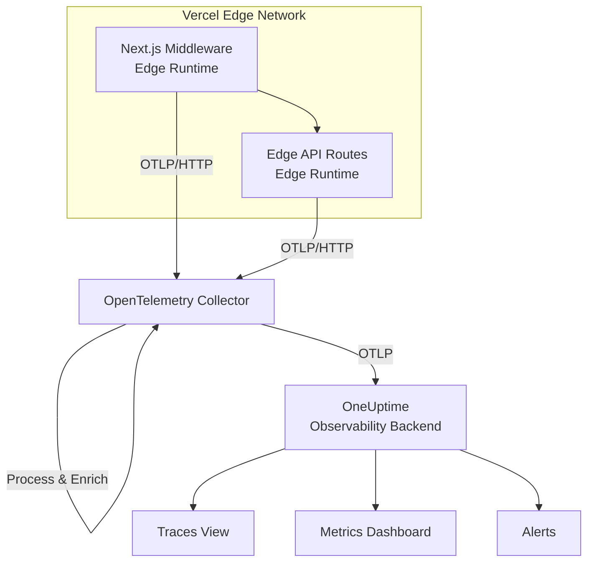

# How to Monitor Vercel Edge Functions with OpenTelemetry

Author: [nawazdhandala](https://www.github.com/nawazdhandala)

Tags: OpenTelemetry, Vercel, Edge Functions, Next.js, Monitoring, Tracing, Serverless

Description: Learn how to set up OpenTelemetry monitoring for Vercel Edge Functions to trace requests, measure performance, and debug issues in production.

---

Vercel Edge Functions run on the Edge Runtime, executing JavaScript and TypeScript at points of presence around the world. They are fast and close to users, but their distributed nature makes debugging difficult. A slow response could be caused by your function code, an external API call, or an issue with data fetching. Without tracing, you are left guessing.

OpenTelemetry provides the instrumentation layer needed to understand what happens inside each edge function invocation. This guide covers setting up OpenTelemetry with Vercel Edge Functions, including Next.js middleware, edge API routes, and standalone edge functions.

## Understanding the Constraints

Vercel Edge Functions run on the Edge Runtime, which is a subset of the standard Node.js runtime. This means some OpenTelemetry SDK features that rely on Node.js-specific APIs are not available. Specifically:

- No file system access (so file-based exporters are out)
- No native gRPC support (HTTP-based OTLP export only)
- Limited execution time (typically 30 seconds max)
- No persistent state between invocations

These constraints shape how you configure OpenTelemetry. You need to use HTTP-based OTLP export, keep span counts low, and flush telemetry before the function returns.

## Setting Up the OpenTelemetry SDK

First, install the required packages in your Vercel project:

```bash
# Install OpenTelemetry packages compatible with the Edge Runtime
npm install @opentelemetry/api \
  @opentelemetry/sdk-trace-base \
  @opentelemetry/exporter-trace-otlp-http \
  @opentelemetry/resources \
  @opentelemetry/semantic-conventions
```

Create a shared instrumentation module that initializes the tracer. This module will be imported by your edge functions:

```typescript
// lib/tracing.ts
// OpenTelemetry setup for Vercel Edge Runtime
// Uses HTTP-based OTLP export since gRPC is not available on the edge

import { trace, SpanStatusCode } from "@opentelemetry/api";
import { BasicTracerProvider, SimpleSpanProcessor } from "@opentelemetry/sdk-trace-base";
import { OTLPTraceExporter } from "@opentelemetry/exporter-trace-otlp-http";
import { Resource } from "@opentelemetry/resources";
import { ATTR_SERVICE_NAME, ATTR_SERVICE_VERSION } from "@opentelemetry/semantic-conventions";

// Initialize the OTLP exporter pointing to your collector
const exporter = new OTLPTraceExporter({
  // Use your collector's HTTP endpoint
  url: process.env.OTEL_EXPORTER_ENDPOINT || "https://collector.example.com:4318/v1/traces",
  headers: {
    // Include an API key if your collector requires authentication
    "x-api-key": process.env.OTEL_API_KEY || "",
  },
});

// Create a resource describing this service
const resource = new Resource({
  [ATTR_SERVICE_NAME]: "vercel-edge-api",
  [ATTR_SERVICE_VERSION]: process.env.VERCEL_GIT_COMMIT_SHA || "unknown",
  "deployment.environment": process.env.VERCEL_ENV || "development",
  "cloud.provider": "vercel",
  "cloud.platform": "vercel_edge",
});

// Use SimpleSpanProcessor for edge functions
// BatchSpanProcessor relies on timers that may not fire before the function completes
const provider = new BasicTracerProvider({ resource });
provider.addSpanProcessor(new SimpleSpanProcessor(exporter));
provider.register();

// Export a convenience function for getting the tracer
export function getTracer(name: string = "edge-function") {
  return trace.getTracer(name);
}

// Helper to flush pending spans before the function returns
export async function flushTraces(): Promise<void> {
  await provider.forceFlush();
}

export { SpanStatusCode };
```

The critical detail here is using `SimpleSpanProcessor` instead of `BatchSpanProcessor`. In a long-running server, batching is more efficient because it groups spans and sends them periodically. But edge functions have short lifetimes. A batch processor might not flush before the function terminates, causing you to lose telemetry. The simple processor sends each span immediately, which has more network overhead but guarantees delivery.

## Instrumenting Next.js Middleware

Next.js middleware runs on Vercel's Edge Runtime by default. It intercepts every request before it reaches your pages or API routes, making it a natural place for tracing:

```typescript
// middleware.ts
// Next.js middleware with OpenTelemetry tracing
// This runs on every request before reaching the page or API route

import { NextRequest, NextResponse } from "next/server";
import { getTracer, flushTraces, SpanStatusCode } from "./lib/tracing";

const tracer = getTracer("nextjs-middleware");

export async function middleware(req: NextRequest) {
  const span = tracer.startSpan("middleware", {
    attributes: {
      "http.method": req.method,
      "http.url": req.url,
      "http.route": req.nextUrl.pathname,
      // Capture the Vercel region for geographic debugging
      "vercel.region": req.headers.get("x-vercel-id")?.split("::")[0] || "unknown",
      "http.user_agent": req.headers.get("user-agent") || "",
    },
  });

  try {
    // Example: rate limiting check
    const clientIP = req.headers.get("x-forwarded-for") || "unknown";
    const isRateLimited = await checkRateLimit(clientIP, span);

    if (isRateLimited) {
      span.setAttribute("middleware.action", "rate_limited");
      span.setStatus({ code: SpanStatusCode.OK });
      span.end();
      await flushTraces();
      return new NextResponse("Too Many Requests", { status: 429 });
    }

    // Example: authentication check for API routes
    if (req.nextUrl.pathname.startsWith("/api/")) {
      const authResult = await validateAuth(req, span);
      if (!authResult.valid) {
        span.setAttribute("middleware.action", "auth_rejected");
        span.setStatus({ code: SpanStatusCode.OK });
        span.end();
        await flushTraces();
        return new NextResponse("Unauthorized", { status: 401 });
      }
      span.setAttribute("auth.user_id", authResult.userId);
    }

    span.setAttribute("middleware.action", "pass_through");
    span.setStatus({ code: SpanStatusCode.OK });
    span.end();
    await flushTraces();
    return NextResponse.next();
  } catch (error) {
    span.recordException(error as Error);
    span.setStatus({ code: SpanStatusCode.ERROR, message: (error as Error).message });
    span.end();
    await flushTraces();
    return new NextResponse("Internal Server Error", { status: 500 });
  }
}

async function checkRateLimit(clientIP: string, parentSpan: any): Promise<boolean> {
  const childSpan = tracer.startSpan("check-rate-limit", {
    attributes: { "client.ip": clientIP },
  });
  // Your rate limiting logic here
  childSpan.end();
  return false;
}

async function validateAuth(req: NextRequest, parentSpan: any) {
  const childSpan = tracer.startSpan("validate-auth");
  // Your auth validation logic here
  childSpan.end();
  return { valid: true, userId: "user-123" };
}

// Apply middleware to specific paths
export const config = {
  matcher: ["/api/:path*", "/dashboard/:path*"],
};
```

Notice the `await flushTraces()` call before every return statement. This is essential. Without it, the function might terminate before the spans are exported, and you lose the telemetry data.

## Instrumenting Edge API Routes

Edge API routes in Next.js use the same Edge Runtime. Here is how to instrument them:

```typescript
// app/api/search/route.ts
// Edge API route with OpenTelemetry tracing for a search endpoint

import { NextRequest, NextResponse } from "next/server";
import { getTracer, flushTraces, SpanStatusCode } from "@/lib/tracing";

// Declare this route runs on the edge
export const runtime = "edge";

const tracer = getTracer("search-api");

export async function GET(req: NextRequest) {
  const span = tracer.startSpan("search-handler", {
    attributes: {
      "http.method": "GET",
      "http.route": "/api/search",
    },
  });

  try {
    const query = req.nextUrl.searchParams.get("q") || "";
    span.setAttribute("search.query_length", query.length);

    // Trace the external API call to a search backend
    const searchSpan = tracer.startSpan("search-backend-call");
    const response = await fetch(
      `https://search-api.internal.example.com/query?q=${encodeURIComponent(query)}`,
      {
        headers: {
          "Authorization": `Bearer ${process.env.SEARCH_API_KEY}`,
          // Manually propagate trace context to the backend
          "traceparent": buildTraceparent(searchSpan),
        },
      }
    );
    searchSpan.setAttribute("http.status_code", response.status);
    searchSpan.end();

    if (!response.ok) {
      span.setAttribute("error", true);
      span.setStatus({ code: SpanStatusCode.ERROR, message: "Search backend error" });
      span.end();
      await flushTraces();
      return NextResponse.json({ error: "Search failed" }, { status: 502 });
    }

    const results = await response.json();
    span.setAttribute("search.result_count", results.items?.length || 0);
    span.setStatus({ code: SpanStatusCode.OK });
    span.end();
    await flushTraces();

    return NextResponse.json(results);
  } catch (error) {
    span.recordException(error as Error);
    span.setStatus({ code: SpanStatusCode.ERROR });
    span.end();
    await flushTraces();
    return NextResponse.json({ error: "Internal error" }, { status: 500 });
  }
}

// Build a W3C traceparent header from a span
function buildTraceparent(span: any): string {
  const ctx = span.spanContext();
  return `00-${ctx.traceId}-${ctx.spanId}-01`;
}
```

The `buildTraceparent` helper manually creates the W3C Trace Context header. In the Edge Runtime, the automatic context propagation from the standard OpenTelemetry HTTP instrumentation may not work because it depends on Node.js HTTP modules. Building the header manually is reliable and straightforward.

## Architecture Overview

Here is how telemetry flows from Vercel Edge Functions to your observability backend:



## Environment Variables for Vercel

Set these environment variables in your Vercel project settings to configure the telemetry pipeline:

```bash
# Vercel Project Environment Variables
# Set these in the Vercel dashboard under Settings > Environment Variables

# Your OpenTelemetry collector endpoint (HTTPS required for production)
OTEL_EXPORTER_ENDPOINT=https://collector.example.com:4318/v1/traces

# API key for authenticating with your collector
OTEL_API_KEY=your-collector-api-key

# These are automatically set by Vercel, no need to configure:
# VERCEL_ENV (production, preview, development)
# VERCEL_REGION (iad1, sfo1, etc.)
# VERCEL_GIT_COMMIT_SHA (current deployment's commit hash)
```

Vercel automatically injects several environment variables that are useful as resource attributes. The region, environment, and commit SHA help you correlate traces with specific deployments and regions when debugging production issues.

## Performance Considerations

OpenTelemetry adds overhead to every function invocation. On the Edge Runtime, where cold starts and execution time directly impact user experience, you need to be mindful of this cost.

The `SimpleSpanProcessor` with HTTP export adds roughly 5 to 15 milliseconds per span, depending on network latency between the edge location and your collector. For functions where latency is critical, consider these optimizations:

- Limit the number of spans per invocation to the essentials
- Use span events instead of child spans for lightweight annotations
- Set up your collector geographically close to Vercel's edge regions
- Consider sampling in high-throughput scenarios

For sampling, you can implement a simple probabilistic approach:

```typescript
// Simple sampling logic for high-throughput edge functions
// Sample 20% of requests, but always trace errors

function shouldTrace(req: NextRequest): boolean {
  // Always trace requests that look like they might be problematic
  if (req.headers.get("x-debug-trace") === "true") return true;

  // Probabilistic sampling at 20%
  return Math.random() < 0.2;
}
```

## Summary

Monitoring Vercel Edge Functions with OpenTelemetry requires working within the Edge Runtime's constraints. Use HTTP-based OTLP export, the SimpleSpanProcessor, and always flush traces before the function returns. The payoff is worth the effort: full distributed tracing across your edge functions, backend services, and databases, all connected by W3C Trace Context propagation. Combined with an observability platform like OneUptime, you get the visibility needed to debug latency issues, track errors, and understand the real performance of your edge-deployed application.
