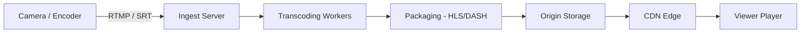

# How to Monitor Video Streaming Backend Performance with OpenTelemetry

Author: [nawazdhandala](https://www.github.com/nawazdhandala)

Tags: OpenTelemetry, Video Streaming, Backend Performance, Observability, Metrics, Tracing, HLS, DASH

Description: Learn how to instrument video streaming backends with OpenTelemetry to monitor transcoding pipelines, CDN origin performance, adaptive bitrate delivery, and viewer experience metrics.

---

Video streaming backends are some of the hardest systems to monitor well. A single stream might pass through an ingest server, a transcoding pipeline, a packaging stage, a CDN origin, and then hit edge servers before reaching the viewer. Latency or failure at any point in that chain results in buffering, quality drops, or a black screen. Traditional request/response monitoring falls short here because streaming is stateful, long-lived, and highly sensitive to timing.

OpenTelemetry gives you the building blocks to trace and measure every stage of that pipeline. This post walks through instrumenting a video streaming backend from ingest to delivery, with real code you can adapt to your own system.

---

## Architecture of a Streaming Backend

Before writing any instrumentation code, it helps to understand the data flow. Most modern streaming platforms use a pipeline that looks something like this:



Each stage has distinct performance characteristics. Ingest servers care about connection stability and bitrate consistency. Transcoding workers care about CPU utilization and encoding speed. Packaging needs to produce segments on time. And the origin needs to serve manifests and segments quickly.

---

## Setting Up the Tracer and Meter

Start by configuring OpenTelemetry with both tracing and metrics. Video backends typically run in Python, Go, or Node.js. Here is a Python setup that covers both signals:

```python
# pip install opentelemetry-api opentelemetry-sdk opentelemetry-exporter-otlp

from opentelemetry import trace, metrics
from opentelemetry.sdk.trace import TracerProvider
from opentelemetry.sdk.trace.export import BatchSpanProcessor
from opentelemetry.sdk.metrics import MeterProvider
from opentelemetry.sdk.metrics.export import PeriodicExportingMetricReader
from opentelemetry.exporter.otlp.proto.grpc.trace_exporter import OTLPSpanExporter
from opentelemetry.exporter.otlp.proto.grpc.metric_exporter import OTLPMetricExporter
from opentelemetry.sdk.resources import Resource

# Identify this service in all telemetry
resource = Resource.create({
    "service.name": "video-streaming-backend",
    "service.version": "2.4.1",
    "deployment.environment": "production",
})

# Configure tracing with OTLP export
trace_provider = TracerProvider(resource=resource)
trace_provider.add_span_processor(
    BatchSpanProcessor(OTLPSpanExporter(endpoint="otel-collector:4317"))
)
trace.set_tracer_provider(trace_provider)

# Configure metrics with OTLP export
metric_reader = PeriodicExportingMetricReader(
    OTLPMetricExporter(endpoint="otel-collector:4317"),
    export_interval_millis=10000,  # Export every 10 seconds
)
meter_provider = MeterProvider(resource=resource, metric_readers=[metric_reader])
metrics.set_meter_provider(meter_provider)

tracer = trace.get_tracer("video.streaming")
meter = metrics.get_meter("video.streaming")
```

The 10-second export interval matters for streaming. You want metrics fresh enough to catch issues mid-stream, but not so frequent that you overwhelm your collector during peak viewership.

---

## Instrumenting the Ingest Server

The ingest server is the first point of contact. It receives live video over RTMP or SRT and needs to validate the stream, check bitrate, and forward frames to the transcoding pipeline. Here is how to instrument that flow:

```python
# Metrics for ingest health
ingest_connections = meter.create_up_down_counter(
    name="video.ingest.active_connections",
    description="Number of active ingest connections",
    unit="connections",
)

ingest_bitrate = meter.create_histogram(
    name="video.ingest.bitrate",
    description="Incoming stream bitrate",
    unit="kbps",
)

ingest_frame_drops = meter.create_counter(
    name="video.ingest.frame_drops_total",
    description="Total dropped frames during ingest",
    unit="frames",
)

def handle_ingest_connection(stream_id, stream_config):
    """Handle an incoming RTMP/SRT stream connection."""
    # Track connection as a span for the full duration of the stream
    with tracer.start_as_current_span(
        "video.ingest.session",
        attributes={
            "video.stream_id": stream_id,
            "video.codec": stream_config["codec"],
            "video.resolution": stream_config["resolution"],
            "video.protocol": stream_config["protocol"],
        },
    ) as span:
        ingest_connections.add(1, {"video.protocol": stream_config["protocol"]})

        try:
            for frame_batch in receive_frames(stream_id):
                # Record bitrate for each batch of frames
                ingest_bitrate.record(
                    frame_batch.bitrate_kbps,
                    {"video.stream_id": stream_id},
                )

                # Track dropped frames if any
                if frame_batch.dropped > 0:
                    ingest_frame_drops.add(
                        frame_batch.dropped,
                        {"video.stream_id": stream_id},
                    )
                    span.add_event(
                        "frames_dropped",
                        {"count": frame_batch.dropped, "reason": frame_batch.drop_reason},
                    )

                # Forward to transcoding pipeline
                forward_to_transcoder(stream_id, frame_batch)

        finally:
            ingest_connections.add(-1, {"video.protocol": stream_config["protocol"]})
```

The up-down counter for active connections lets you see connection load in real time. The histogram for bitrate helps you spot streams that are sending at unexpectedly low or high rates, which often indicates network issues between the encoder and your ingest server.

---

## Tracing the Transcoding Pipeline

Transcoding is usually the most resource-intensive stage. Each incoming stream gets encoded into multiple bitrate variants for adaptive streaming. This is where most of your compute budget goes.

```python
# Metrics specific to transcoding performance
transcode_duration = meter.create_histogram(
    name="video.transcode.duration",
    description="Time to transcode one segment",
    unit="ms",
)

transcode_queue_depth = meter.create_up_down_counter(
    name="video.transcode.queue_depth",
    description="Number of segments waiting to be transcoded",
    unit="segments",
)

def transcode_segment(stream_id, segment, output_profiles):
    """Transcode a single segment into multiple bitrate profiles."""
    with tracer.start_as_current_span(
        "video.transcode.segment",
        attributes={
            "video.stream_id": stream_id,
            "video.segment_number": segment.number,
            "video.segment_duration_ms": segment.duration_ms,
            "video.profile_count": len(output_profiles),
        },
    ) as span:
        results = []
        for profile in output_profiles:
            # Each bitrate variant gets its own child span
            with tracer.start_as_current_span(
                "video.transcode.variant",
                attributes={
                    "video.profile.name": profile.name,
                    "video.profile.bitrate_kbps": profile.bitrate,
                    "video.profile.resolution": profile.resolution,
                    "video.profile.codec": profile.codec,
                },
            ) as variant_span:
                start_time = time.monotonic()

                # Perform the actual transcoding
                encoded = encoder.encode(segment.data, profile)

                duration_ms = (time.monotonic() - start_time) * 1000
                transcode_duration.record(
                    duration_ms,
                    {
                        "video.profile.name": profile.name,
                        "video.profile.resolution": profile.resolution,
                    },
                )

                # Record output size ratio for compression analysis
                variant_span.set_attribute(
                    "video.output_size_bytes", len(encoded)
                )
                variant_span.set_attribute(
                    "video.compression_ratio",
                    round(len(segment.data) / max(len(encoded), 1), 2),
                )

                results.append(encoded)

        return results
```

Having a child span per variant is important. If your 1080p encode takes 400ms but your 4K encode takes 2 seconds, you will see that clearly in the trace waterfall. Without per-variant spans, you only see the total time and have to guess where it went.

---

## Monitoring Segment Packaging and Delivery

After transcoding, segments get packaged into HLS or DASH format and stored at the origin. This stage needs to be fast because viewers are waiting.

```python
# Segment delivery metrics
segment_serve_latency = meter.create_histogram(
    name="video.delivery.segment_latency",
    description="Latency to serve a segment from origin",
    unit="ms",
)

manifest_serve_latency = meter.create_histogram(
    name="video.delivery.manifest_latency",
    description="Latency to serve a manifest/playlist",
    unit="ms",
)

cache_hit_counter = meter.create_counter(
    name="video.delivery.cache_hits_total",
    description="Cache hits when serving segments",
)

cache_miss_counter = meter.create_counter(
    name="video.delivery.cache_misses_total",
    description="Cache misses when serving segments",
)

async def serve_segment(request):
    """Serve an HLS/DASH segment to a CDN or player."""
    with tracer.start_as_current_span(
        "video.delivery.serve_segment",
        attributes={
            "video.stream_id": request.stream_id,
            "video.segment_number": request.segment_number,
            "video.profile": request.profile,
            "http.method": "GET",
        },
    ) as span:
        # Check cache first
        cached = segment_cache.get(request.cache_key)
        if cached:
            cache_hit_counter.add(1, {"video.profile": request.profile})
            span.set_attribute("video.cache_hit", True)
            return cached

        cache_miss_counter.add(1, {"video.profile": request.profile})
        span.set_attribute("video.cache_hit", False)

        # Fetch from storage
        segment_data = await storage.fetch_segment(
            request.stream_id, request.segment_number, request.profile
        )

        segment_serve_latency.record(
            request.elapsed_ms(),
            {"video.profile": request.profile, "video.cache_hit": False},
        )

        return segment_data
```

The split between manifest latency and segment latency is deliberate. Players fetch manifests frequently to discover new segments, and a slow manifest response directly causes buffering even if segments themselves are fast.

---

## Viewer Experience Metrics

The backend metrics above tell you how your infrastructure is performing, but they do not directly tell you what viewers are experiencing. Bridge that gap by collecting viewer-side signals and correlating them:

```python
# Viewer experience metrics collected from player reports
buffer_ratio = meter.create_histogram(
    name="video.viewer.buffer_ratio",
    description="Percentage of playback time spent buffering",
    unit="percent",
)

startup_time = meter.create_histogram(
    name="video.viewer.startup_time",
    description="Time from play request to first frame rendered",
    unit="ms",
)

bitrate_switches = meter.create_counter(
    name="video.viewer.bitrate_switches_total",
    description="Number of adaptive bitrate switches",
)

def process_viewer_heartbeat(heartbeat):
    """Process periodic heartbeat from the video player."""
    with tracer.start_as_current_span(
        "video.viewer.heartbeat",
        attributes={
            "video.stream_id": heartbeat.stream_id,
            "video.viewer_id": heartbeat.viewer_id,
            "video.current_bitrate_kbps": heartbeat.current_bitrate,
            "video.player_state": heartbeat.state,
            "video.cdn_edge": heartbeat.edge_server,
        },
    ):
        buffer_ratio.record(
            heartbeat.buffer_percent,
            {
                "video.stream_id": heartbeat.stream_id,
                "video.cdn_edge": heartbeat.edge_server,
            },
        )

        if heartbeat.is_startup:
            startup_time.record(
                heartbeat.startup_ms,
                {"video.cdn_edge": heartbeat.edge_server},
            )

        if heartbeat.bitrate_changed:
            bitrate_switches.add(
                1,
                {
                    "video.stream_id": heartbeat.stream_id,
                    "video.direction": "up" if heartbeat.bitrate_increased else "down",
                },
            )
```

Tracking bitrate switch direction is a useful detail. Frequent downward switches mean viewers are losing quality, and you can correlate that with your transcoding and delivery metrics to find the bottleneck.

---

## Alerting on Streaming Health

With these metrics flowing into your observability backend, you can set up targeted alerts:

- **Buffer ratio above 5% for more than 2 minutes** on any stream. This catches quality issues before they turn into viewer complaints.
- **Transcode queue depth growing for more than 30 seconds**. This means your transcoding workers cannot keep up, and you need to scale or investigate a stuck job.
- **Ingest frame drops exceeding 1% of total frames**. This usually points to network issues between the encoder and your platform.
- **Segment serve latency p99 above 200ms**. Players expect segments quickly, and high tail latency causes buffering for a meaningful percentage of viewers.

These thresholds are starting points. Tune them based on your specific content type and viewer expectations. Live sports streaming tolerates less latency than a recorded lecture series.

---

## Wrapping Up

Monitoring a video streaming backend requires instrumentation at every stage of the pipeline. OpenTelemetry's combination of traces and metrics lets you follow a stream from ingest through transcoding, packaging, and delivery, then correlate that with what viewers actually experience. The key insight is that streaming is not a single request but a continuous pipeline, and your monitoring needs to reflect that by tracking stateful connections, queue depths, and per-segment timing rather than just HTTP response codes.

Start with the ingest and delivery metrics since those directly affect viewer experience, then work inward to transcoding and packaging as you need deeper visibility.
