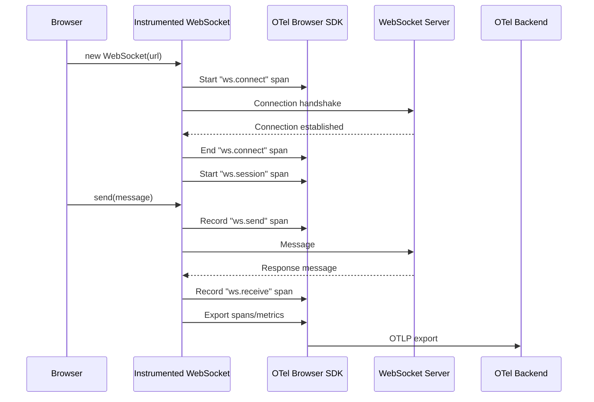

# How to Monitor WebSocket Connections from the Browser with OpenTelemetry

Author: [nawazdhandala](https://www.github.com/nawazdhandala)

Tags: OpenTelemetry, WebSocket, Browser, Real-Time, Monitoring, JavaScript

Description: Learn how to instrument WebSocket connections in the browser using OpenTelemetry to track connection lifecycle, message throughput, latency, and errors in real-time applications.

---

WebSocket connections power chat apps, live dashboards, multiplayer games, and collaborative editing tools. Unlike HTTP requests, WebSockets maintain a persistent connection that can stay open for hours. That persistence makes them harder to observe. You cannot simply look at request/response pairs. You need to track connection lifecycle events, message flow, and failures over time.

OpenTelemetry gives you a standardized way to capture all of this from the browser. By wrapping the native WebSocket API, you can emit spans and metrics that flow into your existing observability backend alongside your HTTP traces and page load data.

## Why WebSocket Monitoring Matters

HTTP requests have a clear start and end. WebSocket connections do not follow that pattern. A connection opens, messages flow in both directions for an indefinite period, and eventually the connection closes or drops. Without instrumentation, you are blind to questions like:

- How long do connections typically stay alive?
- What is the average message latency from send to acknowledgment?
- How often do connections drop unexpectedly?
- Which users experience the most reconnection attempts?

Traditional APM tools often ignore WebSocket traffic entirely because it does not fit the request/response model. OpenTelemetry spans and metrics are flexible enough to capture this.

## Architecture Overview



## Setting Up the OpenTelemetry Browser SDK

Before instrumenting WebSockets, you need the base OpenTelemetry setup in the browser. Install the required packages:

```bash
npm install @opentelemetry/api \
  @opentelemetry/sdk-trace-web \
  @opentelemetry/exporter-trace-otlp-http \
  @opentelemetry/resources \
  @opentelemetry/semantic-conventions
```

Then initialize the tracer provider in your application entry point:

```javascript
// src/tracing.js
import { WebTracerProvider } from '@opentelemetry/sdk-trace-web';
import { OTLPTraceExporter } from '@opentelemetry/exporter-trace-otlp-http';
import { BatchSpanProcessor } from '@opentelemetry/sdk-trace-web';
import { Resource } from '@opentelemetry/resources';
import { ATTR_SERVICE_NAME } from '@opentelemetry/semantic-conventions';
import { trace } from '@opentelemetry/api';

// Create a resource that identifies your application
const resource = new Resource({
  [ATTR_SERVICE_NAME]: 'my-frontend-app',
});

// Configure the OTLP exporter to send traces to your backend
const exporter = new OTLPTraceExporter({
  url: 'https://otel-collector.example.com/v1/traces',
});

// Set up the tracer provider with batch processing
const provider = new WebTracerProvider({ resource });
provider.addSpanProcessor(new BatchSpanProcessor(exporter));
provider.register();

// Export a helper to get a named tracer
export function getTracer(name = 'websocket-instrumentation') {
  return trace.getTracer(name, '1.0.0');
}
```

This setup gives you a tracer provider that batches and exports spans over OTLP. The batch processor is important for browser environments because it avoids sending a network request for every single span.

## Building the WebSocket Wrapper

The core idea is to wrap the native WebSocket constructor with a version that emits OpenTelemetry spans for each lifecycle event. Here is the instrumented wrapper:

```javascript
// src/instrumented-websocket.js
import { SpanStatusCode, SpanKind, context, trace } from '@opentelemetry/api';
import { getTracer } from './tracing';

const tracer = getTracer();

export class InstrumentedWebSocket {
  constructor(url, protocols) {
    this.url = url;
    this.messagesSent = 0;
    this.messagesReceived = 0;
    this.connectTime = null;

    // Start a span for the connection handshake
    this.connectSpan = tracer.startSpan('ws.connect', {
      kind: SpanKind.CLIENT,
      attributes: {
        'ws.url': url,
        'ws.protocols': protocols ? protocols.toString() : 'none',
      },
    });

    // Create the actual WebSocket connection
    this.ws = new WebSocket(url, protocols);
    this.connectTime = performance.now();

    // Attach lifecycle event handlers
    this._attachHandlers();
  }

  _attachHandlers() {
    // Track successful connection
    this.ws.onopen = (event) => {
      const elapsed = performance.now() - this.connectTime;
      this.connectSpan.setAttribute('ws.connect_duration_ms', elapsed);
      this.connectSpan.setStatus({ code: SpanStatusCode.OK });
      this.connectSpan.end();

      // Start a long-running session span
      this.sessionSpan = tracer.startSpan('ws.session', {
        kind: SpanKind.CLIENT,
        attributes: {
          'ws.url': this.url,
        },
      });

      // Call user-defined onopen if set
      if (this._onopen) this._onopen(event);
    };

    // Track connection errors
    this.ws.onerror = (event) => {
      this.connectSpan.setStatus({
        code: SpanStatusCode.ERROR,
        message: 'WebSocket connection error',
      });
      this.connectSpan.end();

      if (this._onerror) this._onerror(event);
    };

    // Track incoming messages
    this.ws.onmessage = (event) => {
      this.messagesReceived++;
      const receiveSpan = tracer.startSpan('ws.receive', {
        kind: SpanKind.CLIENT,
        attributes: {
          'ws.url': this.url,
          'ws.message_size': event.data.length || 0,
          'ws.messages_received_total': this.messagesReceived,
        },
      });
      receiveSpan.end();

      if (this._onmessage) this._onmessage(event);
    };

    // Track connection close
    this.ws.onclose = (event) => {
      if (this.sessionSpan) {
        this.sessionSpan.setAttribute('ws.close_code', event.code);
        this.sessionSpan.setAttribute('ws.close_reason', event.reason);
        this.sessionSpan.setAttribute('ws.messages_sent', this.messagesSent);
        this.sessionSpan.setAttribute('ws.messages_received', this.messagesReceived);

        // Mark abnormal closures as errors
        if (event.code !== 1000 && event.code !== 1001) {
          this.sessionSpan.setStatus({
            code: SpanStatusCode.ERROR,
            message: `Abnormal close: ${event.code} ${event.reason}`,
          });
        } else {
          this.sessionSpan.setStatus({ code: SpanStatusCode.OK });
        }
        this.sessionSpan.end();
      }

      if (this._onclose) this._onclose(event);
    };
  }

  // Instrumented send method
  send(data) {
    this.messagesSent++;
    const sendSpan = tracer.startSpan('ws.send', {
      kind: SpanKind.CLIENT,
      attributes: {
        'ws.url': this.url,
        'ws.message_size': data.length || 0,
        'ws.messages_sent_total': this.messagesSent,
      },
    });
    this.ws.send(data);
    sendSpan.end();
  }

  // Proxy close method
  close(code, reason) {
    this.ws.close(code, reason);
  }

  // Allow setting event handlers from outside
  set onopen(fn) { this._onopen = fn; }
  set onerror(fn) { this._onerror = fn; }
  set onmessage(fn) { this._onmessage = fn; }
  set onclose(fn) { this._onclose = fn; }
}
```

The wrapper creates three categories of spans. The `ws.connect` span tracks the initial handshake duration. The `ws.session` span covers the entire lifetime of the connection. Individual `ws.send` and `ws.receive` spans capture each message with its size and running totals.

Close codes are especially useful. Code 1000 means a normal closure. Code 1006 usually means the connection was lost without a proper close frame. By recording these as span attributes, you can filter for abnormal closures in your backend.

## Using the Instrumented WebSocket

Drop the instrumented version into your application wherever you would normally use the native WebSocket:

```javascript
// src/chat.js
import { InstrumentedWebSocket } from './instrumented-websocket';

// Create a new instrumented connection
const ws = new InstrumentedWebSocket('wss://api.example.com/chat');

ws.onopen = () => {
  console.log('Connected to chat server');
  ws.send(JSON.stringify({ type: 'join', room: 'general' }));
};

ws.onmessage = (event) => {
  const msg = JSON.parse(event.data);
  renderMessage(msg);
};

ws.onclose = (event) => {
  console.log('Disconnected:', event.code, event.reason);
};

ws.onerror = () => {
  console.error('Connection failed');
};
```

This is a drop-in replacement. The instrumented version captures all the telemetry in the background while your application code stays clean.

## Tracking Reconnection Attempts

Real applications need reconnection logic. You can track reconnection attempts as their own spans to understand how often users experience disconnections:

```javascript
// src/resilient-websocket.js
import { InstrumentedWebSocket } from './instrumented-websocket';
import { getTracer } from './tracing';
import { SpanStatusCode } from '@opentelemetry/api';

const tracer = getTracer();

export class ResilientWebSocket {
  constructor(url, options = {}) {
    this.url = url;
    this.maxRetries = options.maxRetries || 5;
    this.retryDelay = options.retryDelay || 1000;
    this.retryCount = 0;
    this.connect();
  }

  connect() {
    this.ws = new InstrumentedWebSocket(this.url);

    this.ws.onclose = (event) => {
      // Only reconnect on abnormal closures
      if (event.code !== 1000 && this.retryCount < this.maxRetries) {
        this.retryCount++;

        // Create a span to track the reconnection attempt
        const retrySpan = tracer.startSpan('ws.reconnect', {
          attributes: {
            'ws.url': this.url,
            'ws.retry_count': this.retryCount,
            'ws.previous_close_code': event.code,
            'ws.retry_delay_ms': this.retryDelay * this.retryCount,
          },
        });

        setTimeout(() => {
          retrySpan.end();
          this.connect();
        }, this.retryDelay * this.retryCount);
      }
    };

    this.ws.onopen = () => {
      // Reset retry count on successful connection
      this.retryCount = 0;
    };
  }
}
```

The exponential backoff delay is recorded as a span attribute. This helps you understand whether your reconnection strategy is working well or if users are stuck in long retry loops.

## Adding Metrics for Aggregate Analysis

Spans are great for individual connection traces, but metrics give you the big picture. Use OpenTelemetry metrics to track aggregate WebSocket health:

```javascript
// src/ws-metrics.js
import { metrics } from '@opentelemetry/api';

const meter = metrics.getMeter('websocket-metrics');

// Create counters and histograms for WebSocket activity
const connectionCounter = meter.createCounter('ws.connections.total', {
  description: 'Total number of WebSocket connections opened',
});

const messageCounter = meter.createCounter('ws.messages.total', {
  description: 'Total messages sent and received',
});

const connectionDuration = meter.createHistogram('ws.connection.duration_ms', {
  description: 'Duration of WebSocket connections in milliseconds',
});

const messageSizeHistogram = meter.createHistogram('ws.message.size_bytes', {
  description: 'Size of WebSocket messages in bytes',
});

// Call these from your instrumented WebSocket handlers
export function recordConnectionOpened(url) {
  connectionCounter.add(1, { 'ws.url': url });
}

export function recordMessageSent(url, sizeBytes) {
  messageCounter.add(1, { 'ws.url': url, 'ws.direction': 'sent' });
  messageSizeHistogram.record(sizeBytes, { 'ws.url': url });
}

export function recordConnectionClosed(url, durationMs, closeCode) {
  connectionDuration.record(durationMs, {
    'ws.url': url,
    'ws.close_code': closeCode,
  });
}
```

These metrics let you build dashboards that show connection counts over time, message throughput, and connection duration distributions. You can quickly spot patterns like a spike in abnormal closures after a deployment.

## What to Alert On

With this instrumentation in place, set up alerts for the following conditions:

- **High rate of close code 1006**: This indicates connections dropping without a proper close handshake. It usually points to network issues or server crashes.
- **Connection duration dropping below threshold**: If connections that normally last minutes start closing after seconds, something is wrong.
- **Reconnection count exceeding limit**: Users hitting the maximum retry count means they are completely cut off from real-time features.
- **Message latency spikes**: If you add round-trip tracking by correlating sent and received messages, latency spikes can signal server overload.

## Wrapping Up

WebSocket connections are a blind spot in most frontend observability setups. By wrapping the native WebSocket API with OpenTelemetry instrumentation, you get connection lifecycle spans, message throughput metrics, and reconnection tracking that feeds into your existing observability pipeline.

The key insight is that WebSocket monitoring needs both spans and metrics. Spans capture individual connection stories, while metrics show you system-wide patterns. Together they give you the full picture of your real-time features, from the browser all the way to the backend.
