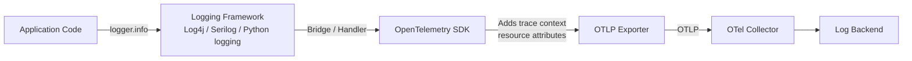

# How to Move from Custom Logging Frameworks to OpenTelemetry Structured Logging

Author: [nawazdhandala](https://www.github.com/nawazdhandala)

Tags: OpenTelemetry, Logging, Structured Logging, Migration, Observability, Log4j, Serilog

Description: A practical guide for replacing custom and framework-specific logging with OpenTelemetry structured logging, including bridge integrations for Log4j, SLF4J, Serilog, and Python logging.

---

Most applications already have logging in place, whether it is Log4j in Java, Serilog in .NET, the standard logging module in Python, or a custom solution built in-house. These frameworks work, but they operate in isolation from your distributed traces and metrics. OpenTelemetry structured logging bridges that gap by connecting log records to trace context, standardizing formats, and routing logs through the same pipeline as your other telemetry signals.

The good news is that migrating does not mean throwing away your existing logging code. OpenTelemetry provides bridge integrations for major frameworks that let you keep familiar APIs while gaining the benefits of the OpenTelemetry log data model.

## The OpenTelemetry Log Data Model

Before making any changes, it helps to understand what OpenTelemetry adds to a log record. A standard log line might look like this:

```
2024-03-15 14:23:45.123 ERROR [order-service] Failed to process order 12345: timeout
```

An OpenTelemetry log record carries much more context:

```json
{
  "timestamp": "2024-03-15T14:23:45.123Z",
  "severityText": "ERROR",
  "severityNumber": 17,
  "body": "Failed to process order 12345: timeout",
  "attributes": {
    "order.id": "12345",
    "error.type": "TimeoutException"
  },
  "resource": {
    "service.name": "order-service",
    "service.version": "2.1.0",
    "deployment.environment": "production"
  },
  "traceId": "a1b2c3d4e5f6a7b8c9d0e1f2a3b4c5d6",
  "spanId": "1a2b3c4d5e6f7a8b"
}
```

The trace and span IDs are the killer feature. They let you click on a log line in your backend and jump directly to the distributed trace that produced it. Resource attributes identify which service, version, and environment the log came from without relying on parsing the log message text.

## Step 1: Java - Bridge Log4j/SLF4J to OpenTelemetry

Java applications typically use Log4j2 or SLF4J (often with Logback). OpenTelemetry provides appenders for both that intercept log records and send them through the OpenTelemetry pipeline.

### Log4j2 Bridge Setup

```xml
<!-- Add these dependencies to your Maven pom.xml -->
<!-- The Log4j2 appender bridges Log4j to OpenTelemetry -->
<!--
  io.opentelemetry.instrumentation:opentelemetry-log4j-appender-2.17:2.2.0
  io.opentelemetry:opentelemetry-sdk:1.35.0
  io.opentelemetry:opentelemetry-exporter-otlp:1.35.0
-->
```

Configure the OpenTelemetry appender in your Log4j2 configuration:

```xml
<!-- log4j2.xml - Add OpenTelemetry appender alongside your existing appenders -->
<?xml version="1.0" encoding="UTF-8"?>
<Configuration status="WARN">
  <Appenders>
    <!-- Keep your existing console or file appender -->
    <Console name="Console" target="SYSTEM_OUT">
      <PatternLayout pattern="%d{ISO8601} %-5p [%t] %c - %m%n"/>
    </Console>

    <!-- Add the OpenTelemetry appender -->
    <!-- This captures Log4j log records and sends them via the OTel SDK -->
    <OpenTelemetry name="OTelAppender"
                   captureExperimentalAttributes="true"
                   captureMapMessageAttributes="true"
                   captureMarkerAttribute="true"/>
  </Appenders>

  <Loggers>
    <Root level="INFO">
      <!-- Route logs to both appenders during migration -->
      <AppenderRef ref="Console"/>
      <AppenderRef ref="OTelAppender"/>
    </Root>
  </Loggers>
</Configuration>
```

Your existing application code does not need to change at all:

```java
// Your existing Log4j2 code works exactly as before
import org.apache.logging.log4j.LogManager;
import org.apache.logging.log4j.Logger;

public class OrderService {
    private static final Logger logger = LogManager.getLogger(OrderService.class);

    public void processOrder(String orderId) {
        // Structured key-value pairs using Log4j2 MapMessage
        logger.info("Processing order", Map.of("order.id", orderId));

        try {
            // business logic
            logger.info("Order processed successfully");
        } catch (Exception e) {
            // The OpenTelemetry appender automatically captures the exception
            // and links this log to the active span's trace context
            logger.error("Failed to process order {}", orderId, e);
        }
    }
}
```

The OpenTelemetry appender automatically attaches trace context (trace ID and span ID) to every log record if there is an active span. No code changes needed for correlation.

## Step 2: .NET - Bridge Serilog/ILogger to OpenTelemetry

.NET applications commonly use Serilog or the built-in ILogger interface. OpenTelemetry for .NET integrates at the ILogger level, which means it works regardless of which underlying provider you use.

```csharp
// Program.cs - Configure OpenTelemetry log export
using OpenTelemetry.Logs;
using OpenTelemetry.Resources;

var builder = WebApplication.CreateBuilder(args);

// Add OpenTelemetry logging provider to the existing logging pipeline
builder.Logging.AddOpenTelemetry(options =>
{
    options.SetResourceBuilder(
        ResourceBuilder.CreateDefault()
            .AddService("order-service", serviceVersion: "2.1.0")
    );

    // Export logs via OTLP to the OpenTelemetry Collector
    options.AddOtlpExporter(otlp =>
    {
        otlp.Endpoint = new Uri("http://localhost:4317");
    });

    // Include formatted message for readability in log backends
    options.IncludeFormattedMessage = true;
    // Include scopes for additional structured context
    options.IncludeScopes = true;
    // Parse state values into separate log record attributes
    options.ParseStateValues = true;
});

// If using Serilog, keep it as the logging provider
// OpenTelemetry hooks into ILogger, so Serilog output goes through both
// builder.Host.UseSerilog();
```

Your existing logging code remains unchanged:

```csharp
// Existing ILogger usage works without modification
public class OrderController : ControllerBase
{
    private readonly ILogger<OrderController> _logger;

    public OrderController(ILogger<OrderController> logger)
    {
        _logger = logger;
    }

    [HttpPost]
    public async Task<IActionResult> CreateOrder(OrderRequest request)
    {
        // Structured logging with named parameters
        // These become attributes in the OpenTelemetry log record
        _logger.LogInformation("Creating order for customer {CustomerId} with {ItemCount} items",
            request.CustomerId, request.Items.Count);

        try
        {
            var order = await _orderService.CreateAsync(request);
            _logger.LogInformation("Order {OrderId} created successfully", order.Id);
            return Ok(order);
        }
        catch (Exception ex)
        {
            // Exception details are automatically captured as log record attributes
            _logger.LogError(ex, "Failed to create order for customer {CustomerId}",
                request.CustomerId);
            return StatusCode(500);
        }
    }
}
```

## Step 3: Python - Bridge the Standard Logging Module

Python's built-in logging module can be bridged to OpenTelemetry with a log handler:

```python
# setup_logging.py - Configure OpenTelemetry logging bridge
import logging
from opentelemetry import trace
from opentelemetry.sdk._logs import LoggerProvider, LoggingHandler
from opentelemetry.sdk._logs.export import BatchLogRecordProcessor
from opentelemetry.exporter.otlp.proto.grpc._log_exporter import OTLPLogExporter
from opentelemetry.sdk.resources import Resource

# Define the service resource so logs are attributed to the correct service
resource = Resource.create({
    "service.name": "order-service",
    "service.version": "2.1.0",
    "deployment.environment": "production",
})

# Set up the OpenTelemetry log pipeline
logger_provider = LoggerProvider(resource=resource)
logger_provider.add_log_record_processor(
    BatchLogRecordProcessor(
        OTLPLogExporter(endpoint="http://localhost:4317")
    )
)

# Create the OpenTelemetry logging handler
# This handler translates Python log records to OpenTelemetry log records
otel_handler = LoggingHandler(
    level=logging.INFO,
    logger_provider=logger_provider,
)

# Attach the handler to the root logger so all loggers in the app use it
logging.getLogger().addHandler(otel_handler)
```

Your application logging code stays the same:

```python
# application.py - No changes needed to existing logging code
import logging

logger = logging.getLogger(__name__)

def process_order(order_id: str):
    # Standard Python logging calls
    # The OpenTelemetry handler captures these and adds trace context
    logger.info("Processing order", extra={"order.id": order_id})

    try:
        # business logic
        result = execute_order(order_id)
        logger.info(
            "Order processed successfully",
            extra={"order.id": order_id, "total": result.total}
        )
    except TimeoutError:
        # Exception info is captured automatically when using exc_info
        logger.error(
            "Order processing timed out",
            extra={"order.id": order_id},
            exc_info=True,
        )
        raise
```

The `extra` dictionary fields become attributes on the OpenTelemetry log record. If there is an active trace span when the log call executes, the trace ID and span ID are automatically attached.

## Step 4: Migrate Custom Logging Frameworks

If your organization built a custom logging framework, you have two options. The easier path is to refactor the custom framework to call a standard logging library internally, then use the bridge approach described above. The harder but more flexible path is to emit OpenTelemetry log records directly using the Logs Bridge API, giving you full control over the log record contents without depending on a specific logging framework.

## Step 5: Verify Trace-Log Correlation

The whole point of this migration is to connect logs with traces. After setting up the bridge, verify that correlation works by checking that log records contain valid trace and span IDs.

```python
# Verification script: check that logs contain trace context
from opentelemetry import trace

tracer = trace.get_tracer("verification")

# Create a span and log within it
with tracer.start_as_current_span("test-correlation") as span:
    span_context = span.get_span_context()
    logger.info(
        "This log should contain trace context",
        extra={
            "expected_trace_id": format(span_context.trace_id, '032x'),
            "expected_span_id": format(span_context.span_id, '016x'),
        }
    )
    # Check your log backend - the log record should show:
    # traceId matching expected_trace_id
    # spanId matching expected_span_id
```



In your log backend, you should be able to search for a trace ID and find all log records that were emitted during that trace, across all services. This is the correlation that makes OpenTelemetry logging so valuable compared to standalone logging frameworks.

## Common Migration Challenges

**Log level mapping.** OpenTelemetry defines a standard severity scale from 1 (TRACE) to 24 (FATAL). The bridge integrations handle mapping automatically, but verify your severity levels translate correctly.

**Performance impact.** The BatchLogRecordProcessor batches records before export, so overhead per log call is minimal. If your application logs thousands of lines per second, benchmark and tune the batch size accordingly.

**Dual output during migration.** Keep your existing log appenders active alongside the OpenTelemetry appender. This gives you a fallback and lets you compare outputs to verify nothing is lost.

## Wrapping Up

Migrating to OpenTelemetry structured logging is less disruptive than it sounds. Bridge integrations for Log4j, Serilog, ILogger, and Python logging let you keep your existing code. What changes is the backend pipeline: logs flow through OpenTelemetry, carrying trace context and resource attributes. Start by adding the bridge to one service, verify correlation works, then roll it out across your fleet.
