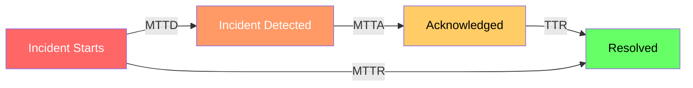

# How to Track Mean Time to Detection (MTTD) and Mean Time to Resolution (MTTR) with OpenTelemetry

Author: [nawazdhandala](https://www.github.com/nawazdhandala)

Tags: OpenTelemetry, MTTD, MTTR, Incident Metrics

Description: Implement accurate MTTD and MTTR measurement using OpenTelemetry instrumentation across your incident lifecycle pipeline.

MTTD (Mean Time to Detection) and MTTR (Mean Time to Resolution) are the two most important metrics for measuring incident response effectiveness. MTTD tells you how quickly your monitoring catches problems. MTTR tells you how quickly your team fixes them. Both metrics are only as accurate as the timestamps feeding into them, and that is where most teams get it wrong. They rely on manually updated incident tickets, which are imprecise and inconsistent. OpenTelemetry lets you capture these timestamps automatically from the actual systems involved.

## Defining the Incident Lifecycle

Before measuring anything, you need clear definitions of when each phase starts and ends.



- **Incident start**: The moment system behavior first deviated from normal (detectable from metric anomalies)
- **Detection**: The moment an alert fired or a human noticed the problem
- **Acknowledgment**: The moment an engineer started working on it
- **Resolution**: The moment the system returned to normal operating parameters

## Capturing Incident Start Time from Metrics

The true start of an incident is not when someone notices it - it is when the system first broke. OpenTelemetry metrics let you determine this retroactively by analyzing when metrics first breached normal thresholds.

```python
# Detect incident start time from OTel metric history
import requests
from datetime import datetime, timedelta

def find_incident_start_time(prometheus_url, metric_name, service, alert_time):
    """
    Walk backward from alert_time to find when the metric first deviated.
    This gives us the true incident start, not just the detection time.
    """
    # Look back up to 1 hour before the alert
    lookback_start = alert_time - timedelta(hours=1)

    query = f'{metric_name}{{service_name="{service}"}}'
    response = requests.get(
        f"{prometheus_url}/api/v1/query_range",
        params={
            "query": query,
            "start": lookback_start.isoformat(),
            "end": alert_time.isoformat(),
            "step": "15s"
        }
    )

    data_points = response.json()["data"]["result"][0]["values"]

    # Compute the baseline from the first portion of the lookback window
    baseline_values = [float(v) for _, v in data_points[:60]]  # First 15 minutes
    baseline_mean = sum(baseline_values) / len(baseline_values)
    baseline_std = (sum((v - baseline_mean)**2 for v in baseline_values) / len(baseline_values)) ** 0.5

    threshold = baseline_mean + 3 * baseline_std

    # Find the first data point that exceeded the threshold
    for timestamp, value in data_points:
        if float(value) > threshold:
            return datetime.fromtimestamp(float(timestamp))

    # If nothing found, use the alert time as fallback
    return alert_time
```

## Instrumenting the Incident Lifecycle

Emit OpenTelemetry metrics at each phase transition of an incident. These metrics become the source of truth for MTTD and MTTR calculations.

```python
# Instrument incident lifecycle transitions as OTel metrics
from opentelemetry import metrics, trace
from datetime import datetime

meter = metrics.get_meter("incident.lifecycle")
tracer = trace.get_tracer("incident.lifecycle")

# Histogram for MTTD - time between incident start and detection
mttd_histogram = meter.create_histogram(
    "incident.mttd.seconds",
    description="Mean Time to Detection in seconds",
    unit="s"
)

# Histogram for MTTR - time between incident start and resolution
mttr_histogram = meter.create_histogram(
    "incident.mttr.seconds",
    description="Mean Time to Resolution in seconds",
    unit="s"
)

# Histogram for time-to-acknowledge
mtta_histogram = meter.create_histogram(
    "incident.mtta.seconds",
    description="Mean Time to Acknowledge in seconds",
    unit="s"
)

class IncidentTracker:
    def __init__(self):
        self.incidents = {}

    def on_alert_fired(self, incident_id, alert_time, service, severity):
        """Called when an alert fires and creates an incident."""
        # Find when the problem actually started
        actual_start = find_incident_start_time(
            PROMETHEUS_URL,
            get_primary_metric(service),
            service,
            alert_time
        )

        self.incidents[incident_id] = {
            "start_time": actual_start,
            "detected_at": alert_time,
            "service": service,
            "severity": severity,
        }

        # Record MTTD
        mttd_seconds = (alert_time - actual_start).total_seconds()
        mttd_histogram.record(mttd_seconds, attributes={
            "service.name": service,
            "incident.severity": severity,
        })

    def on_acknowledged(self, incident_id, ack_time):
        """Called when an engineer acknowledges the incident."""
        incident = self.incidents[incident_id]
        mtta_seconds = (ack_time - incident["detected_at"]).total_seconds()
        mtta_histogram.record(mtta_seconds, attributes={
            "service.name": incident["service"],
            "incident.severity": incident["severity"],
        })
        incident["acknowledged_at"] = ack_time

    def on_resolved(self, incident_id, resolve_time):
        """Called when the incident is resolved."""
        incident = self.incidents[incident_id]
        mttr_seconds = (resolve_time - incident["start_time"]).total_seconds()
        mttr_histogram.record(mttr_seconds, attributes={
            "service.name": incident["service"],
            "incident.severity": incident["severity"],
        })
```

## Detecting Resolution from Metrics

Just as the incident start time can be determined from metrics, so can the resolution time. Instead of relying on someone clicking "resolved" in a dashboard, watch for when metrics return to normal.

```python
# Auto-detect incident resolution from OTel metrics
def watch_for_resolution(prometheus_url, metric_name, service, threshold, check_interval=30):
    """
    Poll the metric and detect when it returns to normal levels.
    Returns the timestamp of resolution.
    """
    import time

    consecutive_normal = 0
    required_consecutive = 4  # Metric must be normal for 4 consecutive checks (2 min)

    while True:
        response = requests.get(
            f"{prometheus_url}/api/v1/query",
            params={"query": f'{metric_name}{{service_name="{service}"}}'}
        )
        current_value = float(response.json()["data"]["result"][0]["value"][1])

        if current_value < threshold:
            consecutive_normal += 1
            if consecutive_normal >= required_consecutive:
                return datetime.utcnow()
        else:
            consecutive_normal = 0

        time.sleep(check_interval)
```

## Querying MTTD and MTTR Trends

Once you are recording these metrics, compute weekly and monthly trends to track improvement over time.

```promql
# Weekly average MTTD by severity (in minutes)
avg by (incident_severity) (
  rate(incident_mttd_seconds_sum[7d])
  /
  rate(incident_mttd_seconds_count[7d])
) / 60

# Weekly average MTTR by service (in minutes)
avg by (service_name) (
  rate(incident_mttr_seconds_sum[7d])
  /
  rate(incident_mttr_seconds_count[7d])
) / 60

# MTTR percentiles over the last 30 days
histogram_quantile(0.50, rate(incident_mttr_seconds_bucket[30d]))
histogram_quantile(0.90, rate(incident_mttr_seconds_bucket[30d]))
histogram_quantile(0.99, rate(incident_mttr_seconds_bucket[30d]))
```

## Using MTTD/MTTR to Drive Improvements

Raw numbers are useful, but trends are more informative. Set up dashboards that show:

- **MTTD by service**: Which services take longest to detect failures? These need better monitoring or more sensitive alert thresholds.
- **MTTR by severity**: Are P1 incidents being resolved faster than P2s? If not, your escalation process may need work.
- **MTTD over time**: Is detection getting faster as you add monitoring? If MTTD is flat or increasing, your observability investment is not paying off.

The key insight is that MTTD and MTTR are output metrics. You cannot improve them directly. You improve them by investing in better monitoring coverage (reducing MTTD), better runbooks and automation (reducing MTTR), and better on-call processes (reducing both). OpenTelemetry provides the instrumentation layer that makes these investments measurable.
