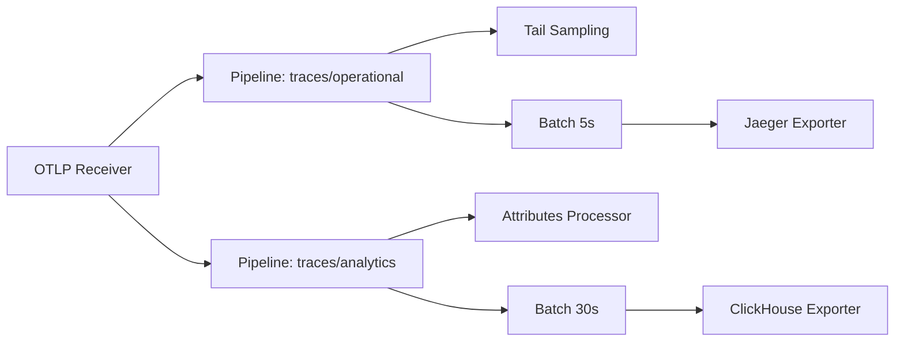

# How to Set Up Multi-Backend Export from a Single OpenTelemetry Collector

Author: [nawazdhandala](https://www.github.com/nawazdhandala)

Tags: OpenTelemetry, Collector, Multi-Backend, Export, Pipeline Configuration, Observability

Description: Learn how to configure a single OpenTelemetry Collector to export telemetry data to multiple backends simultaneously using pipelines, connectors, and routing.

---

Running a single OpenTelemetry Collector that exports to multiple backends is one of the most practical patterns in observability. Maybe you want traces in Jaeger and also in a data lake for analytics. Maybe you want metrics in both Prometheus and a cloud vendor for compliance. Or maybe you are migrating between backends and need to run both in parallel until you are confident in the new system.

Whatever the reason, the OpenTelemetry Collector handles multi-backend export natively through its pipeline architecture. This guide covers the different approaches, from simple multi-exporter pipelines to advanced routing with connectors.

## The Basics of Multi-Exporter Pipelines

The simplest way to export to multiple backends is to list multiple exporters in a single pipeline. The collector will fan out data to every exporter in the list. Each exporter operates independently, so a failure in one does not block the others.

```yaml
# otel-collector-multi-export.yaml
# Basic multi-backend configuration with a single pipeline per signal type
receivers:
  otlp:
    protocols:
      grpc:
        endpoint: 0.0.0.0:4317
      http:
        endpoint: 0.0.0.0:4318

processors:
  # Batch data before export to improve throughput for all backends
  batch:
    timeout: 10s
    send_batch_size: 500

exporters:
  # Primary trace backend for operational use
  otlp/jaeger:
    endpoint: jaeger-collector:4317
    tls:
      insecure: true

  # Secondary trace backend for long-term analytics
  otlp/clickhouse:
    endpoint: clickhouse-otel:4317
    tls:
      insecure: true

  # Primary metrics backend
  prometheusremotewrite:
    endpoint: "http://prometheus:9090/api/v1/write"

  # Cloud vendor metrics for compliance and cross-team visibility
  otlp/cloudvendor:
    endpoint: "otel.vendor.example.com:4317"
    headers:
      api-key: "${VENDOR_API_KEY}"

  # Log storage backend
  otlp/loki:
    endpoint: loki:3100

  # Debug exporter for development and troubleshooting
  debug:
    verbosity: basic

service:
  pipelines:
    # Traces go to both Jaeger and ClickHouse simultaneously
    traces:
      receivers: [otlp]
      processors: [batch]
      exporters: [otlp/jaeger, otlp/clickhouse]

    # Metrics go to both Prometheus and the cloud vendor
    metrics:
      receivers: [otlp]
      processors: [batch]
      exporters: [prometheusremotewrite, otlp/cloudvendor]

    # Logs go to Loki with debug output
    logs:
      receivers: [otlp]
      processors: [batch]
      exporters: [otlp/loki, debug]
```

This approach is straightforward but has a limitation. Every exporter in the pipeline gets exactly the same data. If you need different data in different backends, you need separate pipelines or routing.

## Separate Pipelines with Different Processing

When different backends need different processing, use multiple pipelines. Each pipeline can have its own processors, so you can filter, transform, or sample differently for each backend.



```yaml
# otel-collector-separate-pipelines.yaml
# Separate pipelines allow different processing per backend
receivers:
  otlp:
    protocols:
      grpc:
        endpoint: 0.0.0.0:4317

processors:
  # Fast batching for the operational backend where latency matters
  batch/fast:
    timeout: 5s
    send_batch_size: 200

  # Larger batches for the analytics backend where throughput matters more
  batch/bulk:
    timeout: 30s
    send_batch_size: 5000

  # Tail sampling for the operational backend to reduce storage costs
  # Keep all error traces and sample 10% of successful ones
  tail_sampling:
    decision_wait: 10s
    policies:
      - name: keep-errors
        type: status_code
        status_code:
          status_codes: [ERROR]
      - name: sample-success
        type: probabilistic
        probabilistic:
          sampling_percentage: 10

  # Strip sensitive attributes before sending to the analytics backend
  attributes/sanitize:
    actions:
      - key: user.email
        action: delete
      - key: http.request.header.authorization
        action: delete
      - key: db.statement
        action: hash

exporters:
  otlp/jaeger:
    endpoint: jaeger-collector:4317
    tls:
      insecure: true

  otlp/clickhouse:
    endpoint: clickhouse-otel:4317
    tls:
      insecure: true

service:
  pipelines:
    # Operational pipeline: sampled traces with fast export
    traces/operational:
      receivers: [otlp]
      processors: [tail_sampling, batch/fast]
      exporters: [otlp/jaeger]

    # Analytics pipeline: all traces with sanitized attributes and bulk export
    traces/analytics:
      receivers: [otlp]
      processors: [attributes/sanitize, batch/bulk]
      exporters: [otlp/clickhouse]
```

The receiver is shared between both pipelines. Data enters once and is duplicated internally. Each pipeline then processes its copy independently before exporting to its respective backend.

## Routing with Connectors

Sometimes you need to send different subsets of data to different backends based on content. The routing connector lets you direct data based on resource attributes, span attributes, or other criteria.

```yaml
# otel-collector-routing.yaml
# Route different services to different backends using the routing connector
receivers:
  otlp:
    protocols:
      grpc:
        endpoint: 0.0.0.0:4317

connectors:
  # Routing connector splits traces by service name
  # Each route matches a condition and sends to a specific pipeline
  routing:
    table:
      # Payment service traces go to a dedicated high-retention backend
      - statement: route() where resource.attributes["service.name"] == "payment-service"
        pipelines: [traces/high-retention]
      # Internal tooling traces go to a low-cost backend
      - statement: route() where resource.attributes["service.namespace"] == "internal-tools"
        pipelines: [traces/low-cost]
    # Default route for everything else
    default_pipelines: [traces/standard]

processors:
  batch:
    timeout: 10s
    send_batch_size: 500

exporters:
  # High-retention backend for critical services
  otlp/primary:
    endpoint: primary-backend:4317
    tls:
      insecure: true

  # Standard backend for most services
  otlp/standard:
    endpoint: standard-backend:4317
    tls:
      insecure: true

  # Low-cost backend for internal tooling
  otlp/budget:
    endpoint: budget-backend:4317
    tls:
      insecure: true

service:
  pipelines:
    # Entry pipeline that feeds the routing connector
    traces:
      receivers: [otlp]
      processors: [batch]
      exporters: [routing]

    # Destination pipelines for each route
    traces/high-retention:
      receivers: [routing]
      exporters: [otlp/primary]

    traces/standard:
      receivers: [routing]
      exporters: [otlp/standard]

    traces/low-cost:
      receivers: [routing]
      exporters: [otlp/budget]
```

This pattern is powerful for cost management. You can send your most critical services to a premium backend with long retention, standard services to a moderate-cost option, and development or internal tools to the cheapest available storage.

## Handling Backpressure and Failures

When exporting to multiple backends, you need to think about what happens when one backend is slow or unavailable. By default, each exporter in the collector has its own retry queue and sending queue. Configure these carefully.

```yaml
# Exporter configuration with explicit queue and retry settings
# Each exporter manages its own queue independently
exporters:
  otlp/primary:
    endpoint: primary-backend:4317
    # Sending queue buffers data when the backend is slow
    sending_queue:
      enabled: true
      # Number of batches to buffer in memory
      num_consumers: 10
      queue_size: 5000
    # Retry on transient failures
    retry_on_failure:
      enabled: true
      initial_interval: 5s
      max_interval: 60s
      max_elapsed_time: 300s

  otlp/secondary:
    endpoint: secondary-backend:4317
    sending_queue:
      enabled: true
      num_consumers: 5
      # Smaller queue for the secondary backend since it is less critical
      queue_size: 1000
    retry_on_failure:
      enabled: true
      initial_interval: 10s
      max_interval: 120s
      # Give up sooner on the secondary backend
      max_elapsed_time: 120s
```

The sending queue is the first line of defense against backpressure. If a backend goes down, the queue absorbs the data for a while. Once the queue is full, the collector will start applying backpressure to the receiver, which can cause the SDKs to buffer or drop data.

For critical primary backends, use larger queues and longer retry windows. For secondary or analytics backends, smaller queues with shorter retry windows prevent a failing secondary backend from destabilizing your entire pipeline.

## Monitoring Multi-Backend Health

When running multiple exporters, monitoring becomes more important. Each exporter reports its own set of metrics that tell you if data is flowing successfully.

```yaml
# Add telemetry configuration to monitor the collector itself
service:
  telemetry:
    metrics:
      # Expose collector metrics on a separate port
      address: 0.0.0.0:8888
      level: detailed

  pipelines:
    # Self-monitoring pipeline for collector health metrics
    metrics/internal:
      receivers: [prometheus/internal]
      exporters: [prometheusremotewrite]

receivers:
  # Scrape the collector's own metrics
  prometheus/internal:
    config:
      scrape_configs:
        - job_name: 'otel-collector'
          scrape_interval: 15s
          static_configs:
            - targets: ['0.0.0.0:8888']
```

Key metrics to watch include `otelcol_exporter_sent_spans` and `otelcol_exporter_send_failed_spans` for each exporter. A divergence between the two indicates a backend issue. The `otelcol_exporter_queue_size` metric shows how much data is buffered, which gives you early warning before data loss.

## Wrapping Up

Multi-backend export is one of the key advantages of running an OpenTelemetry Collector. It decouples your instrumentation from your backend choices and gives you the flexibility to use different tools for different purposes. Start with the simple multi-exporter pipeline, add separate pipelines when you need different processing, and use the routing connector when you need content-based routing. Keep an eye on queue sizes and failure rates for each exporter to make sure all your backends are receiving the data they need.
