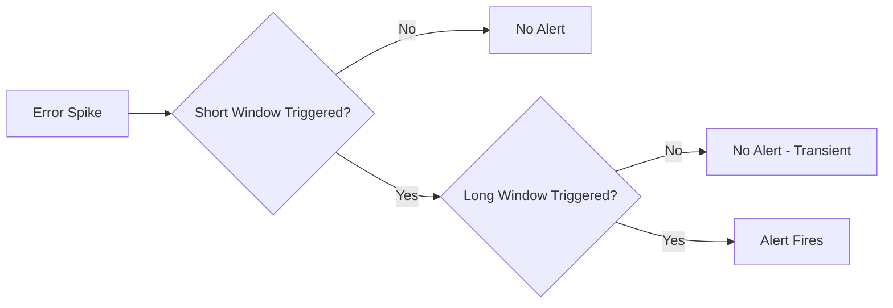

# How to Build Multi-Burn-Rate SLO Alerts from OpenTelemetry Metrics

Author: [nawazdhandala](https://www.github.com/nawazdhandala)

Tags: OpenTelemetry, SLO, Alerting, Burn Rate

Description: Build multi-burn-rate alerts from OpenTelemetry metrics to get notified at the right urgency when error budgets are burning.

A single-threshold alert on your SLO is a blunt instrument. It either fires or it does not, with no sense of urgency. Multi-burn-rate alerting solves this by creating multiple alert tiers based on how fast your error budget is being consumed. A slow burn might warrant a ticket for next week; a fast burn needs someone paged right now. This approach, popularized by Google's SRE book, pairs naturally with OpenTelemetry metrics because you can derive burn rates directly from the same counters and histograms used for SLI measurement.

## What is a Burn Rate

Burn rate measures how fast you are consuming your error budget relative to a steady-state consumption. A burn rate of 1 means you will exhaust your budget exactly at the end of the SLO window (e.g., 30 days). A burn rate of 10 means you are consuming budget 10x faster - you would exhaust it in 3 days. A burn rate of 0.5 means you are running at half the allowed error rate.

```
Burn Rate = Observed Error Rate / Allowed Error Rate
Allowed Error Rate = 1 - SLO Target
```

For a 99.9% SLO, the allowed error rate is 0.1%. If your current error rate is 1%, your burn rate is 10.

## Designing Alert Windows

Multi-burn-rate alerts use pairs of time windows: a short window for responsiveness and a long window to prevent false positives. Both conditions must be true for the alert to fire. This dual-window approach catches real incidents quickly while ignoring brief spikes.

The standard configuration from Google's SRE workbook uses these window pairs:

| Severity | Burn Rate | Long Window | Short Window | Budget Consumed |
|----------|-----------|-------------|--------------|-----------------|
| Page     | 14.4x     | 1 hour      | 5 minutes    | 2% in 1 hour   |
| Page     | 6x        | 6 hours     | 30 minutes   | 5% in 6 hours  |
| Ticket   | 3x        | 1 day       | 2 hours      | 10% in 1 day   |
| Ticket   | 1x        | 3 days      | 6 hours      | 10% in 3 days  |

## Recording Rules for Burn Rates

First, create Prometheus recording rules for error rates at each required window size. These build on the OpenTelemetry metrics exported through your collector.

```yaml
# prometheus-rules/burn-rate-recording.yaml
groups:
  - name: slo_burn_rate_recording
    interval: 30s
    rules:
      # 5-minute error rate
      - record: slo:error_rate:ratio_rate5m
        expr: |
          sum(rate(http_server_request_errors_total{service="payment-service"}[5m]))
          /
          sum(rate(http_server_request_total{service="payment-service"}[5m]))

      # 30-minute error rate
      - record: slo:error_rate:ratio_rate30m
        expr: |
          sum(rate(http_server_request_errors_total{service="payment-service"}[30m]))
          /
          sum(rate(http_server_request_total{service="payment-service"}[30m]))

      # 1-hour error rate
      - record: slo:error_rate:ratio_rate1h
        expr: |
          sum(rate(http_server_request_errors_total{service="payment-service"}[1h]))
          /
          sum(rate(http_server_request_total{service="payment-service"}[1h]))

      # 2-hour error rate
      - record: slo:error_rate:ratio_rate2h
        expr: |
          sum(rate(http_server_request_errors_total{service="payment-service"}[2h]))
          /
          sum(rate(http_server_request_total{service="payment-service"}[2h]))

      # 6-hour error rate
      - record: slo:error_rate:ratio_rate6h
        expr: |
          sum(rate(http_server_request_errors_total{service="payment-service"}[6h]))
          /
          sum(rate(http_server_request_total{service="payment-service"}[6h]))

      # 1-day error rate
      - record: slo:error_rate:ratio_rate1d
        expr: |
          sum(rate(http_server_request_errors_total{service="payment-service"}[1d]))
          /
          sum(rate(http_server_request_total{service="payment-service"}[1d]))

      # 3-day error rate
      - record: slo:error_rate:ratio_rate3d
        expr: |
          sum(rate(http_server_request_errors_total{service="payment-service"}[3d]))
          /
          sum(rate(http_server_request_total{service="payment-service"}[3d]))
```

## Alerting Rules for Multi-Burn-Rate

Now define the alerting rules. Each rule checks both the long window and the short window. The `for` clause adds additional confirmation time.

```yaml
# prometheus-rules/burn-rate-alerts.yaml
groups:
  - name: slo_burn_rate_alerts
    rules:
      # Critical page: 14.4x burn rate (2% budget consumed in 1 hour)
      - alert: SLOBurnRateCritical
        expr: |
          slo:error_rate:ratio_rate1h > (14.4 * 0.001)
          and
          slo:error_rate:ratio_rate5m > (14.4 * 0.001)
        for: 2m
        labels:
          severity: critical
          slo: "payment-availability"
          team: "payment-platform"
        annotations:
          summary: "High error budget burn rate for payment-service"
          description: >
            Error budget is burning at {{ $value | humanizePercentage }} per hour.
            At this rate, the entire 30-day budget will be exhausted in less than 2 days.
          runbook: "https://wiki.internal/runbooks/payment-service-availability"

      # Warning page: 6x burn rate (5% budget consumed in 6 hours)
      - alert: SLOBurnRateHigh
        expr: |
          slo:error_rate:ratio_rate6h > (6 * 0.001)
          and
          slo:error_rate:ratio_rate30m > (6 * 0.001)
        for: 5m
        labels:
          severity: warning
          slo: "payment-availability"
          team: "payment-platform"
        annotations:
          summary: "Elevated error budget burn rate for payment-service"
          description: >
            Error budget is burning at 6x the normal rate.
            At this rate, 5% of the monthly budget will be consumed in 6 hours.

      # Ticket: 3x burn rate (10% budget consumed in 1 day)
      - alert: SLOBurnRateModerate
        expr: |
          slo:error_rate:ratio_rate1d > (3 * 0.001)
          and
          slo:error_rate:ratio_rate2h > (3 * 0.001)
        for: 15m
        labels:
          severity: ticket
          slo: "payment-availability"
          team: "payment-platform"
        annotations:
          summary: "Moderate error budget burn rate for payment-service"

      # Low-priority ticket: 1x burn rate (on track to exhaust budget)
      - alert: SLOBurnRateSlow
        expr: |
          slo:error_rate:ratio_rate3d > (1 * 0.001)
          and
          slo:error_rate:ratio_rate6h > (1 * 0.001)
        for: 30m
        labels:
          severity: info
          slo: "payment-availability"
          team: "payment-platform"
        annotations:
          summary: "Slow error budget burn rate for payment-service"
```

## How the Dual-Window Strategy Prevents False Alerts

The short window catches sudden spikes - if 14.4x burn rate is happening right now, the 5-minute window will detect it quickly. But a 5-minute spike alone could be a deployment blip. The long window (1 hour) confirms the problem is sustained. Both must be true simultaneously, which filters out transient noise while still catching real incidents within minutes.



## Adapting Burn Rates for Latency SLOs

The same multi-burn-rate approach works for latency SLOs. Replace the error rate with the "bad request" rate - the fraction of requests exceeding your latency threshold.

```promql
# Latency burn rate: fraction of requests slower than 200ms
1 - (
  sum(rate(http_server_request_duration_bucket{service="payment-service", le="200"}[1h]))
  /
  sum(rate(http_server_request_duration_count{service="payment-service"}[1h]))
)
```

Replace `0.001` in the alerting rules with your latency SLO's error budget. For a 95% latency SLO, the budget is `1 - 0.95 = 0.05`, so a 14.4x burn rate threshold becomes `14.4 * 0.05 = 0.72`.
