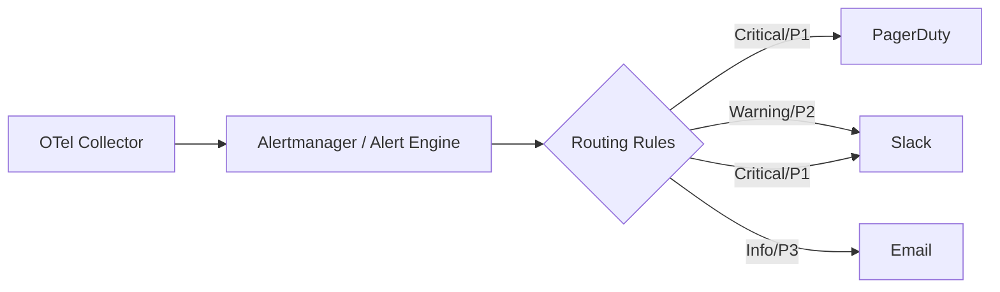

# How to Implement Multi-Channel Alert Routing (PagerDuty + Slack + Email) from OpenTelemetry Data

Author: [nawazdhandala](https://www.github.com/nawazdhandala)

Tags: OpenTelemetry, Alerting, PagerDuty, Slack, Incident Management

Description: Learn how to route OpenTelemetry metric alerts to PagerDuty, Slack, and Email based on severity and service ownership rules.

When your OpenTelemetry pipeline detects an anomaly or threshold breach, the alert needs to reach the right person through the right channel. A P1 incident on the payments service should page the on-call engineer via PagerDuty, not sit in a Slack channel. Meanwhile, a warning-level CPU spike might only need a Slack notification and an email summary.

This post walks through building a multi-channel alert routing system that takes OpenTelemetry metrics, evaluates alert rules, and dispatches notifications to PagerDuty, Slack, and Email based on configurable routing policies.

## Architecture Overview

The routing flow starts with the OpenTelemetry Collector exporting metrics to your alerting backend. From there, routing rules determine which channel receives the alert.



## Step 1: Export OpenTelemetry Metrics to Prometheus

The OpenTelemetry Collector needs to expose metrics in a format your alerting engine can consume. Prometheus is the most common choice for rule-based alerting.

Here is the Collector configuration that exports metrics via the Prometheus exporter:

```yaml
# otel-collector-config.yaml
receivers:
  otlp:
    protocols:
      grpc:
        endpoint: "0.0.0.0:4317"
      http:
        endpoint: "0.0.0.0:4318"

processors:
  batch:
    timeout: 10s

exporters:
  # Expose metrics for Prometheus to scrape
  prometheus:
    endpoint: "0.0.0.0:8889"
    namespace: "otel"
    resource_to_telemetry_conversion:
      enabled: true

service:
  pipelines:
    metrics:
      receivers: [otlp]
      processors: [batch]
      exporters: [prometheus]
```

## Step 2: Define Prometheus Alert Rules with Severity Labels

Alert rules should include a `severity` label that drives routing decisions. This label is what Alertmanager uses to decide where to send each alert.

The following rules define three severity tiers for HTTP error rates:

```yaml
# prometheus-alert-rules.yaml
groups:
  - name: http_alerts
    rules:
      # Critical: error rate above 10% triggers PagerDuty
      - alert: HighErrorRate_Critical
        expr: |
          sum(rate(otel_http_server_request_duration_seconds_count{http_status_code=~"5.."}[5m]))
          /
          sum(rate(otel_http_server_request_duration_seconds_count[5m]))
          > 0.10
        for: 2m
        labels:
          severity: critical
          team: platform
        annotations:
          summary: "HTTP 5xx error rate exceeds 10%"
          description: "Current error rate: {{ $value | humanizePercentage }}"

      # Warning: error rate above 5% goes to Slack
      - alert: HighErrorRate_Warning
        expr: |
          sum(rate(otel_http_server_request_duration_seconds_count{http_status_code=~"5.."}[5m]))
          /
          sum(rate(otel_http_server_request_duration_seconds_count[5m]))
          > 0.05
        for: 5m
        labels:
          severity: warning
          team: platform
        annotations:
          summary: "HTTP 5xx error rate exceeds 5%"

      # Info: error rate above 2% triggers email digest
      - alert: HighErrorRate_Info
        expr: |
          sum(rate(otel_http_server_request_duration_seconds_count{http_status_code=~"5.."}[5m]))
          /
          sum(rate(otel_http_server_request_duration_seconds_count[5m]))
          > 0.02
        for: 10m
        labels:
          severity: info
          team: platform
        annotations:
          summary: "HTTP 5xx error rate elevated above 2%"
```

## Step 3: Configure Alertmanager Routing

Alertmanager's routing tree matches alerts by label and dispatches them to the correct receiver. The `continue` flag allows a single alert to hit multiple channels - critical alerts go to both PagerDuty and Slack.

This Alertmanager configuration implements the severity-based routing:

```yaml
# alertmanager.yaml
global:
  resolve_timeout: 5m
  pagerduty_url: "https://events.pagerduty.com/v2/enqueue"
  slack_api_url: "https://hooks.slack.com/services/YOUR/WEBHOOK/URL"
  smtp_smarthost: "smtp.example.com:587"
  smtp_from: "alerts@example.com"

route:
  receiver: default-email
  group_by: ["alertname", "team"]
  group_wait: 30s
  group_interval: 5m
  repeat_interval: 4h

  routes:
    # Critical alerts route to PagerDuty AND Slack
    - match:
        severity: critical
      receiver: pagerduty-critical
      continue: true  # continue matching so Slack also fires

    - match:
        severity: critical
      receiver: slack-critical

    # Warning alerts go to Slack only
    - match:
        severity: warning
      receiver: slack-warning

    # Info alerts go to email digest
    - match:
        severity: info
      receiver: email-digest

receivers:
  - name: default-email
    email_configs:
      - to: "oncall-team@example.com"

  - name: pagerduty-critical
    pagerduty_configs:
      - routing_key: "YOUR_PAGERDUTY_INTEGRATION_KEY"
        severity: critical
        description: "{{ .CommonAnnotations.summary }}"
        details:
          firing: "{{ .Alerts.Firing | len }}"
          dashboard: "https://grafana.example.com/d/otel-overview"

  - name: slack-critical
    slack_configs:
      - channel: "#incidents"
        title: "CRITICAL: {{ .CommonLabels.alertname }}"
        text: "{{ .CommonAnnotations.summary }}\nTeam: {{ .CommonLabels.team }}"
        send_resolved: true

  - name: slack-warning
    slack_configs:
      - channel: "#alerts-warning"
        title: "WARNING: {{ .CommonLabels.alertname }}"
        text: "{{ .CommonAnnotations.summary }}"
        send_resolved: true

  - name: email-digest
    email_configs:
      - to: "engineering@example.com"
        send_resolved: false
```

## Step 4: Add Team-Based Routing

Beyond severity, you often need to route by team ownership. A database alert should reach the database team, not the frontend team.

Add a second routing layer that matches on the `team` label:

```yaml
# Additional routes nested under the severity routes
routes:
  - match:
      severity: critical
      team: database
    receiver: pagerduty-database-team
  - match:
      severity: critical
      team: payments
    receiver: pagerduty-payments-team
```

## Testing Your Routing

Before deploying, validate that your routing configuration works as expected using `amtool`:

```bash
# Check that a critical alert routes to PagerDuty
amtool config routes test \
  --config.file=alertmanager.yaml \
  severity=critical team=platform

# Verify warning alerts hit the correct Slack channel
amtool config routes test \
  --config.file=alertmanager.yaml \
  severity=warning team=database
```

## Key Takeaways

The routing strategy relies on well-structured labels in your OpenTelemetry metrics and Prometheus alert rules. The `severity` and `team` labels are the two most important dimensions for routing decisions. Keep your Alertmanager routing tree shallow - deep nesting makes debugging difficult. Use `continue: true` sparingly and only when you genuinely need an alert to fire on multiple channels. Finally, always test routing changes with `amtool` before pushing to production.
